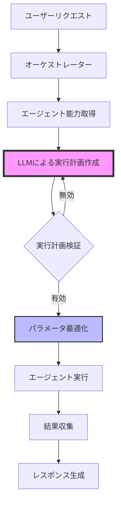

# AI Agent LLMベースオーケストレーション詳細設計書

## 1. 概要

本システムは、LLM（Large Language Model）を使用してユーザーリクエストを分析し、適切なAIエージェントの選択と実行パラメータの決定を自動的に行います。各エージェントは自身の能力を宣言的に定義し、オーケストレーターがLLMを通じて最適な実行計画を作成します。

## 2. システムアーキテクチャ

### 2.1 コンポーネント構成

```
AI_Agent/
├── __init__.py
├── orchestrator.py              # メインオーケストレーター
├── orchestration_planner.py     # LLMベースの実行計画作成
├── plan_executor.py             # 実行計画の実行
├── base_agent.py               # エージェント基底クラス
├── agent_registry.py           # エージェント登録・管理
├── status_manager.py           # ステータス管理
├── parameter_optimizer.py      # パラメータ最適化
│
├── agents/
│   ├── __init__.py
│   ├── analyzer_agent.py       # プロンプト分析
│   ├── web_agent.py           # Web検索・クロール
│   ├── image_agent.py         # 画像生成
│   ├── document_agent.py      # ドキュメント処理
│   └── creative_agent.py      # 創造的タスク
│
└── utils/
    ├── __init__.py
    ├── prompts.py             # プロンプトテンプレート
    └── validators.py          # パラメータ検証
```

## 3. エージェント能力定義

### 3.1 基底クラスの定義

```python
from abc import ABC, abstractmethod
from typing import Dict, Any, AsyncGenerator, Optional

class BaseAgent(ABC):
    """すべてのエージェントの基底クラス"""
    
    @classmethod
    @abstractmethod
    def get_capability_description(cls) -> Dict[str, Any]:
        """
        エージェントの能力を宣言的に定義
        
        Returns:
            {
                'name': str,              # エージェント名
                'description': str,       # 概要
                'when_to_use': str,      # 使用すべきケース
                'inputs': {
                    'required': Dict[str, str],  # 必須パラメータ
                    'optional': Dict[str, str]   # オプションパラメータ
                },
                'outputs': Dict[str, str],       # 出力
                'execution_params': {            # 実行パラメータ
                    'llm_settings': Dict,        # LLM設定
                    'agent_specific': Dict       # エージェント固有設定
                },
                'constraints': str,              # 制約事項
                'examples': List[str]            # 使用例
            }
        """
        pass
```

### 3.2 実行パラメータ定義

#### LLM設定パラメータ
- **temperature**: 0.0-2.0 - 出力の創造性/ランダム性
- **max_tokens**: 100-4000 - 最大生成トークン数
- **top_p**: 0.0-1.0 - 累積確率による単語選択
- **frequency_penalty**: -2.0-2.0 - 単語の繰り返し抑制
- **presence_penalty**: -2.0-2.0 - 新しいトピックへの傾向

#### エージェント固有パラメータ
各エージェントが独自に定義する実行パラメータ

## 4. オーケストレーションプロセス

### 4.1 処理フロー



### 4.2 LLMプロンプト構造

```
システムプロンプト:
- 役割定義
- 出力フォーマット仕様
- パラメータ選択ガイドライン
- 制約事項

ユーザープロンプト:
- 利用可能なエージェント一覧と能力
- ユーザーリクエスト
- 会話コンテキスト
- 追加の制約やヒント
```

## 5. 実行計画のJSON構造

```json
{
    "analysis": "ユーザーリクエストの詳細分析",
    "reasoning": "エージェント選択の理由",
    "execution_plan": [
        {
            "step": 1,
            "agent": "WebAgent",
            "purpose": "このステップの目的",
            "inputs": {
                "keywords": ["検索", "キーワード"],
                "max_results": 5
            },
            "execution_params": {
                "llm_settings": {
                    "temperature": 0.3,
                    "max_tokens": 1500
                },
                "agent_specific": {
                    "search_depth": "thorough",
                    "timeout_seconds": 30
                }
            },
            "depends_on": [],
            "parallel": false,
            "expected_output": "期待される出力の説明",
            "optimization_notes": "パラメータ選択の根拠"
        }
    ],
    "success_criteria": "成功判定基準",
    "fallback_plan": "失敗時の代替案"
}
```

## 6. パラメータ選択ガイドライン

### 6.1 Temperature設定

| タスクタイプ | 推奨Temperature | 理由 |
|------------|----------------|------|
| 事実検索・要約 | 0.0-0.3 | 正確性と一貫性が重要 |
| 一般的な説明 | 0.3-0.7 | バランスの取れた出力 |
| 創造的な文章 | 0.7-1.2 | 多様性と創造性が必要 |
| ブレインストーミング | 1.0-1.5 | 最大限の創造性 |

### 6.2 エージェント別推奨設定

#### WebAgent（検索・クロール）
- temperature: 0.1-0.3（正確な情報収集）
- max_tokens: 1000-2000（要約の詳細度）
- search_depth: タスクの緊急度に応じて調整

#### ImageAgent（画像生成）
- temperature: 0.8-1.2（創造的な画像プロンプト）
- quality: 品質要求に応じて選択
- style: コンテンツの性質に応じて選択

#### DocumentAgent（文書処理）
- temperature: 0.2-0.5（正確な情報抽出）
- extraction_mode: 文書タイプに応じて選択

## 7. エラーハンドリングと回復戦略

### 7.1 エラータイプと対処

| エラータイプ | 原因 | 対処法 |
|------------|-----|--------|
| PlanValidationError | 実行計画が無効 | LLMに再生成を要求 |
| AgentNotFoundError | 指定エージェント不在 | 代替エージェントを提案 |
| ParameterOutOfRangeError | パラメータ範囲外 | 自動的に範囲内に調整 |
| DependencyError | 依存関係エラー | 実行順序を再調整 |
| TimeoutError | 実行タイムアウト | 簡略版で再実行 |

### 7.2 フォールバック戦略

```python
fallback_strategies = {
    "web_search_failed": "キャッシュデータまたは一般知識で回答",
    "image_generation_failed": "代替の説明文を提供",
    "document_processing_failed": "要約版の処理を実行"
}
```

## 8. パフォーマンス最適化

### 8.1 並列実行
- 依存関係のないエージェントは並列実行
- リソース制限に基づく同時実行数制御

### 8.2 キャッシング
- 実行計画のキャッシュ（類似リクエスト用）
- エージェント結果のキャッシュ

### 8.3 動的パラメータ調整
- 実行時のパフォーマンスに基づく調整
- ユーザーフィードバックの学習

## 9. セキュリティ考慮事項

- 入力サニタイゼーション
- 実行パラメータの検証
- リソース使用量の制限
- 機密情報の取り扱い

## 10. 拡張性

### 10.1 新規エージェントの追加手順
1. BaseAgentを継承したクラスを作成
2. get_capability_description()を実装
3. process()メソッドを実装
4. AgentRegistryに登録

### 10.2 カスタムパラメータの追加
- agent_specificセクションに新規パラメータを定義
- バリデーションルールを追加
- LLMプロンプトにガイドラインを追加

## 11. モニタリングとログ

### 11.1 記録項目
- 実行計画の生成時間
- 各エージェントの実行時間
- パラメータ選択の統計
- エラー発生率

### 11.2 分析指標
- 最も使用されるエージェント組み合わせ
- パラメータ設定の効果測定
- ユーザー満足度との相関

## 12. テスト戦略

### 12.1 単体テスト
- 各エージェントの独立したテスト
- パラメータ検証のテスト

### 12.2 統合テスト
- エンドツーエンドのフロー検証
- 複雑な実行計画のテスト

### 12.3 負荷テスト
- 並列実行の限界確認
- タイムアウト処理の検証