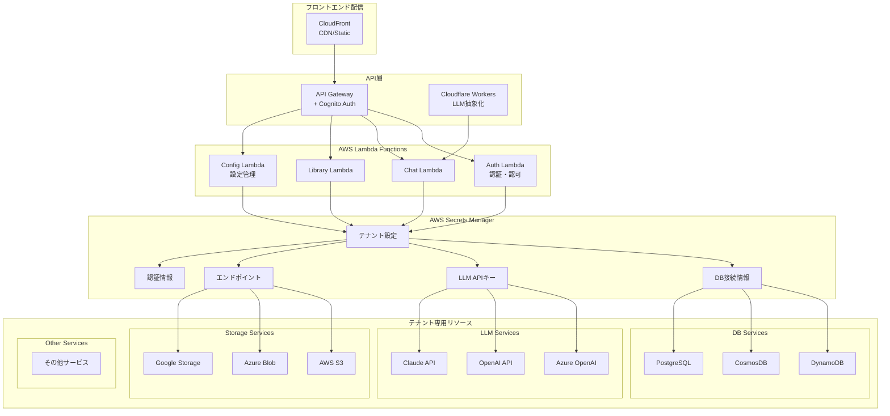
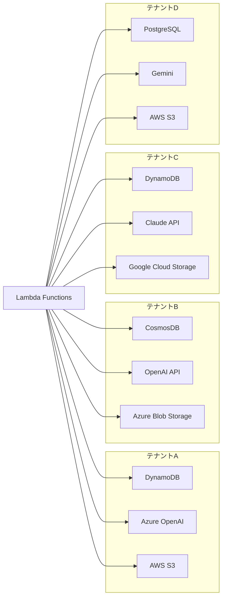

# AWS Lambda + API Gateway + マルチテナント SaaS 移行計画

## 1. 現在のアーキテクチャ分析

### 現在の構成
- **バックエンド**: FastAPI (uvicorn) + TinyDB
- **フロントエンド**: React/Vue.js (Vite)
- **データベース**: TinyDB (ローカルJSONファイル)
- **認証**: なし（開発環境のみ）
- **テナント管理**: なし（シングルテナント）

## 2. 新しいマルチテナント SaaS アーキテクチャ

### アーキテクチャ構成

### テナント分離モデル

## 3. テナント毎リソース契約モデル

### 3.1 データベース分離戦略
- **完全分離**: テナント毎に専用DB契約
- **マルチDB対応**: DynamoDB、CosmosDB、PostgreSQL等
- **接続情報管理**: AWS Secrets Manager
- **抽象化レイヤー**: 統一インターフェース

### 3.2 LLM分離戦略  
- **完全分離**: テナント毎にLLMサービス契約
- **マルチLLM対応**: Azure OpenAI、OpenAI、Claude、Gemini等
- **APIキー管理**: AWS Secrets Manager
- **抽象化レイヤー**: 統一インターフェース

### 3.3 ストレージ分離戦略
- **完全分離**: テナント毎にストレージサービス契約
- **マルチストレージ対応**: AWS S3、Azure Blob Storage、Google Cloud Storage等
- **接続情報管理**: AWS Secrets Manager
- **抽象化レイヤー**: 統一インターフェース
- **用途**: アップロードファイル、大容量プロンプト、生成画像等

### 3.4 設定管理戦略
- **シークレット管理**: AWS Secrets Manager
- **動的設定取得**: Lambda実行時に設定取得
- **キャッシュ戦略**: 設定情報のメモリキャッシュ
- **フォールバック**: デフォルト設定

## 4. 設計が必要な項目一覧

### 4.1 抽象化レイヤー設計
1. **データベース抽象化レイヤー**
   - 統一インターフェース設計
   - マルチDB対応（DynamoDB、CosmosDB、PostgreSQL等）
   - 接続プール管理
   - トランザクション管理

2. **LLM抽象化レイヤー**
   - 統一インターフェース設計
   - マルチLLM対応（Azure OpenAI、OpenAI、Claude、Gemini等）
   - レスポンス正規化
   - エラーハンドリング統一

3. **ストレージ抽象化レイヤー**
   - 統一インターフェース設計
   - マルチストレージ対応（S3、Azure Blob、Google Storage等）
   - ファイル操作統一
   - アクセス制御管理

### 4.2 シークレット管理設計
1. **AWS Secrets Manager構造設計**
   - テナント毎の設定管理
   - 階層化された設定構造
   - 暗号化・アクセス制御
   - ローテーション対応

2. **設定キャッシュ戦略**
   - Lambda内メモリキャッシュ
   - TTL管理
   - 設定更新の即座反映
   - フォールバック機能

### 4.3 データベース設計
1. **テナント管理テーブル設計**
   - テナント情報、設定、制限値
   - サブスクリプション情報
   - 機能フラグ管理

2. **ユーザー管理テーブル設計**
   - テナント-ユーザー関係
   - 権限・ロール管理
   - プロファイル情報

3. **マルチテナント対応データモデル**
   - 全テーブルでのテナントID分離
   - GSI設計
   - パーティション戦略

### 4.4 認証・認可設計
1. **Cognito User Pool設計**
   - テナント別User Pool vs 統合User Pool
   - カスタム属性設計
   - MFA設定

2. **JWT Token設計**
   - Claims構造
   - テナントID、ユーザーID、権限情報
   - トークン有効期限管理

3. **API認可設計**
   - Lambda Authorizer実装
   - リソースレベルアクセス制御
   - テナント間データ漏洩防止

### 4.5 WebSocket設計
1. **マルチテナント対応WebSocket**
   - 接続時認証
   - テナント別チャンネル分離
   - リアルタイム通知

2. **API Gateway WebSocket**
   - 接続管理
   - メッセージルーティング
   - 切断処理

### 4.6 ストレージ設計
1. **マルチストレージ対応**
   - テナント毎のストレージサービス選択
   - アクセス制御統一
   - ファイル管理統一

2. **CDN設計**
   - テナント別コンテンツ配信
   - キャッシュ戦略
   - セキュリティ設定

### 4.7 Lambda関数設計
1. **テナントコンテキスト管理**
   - 共通ライブラリ設計
   - 環境変数管理
   - エラーハンドリング

2. **関数分割戦略**
   - 機能別Lambda分離
   - 共通処理の抽象化
   - パフォーマンス最適化

### 4.8 監視・ログ設計
1. **マルチテナント監視**
   - テナント別メトリクス
   - リソース使用量追跡
   - アラート設定

2. **セキュリティ監査**
   - アクセスログ
   - 異常検知
   - コンプライアンス対応

### 4.9 課金・制限設計
1. **使用量管理**
   - API呼び出し制限
   - ストレージ制限
   - 機能制限

2. **課金システム**
   - メータリング
   - プランベース制限
   - 使用量レポート

### 4.10 データ移行設計
1. **段階的移行戦略**
   - Blue-Green デプロイ
   - データ同期機能
   - ロールバック計画

2. **テナント作成プロセス**
   - 初期セットアップ
   - デフォルト設定
   - 管理者アカウント作成

### 4.11 フロントエンド設計
1. **マルチテナント対応UI**
   - テナント別ブランディング
   - 権限別UI制御
   - サブドメイン対応

2. **状態管理**
   - テナントコンテキスト
   - ユーザー権限管理
   - API通信最適化

### 4.12 DevOps・運用設計
1. **CI/CD パイプライン**
   - 環境別デプロイ
   - テスト戦略
   - 品質ゲート

2. **運用監視**
   - ヘルスチェック
   - パフォーマンス監視
   - 障害対応手順

## 5. 実装フェーズ

### Phase 1: 基盤設計・実装 (2-3週間)
- Cognito設定
- DynamoDB設計・構築
- Lambda基盤実装

### Phase 2: 認証・認可実装 (2週間)
- JWT処理
- Lambda Authorizer
- API Gateway統合

### Phase 3: マルチテナント機能実装 (3-4週間)
- テナント管理機能
- データ分離実装
- WebSocket対応

### Phase 4: 移行・テスト (2週間)
- データ移行
- 統合テスト
- パフォーマンステスト

### Phase 5: 本番デプロイ・運用開始 (1週間)
- 本番環境デプロイ
- 監視設定
- ドキュメント整備

## 6. 次のステップ

この移行計画の各設計項目について、順次詳細設計を行います：

1. **データベース設計** の詳細化
2. **認証・認可設計** の詳細化  
3. **WebSocket設計** の詳細化
4. **その他各設計項目** の詳細化

どの設計項目から始めますか？