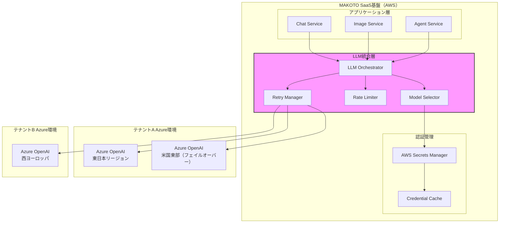
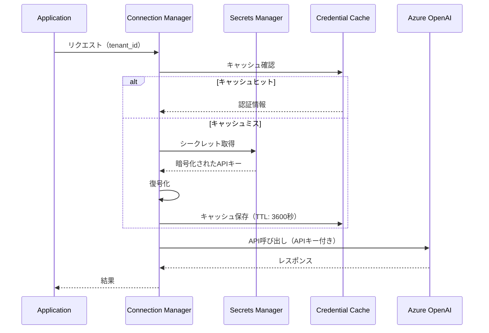

# Azure OpenAI統合設計書

## 目次

1. [概要](#概要)
2. [アーキテクチャ概要](#アーキテクチャ概要)
3. [接続モデル](#接続モデル)
4. [認証とセキュリティ](#認証とセキュリティ)
5. [API統合設計](#api統合設計)
6. [マルチモデル対応](#マルチモデル対応)
7. [レート制限とスケーリング](#レート制限とスケーリング)
8. [エラーハンドリング](#エラーハンドリング)
9. [コスト管理](#コスト管理)
10. [監視とロギング](#監視とロギング)

## 概要

MAKOTO Visual AIは、各テナントが契約するAzure OpenAIサービスに接続し、チャット機能、画像生成、エージェント機能などを提供します。本設計書では、Azure OpenAIサービスとの統合アーキテクチャを定義します。

### 設計原則

1. **マルチテナント対応**: 各テナントが独自のAzure OpenAIリソースを使用
2. **柔軟性**: 複数のモデル、リージョン、デプロイメントに対応
3. **可用性**: フェイルオーバーとリトライ機能
4. **セキュリティ**: APIキーの安全な管理
5. **最適化**: レート制限の効率的な管理とコスト最適化

## アーキテクチャ概要



## 接続モデル

### テナント別Azure OpenAI設定

```yaml
tenant_azure_openai_config:
  tenant_id: "tenant-abc-123"
  
  primary_deployment:
    endpoint: "https://tenant-a-openai.openai.azure.com/"
    api_key_ref: "arn:aws:secretsmanager:region:account:secret:tenant-a/azure-openai"
    api_version: "2024-02-15-preview"
    region: "japaneast"
    
    models:
      chat:
        deployment_name: "gpt-4-turbo"
        model_version: "1106-Preview"
        max_tokens: 4096
        
      embedding:
        deployment_name: "text-embedding-ada-002"
        model_version: "2"
        max_tokens: 8191
        
      image:
        deployment_name: "dall-e-3"
        model_version: "3.0"
        
  failover_deployment:
    endpoint: "https://tenant-a-openai-us.openai.azure.com/"
    api_key_ref: "arn:aws:secretsmanager:region:account:secret:tenant-a/azure-openai-us"
    api_version: "2024-02-15-preview"
    region: "eastus"
    
  rate_limits:
    requests_per_minute: 600
    tokens_per_minute: 90000
    concurrent_requests: 20
    
  features:
    streaming_enabled: true
    function_calling_enabled: true
    vision_enabled: true
    json_mode_enabled: true
```

### 接続管理クラス

```python
class AzureOpenAIConnectionManager:
    """Azure OpenAI接続管理"""
    
    def __init__(self):
        self.secrets_manager = boto3.client('secretsmanager')
        self.connections = {}
        self.rate_limiters = {}
    
    async def get_client(self, tenant_id: str, deployment_type: str = 'primary') -> AzureOpenAI:
        """テナント用Azure OpenAIクライアントの取得"""
        
        cache_key = f"{tenant_id}:{deployment_type}"
        
        # キャッシュチェック
        if cache_key in self.connections:
            return self.connections[cache_key]
        
        # 設定取得
        config = await self.get_tenant_config(tenant_id)
        deployment_config = config.get(f'{deployment_type}_deployment')
        
        # APIキー取得
        api_key = await self.get_api_key(deployment_config['api_key_ref'])
        
        # クライアント作成
        client = AzureOpenAI(
            api_key=api_key,
            api_version=deployment_config['api_version'],
            azure_endpoint=deployment_config['endpoint']
        )
        
        # レート制限設定
        self.rate_limiters[cache_key] = RateLimiter(
            requests_per_minute=config['rate_limits']['requests_per_minute'],
            tokens_per_minute=config['rate_limits']['tokens_per_minute']
        )
        
        # キャッシュ保存
        self.connections[cache_key] = client
        
        return client
    
    async def get_api_key(self, secret_arn: str) -> str:
        """Secrets ManagerからAPIキー取得"""
        try:
            response = self.secrets_manager.get_secret_value(SecretId=secret_arn)
            secret = json.loads(response['SecretString'])
            return secret['api_key']
        except Exception as e:
            raise AzureOpenAIConfigError(f"Failed to retrieve API key: {str(e)}")
```

## 認証とセキュリティ

### APIキー管理



### セキュリティ実装

```python
class SecureAzureOpenAIClient:
    """セキュアなAzure OpenAIクライアント"""
    
    def __init__(self, tenant_id: str):
        self.tenant_id = tenant_id
        self.key_rotation_interval = timedelta(hours=24)
        self.last_rotation = None
    
    async def ensure_fresh_credentials(self):
        """認証情報の鮮度確認"""
        if self.last_rotation is None or \
           datetime.now() - self.last_rotation > self.key_rotation_interval:
            await self.rotate_credentials()
    
    async def rotate_credentials(self):
        """認証情報のローテーション"""
        # 新しいAPIキーの取得（必要に応じて）
        # キャッシュのクリア
        # 監査ログの記録
        self.last_rotation = datetime.now()
        
        await self.audit_log('credential_rotation', {
            'tenant_id': self.tenant_id,
            'timestamp': self.last_rotation.isoformat()
        })
```

## API統合設計

### チャット完了API統合

```python
class AzureOpenAIChatService:
    """Azure OpenAIチャットサービス"""
    
    def __init__(self, connection_manager: AzureOpenAIConnectionManager):
        self.connection_manager = connection_manager
        self.token_counter = TokenCounter()
    
    async def create_chat_completion(
        self,
        tenant_id: str,
        messages: List[ChatMessage],
        **kwargs
    ) -> ChatCompletionResponse:
        """チャット完了の作成"""
        
        # クライアント取得
        client = await self.connection_manager.get_client(tenant_id)
        config = await self.connection_manager.get_tenant_config(tenant_id)
        
        # レート制限チェック
        rate_limiter = self.connection_manager.rate_limiters[f"{tenant_id}:primary"]
        token_count = self.token_counter.count_messages(messages)
        
        await rate_limiter.acquire(requests=1, tokens=token_count)
        
        try:
            # API呼び出し
            response = await client.chat.completions.create(
                model=config['primary_deployment']['models']['chat']['deployment_name'],
                messages=[m.to_dict() for m in messages],
                temperature=kwargs.get('temperature', 0.7),
                max_tokens=kwargs.get('max_tokens', 2000),
                stream=kwargs.get('stream', False),
                **self._filter_supported_params(config, kwargs)
            )
            
            # 使用量記録
            await self.record_usage(tenant_id, response.usage)
            
            return response
            
        except Exception as e:
            # フェイルオーバー処理
            if self._should_failover(e):
                return await self._failover_request(tenant_id, messages, **kwargs)
            raise
    
    def _filter_supported_params(self, config: dict, params: dict) -> dict:
        """サポートされているパラメータのフィルタリング"""
        supported = {}
        
        if config['features'].get('function_calling_enabled'):
            if 'functions' in params:
                supported['functions'] = params['functions']
            if 'function_call' in params:
                supported['function_call'] = params['function_call']
                
        if config['features'].get('json_mode_enabled'):
            if 'response_format' in params:
                supported['response_format'] = params['response_format']
                
        return supported
```

### ストリーミング対応

```python
class StreamingChatService:
    """ストリーミングチャットサービス"""
    
    async def create_streaming_completion(
        self,
        tenant_id: str,
        messages: List[ChatMessage],
        **kwargs
    ) -> AsyncGenerator[StreamChunk, None]:
        """ストリーミング応答の生成"""
        
        client = await self.connection_manager.get_client(tenant_id)
        config = await self.connection_manager.get_tenant_config(tenant_id)
        
        # ストリーミング有効確認
        if not config['features'].get('streaming_enabled'):
            raise FeatureNotEnabledError("Streaming is not enabled for this tenant")
        
        # ストリーム作成
        stream = await client.chat.completions.create(
            model=config['primary_deployment']['models']['chat']['deployment_name'],
            messages=[m.to_dict() for m in messages],
            stream=True,
            **kwargs
        )
        
        # チャンク処理
        async for chunk in stream:
            if chunk.choices[0].delta.content:
                yield StreamChunk(
                    content=chunk.choices[0].delta.content,
                    finish_reason=chunk.choices[0].finish_reason
                )
                
            # 使用量記録（最後のチャンク）
            if chunk.choices[0].finish_reason:
                await self.record_streaming_usage(tenant_id, chunk)
```

### 画像生成API統合

```python
class AzureOpenAIImageService:
    """Azure OpenAI画像生成サービス"""
    
    async def generate_image(
        self,
        tenant_id: str,
        prompt: str,
        **kwargs
    ) -> ImageGenerationResponse:
        """画像生成"""
        
        client = await self.connection_manager.get_client(tenant_id)
        config = await self.connection_manager.get_tenant_config(tenant_id)
        
        # DALL-E 3設定確認
        if 'image' not in config['primary_deployment']['models']:
            raise FeatureNotEnabledError("Image generation is not configured")
        
        # パラメータ設定
        params = {
            'model': config['primary_deployment']['models']['image']['deployment_name'],
            'prompt': prompt,
            'n': kwargs.get('n', 1),
            'size': kwargs.get('size', '1024x1024'),
            'quality': kwargs.get('quality', 'standard'),
            'response_format': kwargs.get('response_format', 'url')
        }
        
        # API呼び出し
        response = await client.images.generate(**params)
        
        # レスポンス処理
        images = []
        for image_data in response.data:
            if params['response_format'] == 'url':
                # URLを保存
                images.append({
                    'url': image_data.url,
                    'revised_prompt': image_data.revised_prompt
                })
            else:
                # Base64データを処理
                image_url = await self.save_generated_image(
                    tenant_id,
                    image_data.b64_json,
                    prompt
                )
                images.append({
                    'url': image_url,
                    'revised_prompt': image_data.revised_prompt
                })
        
        return ImageGenerationResponse(images=images)
```

## マルチモデル対応

### モデル選択ロジック

```python
class ModelSelector:
    """モデル選択器"""
    
    def __init__(self):
        self.model_capabilities = {
            'gpt-4-turbo': {
                'max_tokens': 128000,
                'supports_vision': True,
                'supports_functions': True,
                'supports_json_mode': True
            },
            'gpt-4': {
                'max_tokens': 8192,
                'supports_vision': False,
                'supports_functions': True,
                'supports_json_mode': False
            },
            'gpt-35-turbo': {
                'max_tokens': 16384,
                'supports_vision': False,
                'supports_functions': True,
                'supports_json_mode': True
            }
        }
    
    async def select_model(
        self,
        tenant_config: dict,
        requirements: ModelRequirements
    ) -> str:
        """要件に基づくモデル選択"""
        
        available_models = tenant_config['primary_deployment']['models']
        
        # 要件チェック
        for model_type, model_config in available_models.items():
            if model_type != 'chat':
                continue
                
            model_name = model_config['deployment_name']
            capabilities = self.model_capabilities.get(model_name, {})
            
            # 要件を満たすかチェック
            if requirements.needs_vision and not capabilities.get('supports_vision'):
                continue
            if requirements.needs_functions and not capabilities.get('supports_functions'):
                continue
            if requirements.min_tokens > capabilities.get('max_tokens', 0):
                continue
                
            return model_name
        
        raise NoSuitableModelError("No model matches the requirements")
```

### Function Calling実装

```python
class FunctionCallingService:
    """Function Callingサービス"""
    
    async def execute_with_functions(
        self,
        tenant_id: str,
        messages: List[ChatMessage],
        functions: List[FunctionDefinition],
        **kwargs
    ) -> FunctionCallingResponse:
        """Function Callingの実行"""
        
        client = await self.connection_manager.get_client(tenant_id)
        config = await self.connection_manager.get_tenant_config(tenant_id)
        
        # Function Calling有効確認
        if not config['features'].get('function_calling_enabled'):
            raise FeatureNotEnabledError("Function calling is not enabled")
        
        # 初回呼び出し
        response = await client.chat.completions.create(
            model=config['primary_deployment']['models']['chat']['deployment_name'],
            messages=[m.to_dict() for m in messages],
            functions=[f.to_dict() for f in functions],
            function_call=kwargs.get('function_call', 'auto')
        )
        
        # 関数呼び出し処理
        if response.choices[0].message.function_call:
            function_call = response.choices[0].message.function_call
            
            # 関数実行
            function_result = await self.execute_function(
                function_call.name,
                json.loads(function_call.arguments)
            )
            
            # 結果を含めて再度呼び出し
            messages.append(response.choices[0].message)
            messages.append({
                'role': 'function',
                'name': function_call.name,
                'content': json.dumps(function_result)
            })
            
            final_response = await client.chat.completions.create(
                model=config['primary_deployment']['models']['chat']['deployment_name'],
                messages=[m.to_dict() for m in messages]
            )
            
            return FunctionCallingResponse(
                initial_response=response,
                function_result=function_result,
                final_response=final_response
            )
        
        return FunctionCallingResponse(initial_response=response)
```

## レート制限とスケーリング

### レート制限管理

```python
class RateLimiter:
    """レート制限管理"""
    
    def __init__(self, requests_per_minute: int, tokens_per_minute: int):
        self.rpm_limit = requests_per_minute
        self.tpm_limit = tokens_per_minute
        self.request_window = deque()
        self.token_window = deque()
        self.lock = asyncio.Lock()
    
    async def acquire(self, requests: int = 1, tokens: int = 0):
        """レート制限の取得"""
        async with self.lock:
            now = time.time()
            
            # 古いエントリを削除
            self._clean_windows(now)
            
            # 制限チェック
            current_rpm = len(self.request_window)
            current_tpm = sum(t for _, t in self.token_window)
            
            if current_rpm + requests > self.rpm_limit:
                wait_time = 60 - (now - self.request_window[0])
                raise RateLimitError(f"RPM limit exceeded. Wait {wait_time:.1f}s")
            
            if current_tpm + tokens > self.tpm_limit:
                wait_time = 60 - (now - self.token_window[0][0])
                raise RateLimitError(f"TPM limit exceeded. Wait {wait_time:.1f}s")
            
            # 記録
            for _ in range(requests):
                self.request_window.append(now)
            if tokens > 0:
                self.token_window.append((now, tokens))
    
    def _clean_windows(self, now: float):
        """古いエントリの削除"""
        cutoff = now - 60  # 1分前
        
        while self.request_window and self.request_window[0] < cutoff:
            self.request_window.popleft()
            
        while self.token_window and self.token_window[0][0] < cutoff:
            self.token_window.popleft()
```

### 動的スケーリング

```python
class DynamicScalingManager:
    """動的スケーリング管理"""
    
    def __init__(self):
        self.usage_metrics = {}
        self.scaling_policies = {}
    
    async def monitor_and_scale(self, tenant_id: str):
        """使用状況の監視とスケーリング"""
        
        metrics = self.usage_metrics.get(tenant_id, {})
        policy = self.scaling_policies.get(tenant_id)
        
        # 使用率計算
        rpm_usage = metrics.get('rpm_current', 0) / metrics.get('rpm_limit', 1)
        tpm_usage = metrics.get('tpm_current', 0) / metrics.get('tpm_limit', 1)
        
        # スケーリング判定
        if rpm_usage > 0.8 or tpm_usage > 0.8:
            # フェイルオーバーデプロイメントの有効化
            await self.enable_failover(tenant_id)
            
            # アラート送信
            await self.send_scaling_alert(tenant_id, {
                'rpm_usage': rpm_usage,
                'tpm_usage': tpm_usage,
                'action': 'failover_enabled'
            })
```

## エラーハンドリング

### エラー分類と対処

```python
class AzureOpenAIErrorHandler:
    """Azure OpenAIエラーハンドラー"""
    
    def __init__(self):
        self.retry_config = {
            'max_retries': 3,
            'base_delay': 1,
            'max_delay': 60,
            'exponential_base': 2
        }
    
    async def handle_error(self, error: Exception, context: dict) -> Any:
        """エラーハンドリング"""
        
        if isinstance(error, RateLimitError):
            # レート制限エラー
            return await self._handle_rate_limit(error, context)
            
        elif isinstance(error, AuthenticationError):
            # 認証エラー
            return await self._handle_auth_error(error, context)
            
        elif isinstance(error, APIConnectionError):
            # 接続エラー
            return await self._handle_connection_error(error, context)
            
        elif isinstance(error, InvalidRequestError):
            # リクエストエラー
            return await self._handle_invalid_request(error, context)
            
        else:
            # その他のエラー
            await self.log_error(error, context)
            raise
    
    async def _handle_rate_limit(self, error: RateLimitError, context: dict):
        """レート制限エラーの処理"""
        # バックオフ計算
        retry_after = self._extract_retry_after(error)
        
        if context.get('retry_count', 0) < self.retry_config['max_retries']:
            await asyncio.sleep(retry_after)
            context['retry_count'] = context.get('retry_count', 0) + 1
            return 'retry'
        
        # フェイルオーバー
        if context.get('can_failover'):
            context['use_failover'] = True
            return 'failover'
        
        raise error
```

### リトライ戦略

```python
class RetryManager:
    """リトライ管理"""
    
    async def execute_with_retry(
        self,
        func: Callable,
        *args,
        max_retries: int = 3,
        **kwargs
    ) -> Any:
        """リトライ付き実行"""
        
        last_error = None
        
        for attempt in range(max_retries + 1):
            try:
                return await func(*args, **kwargs)
                
            except Exception as e:
                last_error = e
                
                # リトライ可能か判定
                if not self._is_retryable(e) or attempt == max_retries:
                    raise
                
                # バックオフ計算
                delay = self._calculate_backoff(attempt, e)
                
                # ログ記録
                await self.log_retry(attempt, e, delay)
                
                # 待機
                await asyncio.sleep(delay)
        
        raise last_error
    
    def _is_retryable(self, error: Exception) -> bool:
        """リトライ可能なエラーか判定"""
        retryable_errors = [
            RateLimitError,
            APIConnectionError,
            ServiceUnavailableError,
            TimeoutError
        ]
        return any(isinstance(error, err_type) for err_type in retryable_errors)
```

## コスト管理

### 使用量追跡

```python
class UsageTracker:
    """使用量追跡"""
    
    def __init__(self):
        self.usage_store = UsageStore()
        self.cost_calculator = CostCalculator()
    
    async def track_usage(
        self,
        tenant_id: str,
        model: str,
        usage: dict
    ):
        """使用量の追跡"""
        
        usage_record = {
            'tenant_id': tenant_id,
            'timestamp': datetime.utcnow(),
            'model': model,
            'prompt_tokens': usage.get('prompt_tokens', 0),
            'completion_tokens': usage.get('completion_tokens', 0),
            'total_tokens': usage.get('total_tokens', 0)
        }
        
        # 保存
        await self.usage_store.save(usage_record)
        
        # コスト計算
        cost = self.cost_calculator.calculate(model, usage)
        
        # アラートチェック
        await self.check_cost_alerts(tenant_id, cost)
    
    async def get_usage_summary(
        self,
        tenant_id: str,
        start_date: datetime,
        end_date: datetime
    ) -> UsageSummary:
        """使用量サマリーの取得"""
        
        records = await self.usage_store.query(
            tenant_id=tenant_id,
            start_date=start_date,
            end_date=end_date
        )
        
        summary = UsageSummary()
        
        for record in records:
            summary.total_requests += 1
            summary.total_tokens += record['total_tokens']
            summary.by_model[record['model']] += record['total_tokens']
        
        # コスト計算
        summary.estimated_cost = self.cost_calculator.calculate_total(records)
        
        return summary
```

### コスト最適化

```python
class CostOptimizer:
    """コスト最適化"""
    
    def __init__(self):
        self.model_costs = {
            'gpt-4-turbo': {'prompt': 0.01, 'completion': 0.03},
            'gpt-4': {'prompt': 0.03, 'completion': 0.06},
            'gpt-35-turbo': {'prompt': 0.0005, 'completion': 0.0015}
        }
    
    async def recommend_optimization(
        self,
        tenant_id: str,
        usage_pattern: UsagePattern
    ) -> List[Optimization]:
        """最適化推奨"""
        
        recommendations = []
        
        # モデル選択の最適化
        if usage_pattern.avg_prompt_length < 1000:
            recommendations.append(Optimization(
                type='model_downgrade',
                description='短いプロンプトにはGPT-3.5 Turboを推奨',
                estimated_savings='70%'
            ))
        
        # バッチ処理の推奨
        if usage_pattern.request_frequency > 100:
            recommendations.append(Optimization(
                type='batch_processing',
                description='バッチ処理による効率化',
                estimated_savings='20%'
            ))
        
        # キャッシュの活用
        if usage_pattern.repetition_rate > 0.3:
            recommendations.append(Optimization(
                type='response_caching',
                description='頻出クエリのキャッシュ',
                estimated_savings='30%'
            ))
        
        return recommendations
```

## 監視とロギング

### メトリクス収集

```yaml
監視メトリクス:
  可用性:
    - API応答率
    - エンドポイント健全性
    - フェイルオーバー発生率
    
  パフォーマンス:
    - 応答時間（p50, p90, p99）
    - スループット（RPM）
    - トークン処理速度
    
  使用量:
    - リクエスト数
    - トークン消費量
    - モデル別使用率
    
  エラー:
    - エラー率
    - エラータイプ分布
    - リトライ成功率
    
  コスト:
    - 推定コスト
    - テナント別コスト
    - モデル別コスト
```

### ロギング実装

```python
class AzureOpenAILogger:
    """Azure OpenAIロガー"""
    
    def __init__(self):
        self.logger = logging.getLogger('azure_openai')
        self.metrics_client = CloudWatchMetrics()
    
    async def log_request(self, context: RequestContext):
        """リクエストのログ記録"""
        
        log_entry = {
            'timestamp': datetime.utcnow().isoformat(),
            'tenant_id': context.tenant_id,
            'request_id': context.request_id,
            'model': context.model,
            'endpoint': context.endpoint,
            'prompt_tokens': context.prompt_tokens,
            'user_id': context.user_id
        }
        
        # 構造化ログ
        self.logger.info(json.dumps(log_entry))
        
        # メトリクス送信
        await self.metrics_client.put_metric(
            namespace='MAKOTO/AzureOpenAI',
            metric_name='RequestCount',
            value=1,
            dimensions=[
                {'Name': 'TenantId', 'Value': context.tenant_id},
                {'Name': 'Model', 'Value': context.model}
            ]
        )
    
    async def log_response(self, context: ResponseContext):
        """レスポンスのログ記録"""
        
        log_entry = {
            'timestamp': datetime.utcnow().isoformat(),
            'request_id': context.request_id,
            'duration_ms': context.duration_ms,
            'completion_tokens': context.completion_tokens,
            'total_tokens': context.total_tokens,
            'finish_reason': context.finish_reason,
            'success': context.success
        }
        
        self.logger.info(json.dumps(log_entry))
        
        # レイテンシメトリクス
        await self.metrics_client.put_metric(
            namespace='MAKOTO/AzureOpenAI',
            metric_name='ResponseLatency',
            value=context.duration_ms,
            unit='Milliseconds',
            dimensions=[
                {'Name': 'TenantId', 'Value': context.tenant_id},
                {'Name': 'Model', 'Value': context.model}
            ]
        )
```

## まとめ

本設計により、以下を実現します：

1. **マルチテナント対応**: 各テナントの独自Azure OpenAIリソースへの安全な接続
2. **高可用性**: フェイルオーバーとリトライによる安定性
3. **パフォーマンス**: 効率的なレート制限管理とキャッシング
4. **セキュリティ**: APIキーの安全な管理と監査
5. **コスト最適化**: 使用量追跡と最適化推奨
6. **運用性**: 包括的な監視とロギング

この統合により、各テナントは自身のAzure OpenAIリソースを活用しながら、MAKOTOの高度な機能を利用できます。