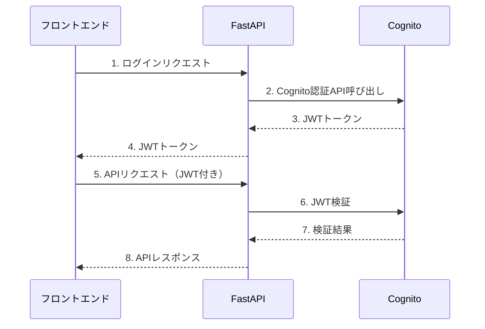
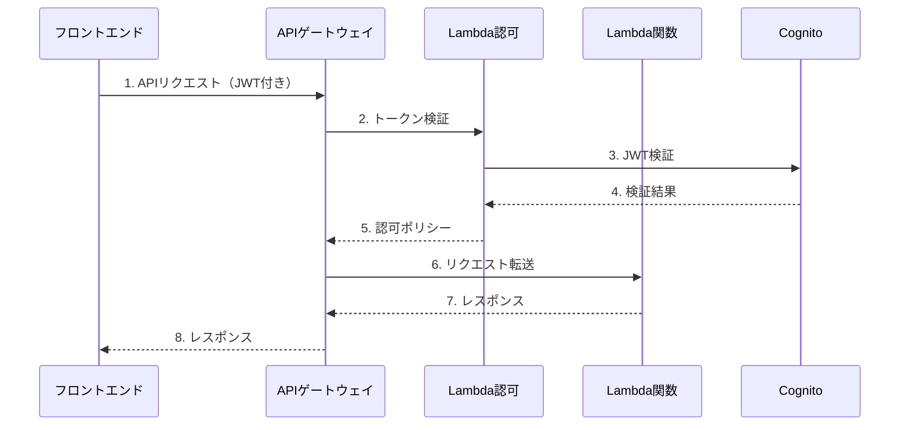

# Cognito + FastAPI統合ガイド

## 概要
開発環境でFastAPIとAWS Cognitoを直接連携させる実装ガイド。
本番環境でのAPI Gateway移行を考慮した設計。

## アーキテクチャ

### 開発環境（現在の実装向け）


### 本番環境（将来の移行先）


## 実装手順

### 1. Cognito User Pool作成

```yaml
# AWS CDK/CloudFormation設定例
MakotoUserPool:
  Type: AWS::Cognito::UserPool
  Properties:
    UserPoolName: makoto-dev-users
    
    # メールアドレスでログイン
    UsernameAttributes:
      - email
    
    # パスワードポリシー
    Policies:
      PasswordPolicy:
        MinimumLength: 8
        RequireUppercase: true
        RequireLowercase: true
        RequireNumbers: true
    
    # 自動検証
    AutoVerifiedAttributes:
      - email
    
    # カスタム属性（将来のマルチテナント対応）
    Schema:
      - Name: tenant_id
        AttributeDataType: String
        Mutable: true
      - Name: role
        AttributeDataType: String
        Mutable: true
```

### 2. FastAPI認証ミドルウェア実装

```python
# backend/core/auth.py
import json
import time
from typing import Optional
from fastapi import HTTPException, Request
from fastapi.security import HTTPBearer, HTTPAuthorizationCredentials
from jose import jwt, jwk, JWTError
from jose.utils import base64url_decode
import boto3
import requests
from functools import lru_cache

class CognitoTokenVerifier:
    def __init__(self, region: str, user_pool_id: str, client_id: str):
        self.region = region
        self.user_pool_id = user_pool_id
        self.client_id = client_id
        self.jwks_url = f"https://cognito-idp.{region}.amazonaws.com/{user_pool_id}/.well-known/jwks.json"
        self._jwks = None
    
    @lru_cache()
    def get_jwks(self):
        """Cognito公開鍵を取得（キャッシュ付き）"""
        if not self._jwks:
            response = requests.get(self.jwks_url)
            self._jwks = response.json()
        return self._jwks
    
    def verify_token(self, token: str) -> dict:
        """JWTトークンを検証"""
        try:
            # トークンヘッダーから kid を取得
            headers = jwt.get_unverified_headers(token)
            kid = headers['kid']
            
            # 対応する公開鍵を取得
            jwks = self.get_jwks()
            key = None
            for k in jwks['keys']:
                if k['kid'] == kid:
                    key = k
                    break
            
            if not key:
                raise HTTPException(status_code=401, detail="公開鍵が見つかりません")
            
            # トークンを検証
            payload = jwt.decode(
                token,
                key,
                algorithms=['RS256'],
                audience=self.client_id,
                issuer=f"https://cognito-idp.{self.region}.amazonaws.com/{self.user_pool_id}"
            )
            
            # 有効期限チェック
            if payload['exp'] < time.time():
                raise HTTPException(status_code=401, detail="トークンの有効期限が切れています")
            
            return payload
            
        except JWTError as e:
            raise HTTPException(status_code=401, detail=f"トークン検証エラー: {str(e)}")

class CognitoBearer(HTTPBearer):
    def __init__(self, verifier: CognitoTokenVerifier, auto_error: bool = True):
        super().__init__(auto_error=auto_error)
        self.verifier = verifier
    
    async def __call__(self, request: Request) -> Optional[dict]:
        credentials: HTTPAuthorizationCredentials = await super().__call__(request)
        if credentials:
            if not credentials.scheme == "Bearer":
                raise HTTPException(status_code=403, detail="Invalid authentication scheme")
            
            # トークンを検証
            payload = self.verifier.verify_token(credentials.credentials)
            
            # リクエストに認証情報を追加
            request.state.user = {
                "user_id": payload.get("sub"),
                "email": payload.get("email"),
                "tenant_id": payload.get("custom:tenant_id", "default"),
                "role": payload.get("custom:role", "user")
            }
            
            return payload
        return None
```

### 3. FastAPI認証エンドポイント

```python
# backend/routers/auth.py
import boto3
from fastapi import APIRouter, HTTPException
from pydantic import BaseModel
from typing import Optional
import os

router = APIRouter()
cognito = boto3.client('cognito-idp', region_name=os.getenv('AWS_REGION', 'ap-northeast-1'))

class LoginRequest(BaseModel):
    email: str
    password: str

class SignUpRequest(BaseModel):
    email: str
    password: str
    name: str

class TokenResponse(BaseModel):
    access_token: str
    id_token: str
    refresh_token: str
    expires_in: int

@router.post("/auth/login", response_model=TokenResponse)
async def login(request: LoginRequest):
    """ユーザーログイン"""
    try:
        response = cognito.initiate_auth(
            ClientId=os.getenv('COGNITO_CLIENT_ID'),
            AuthFlow='USER_PASSWORD_AUTH',
            AuthParameters={
                'USERNAME': request.email,
                'PASSWORD': request.password
            }
        )
        
        return TokenResponse(
            access_token=response['AuthenticationResult']['AccessToken'],
            id_token=response['AuthenticationResult']['IdToken'],
            refresh_token=response['AuthenticationResult']['RefreshToken'],
            expires_in=response['AuthenticationResult']['ExpiresIn']
        )
    except cognito.exceptions.NotAuthorizedException:
        raise HTTPException(status_code=401, detail="認証に失敗しました")
    except Exception as e:
        raise HTTPException(status_code=500, detail=str(e))

@router.post("/auth/signup")
async def signup(request: SignUpRequest):
    """ユーザー登録"""
    try:
        response = cognito.sign_up(
            ClientId=os.getenv('COGNITO_CLIENT_ID'),
            Username=request.email,
            Password=request.password,
            UserAttributes=[
                {'Name': 'email', 'Value': request.email},
                {'Name': 'name', 'Value': request.name}
            ]
        )
        
        return {"message": "登録が完了しました。メールをご確認ください。"}
    except cognito.exceptions.UsernameExistsException:
        raise HTTPException(status_code=400, detail="このメールアドレスは既に登録されています")
    except Exception as e:
        raise HTTPException(status_code=500, detail=str(e))

@router.post("/auth/refresh")
async def refresh_token(refresh_token: str):
    """トークンのリフレッシュ"""
    try:
        response = cognito.initiate_auth(
            ClientId=os.getenv('COGNITO_CLIENT_ID'),
            AuthFlow='REFRESH_TOKEN_AUTH',
            AuthParameters={
                'REFRESH_TOKEN': refresh_token
            }
        )
        
        return TokenResponse(
            access_token=response['AuthenticationResult']['AccessToken'],
            id_token=response['AuthenticationResult']['IdToken'],
            refresh_token=refresh_token,  # リフレッシュトークンは変わらない
            expires_in=response['AuthenticationResult']['ExpiresIn']
        )
    except Exception as e:
        raise HTTPException(status_code=401, detail="トークンのリフレッシュに失敗しました")
```

### 4. FastAPIアプリケーションへの統合

```python
# backend/main.py
from fastapi import FastAPI, Depends
from core.auth import CognitoTokenVerifier, CognitoBearer
import os

app = FastAPI()

# Cognito認証設定
verifier = CognitoTokenVerifier(
    region=os.getenv('AWS_REGION', 'ap-northeast-1'),
    user_pool_id=os.getenv('COGNITO_USER_POOL_ID'),
    client_id=os.getenv('COGNITO_CLIENT_ID')
)
auth = CognitoBearer(verifier)

# 認証付きエンドポイントの例
@app.get("/api/protected")
async def protected_route(token=Depends(auth)):
    return {"message": "認証されたユーザーのみアクセス可能"}

# 認証情報を使用するエンドポイント
@app.get("/api/user/profile")
async def get_profile(request: Request, token=Depends(auth)):
    user = request.state.user
    return {
        "user_id": user["user_id"],
        "email": user["email"],
        "role": user["role"]
    }
```

### 5. 環境変数設定

```env
# backend/.env
AWS_REGION=ap-northeast-1
COGNITO_USER_POOL_ID=ap-northeast-1_XXXXXXXXX
COGNITO_CLIENT_ID=1234567890abcdef1234567890

# 開発環境では認証をオプションにする
REQUIRE_AUTH=false
```

### 6. フロントエンド実装

```typescript
// frontend/src/stores/auth.ts
import { defineStore } from 'pinia'
import axios from 'axios'

export const useAuthStore = defineStore('auth', {
  state: () => ({
    accessToken: localStorage.getItem('access_token') || null,
    idToken: localStorage.getItem('id_token') || null,
    refreshToken: localStorage.getItem('refresh_token') || null,
    user: null
  }),

  actions: {
    async login(email: string, password: string) {
      try {
        const response = await axios.post('/api/auth/login', {
          email,
          password
        })
        
        this.accessToken = response.data.access_token
        this.idToken = response.data.id_token
        this.refreshToken = response.data.refresh_token
        
        // トークンを保存
        localStorage.setItem('access_token', this.accessToken)
        localStorage.setItem('id_token', this.idToken)
        localStorage.setItem('refresh_token', this.refreshToken)
        
        // Axiosのデフォルトヘッダーに設定
        axios.defaults.headers.common['Authorization'] = `Bearer ${this.accessToken}`
        
        // ユーザー情報を取得
        await this.fetchUser()
        
      } catch (error) {
        throw error
      }
    },

    async fetchUser() {
      try {
        const response = await axios.get('/api/user/profile')
        this.user = response.data
      } catch (error) {
        console.error('ユーザー情報の取得に失敗しました', error)
      }
    },

    logout() {
      this.accessToken = null
      this.idToken = null
      this.refreshToken = null
      this.user = null
      
      localStorage.removeItem('access_token')
      localStorage.removeItem('id_token')
      localStorage.removeItem('refresh_token')
      
      delete axios.defaults.headers.common['Authorization']
    }
  }
})
```

## 移行パス

### 1. 開発環境（現在）
- FastAPIが直接Cognitoと通信
- 認証ミドルウェアでJWT検証
- ローカル開発に適した構成

### 2. 本番環境（将来）
- API Gateway + Lambda Authorizer
- FastAPIをLambda関数として実行
- よりスケーラブルな構成

### 移行時の変更点
1. 認証エンドポイントをLambda関数に移動
2. FastAPIの認証ミドルウェアを削除（API Gatewayが担当）
3. Lambda Authorizerでトークン検証
4. フロントエンドのAPIエンドポイントURLを変更

## セキュリティ考慮事項

1. **HTTPS必須**
   - 開発環境でもHTTPSを使用推奨
   - トークンの盗聴を防ぐ

2. **CORS設定**
   - 許可するオリジンを厳密に設定
   - 認証ヘッダーの許可

3. **トークン管理**
   - アクセストークンの有効期限を短く（1時間）
   - リフレッシュトークンで自動更新
   - ログアウト時にトークンを削除

4. **エラーハンドリング**
   - 認証エラーの詳細を隠蔽
   - 一般的なエラーメッセージを返す