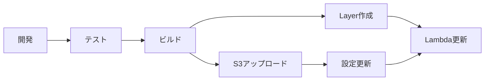

# Lambda環境でのプラグイン運用

## 概要

AWS Lambda環境では、ファイルシステムが読み取り専用（/tmp以外）であり、動的なプラグイン読み込みに特別な考慮が必要です。

## プラグイン配置戦略

### 1. Lambda Layers（推奨）

```
Lambda Layer構造:
python/
├── AI_Agent/
│   └── plugins/
│       ├── __init__.py
│       ├── weather_agent.py
│       ├── stock_agent.py
│       └── custom_agents/
│           └── company_agent.py
```

**利点:**
- バージョン管理が容易
- 複数のLambda関数で共有可能
- デプロイが高速
- 最大5つのLayerまで使用可能

**設定方法:**
```bash
# Layer作成
zip -r plugins-layer.zip python/
aws lambda publish-layer-version \
    --layer-name ai-agent-plugins \
    --zip-file fileb://plugins-layer.zip \
    --compatible-runtimes python3.9 python3.10
```

### 2. S3からの動的ロード

```python
# 環境変数設定
PLUGIN_S3_BUCKET=my-lambda-plugins
PLUGIN_S3_PREFIX=plugins/v1/

# 実行時に/tmpにダウンロード
/tmp/plugins/
├── weather_agent.py
├── stock_agent.py
└── translation_agent.py
```

**利点:**
- 実行時の動的更新が可能
- プラグインの追加がLambda再デプロイ不要
- A/Bテストが容易

**欠点:**
- コールドスタート時のレイテンシ増加
- S3アクセス料金

### 3. 環境変数による設定

```bash
# プラグイン設定をJSON形式で
PLUGIN_AGENTS='[
  {
    "name": "WeatherAgent",
    "module": "AI_Agent.plugins.weather_agent",
    "class": "WeatherAgent",
    "enabled": true
  }
]'

# 個別設定
PLUGIN_WEATHER_ENABLED=true
PLUGIN_WEATHER_API_KEY=xxx
PLUGIN_WEATHER_TIMEOUT=10
```

### 4. DynamoDBによる設定管理

```python
# DynamoDBテーブル構造
{
  "config_type": "agent_plugins",
  "agents": [
    {
      "name": "WeatherAgent",
      "enabled": true,
      "config": {
        "api_key": "encrypted_key",
        "regions": ["us-east-1", "ap-northeast-1"]
      }
    }
  ],
  "updated_at": "2024-01-01T00:00:00Z"
}
```

## 実装例

### Lambda関数のコード

```python
import os
from AI_Agent.lambda_plugin_loader import get_lambda_plugin_loader
from AI_Agent.agent_executor import AgentExecutor

# グローバルスコープで初期化（コールドスタート最適化）
plugin_loader = None
agent_executor = None

def lambda_handler(event, context):
    global plugin_loader, agent_executor
    
    # 初回のみ初期化
    if plugin_loader is None:
        plugin_loader = get_lambda_plugin_loader()
        plugin_loader.load_plugins()
        
        agent_executor = AgentExecutor()
    
    # エージェント実行
    agent_name = event.get('agent', 'WebAgent')
    inputs = event.get('inputs', {})
    
    result = await agent_executor.execute_step({
        'agent': agent_name,
        'inputs': inputs
    })
    
    return {
        'statusCode': 200,
        'body': json.dumps(result)
    }
```

### SAMテンプレート

```yaml
AWSTemplateFormatVersion: '2010-09-09'
Transform: AWS::Serverless-2016-10-31

Globals:
  Function:
    Runtime: python3.9
    Timeout: 30
    MemorySize: 512
    Environment:
      Variables:
        PLUGIN_S3_BUCKET: !Ref PluginBucket
        PLUGIN_DYNAMODB_TABLE: !Ref PluginConfigTable

Resources:
  AgentFunction:
    Type: AWS::Serverless::Function
    Properties:
      CodeUri: ./
      Handler: lambda_function.lambda_handler
      Layers:
        - !Ref PluginLayer
      Policies:
        - S3ReadPolicy:
            BucketName: !Ref PluginBucket
        - DynamoDBReadPolicy:
            TableName: !Ref PluginConfigTable
      Environment:
        Variables:
          PLUGIN_WEATHER_ENABLED: true
          PLUGIN_STOCK_ENABLED: false

  PluginLayer:
    Type: AWS::Serverless::LayerVersion
    Properties:
      LayerName: AIAgentPlugins
      ContentUri: ./layers/plugins/
      CompatibleRuntimes:
        - python3.9
        - python3.10

  PluginBucket:
    Type: AWS::S3::Bucket
    Properties:
      BucketName: ai-agent-plugins
      VersioningConfiguration:
        Status: Enabled

  PluginConfigTable:
    Type: AWS::DynamoDB::Table
    Properties:
      TableName: ai-agent-plugin-config
      AttributeDefinitions:
        - AttributeName: config_type
          AttributeType: S
      KeySchema:
        - AttributeName: config_type
          KeyType: HASH
      BillingMode: PAY_PER_REQUEST
```

## 最適化のベストプラクティス

### 1. コールドスタート対策

```python
# グローバルスコープで重い処理を実行
import os
import json
from AI_Agent.lambda_plugin_loader import LambdaPluginLoader

# プラグインローダーをグローバルで初期化
PLUGIN_LOADER = LambdaPluginLoader()
PLUGINS = PLUGIN_LOADER.load_plugins()

def lambda_handler(event, context):
    # ここでは軽い処理のみ
    pass
```

### 2. キャッシング戦略

```python
class CachedPluginLoader(LambdaPluginLoader):
    def __init__(self):
        super().__init__()
        self._cache_duration = 300  # 5分
        self._last_load = 0
    
    def load_plugins(self, factory=None):
        import time
        current_time = time.time()
        
        # キャッシュが有効な場合はスキップ
        if current_time - self._last_load < self._cache_duration:
            return self.loaded_plugins
            
        # 再読み込み
        plugins = super().load_plugins(factory)
        self._last_load = current_time
        return plugins
```

### 3. 並列ダウンロード

```python
import asyncio
import aioboto3

async def download_plugins_parallel(self):
    """S3から並列でプラグインをダウンロード"""
    async with aioboto3.Session().client('s3') as s3:
        tasks = []
        for key in plugin_keys:
            task = self._download_single_plugin(s3, key)
            tasks.append(task)
        
        await asyncio.gather(*tasks)
```

## セキュリティ考慮事項

### 1. プラグインの検証

```python
def validate_plugin(plugin_path: str) -> bool:
    """プラグインの安全性を検証"""
    # 署名検証
    if not verify_signature(plugin_path):
        return False
    
    # 危険な操作の検出
    with open(plugin_path, 'r') as f:
        content = f.read()
        dangerous_patterns = [
            'exec(', 'eval(', '__import__',
            'subprocess', 'os.system'
        ]
        for pattern in dangerous_patterns:
            if pattern in content:
                return False
    
    return True
```

### 2. 実行権限の制限

```yaml
# IAMロールで最小権限
Policies:
  - Version: '2012-10-17'
    Statement:
      - Effect: Allow
        Action:
          - s3:GetObject
        Resource: !Sub '${PluginBucket.Arn}/plugins/*'
      - Effect: Allow
        Action:
          - dynamodb:GetItem
        Resource: !GetAtt PluginConfigTable.Arn
```

## デプロイメントパイプライン



## まとめ

Lambda環境でのプラグイン運用は：

1. **Lambda Layers**: 静的プラグイン用（推奨）
2. **S3動的ロード**: 頻繁に更新されるプラグイン用
3. **環境変数**: 簡単な設定用
4. **DynamoDB**: 複雑な設定と動的更新用

これらを組み合わせることで、柔軟かつ高性能なプラグインシステムを実現できます。