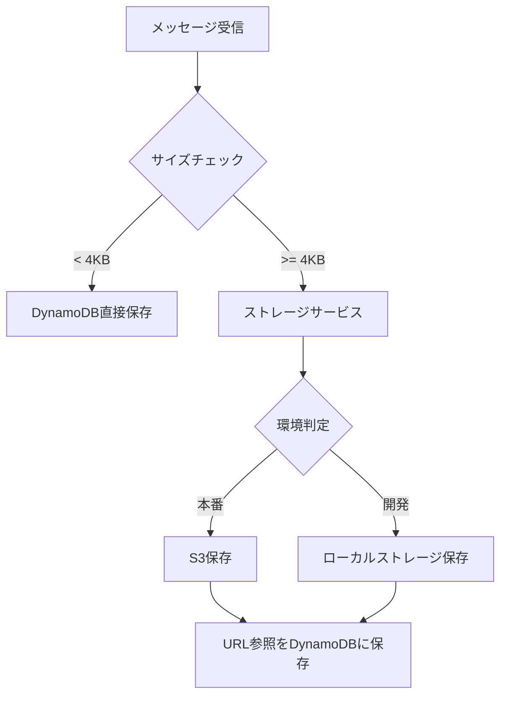

# ストレージ戦略

## ⚠️⚠️⚠️ 重要な注意 ⚠️⚠️⚠️
**このドキュメントは古い仕様です！！！**
**正しい仕様は[チャット仕様書](../仕様書/チャット仕様書.md)を参照してください！！！**

### 🚨 正しい実装：
- **全てのメッセージ（サイズに関わらず）をS3/BlobStorageに保存する**
- **日付ベースのディレクトリ構造で保存する**
- **DynamoDBはインデックスとしてのみ使用する**

### ❌ 間違った実装（このドキュメント）：
- ~~4KB未満はDynamoDB直接保存~~ → **間違い！**
- ~~4KB以上のみS3保存~~ → **間違い！**

---

## 概要（旧仕様・使用禁止）
~~メッセージデータのサイズに応じて、DynamoDBとS3（開発環境ではローカルストレージ）を使い分ける戦略を採用しています。~~

## サイズ制限（旧仕様・使用禁止）
- **最大メッセージサイズ**: 128KB（画像URLは除外）
- ~~**DynamoDB直接保存**: 4KB未満~~ **← 使用禁止！**
- ~~**S3/ローカルストレージ保存**: 4KB以上~~ **← 間違い！全て保存！**

## アーキテクチャ

### 1. ストレージインターフェース構成

```
services/
├── storage_service.py        # 統一ストレージサービス（メインインターフェース）
├── local_storage_service.py  # ローカルストレージ実装
├── message_processor.py      # メッセージサイズ処理
└── chat_service.py          # チャットサービス（ストレージを利用）
```

### 2. データフロー



## 実装詳細

### 1. StorageService（統一インターフェース）

環境変数`USE_S3`に基づいて、S3またはローカルストレージを自動選択：

```python
# 環境変数
USE_S3=false  # 開発環境（デフォルト）
USE_S3=true   # 本番環境

# 使用例
from services.storage_service import storage_service

# 保存（環境に応じて自動的にS3またはローカルに保存）
result = await storage_service.put_object(key, content)
url = result['url']  # s3://... または local://...

# 取得（URLから自動的に適切なストレージから取得）
content = await storage_service.get_object_from_url(url)
```

### 2. LocalStorageService（開発環境）

S3のAPIを模倣したローカルファイルシステム実装：

- **保存先**: `./data/local_storage/`
- **URL形式**: `local://storage/{key}`
- **メタデータ**: JSONファイルとして保存

### 3. MessageProcessor

メッセージサイズの検証と処理戦略の決定：

```python
# サイズ検証
is_valid, size, error = processor.validate_message_size(content)

# 保存戦略の決定
if processor.should_use_s3(size):
    # S3/ローカルストレージに保存
else:
    # DynamoDBに直接保存
```

## データ構造

### DynamoDBに保存されるメッセージ構造

#### 小さいメッセージ（< 4KB）
```json
{
  "id": "message-uuid",
  "chat_id": "chat-uuid",
  "role": "user",
  "content": "メッセージ本文",
  "content_type": "text",
  "storage_type": "dynamodb",
  "size_bytes": 2048,
  "timestamp": "2025-07-10T12:00:00"
}
```

#### 大きいメッセージ（>= 4KB）
```json
{
  "id": "message-uuid",
  "chat_id": "chat-uuid",
  "role": "assistant",
  "content": "メッセージの最初の200文字...",
  "content_preview": "メッセージの最初の200文字...",
  "content_type": "large_text",
  "storage_type": "s3",
  "content_url": "s3://bucket/messages/chat-id/message-id.json",
  "size_bytes": 15360,
  "timestamp": "2025-07-10T12:00:00"
}
```

### S3/ローカルストレージのオブジェクト構造

```json
{
  "content": "完全なメッセージ本文",
  "metadata": {
    "chat_id": "chat-uuid",
    "message_id": "message-uuid",
    "original_size": "15360"
  },
  "created_at": "2025-07-10T12:00:00"
}
```

## 移行ガイド

### 開発環境から本番環境への移行

1. **環境変数の設定**
   ```bash
   USE_S3=true
   S3_BUCKET_NAME=makoto-messages
   AWS_REGION=ap-northeast-1
   ```

2. **IAMロールの設定**
   - S3バケットへの読み書き権限
   - DynamoDBテーブルへのアクセス権限

3. **S3バケットの作成**
   ```bash
   aws s3 mb s3://makoto-messages --region ap-northeast-1
   ```

4. **ライフサイクルポリシーの設定**
   - 古いメッセージの自動アーカイブ
   - 削除ポリシーの設定

## パフォーマンス最適化

### 1. 非同期処理
- すべてのストレージ操作は非同期で実行
- 大きいメッセージの保存中もUIはブロックされない

### 2. キャッシュ戦略
- 頻繁にアクセスされるメッセージはメモリキャッシュ
- CloudFront（本番）またはローカルキャッシュ（開発）

### 3. バッチ処理
- 複数メッセージの一括取得
- 並列処理による高速化

## エラーハンドリング

### 1. サイズ超過エラー
```python
if content_size > 128 * 1024:
    raise ValueError(f"メッセージサイズが上限（128KB）を超えています")
```

### 2. ストレージエラー
- S3エラー時: 4KB未満ならDynamoDBに直接保存
- それ以外: エラーをユーザーに通知

### 3. リトライ戦略
- 最大3回のリトライ
- 指数バックオフ

## モニタリング

### CloudWatchメトリクス
- メッセージサイズ分布
- ストレージ使用率
- エラー率
- レスポンスタイム

### アラート設定
- 10%以上のメッセージが4KB超: 通知
- 128KB超のメッセージ: エラー通知
- ストレージエラー率が1%超: 警告

## セキュリティ

### 1. 暗号化
- S3: サーバーサイド暗号化（SSE-S3）
- DynamoDB: 保存時の暗号化
- 転送時: HTTPS/TLS

### 2. アクセス制御
- IAMロールベースのアクセス
- 最小権限の原則
- テナント分離

### 3. 監査
- CloudTrailによるアクセスログ
- DynamoDBストリーム
- S3アクセスログ

## 今後の拡張

### 1. 圧縮対応（現在は無効）
- 将来的に必要に応じて圧縮機能を追加可能
- gzip圧縮でさらなる容量削減

### 2. メディアファイル対応
- 画像、動画などのバイナリファイル
- プレビュー生成
- CDN配信

### 3. グローバル展開
- マルチリージョンレプリケーション
- エッジロケーションでのキャッシュ
- 地理的に近いストレージの自動選択