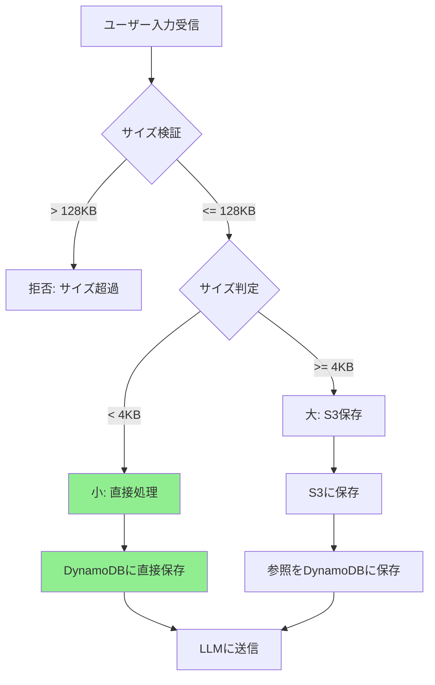
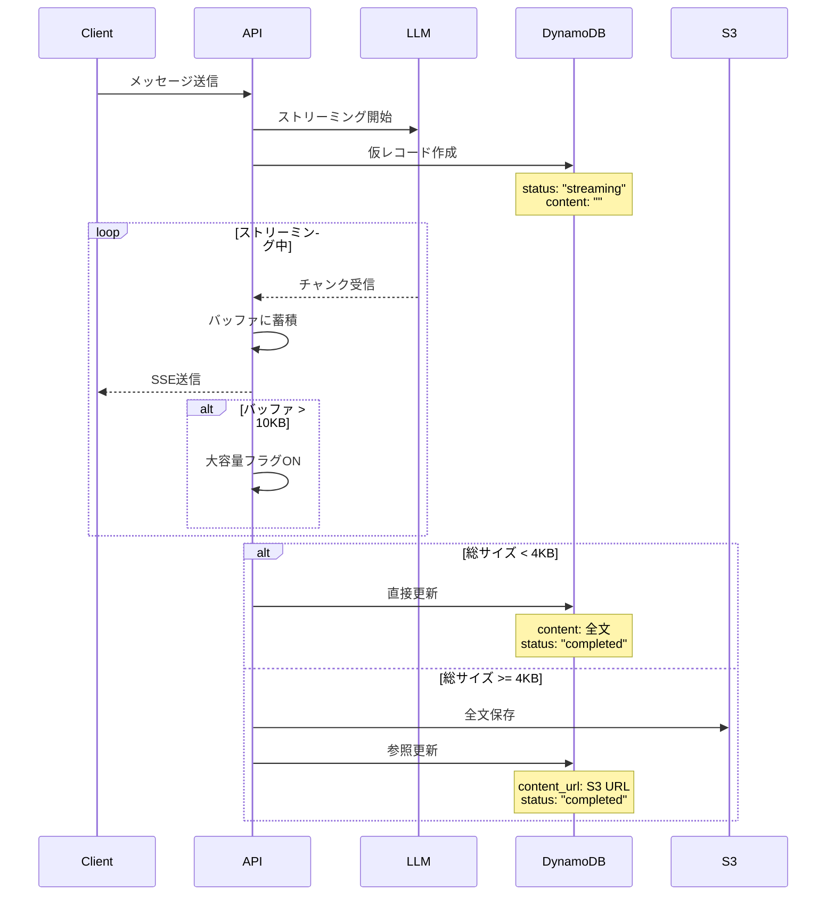

# 大容量データ処理設計書

## 概要
本ドキュメントでは、チャットシステムにおける大容量データの処理方法について、入力（ユーザーメッセージ）と出力（LLM応答）それぞれの処理フローを定義します。

## 1. データサイズの定義

### 閾値設定
```yaml
# 環境変数で設定可能
SMALL_MESSAGE_THRESHOLD: 4KB      # これ以下はDynamoDBに直接保存
MAX_MESSAGE_SIZE: 128KB           # 絶対的な上限（画像URLは除外）
```

### 現実的なサイズ分布
- **ユーザー入力**
  - 通常: 100バイト〜1KB（質問、指示）
  - 大きい: 1KB〜64KB（コード、ドキュメントのコピペ）
  - 最大: 64KB〜128KB（長文のドキュメント）

- **LLM出力**
  - 通常: 500バイト〜3KB（回答、説明）
  - 大きい: 3KB〜10KB（詳細な解説、コード生成）
  - 最大: 10KB〜128KB（大量のコード生成、詳細な分析）

- **画像データ**
  - URLのみ保存（実際の画像はS3に別途保存）
  - URLサイズ: 通常100〜200バイト

## 2. 入力処理フロー（ユーザーメッセージ）

### 2.1 処理フロー図



### 2.2 実装詳細

```python
class InputProcessor:
    def __init__(self):
        self.SMALL_THRESHOLD = 4 * 1024  # 4KB
        self.MAX_SIZE = 128 * 1024  # 128KB
        
    async def process_user_input(self, chat_id: str, content: str, files: List[File] = None):
        """ユーザー入力の処理"""
        
        # 1. サイズ検証
        content_size = len(content.encode('utf-8'))
        if content_size > self.MAX_SIZE:
            raise ValueError(f"入力サイズが上限（128KB）を超えています: {content_size / 1024:.1f}KB")
        
        # 2. サイズに応じた処理
        if content_size < self.SMALL_THRESHOLD:
            return await self._process_small_input(chat_id, content)
        else:
            return await self._process_large_input(chat_id, content)
    
    async def _process_small_input(self, chat_id: str, content: str):
        """小さい入力（< 4KB）: 直接保存"""
        message = {
            "PK": f"TENANT#{self.tenant_id}#CHAT#{chat_id}",
            "SK": f"MSG#{datetime.now().isoformat()}#{uuid4()}",
            "role": "user",
            "content": content,
            "content_type": "text",
            "size_bytes": len(content.encode('utf-8')),
            "timestamp": datetime.now().isoformat()
        }
        
        await self.dynamodb.put_item(Item=message)
        return message
    
    async def _process_large_input(self, chat_id: str, content: str):
        """大きい入力（>= 4KB）: S3保存"""
        # S3に保存
        s3_key = f"messages/{self.tenant_id}/{chat_id}/input-{uuid4()}.json"
        await self.s3.put_object(
            Bucket=self.bucket_name,
            Key=s3_key,
            Body=json.dumps({"content": content}),
            ContentType='application/json',
            Metadata={
                'size': str(len(content.encode('utf-8'))),
                'role': 'user'
            }
        )
        
        # DynamoDBには参照を保存
        message = {
            "PK": f"TENANT#{self.tenant_id}#CHAT#{chat_id}",
            "SK": f"MSG#{datetime.now().isoformat()}#{uuid4()}",
            "role": "user",
            "content": content[:200] + "...",  # プレビュー
            "content_type": "large_text",
            "content_url": f"s3://{self.bucket_name}/{s3_key}",
            "size_bytes": len(content.encode('utf-8')),
            "timestamp": datetime.now().isoformat()
        }
        
        await self.dynamodb.put_item(Item=message)
        return message
    
```

## 3. 出力処理フロー（LLM応答）

### 3.1 処理フロー図



### 3.2 実装詳細

```python
class OutputProcessor:
    def __init__(self):
        self.DIRECT_SAVE_THRESHOLD = 4 * 1024  # 4KB
        self.WARNING_THRESHOLD = 10 * 1024  # 10KB（警告用）
        
    async def process_llm_stream(self, chat_id: str, stream_generator):
        """LLM応答のストリーミング処理"""
        
        # 1. 初期化
        buffer = StringIO()
        total_size = 0
        message_id = str(uuid4())
        start_time = datetime.now()
        
        # 2. 仮レコード作成
        await self._create_streaming_record(chat_id, message_id)
        
        # 3. ストリーミング処理
        try:
            async for chunk in stream_generator:
                # バッファに蓄積
                buffer.write(chunk)
                chunk_size = len(chunk.encode('utf-8'))
                total_size += chunk_size
                
                # クライアントに送信
                yield {
                    "type": "content",
                    "data": chunk,
                    "total_size": total_size
                }
                
                # サイズ警告
                if total_size > self.WARNING_THRESHOLD and total_size < self.WARNING_THRESHOLD + 1000:
                    yield {
                        "type": "warning",
                        "message": "Large response detected",
                        "size": total_size
                    }
            
            # 4. 完了処理
            full_content = buffer.getvalue()
            await self._finalize_message(chat_id, message_id, full_content, total_size)
            
            yield {
                "type": "completed",
                "message_id": message_id,
                "total_size": total_size,
                "duration": (datetime.now() - start_time).total_seconds()
            }
            
        except Exception as e:
            # エラー処理
            await self._mark_as_error(chat_id, message_id, str(e))
            raise
    
    async def _create_streaming_record(self, chat_id: str, message_id: str):
        """ストリーミング中の仮レコード作成"""
        message = {
            "PK": f"TENANT#{self.tenant_id}#CHAT#{chat_id}",
            "SK": f"MSG#{datetime.now().isoformat()}#{message_id}",
            "message_id": message_id,
            "role": "assistant",
            "content": "",
            "content_type": "streaming",
            "status": "streaming",
            "timestamp": datetime.now().isoformat()
        }
        
        await self.dynamodb.put_item(Item=message)
    
    async def _finalize_message(self, chat_id: str, message_id: str, content: str, size: int):
        """メッセージの完了処理"""
        
        update_expr_parts = []
        expr_attr_values = {}
        
        if size < self.DIRECT_SAVE_THRESHOLD:
            # 小さい応答: DynamoDBに直接保存
            update_expr_parts.extend([
                "content = :content",
                "content_type = :type",
                "#status = :status",
                "size_bytes = :size"
            ])
            expr_attr_values.update({
                ":content": content,
                ":type": "text",
                ":status": "completed",
                ":size": size
            })
            
        else:
            # 大きい応答: S3に保存
            s3_key = f"messages/{self.tenant_id}/{chat_id}/output-{message_id}.json"
            await self.s3.put_object(
                Bucket=self.bucket_name,
                Key=s3_key,
                Body=json.dumps({"content": content}),
                ContentType='application/json',
                Metadata={
                    'original-size': str(size)
                }
            )
            
            update_expr_parts.extend([
                "content = :preview",
                "content_url = :url",
                "content_type = :type",
                "#status = :status",
                "size_bytes = :size"
            ])
            expr_attr_values.update({
                ":preview": content[:200] + "...",
                ":url": f"s3://{self.bucket_name}/{s3_key}",
                ":type": "large_text",
                ":status": "completed",
                ":size": size
            })
        
        # DynamoDB更新
        await self.dynamodb.update_item(
            Key={
                "PK": f"TENANT#{self.tenant_id}#CHAT#{chat_id}",
                "SK": f"MSG#{message_id}"
            },
            UpdateExpression="SET " + ", ".join(update_expr_parts),
            ExpressionAttributeValues=expr_attr_values,
            ExpressionAttributeNames={"#status": "status"}
        )
```

## 4. 取得時の処理

### 4.1 統一的な取得インターフェース

```python
class MessageRetriever:
    async def get_message_content(self, message: dict) -> str:
        """メッセージコンテンツの取得（保存方法に依らず）"""
        
        content_type = message.get('content_type', 'text')
        
        if content_type == 'text':
            # 直接保存されている
            return message['content']
            
        elif content_type == 'large_text':
            # S3から取得
            content_url = message['content_url']
            s3_key = content_url.replace(f"s3://{self.bucket_name}/", "")
            
            response = await self.s3.get_object(
                Bucket=self.bucket_name,
                Key=s3_key
            )
            
            body = await response['Body'].read()
            # JSON形式
            data = json.loads(body)
            return data['content']
        
        else:
            raise ValueError(f"Unknown content_type: {content_type}")
    
```

## 5. パフォーマンス最適化

### 5.1 キャッシュ戦略

```yaml
キャッシュレイヤー:
  - DynamoDB DAX: 頻繁にアクセスされるメッセージ
  - CloudFront: S3の大きなコンテンツ
  - Redis/ElastiCache: アプリケーションレベルキャッシュ
```

### 5.2 並列処理

```python
# 複数メッセージの並列取得
async def get_messages_batch(self, message_ids: List[str]):
    tasks = []
    for msg_id in message_ids:
        task = self.get_message_content(msg_id)
        tasks.append(task)
    
    return await asyncio.gather(*tasks)
```

## 6. エラーハンドリング

### 6.1 リトライ戦略

```python
@retry(
    stop=stop_after_attempt(3),
    wait=wait_exponential(multiplier=1, min=4, max=10),
    retry=retry_if_exception_type(ClientError)
)
async def s3_put_with_retry(self, **kwargs):
    return await self.s3.put_object(**kwargs)
```

### 6.2 フォールバック

```python
async def save_message_with_fallback(self, content: str):
    try:
        # 通常の保存処理
        return await self.save_message(content)
    except S3Error:
        # S3エラー時はサイズが小さければDynamoDBに直接保存
        if len(content.encode('utf-8')) < 4 * 1024:  # 4KB
            return await self.save_to_dynamodb_direct(content)
        else:
            # それ以上の場合はエラー
            raise
```

## 7. モニタリング

### 7.1 メトリクス

```yaml
CloudWatch Metrics:
  - MessageSize: 
      - 平均サイズ
      - 最大サイズ（128KB上限）
      - サイズ分布
  - ProcessingTime:
      - S3保存時間
  - ErrorRate:
      - サイズ超過エラー（128KB超）
      - S3エラー
```

### 7.2 アラート設定

```yaml
Alarms:
  - LargeMessageRate:
      Threshold: 10%以上のメッセージが4KB超
      Action: 通知
  - MessageSizeLimit:
      Threshold: 128KB超のメッセージ
      Action: エラー通知
  - ProcessingLatency:
      Threshold: 5秒以上
      Action: スケールアウト
```

## 8. 将来の拡張性

### 8.1 ストリーミング最適化
- Server-Sent Eventsでのプログレッシブレンダリング
- WebSocketでの双方向通信

### 8.2 エッジ処理
- CloudFront Functionsでの前処理
- Lambda@Edgeでの圧縮/解凍

### 8.3 機械学習統合
- 大きな入力の要約生成
- コンテンツの自動分類