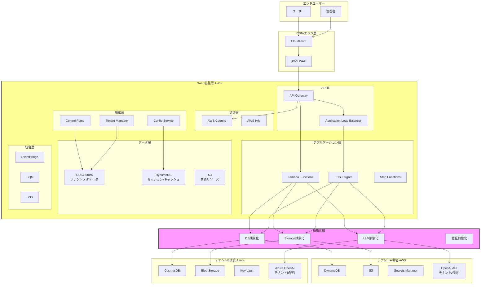
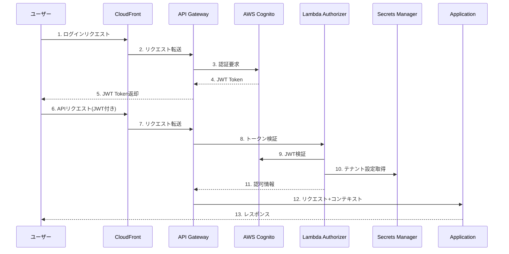
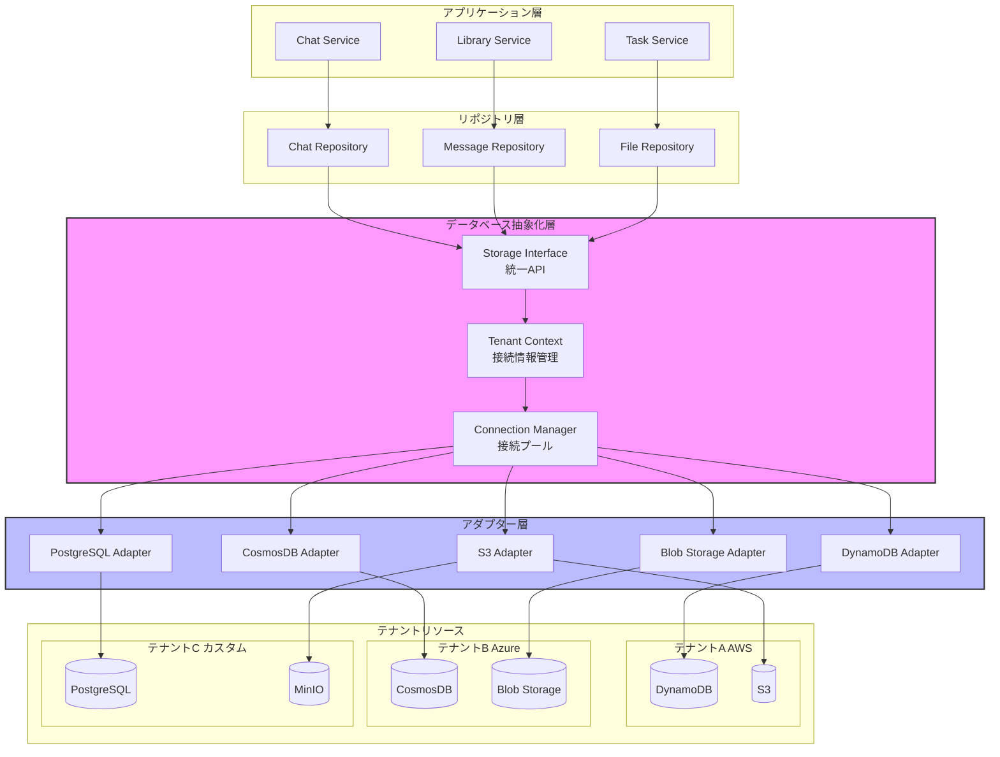
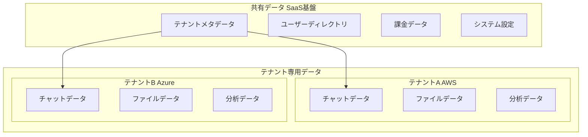
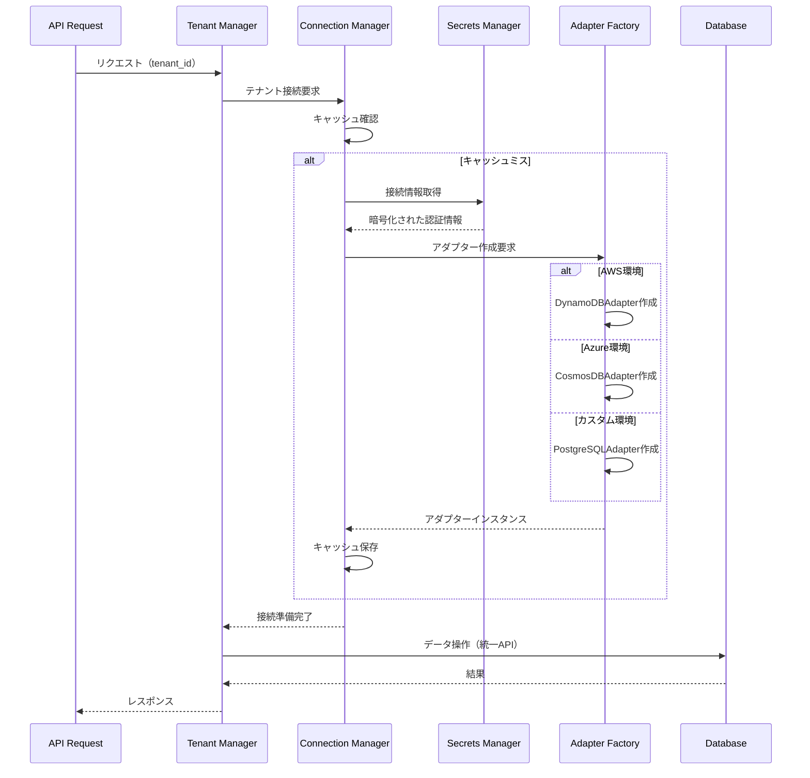
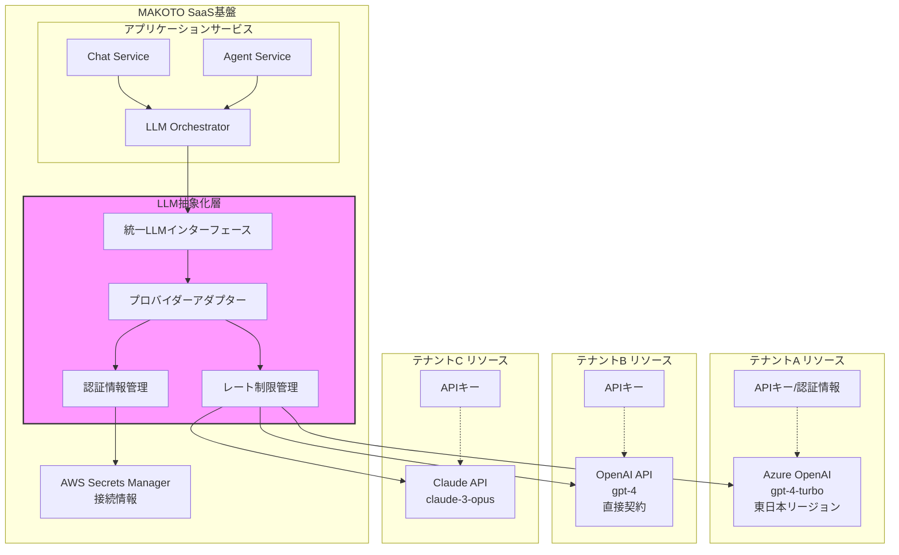
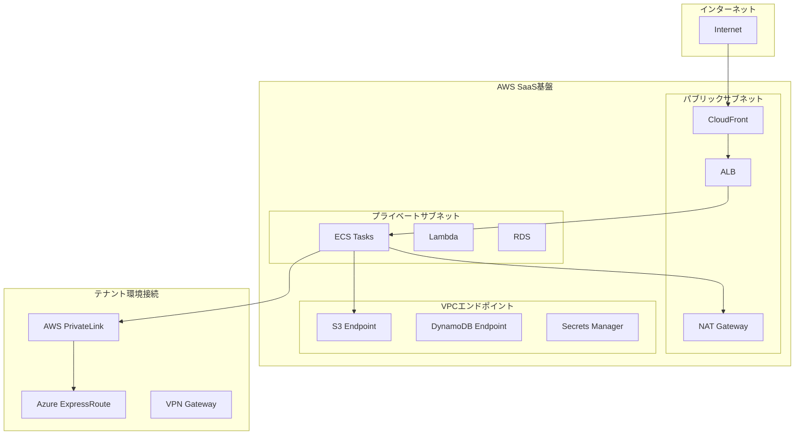
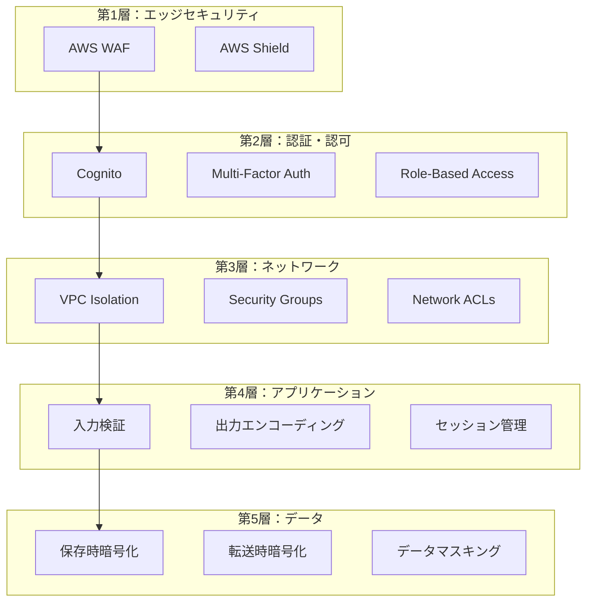
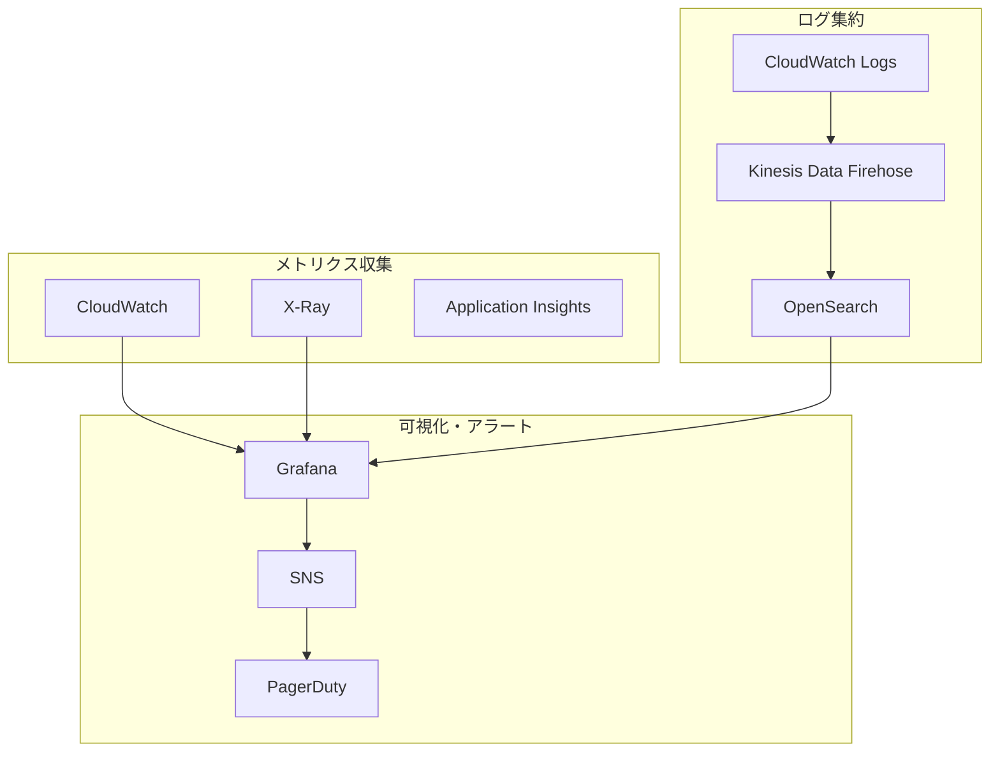
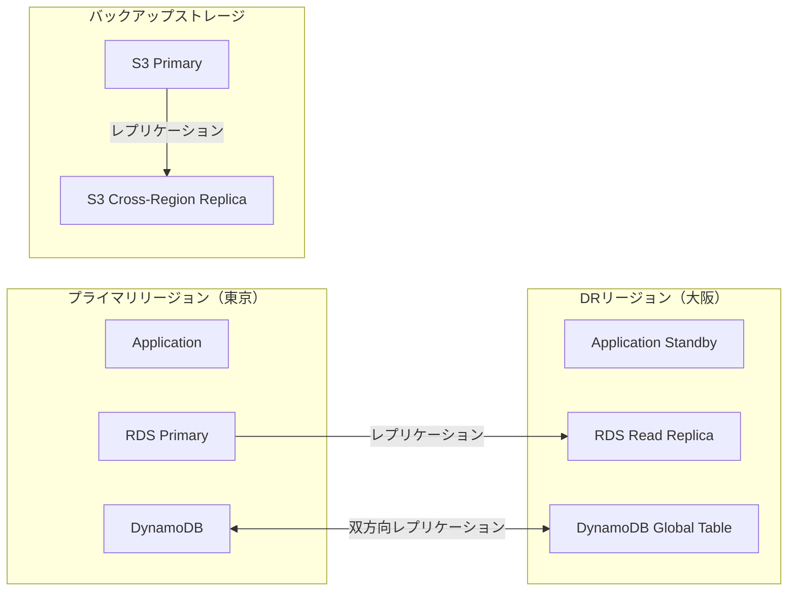

# SaaS基盤アーキテクチャ設計書

## 目次

1. [概要](#概要)
2. [全体アーキテクチャ](#全体アーキテクチャ)
3. [SaaS基盤層（AWS）](#saas基盤層aws)
4. [テナント層（AWS/Azure選択可能）](#テナント層awsazure選択可能)
5. [認証・認可アーキテクチャ](#認証認可アーキテクチャ)
6. [データアーキテクチャ](#データアーキテクチャ)
7. [LLMサービス統合](#llmサービス統合)
8. [ネットワークアーキテクチャ](#ネットワークアーキテクチャ)
9. [セキュリティアーキテクチャ](#セキュリティアーキテクチャ)
10. [監視・運用アーキテクチャ](#監視運用アーキテクチャ)
11. [災害復旧・事業継続性](#災害復旧事業継続性)
12. [コスト最適化戦略](#コスト最適化戦略)

## 概要

MAKOTO Visual AIは、マルチテナント型SaaSアプリケーションとして設計されています。SaaS基盤はAWSのマネージドサービスで構築・運用し、各テナント（顧客）は自身のクラウド環境（AWS/Azure）でデータストレージ、LLMサービス（Azure OpenAI等）を契約・管理します。MAKOTOはこれらのテナント提供リソースに安全に接続してサービスを提供します。

### 設計原則

1. **マルチクラウド対応**: テナント毎にAWS/Azureを選択可能
2. **完全なテナント分離**: データ、リソース、認証の完全分離
3. **スケーラビリティ**: 水平・垂直両方向への拡張性
4. **高可用性**: 99.95%以上のSLA達成
5. **セキュリティファースト**: ゼロトラストアーキテクチャ
6. **コスト最適化**: 使用量ベースの課金とリソース最適化

## 全体アーキテクチャ



## SaaS基盤層（AWS）

### コンポーネント構成

#### 1. API Gateway
- **役割**: APIエンドポイント管理、認証、レート制限
- **構成**:
  ```yaml
  APIGateway:
    Type: REST/HTTP API v2
    Features:
      - JWT Authorizer (Cognito統合)
      - Request/Response変換
      - APIキー管理
      - 使用量プラン
    Endpoints:
      - /api/v1/tenants/{tenant_id}/*
      - /api/v1/auth/*
      - /api/v1/admin/*
  ```

#### 2. コンピューティング層
- **ECS Fargate**: 長時間実行タスク、WebSocket接続
- **Lambda**: 短時間処理、イベント駆動型処理
- **Step Functions**: ワークフロー管理、複雑な処理の調整

#### 3. データストア
```yaml
SaaS基盤データストア:
  RDS Aurora:
    用途: テナントメタデータ、設定、課金情報
    構成: Multi-AZ、Read Replica
    
  DynamoDB:
    用途: セッション管理、一時データ、キャッシュ
    構成: On-Demand、Global Tables
    
  S3:
    用途: 静的リソース、ログ、バックアップ
    構成: Versioning有効、ライフサイクル管理
```

### コントロールプレーン設計

```python
class ControlPlane:
    """SaaS基盤のコントロールプレーン"""
    
    def __init__(self):
        self.tenant_manager = TenantManager()
        self.resource_manager = ResourceManager()
        self.config_service = ConfigurationService()
        self.billing_service = BillingService()
    
    async def create_tenant(self, tenant_config: TenantConfig):
        """新規テナント作成"""
        # 1. テナントメタデータ作成
        tenant = await self.tenant_manager.create(tenant_config)
        
        # 2. 認証リソース作成
        if tenant_config.auth_provider == "cognito":
            await self._create_cognito_resources(tenant)
        
        # 3. クラウドリソース作成
        if tenant_config.cloud_provider == "aws":
            await self._provision_aws_resources(tenant)
        elif tenant_config.cloud_provider == "azure":
            await self._provision_azure_resources(tenant)
        
        # 4. 初期設定
        await self.config_service.initialize_tenant(tenant)
        
        return tenant
```

## テナント層（AWS/Azure選択可能）

### テナント分離戦略

#### 1. AWS環境のテナント
```yaml
AWSテナント構成:
  データストア:
    DynamoDB:
      - テーブル名: makoto-{tenant_id}-chats
      - 暗号化: AWS管理キー
      - バックアップ: Point-in-time recovery
    
    S3:
      - バケット: makoto-{tenant_id}-assets
      - 暗号化: SSE-S3
      - アクセス: IAMロール制限
  
  シークレット管理:
    Secrets Manager:
      - パス: /makoto/{tenant_id}/*
      - ローテーション: 自動
```

#### 2. Azure環境のテナント
```yaml
Azureテナント構成:
  データストア:
    CosmosDB:
      - データベース: makoto-{tenant_id}
      - パーティションキー: /tenantId
      - 一貫性レベル: Session
    
    Blob Storage:
      - コンテナ: {tenant_id}-assets
      - アクセス層: Hot
      - レプリケーション: LRS
  
  シークレット管理:
    Key Vault:
      - 名前: makoto-{tenant_id}-kv
      - アクセスポリシー: RBAC
```

### 抽象化層の実装

```python
from abc import ABC, abstractmethod

class StorageInterface(ABC):
    """ストレージ抽象化インターフェース"""
    
    @abstractmethod
    async def upload(self, key: str, data: bytes, metadata: dict) -> str:
        pass
    
    @abstractmethod
    async def download(self, key: str) -> bytes:
        pass
    
    @abstractmethod
    async def delete(self, key: str) -> bool:
        pass

class MultiCloudStorageFactory:
    """マルチクラウド対応ストレージファクトリー"""
    
    @staticmethod
    def create_storage(tenant_config: TenantConfig) -> StorageInterface:
        if tenant_config.cloud_provider == "aws":
            return S3Storage(
                bucket_name=f"makoto-{tenant_config.tenant_id}-assets",
                region=tenant_config.aws_region
            )
        elif tenant_config.cloud_provider == "azure":
            return BlobStorage(
                container_name=f"{tenant_config.tenant_id}-assets",
                connection_string=tenant_config.azure_connection_string
            )
        else:
            raise ValueError(f"Unsupported cloud provider: {tenant_config.cloud_provider}")
```

## 認証・認可アーキテクチャ

### マルチテナント認証フロー



### JWTトークン構造

```json
{
  "sub": "user-uuid",
  "iss": "https://cognito-idp.region.amazonaws.com/user-pool-id",
  "custom:tenant_id": "tenant-abc-123",
  "custom:cloud_provider": "azure",
  "custom:role": "admin",
  "custom:organization": "株式会社サンプル",
  "custom:features": ["chat", "image_generation", "web_search"],
  "exp": 1234567890,
  "iat": 1234567890
}
```

## データアーキテクチャ

### データベース抽象化レイヤー



### 抽象化インターフェース実装

```python
from abc import ABC, abstractmethod
from typing import Dict, List, Optional, Any

class StorageInterface(ABC):
    """データベース操作の統一インターフェース"""
    
    @abstractmethod
    async def get(self, key: str) -> Optional[Dict[str, Any]]:
        """単一アイテムの取得"""
        pass
    
    @abstractmethod
    async def put(self, key: str, item: Dict[str, Any]) -> None:
        """アイテムの保存"""
        pass
    
    @abstractmethod
    async def delete(self, key: str) -> None:
        """アイテムの削除"""
        pass
    
    @abstractmethod
    async def query(self, **kwargs) -> List[Dict[str, Any]]:
        """クエリ実行"""
        pass
    
    @abstractmethod
    async def batch_get(self, keys: List[str]) -> List[Optional[Dict[str, Any]]]:
        """バッチ取得"""
        pass
    
    @abstractmethod
    async def batch_put(self, items: List[Dict[str, Any]]) -> None:
        """バッチ保存"""
        pass

class DynamoDBAdapter(StorageInterface):
    """DynamoDB実装"""
    
    def __init__(self, connection_info: dict):
        self.table_name = connection_info['table_name']
        self.client = self._create_client(connection_info)
    
    async def get(self, key: str) -> Optional[Dict[str, Any]]:
        response = await self.client.get_item(
            TableName=self.table_name,
            Key=self._parse_key(key)
        )
        return response.get('Item')
    
    async def query(self, **kwargs) -> List[Dict[str, Any]]:
        # DynamoDB特有のクエリ変換
        query_params = self._build_query_params(kwargs)
        response = await self.client.query(**query_params)
        return response.get('Items', [])

class CosmosDBAdapter(StorageInterface):
    """CosmosDB実装"""
    
    def __init__(self, connection_info: dict):
        self.database = connection_info['database']
        self.container = connection_info['container']
        self.client = self._create_client(connection_info)
    
    async def get(self, key: str) -> Optional[Dict[str, Any]]:
        try:
            return await self.container.read_item(
                item=key,
                partition_key=self._extract_partition_key(key)
            )
        except exceptions.CosmosResourceNotFoundError:
            return None
    
    async def query(self, **kwargs) -> List[Dict[str, Any]]:
        # CosmosDB SQLクエリ生成
        query = self._build_sql_query(kwargs)
        items = []
        async for item in self.container.query_items(query):
            items.append(item)
        return items
```

### データ分離モデル



### 動的接続管理フロー



### データアクセスパターン

```python
class TenantAwareDataAccess:
    """テナント認識型データアクセス層"""
    
    def __init__(self):
        self.connection_manager = ConnectionManager()
        self.adapter_cache = {}
    
    async def get_storage_adapter(self, tenant_context: TenantContext) -> StorageInterface:
        """テナント用ストレージアダプターの取得"""
        
        cache_key = f"{tenant_context.tenant_id}:{tenant_context.cloud_provider}"
        
        # キャッシュ確認
        if cache_key in self.adapter_cache:
            return self.adapter_cache[cache_key]
        
        # 接続情報取得
        connection_info = await self.connection_manager.get_connection_info(tenant_context)
        
        # アダプター作成
        if tenant_context.cloud_provider == "aws":
            adapter = DynamoDBAdapter(connection_info)
        elif tenant_context.cloud_provider == "azure":
            adapter = CosmosDBAdapter(connection_info)
        elif tenant_context.cloud_provider == "custom":
            adapter = PostgreSQLAdapter(connection_info)
        else:
            raise ValueError(f"Unsupported provider: {tenant_context.cloud_provider}")
        
        # キャッシュ保存
        self.adapter_cache[cache_key] = adapter
        
        return adapter
    
    async def get_chat(self, tenant_context: TenantContext, chat_id: str) -> Chat:
        """テナント分離されたチャット取得"""
        
        # 適切なアダプターを取得
        adapter = await self.get_storage_adapter(tenant_context)
        
        # 統一APIでデータ取得
        data = await adapter.get(f"CHAT#{chat_id}")
        
        return Chat.from_dict(data) if data else None
```

### マルチデータベース対応マッピング

| データベース | キー構造 | クエリ方式 | トランザクション |
|------------|---------|-----------|----------------|
| DynamoDB | PK/SK複合キー | KeyCondition/Filter | TransactWrite |
| CosmosDB | id/partitionKey | SQL API | バッチ操作 |
| PostgreSQL | プライマリキー | SQL | ACID準拠 |
| MongoDB | _id/インデックス | クエリドキュメント | マルチドキュメント |

## LLMサービス統合

### テナント提供LLM統合アーキテクチャ



### LLM設定管理

```yaml
# テナント別LLM設定（各テナントが自身のLLMサービスを提供）
tenant_llm_configurations:
  tenant_a:
    provider: azure_openai
    connection:
      endpoint: https://tenant-a-openai.openai.azure.com/
      api_key_ref: arn:aws:secretsmanager:region:account:secret:tenant-a/llm-key
      api_version: 2024-02-15-preview
    models:
      chat: gpt-4-turbo
      embedding: text-embedding-ada-002
      image: dall-e-3
    region: japaneast
    rate_limits:
      rpm: 600
      tpm: 90000
      
  tenant_b:
    provider: openai
    connection:
      api_key_ref: arn:aws:secretsmanager:region:account:secret:tenant-b/llm-key
    models:
      chat: gpt-4
      embedding: text-embedding-3-small
    rate_limits:
      rpm: 500
      tpm: 60000
      
  tenant_c:
    provider: anthropic
    connection:
      api_key_ref: arn:aws:secretsmanager:region:account:secret:tenant-c/llm-key
    models:
      chat: claude-3-opus-20240229
    rate_limits:
      rpm: 100
      tpm: 100000
```

### LLM抽象化実装

```python
class TenantLLMProvider:
    """テナント提供LLMへの統一アクセス"""
    
    def __init__(self, tenant_id: str):
        self.tenant_id = tenant_id
        self.config = None
        self.client = None
        
    async def initialize(self):
        """テナントLLM設定の初期化"""
        # Secrets ManagerからLLM設定を取得
        self.config = await self.get_tenant_llm_config(self.tenant_id)
        
        # プロバイダー別クライアント作成
        if self.config['provider'] == 'azure_openai':
            self.client = await self._create_azure_openai_client()
        elif self.config['provider'] == 'openai':
            self.client = await self._create_openai_client()
        elif self.config['provider'] == 'anthropic':
            self.client = await self._create_anthropic_client()
        else:
            raise ValueError(f"Unsupported provider: {self.config['provider']}")
    
    async def chat_completion(self, messages: List[dict], **kwargs) -> dict:
        """統一されたチャット完了API"""
        # プロバイダー別の実装を呼び出し
        if self.config['provider'] == 'azure_openai':
            return await self._azure_chat_completion(messages, **kwargs)
        elif self.config['provider'] == 'openai':
            return await self._openai_chat_completion(messages, **kwargs)
        elif self.config['provider'] == 'anthropic':
            return await self._anthropic_chat_completion(messages, **kwargs)
```

## ネットワークアーキテクチャ

### ネットワーク分離設計



### セキュリティグループ設計

```yaml
SecurityGroups:
  ALB:
    Ingress:
      - Protocol: HTTPS (443)
        Source: CloudFront
    Egress:
      - Protocol: HTTP (8080)
        Destination: ECS Tasks
        
  ECS:
    Ingress:
      - Protocol: HTTP (8080)
        Source: ALB
    Egress:
      - Protocol: HTTPS (443)
        Destination: 0.0.0.0/0
      - Protocol: PostgreSQL (5432)
        Destination: RDS
        
  RDS:
    Ingress:
      - Protocol: PostgreSQL (5432)
        Source: ECS, Lambda
```

## セキュリティアーキテクチャ

### 多層防御設計



### コンプライアンス対応

```yaml
コンプライアンス要件:
  データ保護:
    - GDPR準拠（EU顧客向け）
    - 個人情報保護法準拠（日本）
    - データレジデンシー対応
    
  セキュリティ認証:
    - ISO 27001
    - SOC 2 Type II
    - PCI DSS（決済情報を扱う場合）
    
  監査ログ:
    - 全APIアクセスログ
    - データアクセスログ
    - 管理操作ログ
```

## 監視・運用アーキテクチャ

### 監視スタック



### SLI/SLO定義

```yaml
ServiceLevelIndicators:
  可用性:
    測定方法: 成功リクエスト数 / 総リクエスト数
    目標: 99.95%
    
  レイテンシ:
    測定方法: 95パーセンタイルレスポンスタイム
    目標: < 200ms (API), < 1s (画像生成)
    
  エラー率:
    測定方法: 5xxエラー数 / 総リクエスト数
    目標: < 0.1%
    
ServiceLevelObjectives:
  月間稼働率: 99.95%
  許容ダウンタイム: 21.6分/月
  エラーバジェット: 0.05%
```

## 災害復旧・事業継続性

### マルチリージョン構成



### RPO/RTO目標

```yaml
DisasterRecovery:
  RPO: # Recovery Point Objective
    データベース: 5分
    ファイルストレージ: 1時間
    
  RTO: # Recovery Time Objective
    自動フェイルオーバー: 5分
    手動フェイルオーバー: 30分
    完全復旧: 2時間
```

## コスト最適化戦略

### リソース最適化

```yaml
コスト最適化施策:
  コンピューティング:
    - Savings Plans活用（30-50%削減）
    - Spot Instancesの活用（バッチ処理）
    - Lambda関数のメモリ最適化
    
  ストレージ:
    - S3ライフサイクルポリシー
    - Intelligent-Tiering
    - 不要スナップショットの削除
    
  データ転送:
    - CloudFrontキャッシング
    - VPCエンドポイントの活用
    - リージョン内通信の最適化
    
  監視:
    - Cost Explorer定期レビュー
    - 予算アラート設定
    - タグベースのコスト配分
```

### テナント別課金モデル

```python
class UsageMetering:
    """使用量測定サービス"""
    
    async def track_api_usage(self, tenant_id: str, api_call: str):
        """API使用量の記録"""
        await self.metrics.put_metric(
            namespace='MAKOTO/Usage',
            metric_name='APICallCount',
            dimensions=[
                {'Name': 'TenantId', 'Value': tenant_id},
                {'Name': 'APIName', 'Value': api_call}
            ],
            value=1,
            unit='Count'
        )
    
    async def calculate_monthly_bill(self, tenant_id: str) -> Bill:
        """月額請求額の計算"""
        usage = await self.get_monthly_usage(tenant_id)
        
        bill = Bill(tenant_id=tenant_id)
        bill.add_item('API Calls', usage.api_calls * 0.0001)
        bill.add_item('Storage (GB)', usage.storage_gb * 0.023)
        bill.add_item('LLM Tokens', usage.llm_tokens * 0.00002)
        
        return bill
```

## まとめ

本アーキテクチャ設計により、以下を実現します：

1. **柔軟性**: テナント毎にAWS/Azureを選択可能
2. **拡張性**: 水平・垂直両方向への容易な拡張
3. **信頼性**: 99.95%以上の高可用性
4. **セキュリティ**: ゼロトラストと多層防御
5. **効率性**: リソースの最適利用とコスト削減
6. **運用性**: 自動化された監視と障害対応

この設計を基に、段階的な実装を進めることで、エンタープライズグレードのSaaS基盤を構築できます。