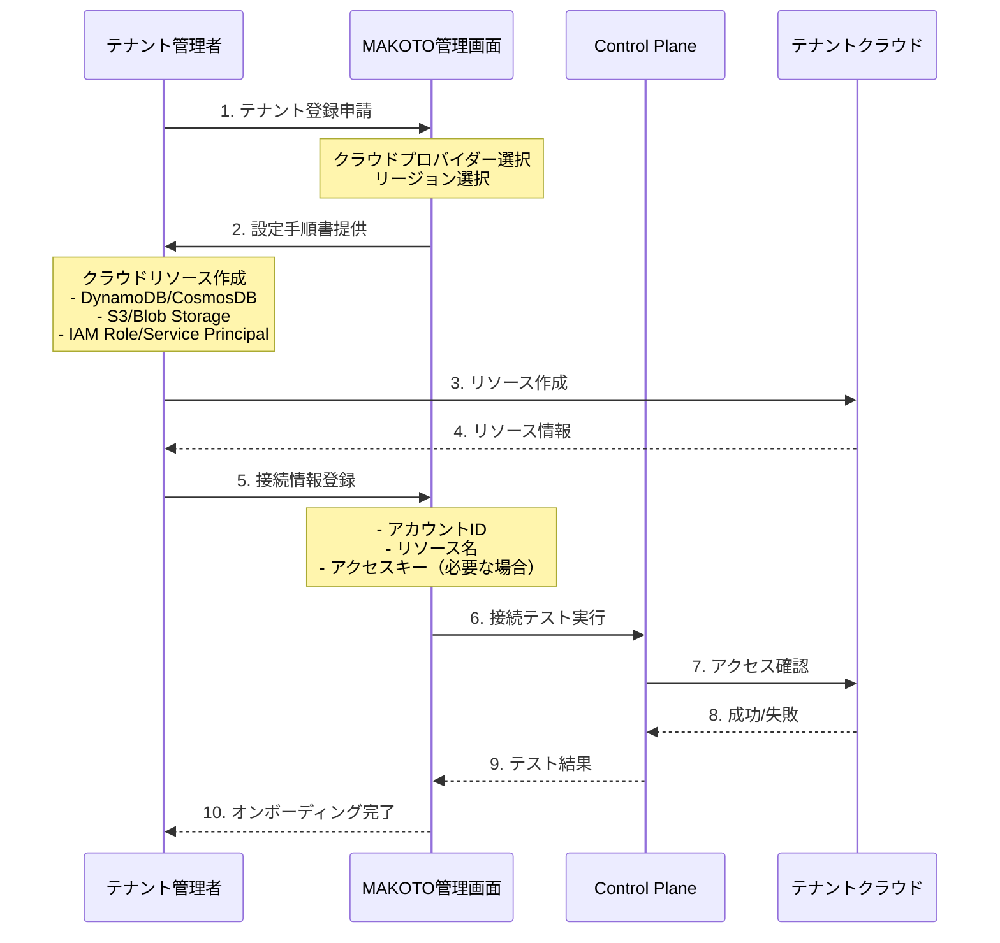
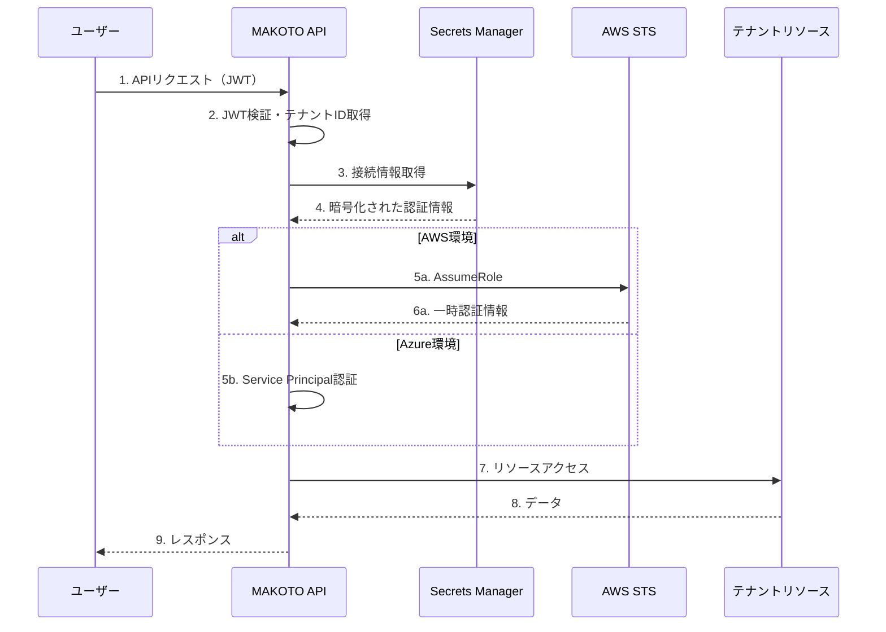

# テナント提供型リソース接続アーキテクチャ

## 目次

1. [概要](#概要)
2. [アーキテクチャ概要](#アーキテクチャ概要)
3. [テナントオンボーディング](#テナントオンボーディング)
4. [接続管理](#接続管理)
5. [セキュリティモデル](#セキュリティモデル)
6. [リソースアクセスパターン](#リソースアクセスパターン)
7. [設定管理](#設定管理)
8. [監視とトラブルシューティング](#監視とトラブルシューティング)
9. [ベストプラクティス](#ベストプラクティス)

## 概要

MAKOTO Visual AIは、SaaS基盤をAWSで運用し、各テナント（顧客）が自身のクラウド環境（AWS/Azure）にデータストレージやLLMサービスを準備し、MAKOTOがそれらのリソースに接続してサービスを提供するアーキテクチャを採用します。

### メリット

1. **データ主権**: テナントが自身のデータを完全に管理
2. **コンプライアンス**: 各テナントの規制要件に対応可能
3. **コスト透明性**: リソース使用料は各テナントが直接負担
4. **柔軟性**: テナント毎に異なるクラウド/リージョンを選択可能

## アーキテクチャ概要

```mermaid
graph TB
    subgraph "MAKOTO SaaS基盤（AWS）"
        subgraph "認証・管理層"
            Cognito[AWS Cognito]
            APIGateway[API Gateway]
            ControlPlane[Control Plane]
        end
        
        subgraph "アプリケーション層"
            Lambda[Lambda Functions]
            ECS[ECS Fargate]
            StepFunctions[Step Functions]
        end
        
        subgraph "メタデータ層"
            RDS[(RDS Aurora<br/>テナント設定)]
            DynamoDBMeta[(DynamoDB<br/>接続情報)]
            SecretsManager[Secrets Manager<br/>認証情報]
        end
    end
    
    subgraph "テナントA環境（AWS）"
        subgraph "データストア"
            DynamoDBTenantA[(DynamoDB<br/>チャットデータ)]
            S3TenantA[(S3<br/>ファイル)]
        end
        subgraph "IAM"
            RoleTenantA[Cross-Account Role]
        end
    end
    
    subgraph "テナントB環境（Azure）"
        subgraph "データストア"
            CosmosDBTenantB[(CosmosDB<br/>チャットデータ)]
            BlobTenantB[(Blob Storage<br/>ファイル)]
        end
        subgraph "認証"
            ServicePrincipalB[Service Principal]
        end
    end
    
    subgraph "LLMサービス"
        AzureOpenAI[Azure OpenAI<br/>（テナント契約）]
    end
    
    User[ユーザー] --> Cognito
    Cognito --> APIGateway
    APIGateway --> Lambda
    
    Lambda --> SecretsManager
    Lambda --> RoleTenantA
    Lambda --> ServicePrincipalB
    
    RoleTenantA --> DynamoDBTenantA
    RoleTenantA --> S3TenantA
    
    ServicePrincipalB --> CosmosDBTenantB
    ServicePrincipalB --> BlobTenantB
    
    Lambda --> AzureOpenAI
    
    style MAKOTO SaaS基盤（AWS） fill:#ff9,stroke:#333,stroke-width:2px
```

## テナントオンボーディング

### オンボーディングフロー



### テナント側準備（AWS）

```yaml
必要なAWSリソース:
  DynamoDB:
    TableName: makoto-tenant-{tenant-id}-chats
    PartitionKey: PK (String)
    SortKey: SK (String)
    BillingMode: PAY_PER_REQUEST
    PointInTimeRecovery: true
    
  S3:
    BucketName: makoto-tenant-{tenant-id}-assets
    Versioning: Enabled
    Encryption: AES256
    PublicAccessBlock: すべてブロック
    
  IAM Role:
    RoleName: MAKOTOCrossAccountRole
    TrustPolicy:
      Principal:
        AWS: "arn:aws:iam::123456789012:root"  # MAKOTO AWSアカウント
      Condition:
        StringEquals:
          "sts:ExternalId": "{unique-external-id}"
    Policies:
      - DynamoDBアクセス（特定テーブルのみ）
      - S3アクセス（特定バケットのみ）
```

### テナント側準備（Azure）

```yaml
必要なAzureリソース:
  CosmosDB:
    AccountName: makoto-tenant-{tenant-id}
    API: Core (SQL)
    Database: makoto-data
    Container: chats
    PartitionKey: /tenantId
    
  Blob Storage:
    StorageAccount: makototenant{tenantid}
    Container: assets
    AccessTier: Hot
    Encryption: Microsoft管理キー
    
  Service Principal:
    DisplayName: MAKOTO-ServicePrincipal
    Roles:
      - Cosmos DB Data Contributor（特定データベース）
      - Storage Blob Data Contributor（特定コンテナ）
    Credentials:
      - Client Secret または Certificate
```

## 接続管理

### 接続情報の暗号化保存

```python
@dataclass
class TenantConnectionInfo:
    """テナント接続情報"""
    tenant_id: str
    cloud_provider: str  # aws | azure
    
    # AWS接続情報
    aws_account_id: Optional[str] = None
    aws_role_arn: Optional[str] = None
    aws_external_id: Optional[str] = None
    aws_region: Optional[str] = None
    
    # Azure接続情報
    azure_tenant_id: Optional[str] = None
    azure_subscription_id: Optional[str] = None
    azure_client_id: Optional[str] = None
    azure_client_secret_ref: Optional[str] = None  # Secrets Manager参照
    
    # リソース情報
    database_config: Dict[str, str] = field(default_factory=dict)
    storage_config: Dict[str, str] = field(default_factory=dict)
    llm_config: Dict[str, str] = field(default_factory=dict)
    
    # 接続状態
    last_connection_test: Optional[datetime] = None
    connection_status: str = "pending"  # pending | active | failed
```

### 動的接続管理

```python
class TenantConnectionManager:
    """テナント接続管理"""
    
    def __init__(self):
        self.secrets_manager = boto3.client('secretsmanager')
        self.connection_cache = {}
    
    async def get_tenant_connection(self, tenant_id: str) -> TenantConnection:
        """テナント接続の取得"""
        
        # キャッシュチェック
        if tenant_id in self.connection_cache:
            return self.connection_cache[tenant_id]
        
        # 接続情報取得
        conn_info = await self.get_connection_info(tenant_id)
        
        # 接続作成
        if conn_info.cloud_provider == 'aws':
            connection = await self._create_aws_connection(conn_info)
        else:
            connection = await self._create_azure_connection(conn_info)
        
        # キャッシュ保存
        self.connection_cache[tenant_id] = connection
        
        return connection
    
    async def _create_aws_connection(self, conn_info: TenantConnectionInfo) -> AWSConnection:
        """AWS接続の作成"""
        
        # AssumeRole実行
        sts_client = boto3.client('sts')
        assumed_role = sts_client.assume_role(
            RoleArn=conn_info.aws_role_arn,
            RoleSessionName=f'makoto-session-{conn_info.tenant_id}',
            ExternalId=conn_info.aws_external_id,
            DurationSeconds=3600  # 1時間
        )
        
        # 一時認証情報で接続
        credentials = assumed_role['Credentials']
        
        return AWSConnection(
            dynamodb_client=boto3.client(
                'dynamodb',
                region_name=conn_info.aws_region,
                aws_access_key_id=credentials['AccessKeyId'],
                aws_secret_access_key=credentials['SecretAccessKey'],
                aws_session_token=credentials['SessionToken']
            ),
            s3_client=boto3.client(
                's3',
                region_name=conn_info.aws_region,
                aws_access_key_id=credentials['AccessKeyId'],
                aws_secret_access_key=credentials['SecretAccessKey'],
                aws_session_token=credentials['SessionToken']
            ),
            table_name=conn_info.database_config['table_name'],
            bucket_name=conn_info.storage_config['bucket_name']
        )
    
    async def _create_azure_connection(self, conn_info: TenantConnectionInfo) -> AzureConnection:
        """Azure接続の作成"""
        
        # シークレット取得
        client_secret = await self._get_secret(conn_info.azure_client_secret_ref)
        
        # 認証
        credential = ClientSecretCredential(
            tenant_id=conn_info.azure_tenant_id,
            client_id=conn_info.azure_client_id,
            client_secret=client_secret
        )
        
        return AzureConnection(
            cosmos_client=CosmosClient(
                url=conn_info.database_config['endpoint'],
                credential=credential
            ),
            blob_service_client=BlobServiceClient(
                account_url=conn_info.storage_config['account_url'],
                credential=credential
            ),
            database_name=conn_info.database_config['database_name'],
            container_name=conn_info.database_config['container_name'],
            blob_container_name=conn_info.storage_config['container_name']
        )
```

## セキュリティモデル

### 最小権限の原則

```json
{
  "Version": "2012-10-17",
  "Statement": [
    {
      "Sid": "DynamoDBAccess",
      "Effect": "Allow",
      "Action": [
        "dynamodb:GetItem",
        "dynamodb:PutItem",
        "dynamodb:UpdateItem",
        "dynamodb:DeleteItem",
        "dynamodb:Query",
        "dynamodb:Scan"
      ],
      "Resource": [
        "arn:aws:dynamodb:*:*:table/makoto-tenant-*"
      ]
    },
    {
      "Sid": "S3Access",
      "Effect": "Allow",
      "Action": [
        "s3:GetObject",
        "s3:PutObject",
        "s3:DeleteObject",
        "s3:ListBucket"
      ],
      "Resource": [
        "arn:aws:s3:::makoto-tenant-*",
        "arn:aws:s3:::makoto-tenant-*/*"
      ]
    }
  ]
}
```

### 認証フロー



## リソースアクセスパターン

### 統一アクセスインターフェース

```python
from abc import ABC, abstractmethod

class TenantResourceAccess(ABC):
    """テナントリソースアクセス基底クラス"""
    
    @abstractmethod
    async def get_chat(self, chat_id: str) -> Optional[Chat]:
        pass
    
    @abstractmethod
    async def save_chat(self, chat: Chat) -> None:
        pass
    
    @abstractmethod
    async def upload_file(self, key: str, data: bytes) -> str:
        pass
    
    @abstractmethod
    async def download_file(self, key: str) -> bytes:
        pass

class AWSTenantResourceAccess(TenantResourceAccess):
    """AWSテナントリソースアクセス実装"""
    
    def __init__(self, connection: AWSConnection):
        self.connection = connection
    
    async def get_chat(self, chat_id: str) -> Optional[Chat]:
        response = await self.connection.dynamodb_client.get_item(
            TableName=self.connection.table_name,
            Key={
                'PK': {'S': f'CHAT#{chat_id}'},
                'SK': {'S': 'METADATA'}
            }
        )
        
        if 'Item' in response:
            return Chat.from_dynamodb_item(response['Item'])
        return None
    
    async def upload_file(self, key: str, data: bytes) -> str:
        await self.connection.s3_client.put_object(
            Bucket=self.connection.bucket_name,
            Key=key,
            Body=data
        )
        return f"s3://{self.connection.bucket_name}/{key}"

class AzureTenantResourceAccess(TenantResourceAccess):
    """Azureテナントリソースアクセス実装"""
    
    def __init__(self, connection: AzureConnection):
        self.connection = connection
    
    async def get_chat(self, chat_id: str) -> Optional[Chat]:
        container = self.connection.cosmos_client.get_database_client(
            self.connection.database_name
        ).get_container_client(self.connection.container_name)
        
        try:
            item = await container.read_item(
                item=chat_id,
                partition_key=chat_id
            )
            return Chat.from_cosmos_item(item)
        except exceptions.CosmosResourceNotFoundError:
            return None
    
    async def upload_file(self, key: str, data: bytes) -> str:
        blob_client = self.connection.blob_service_client.get_blob_client(
            container=self.connection.blob_container_name,
            blob=key
        )
        await blob_client.upload_blob(data, overwrite=True)
        return blob_client.url
```

### リクエスト処理フロー

```python
class ChatService:
    """チャットサービス"""
    
    def __init__(self, connection_manager: TenantConnectionManager):
        self.connection_manager = connection_manager
    
    async def create_message(self, tenant_id: str, chat_id: str, message: Message) -> Message:
        """メッセージ作成"""
        
        # テナント接続取得
        connection = await self.connection_manager.get_tenant_connection(tenant_id)
        
        # リソースアクセス作成
        if connection.provider == 'aws':
            resource_access = AWSTenantResourceAccess(connection)
        else:
            resource_access = AzureTenantResourceAccess(connection)
        
        # チャット取得
        chat = await resource_access.get_chat(chat_id)
        if not chat:
            raise ChatNotFoundError(f"Chat {chat_id} not found")
        
        # メッセージ保存
        await resource_access.save_message(chat_id, message)
        
        # 大容量メッセージの場合はストレージに保存
        if len(message.content) > 10240:  # 10KB
            file_key = f"messages/{chat_id}/{message.id}.json"
            file_url = await resource_access.upload_file(
                key=file_key,
                data=json.dumps(message.to_dict()).encode('utf-8')
            )
            message.content_url = file_url
            message.content = message.content[:200] + "..."  # プレビュー
        
        return message
```

## 設定管理

### テナント設定構造

```yaml
tenant_configuration:
  tenant_id: "abc-123"
  organization_name: "株式会社サンプル"
  
  cloud_config:
    provider: "aws"  # aws | azure
    region: "ap-northeast-1"
    
  aws_config:
    account_id: "123456789012"
    role_arn: "arn:aws:iam::123456789012:role/MAKOTOCrossAccountRole"
    external_id: "unique-external-id-for-security"
    
  azure_config:
    tenant_id: "xxxxxxxx-xxxx-xxxx-xxxx-xxxxxxxxxxxx"
    subscription_id: "yyyyyyyy-yyyy-yyyy-yyyy-yyyyyyyyyyyy"
    resource_group: "makoto-resources"
    
  resources:
    database:
      type: "dynamodb"  # dynamodb | cosmosdb
      config:
        table_name: "makoto-tenant-abc-123-chats"
        
    storage:
      type: "s3"  # s3 | blob
      config:
        bucket_name: "makoto-tenant-abc-123-assets"
        
    llm:
      provider: "azure_openai"
      config:
        endpoint: "https://tenant-openai.openai.azure.com/"
        deployment_name: "gpt-4"
        api_version: "2024-02-15-preview"
```

### 接続テスト

```python
class ConnectionTester:
    """接続テスター"""
    
    async def test_tenant_connection(self, tenant_id: str) -> ConnectionTestResult:
        """テナント接続のテスト"""
        
        result = ConnectionTestResult(tenant_id=tenant_id)
        
        try:
            # 接続取得
            connection = await self.connection_manager.get_tenant_connection(tenant_id)
            result.connection_established = True
            
            # データベーステスト
            result.database_test = await self._test_database(connection)
            
            # ストレージテスト
            result.storage_test = await self._test_storage(connection)
            
            # LLMテスト（設定されている場合）
            if connection.has_llm_config():
                result.llm_test = await self._test_llm(connection)
            
            # 総合判定
            result.overall_status = "success" if all([
                result.database_test.success,
                result.storage_test.success,
                result.llm_test.success if result.llm_test else True
            ]) else "failed"
            
        except Exception as e:
            result.connection_established = False
            result.error = str(e)
            result.overall_status = "failed"
        
        # 結果保存
        await self._save_test_result(tenant_id, result)
        
        return result
```

## 監視とトラブルシューティング

### 接続監視

```yaml
監視項目:
  接続性:
    - 定期的な接続テスト（5分毎）
    - AssumeRole成功率
    - API応答時間
    
  エラー監視:
    - 認証エラー
    - 権限エラー
    - ネットワークエラー
    - リソース制限エラー
    
  使用量:
    - APIコール数
    - データ転送量
    - ストレージ使用量

アラート:
  - name: "接続失敗"
    condition: "connection_test_failed"
    severity: "critical"
    action: "通知 + 自動再試行"
    
  - name: "認証期限切れ"
    condition: "credential_expiry < 24h"
    severity: "warning"
    action: "管理者通知"
```

### トラブルシューティングガイド

```python
class ConnectionTroubleshooter:
    """接続トラブルシューター"""
    
    async def diagnose_connection_issue(self, tenant_id: str, error: Exception) -> DiagnosisResult:
        """接続問題の診断"""
        
        diagnosis = DiagnosisResult()
        
        # エラータイプ別診断
        if isinstance(error, ClientError):
            if error.response['Error']['Code'] == 'AccessDenied':
                diagnosis.issue = "権限不足"
                diagnosis.suggestions = [
                    "IAMロール/Service Principalの権限を確認",
                    "信頼関係（Trust Relationship）を確認",
                    "External IDが正しいか確認"
                ]
            elif error.response['Error']['Code'] == 'NoSuchBucket':
                diagnosis.issue = "リソースが見つからない"
                diagnosis.suggestions = [
                    "S3バケット名を確認",
                    "リージョンを確認",
                    "リソースが作成されているか確認"
                ]
        
        # 接続テストの実行
        diagnosis.test_results = await self._run_diagnostic_tests(tenant_id)
        
        return diagnosis
```

## ベストプラクティス

### テナント側の推奨設定

1. **セキュリティ**
   - 最小権限の原則に従ったIAM設定
   - 暗号化の有効化（保存時・転送時）
   - ネットワーク制限（可能な場合）

2. **可用性**
   - マルチAZ/リージョン設定
   - バックアップの自動化
   - 災害復旧計画

3. **パフォーマンス**
   - 適切なインデックス設定
   - キャッシュの活用
   - リソースのスケーリング設定

### MAKOTO側の実装

1. **接続管理**
   - 接続プーリング
   - 自動リトライ
   - フェイルオーバー

2. **セキュリティ**
   - 認証情報の暗号化保存
   - 監査ログ
   - 異常検知

3. **運用**
   - 自動接続テスト
   - メトリクス収集
   - アラート設定

## まとめ

このアーキテクチャにより：

1. **データ主権**: テナントが自身のデータを完全管理
2. **柔軟性**: AWS/Azure両対応、リージョン選択自由
3. **セキュリティ**: ゼロトラスト、最小権限
4. **拡張性**: テナント数増加に容易に対応
5. **運用性**: 自動化された監視と診断

各テナントは自身のセキュリティ要件やコンプライアンス要件に応じてクラウド環境を構築し、MAKOTOはそれらに安全に接続してサービスを提供します。