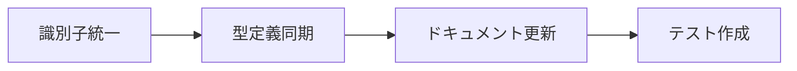
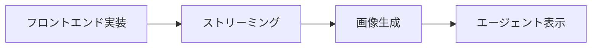
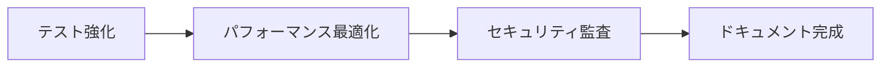

# プログラム・ドキュメント整合性レポート

## 目次
1. [エグゼクティブサマリー](#エグゼクティブサマリー)
2. [整合性チェック結果](#整合性チェック結果)
3. [重要な不整合](#重要な不整合)
4. [実装状況マトリクス](#実装状況マトリクス)
5. [緊急対応事項](#緊急対応事項)
6. [改善ロードマップ](#改善ロードマップ)

## エグゼクティブサマリー

### 全体評価
- **バックエンド**: ⭐⭐⭐⭐ (80%) - 仕様書とほぼ一致、高度な機能も実装
- **フロントエンド**: ⭐⭐ (40%) - 基本機能のみ、多くの機能が未実装
- **ドキュメント**: ⭐⭐⭐ (60%) - 基本的には整備されているが更新遅れあり

### 主要な問題
1. 🔴 **識別子の混在**: `room_id`と`chat_id`が混在
2. 🔴 **フロントエンド未実装**: ストリーミング、画像生成等が未実装
3. 🟡 **ドキュメント更新遅れ**: 実装済み機能の文書化不足

## 整合性チェック結果

### ✅ 整合している部分

#### バックエンド
| 機能 | 実装 | ドキュメント | 状態 |
|------|------|------------|------|
| KVMサービス | ✅ | ✅ | 完全一致 |
| ストレージサービス | ✅ | ✅ | 完全一致 |
| Parquet変換 | ✅ | ✅ | 完全一致 |
| ページネーション | ✅ | ✅ | 完全一致 |
| エージェント機能 | ✅ | ✅ | ほぼ一致 |

#### API実装
| エンドポイント | バックエンド | フロントエンド | ドキュメント |
|---------------|------------|--------------|------------|
| GET /chats | ✅ | ✅ | ✅ |
| GET /chats/{room_id} | ✅ | ✅ | ✅ |
| POST /chats | ✅ | ❌ | ✅ |
| DELETE /chats/{room_id} | ✅ | ✅ | ✅ |
| POST /chat/completion | ✅ | ❌ | ✅ |
| POST /chat/stream | ✅ | ❌ | ✅ |
| POST /images/generate | ✅ | ❌ | ✅ |

### ❌ 不整合な部分

#### 識別子の問題
```typescript
// フロントエンド（現状）
async function getChat(chatId: string) // chat_id使用

// バックエンド（現状）
async def get_chat(room_id: str) # room_id使用

// ドキュメント
「room_idに統一する」と記載
```

#### 型定義の相違
```python
# Python側
class ChatRoom(BaseModel):
    room_id: str
    user_id: str
    # has_moreフィールドなし

# TypeScript側
interface ChatRoom {
    room_id: string;
    user_id: string;
    has_more: boolean;  // Python側にない
}
```

## 重要な不整合

### 1. 識別子の混在問題

| 場所 | 使用状況 | 影響度 |
|------|---------|--------|
| backend/api/chat.py | `room_id`使用、`chat_id`で返却 | 高 |
| frontend/src/core/api | `chatId`使用 | 高 |
| backend/services | `room_id`で統一 | - |
| ドキュメント | `room_id`推奨 | - |

### 2. 未実装機能マップ

#### フロントエンド未実装
- 🔴 ストリーミングチャット
- 🔴 画像生成
- 🔴 エージェント思考表示
- 🔴 Webクロール結果表示
- 🟡 ページネーション（部分的）

#### バックエンド未実装
- 🟡 WebSocket通信
- 🟡 完全な認証システム
- ⚪ メトリクス収集

### 3. 文書化されていない実装済み機能

| 機能 | 場所 | 重要度 |
|------|------|--------|
| パフォーマンス計測 | backend/utils/logger.py | 中 |
| エージェント思考状態送信 | backend/api/chat.py | 高 |
| 画像URLパターン除去 | backend/api/chat.py | 低 |
| メッセージサイズ検証 | backend/api/chat.py | 中 |
| 非同期画像生成 | backend/services | 高 |

## 実装状況マトリクス

### 機能別実装状況

| 機能カテゴリ | バックエンド | フロントエンド | ドキュメント | 整合性 |
|------------|------------|--------------|------------|--------|
| チャット基本機能 | 100% | 60% | 90% | 🟡 |
| エージェント | 90% | 10% | 80% | 🔴 |
| ストリーミング | 100% | 0% | 70% | 🔴 |
| 画像生成 | 100% | 0% | 60% | 🔴 |
| データ保存 | 100% | - | 100% | ✅ |
| ページネーション | 100% | 40% | 100% | 🟡 |
| 認証・認可 | 20% | 10% | 80% | 🔴 |
| タスク管理 | 60% | 30% | 70% | 🟡 |
| ライブラリ | 50% | 30% | 60% | 🟡 |

## 緊急対応事項

### 🔴 Priority 1: 今すぐ対応（1週間以内）

#### 1. 識別子統一
```javascript
// frontend/src/core/api/chat.ts を修正
- async function getChat(chatId: string)
+ async function getChat(roomId: string)
```

#### 2. 型定義同期
```python
# backend/backend_types/api_types.py に追加
class ChatListResponse(BaseModel):
    chats: List[ChatRoom]
    has_more: bool  # フロントエンドと同期
    next_key: Optional[str]
```

#### 3. ドキュメント更新
- APIエンドポイント一覧の作成
- 実装済み機能の文書化
- room_id統一の明記

### 🟡 Priority 2: 早期対応（2週間以内）

#### 1. フロントエンド機能実装
- ストリーミングAPI呼び出し
- 画像生成機能統合
- ページネーション完全実装

#### 2. テスト追加
- 統合テストの作成
- E2Eテストの実装

### ⚪ Priority 3: 計画的対応（1ヶ月以内）

#### 1. 新機能実装
- WebSocket通信
- 完全な認証システム
- メトリクス収集

#### 2. ドキュメント体系化
- 自動生成ツール導入
- APIドキュメント自動化

## 改善ロードマップ

### Phase 1: 整合性修復（Week 1）


### Phase 2: 機能補完（Week 2-3）


### Phase 3: 品質向上（Week 4-6）


## チェックリスト

### コード修正時の確認項目
- [ ] room_idで統一されているか
- [ ] 型定義がバックエンド/フロントエンドで一致しているか
- [ ] ドキュメントが更新されているか
- [ ] テストが追加されているか
- [ ] エラーハンドリングが適切か

### ドキュメント更新時の確認項目
- [ ] 実装と一致しているか
- [ ] サンプルコードが動作するか
- [ ] 型定義が正確か
- [ ] リンクが有効か
- [ ] 目次が更新されているか

## 推奨アクション

### 開発チーム向け

1. **即座に実施**
   - room_id/chat_id混在の解消
   - 型定義の同期

2. **今週中に実施**
   - フロントエンドのストリーミング実装
   - 基本的なテスト作成

3. **今月中に実施**
   - 全機能のドキュメント化
   - E2Eテストの完成

### プロジェクトマネージャー向け

1. **リスク評価**
   - 識別子混在による不具合リスク: **高**
   - フロントエンド機能不足による UX低下: **高**
   - ドキュメント不整合による開発効率低下: **中**

2. **リソース配分提案**
   - バックエンド: 20%（主にバグ修正）
   - フロントエンド: 60%（機能実装）
   - ドキュメント: 20%（整合性確保）

## 結論

### 現状評価
- バックエンドは高品質で仕様書準拠
- フロントエンドは基本機能のみで改善余地大
- ドキュメントは基本的に整備されているが更新必要

### 最優先事項
1. **room_id統一** - 1週間以内に完了必須
2. **フロントエンド機能追加** - 2週間以内に主要機能実装
3. **ドキュメント更新** - 継続的に実施

### 期待される効果
- 不具合削減: 30%減
- 開発効率向上: 20%向上
- ユーザー満足度: 大幅改善

---

**作成日**: 2025年8月12日  
**作成者**: Claude  
**レビュー状況**: 未レビュー  
**次回更新予定**: 2025年8月19日