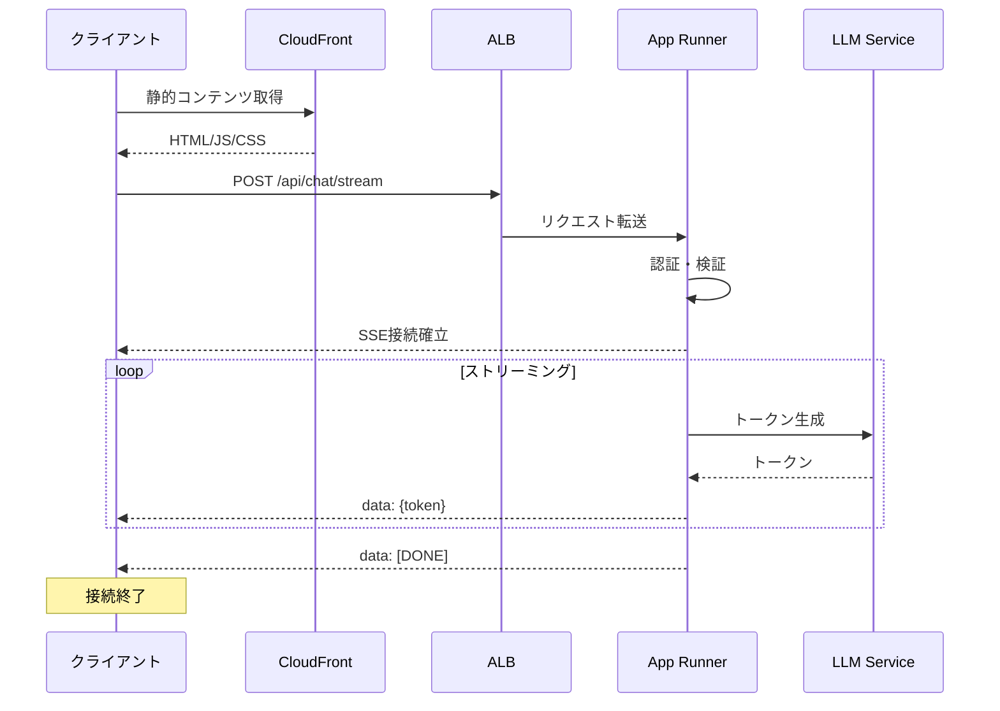

# SSE（Server-Sent Events）仕様書

## 目次

1. [概要](#概要)
2. [アーキテクチャ](#アーキテクチャ)
3. [エンドポイント設計](#エンドポイント設計)
4. [メッセージフォーマット](#メッセージフォーマット)
5. [イベントタイプ](#イベントタイプ)
6. [チャットストリーミング](#チャットストリーミング)
7. [エージェント実行通知](#エージェント実行通知)
8. [ライブラリ処理通知](#ライブラリ処理通知)
9. [エラーハンドリング](#エラーハンドリング)
10. [クライアント実装](#クライアント実装)
11. [サーバー実装](#サーバー実装)
12. [パフォーマンス最適化](#パフォーマンス最適化)
13. [セキュリティ](#セキュリティ)
14. [更新履歴](#更新履歴)

## 概要

MAKOTO Visual AIのSSE実装は、サーバーからクライアントへのリアルタイムデータ配信を提供します。LLMのストリーミング応答、エージェントの実行状態、ライブラリ処理の進捗など、すべてのリアルタイム通信をSSEで統一します。

### SSEを選択した理由

- **シンプル**: HTTPベースで実装が簡単
- **自動再接続**: ブラウザが自動的に再接続を処理
- **十分な機能**: AIとの1対1チャットに必要な機能をすべてカバー
- **App Runner対応**: 長時間接続に最適
- **デバッグ容易**: 標準的なHTTPツールで検証可能

### 主要な用途

- LLMストリーミング応答
- エージェント実行状態の通知
- エージェント思考プロセスの可視化
- ライブラリ処理進捗の通知
- ファイルアップロード進捗
- エラー通知

## アーキテクチャ

### AWS App Runnerベースの構成

```
CloudFront (静的コンテンツ)
    ↓
Application Load Balancer (ALB)
    ↓
AWS App Runner
├── FastAPI アプリケーション
├── SSEストリーミング
└── 自動スケーリング
    ↓
バックエンドサービス
├── DynamoDB (データストア)
├── S3 (ファイルストレージ)
├── SQS (非同期処理)
└── Bedrock/OpenAI (LLM)
```

### App Runnerの利点

- **長時間接続対応**: SSEの長時間接続に最適
- **自動スケーリング**: トラフィックに応じて自動調整
- **マネージドサービス**: インフラ管理不要
- **コンテナベース**: Dockerイメージで簡単デプロイ
- **組み込みロードバランサー**: 複数インスタンス間で負荷分散

### データフロー



## エンドポイント設計

### ベースURL

```
本番環境: https://makoto-api.awsapprunner.com
開発環境: http://localhost:8000
```

### チャットストリーミング

```
POST /api/chat/{chat_id}/stream
Authorization: Bearer {jwt_token}
Content-Type: application/json

{
  "messages": [...],
  "stream": true,
  "active_modes": ["chat", "agent"],
  "model_settings": {...}
}

Response:
Content-Type: text/event-stream
Cache-Control: no-cache
Connection: keep-alive
```

### エージェント実行ストリーム

```
POST /api/agent/execute/stream
Authorization: Bearer {jwt_token}
Content-Type: application/json

{
  "prompt": "...",
  "agent_config": {...}
}

Response:
Content-Type: text/event-stream
```

### ライブラリ処理ストリーム

```
POST /api/library/{library_id}/process/stream
Authorization: Bearer {jwt_token}

Response:
Content-Type: text/event-stream
```

## メッセージフォーマット

### 基本構造

```
data: {JSON形式のデータ}\n\n
```

### フィールド説明

| フィールド | 説明 | 使用例 |
|----------|------|--------|
| data | メッセージデータ | `data: {"type": "token", "content": "こんにちは"}` |
| event | イベントタイプ（オプション） | `event: agent_status` |
| id | メッセージID（オプション） | `id: msg_123` |
| retry | 再接続間隔（ミリ秒） | `retry: 3000` |

### メッセージ構造

```typescript
interface SSEMessage {
  type: SSEMessageType;        // メッセージタイプ
  content?: any;                // メッセージ内容
  metadata?: {
    timestamp: string;          // ISO 8601形式
    sequence?: number;          // シーケンス番号
    total?: number;            // 総数（進捗表示用）
  };
}

type SSEMessageType = 
  // チャット関連
  | 'token'                    // LLMトークン
  | 'content_block_start'      // コンテンツブロック開始
  | 'content_block_delta'      // コンテンツブロック差分
  | 'content_block_stop'       // コンテンツブロック終了
  | 'message_complete'         // メッセージ完了
  
  // エージェント関連
  | 'agent_status'            // エージェント状態
  | 'agent_thinking'          // エージェント思考プロセス
  | 'execution_started'       // 実行開始
  | 'step_started'           // ステップ開始
  | 'step_completed'         // ステップ完了
  | 'execution_completed'    // 実行完了
  
  // ライブラリ関連
  | 'library_processing'     // ライブラリ処理中
  | 'embedding_progress'     // エンベディング進捗
  | 'index_update'          // インデックス更新
  
  // システム
  | 'error'                 // エラー
  | 'warning'               // 警告
  | 'info'                  // 情報
  | 'done';                 // 完了
```

## イベントタイプ

### チャットストリーミング

```typescript
// トークンストリーミング
{
  "type": "token",
  "content": "こんにちは",
  "metadata": {
    "timestamp": "2025-08-06T10:00:00Z",
    "sequence": 1
  }
}

// メッセージ完了
{
  "type": "message_complete",
  "content": {
    "message_id": "msg_123",
    "total_tokens": 150,
    "model": "claude-3-opus"
  },
  "metadata": {
    "timestamp": "2025-08-06T10:00:05Z"
  }
}
```

### エージェント実行

```typescript
// 実行開始
{
  "type": "execution_started",
  "content": {
    "execution_id": "exec_123",
    "total_steps": 3,
    "plan_summary": "Web検索と画像生成を実行"
  }
}

// エージェント思考プロセス
{
  "type": "agent_thinking",
  "content": {
    "agent_type": "OrchestrationPlanner",
    "phase": "analyzing",
    "thoughts": {
      "current_analysis": "ユーザーリクエストを分析中",
      "confidence": 0.85
    },
    "visibility": "summary"
  }
}

// ステップ完了
{
  "type": "step_completed",
  "content": {
    "step": 1,
    "agent": "WebAgent",
    "result": {
      "success": true,
      "data": {...}
    }
  }
}
```

### ライブラリ処理

```typescript
// エンベディング進捗
{
  "type": "embedding_progress",
  "content": {
    "library_id": "lib_123",
    "file": "document.pdf",
    "progress": {
      "current": 50,
      "total": 100,
      "percentage": 50
    }
  }
}

// インデックス更新完了
{
  "type": "index_update",
  "content": {
    "library_id": "lib_123",
    "status": "completed",
    "vectors_added": 1500,
    "total_vectors": 5000
  }
}
```

## チャットストリーミング

### LLM応答のストリーミング

```python
# サーバー側実装例（FastAPI + App Runner）
from fastapi import FastAPI, Request, Header, HTTPException
from fastapi.responses import StreamingResponse
import json
import asyncio
from datetime import datetime

@app.post("/api/chat/{chat_id}/stream")
async def stream_chat(
    chat_id: str,
    request: ChatRequest,
    authorization: str = Header(...)
):
    """チャットストリーミング エンドポイント"""
    
    # 認証検証
    user = await verify_token(authorization)
    if not user:
        raise HTTPException(status_code=401, detail="Unauthorized")
    
    async def generate():
        try:
            # 開始通知
            yield format_sse({
                "type": "content_block_start",
                "metadata": {"timestamp": datetime.now().isoformat()}
            })
            
            # LLMからのトークンストリーミング
            token_count = 0
            async for token in llm_service.stream_generate(
                messages=request.messages,
                model_settings=request.model_settings,
                user_id=user["user_id"],
                tenant_id=user["tenant_id"]
            ):
                token_count += 1
                
                yield format_sse({
                    "type": "token",
                    "content": token,
                    "metadata": {
                        "timestamp": datetime.now().isoformat(),
                        "sequence": token_count
                    }
                })
                
                # 定期的にyieldしてApp Runnerのタイムアウトを防ぐ
                if token_count % 10 == 0:
                    await asyncio.sleep(0)
            
            # 完了通知
            yield format_sse({
                "type": "message_complete",
                "content": {
                    "message_id": f"msg_{chat_id}_{datetime.now().timestamp()}",
                    "total_tokens": token_count,
                    "model": request.model_settings.get("model", "claude-3")
                },
                "metadata": {"timestamp": datetime.now().isoformat()}
            })
            
        except Exception as e:
            # エラー通知
            yield format_sse({
                "type": "error",
                "content": {
                    "code": "STREAM_ERROR",
                    "message": str(e),
                    "recoverable": False
                },
                "metadata": {"timestamp": datetime.now().isoformat()}
            })
        
        finally:
            # 終了シグナル
            yield "data: [DONE]\n\n"
    
    return StreamingResponse(
        generate(),
        media_type="text/event-stream",
        headers={
            "Cache-Control": "no-cache",
            "Connection": "keep-alive",
            "X-Accel-Buffering": "no",
            "Access-Control-Allow-Origin": "*"  # 本番環境では適切に設定
        }
    )

def format_sse(data: dict, event: str = None, id: str = None) -> str:
    """SSEフォーマットにデータを変換"""
    lines = []
    
    if id:
        lines.append(f"id: {id}")
    if event:
        lines.append(f"event: {event}")
    
    lines.append(f"data: {json.dumps(data, ensure_ascii=False)}")
    
    return "\n".join(lines) + "\n\n"
```

## エージェント実行通知

### エージェント状態のストリーミング

```python
from typing import AsyncGenerator

class AgentExecutionStreamer:
    """エージェント実行のストリーミング"""
    
    async def stream_execution(
        self,
        agent_request: AgentRequest,
        user_id: str,
        tenant_id: str
    ) -> AsyncGenerator[str, None]:
        """エージェント実行をストリーミング"""
        
        execution_id = f"exec_{datetime.now().timestamp()}"
        
        try:
            # 実行計画作成フェーズ
            yield format_sse({
                "type": "agent_thinking",
                "content": {
                    "agent_type": "OrchestrationPlanner",
                    "phase": "planning",
                    "thoughts": {
                        "current_analysis": "最適な実行計画を作成中...",
                        "visibility": "summary"
                    }
                },
                "metadata": {
                    "timestamp": datetime.now().isoformat(),
                    "execution_id": execution_id
                }
            })
            
            # 実行計画を作成
            plan = await self.create_execution_plan(agent_request)
            
            # 実行開始
            yield format_sse({
                "type": "execution_started",
                "content": {
                    "execution_id": execution_id,
                    "total_steps": len(plan.steps),
                    "plan_summary": plan.summary
                },
                "metadata": {"timestamp": datetime.now().isoformat()}
            })
            
            # 各ステップの実行
            for step in plan.steps:
                # ステップ開始
                yield format_sse({
                    "type": "step_started",
                    "content": {
                        "step": step.number,
                        "agent": step.agent_name,
                        "purpose": step.purpose
                    },
                    "metadata": {
                        "timestamp": datetime.now().isoformat(),
                        "execution_id": execution_id
                    }
                })
                
                # エージェント実行
                result = await self.execute_agent_step(step, user_id, tenant_id)
                
                # ステップ完了
                yield format_sse({
                    "type": "step_completed",
                    "content": {
                        "step": step.number,
                        "success": result.success,
                        "data": result.data
                    },
                    "metadata": {
                        "timestamp": datetime.now().isoformat(),
                        "execution_id": execution_id
                    }
                })
                
                # App Runnerのタイムアウト防止
                await asyncio.sleep(0)
            
            # 実行完了
            yield format_sse({
                "type": "execution_completed",
                "content": {
                    "execution_id": execution_id,
                    "total_time_ms": (datetime.now() - start_time).total_seconds() * 1000
                },
                "metadata": {"timestamp": datetime.now().isoformat()}
            })
            
        except Exception as e:
            yield format_sse({
                "type": "error",
                "content": {
                    "code": "AGENT_ERROR",
                    "message": str(e),
                    "execution_id": execution_id
                }
            })
        
        finally:
            yield "data: [DONE]\n\n"

# エンドポイント
@app.post("/api/agent/execute/stream")
async def stream_agent_execution(
    request: AgentRequest,
    authorization: str = Header(...)
):
    """エージェント実行ストリーミング"""
    
    user = await verify_token(authorization)
    if not user:
        raise HTTPException(status_code=401)
    
    streamer = AgentExecutionStreamer()
    
    return StreamingResponse(
        streamer.stream_execution(
            request,
            user["user_id"],
            user["tenant_id"]
        ),
        media_type="text/event-stream"
    )
```

## ライブラリ処理通知

### エンベディング処理の進捗通知

```python
class LibraryProcessingStreamer:
    """ライブラリ処理のストリーミング"""
    
    async def stream_library_processing(
        self,
        library_id: str,
        files: List[UploadFile],
        user_id: str,
        tenant_id: str
    ) -> AsyncGenerator[str, None]:
        """ライブラリ処理をストリーミング"""
        
        total_files = len(files)
        
        try:
            for i, file in enumerate(files):
                # ファイル処理開始
                yield format_sse({
                    "type": "library_processing",
                    "content": {
                        "library_id": library_id,
                        "file": file.filename,
                        "status": "processing",
                        "progress": {
                            "current": i,
                            "total": total_files,
                            "percentage": (i / total_files) * 100
                        }
                    },
                    "metadata": {"timestamp": datetime.now().isoformat()}
                })
                
                # S3にアップロード
                file_key = await self.upload_to_s3(file, library_id, tenant_id)
                
                # テキスト抽出
                text_chunks = await self.extract_text(file_key)
                total_chunks = len(text_chunks)
                
                # エンベディング生成
                for j, chunk in enumerate(text_chunks):
                    embedding = await self.generate_embedding(chunk)
                    
                    # DynamoDBに保存
                    await self.save_embedding(
                        library_id,
                        file.filename,
                        chunk,
                        embedding,
                        tenant_id
                    )
                    
                    # 進捗通知（10チャンクごと）
                    if j % 10 == 0 or j == total_chunks - 1:
                        yield format_sse({
                            "type": "embedding_progress",
                            "content": {
                                "library_id": library_id,
                                "file": file.filename,
                                "progress": {
                                    "current": j + 1,
                                    "total": total_chunks,
                                    "percentage": ((j + 1) / total_chunks) * 100
                                }
                            },
                            "metadata": {"timestamp": datetime.now().isoformat()}
                        })
                        
                        # App Runnerタイムアウト防止
                        await asyncio.sleep(0)
                
                # ファイル処理完了
                yield format_sse({
                    "type": "library_processing",
                    "content": {
                        "library_id": library_id,
                        "file": file.filename,
                        "status": "completed",
                        "chunks_processed": total_chunks
                    },
                    "metadata": {"timestamp": datetime.now().isoformat()}
                })
            
            # FAISSインデックス更新
            yield format_sse({
                "type": "index_update",
                "content": {
                    "library_id": library_id,
                    "status": "updating"
                },
                "metadata": {"timestamp": datetime.now().isoformat()}
            })
            
            vectors_added = await self.update_faiss_index(library_id, tenant_id)
            
            yield format_sse({
                "type": "index_update",
                "content": {
                    "library_id": library_id,
                    "status": "completed",
                    "vectors_added": vectors_added
                },
                "metadata": {"timestamp": datetime.now().isoformat()}
            })
            
        except Exception as e:
            yield format_sse({
                "type": "error",
                "content": {
                    "code": "LIBRARY_PROCESSING_ERROR",
                    "message": str(e),
                    "library_id": library_id
                }
            })
        
        finally:
            yield "data: [DONE]\n\n"
```

## エラーハンドリング

### エラーメッセージ形式

```typescript
interface SSEError {
  type: 'error';
  content: {
    code: string;              // エラーコード
    message: string;           // エラーメッセージ
    details?: any;            // 詳細情報
    recoverable: boolean;     // 回復可能かどうか
    retry_after?: number;     // 再試行までの秒数
  };
  metadata: {
    timestamp: string;
    request_id?: string;
  };
}
```

### エラー処理の実装

```python
class SSEErrorHandler:
    """SSEエラーハンドリング"""
    
    @staticmethod
    def format_error(
        code: str,
        message: str,
        recoverable: bool = False,
        details: dict = None
    ) -> str:
        """エラーをSSE形式でフォーマット"""
        
        error_data = {
            "type": "error",
            "content": {
                "code": code,
                "message": message,
                "recoverable": recoverable
            },
            "metadata": {
                "timestamp": datetime.now().isoformat()
            }
        }
        
        if details:
            error_data["content"]["details"] = details
        
        return format_sse(error_data)
    
    async def handle_stream_errors(self, generator):
        """ストリーミング中のエラーをハンドル"""
        
        try:
            async for data in generator:
                yield data
                
        except RateLimitError as e:
            yield self.format_error(
                "RATE_LIMIT",
                "API制限に達しました",
                recoverable=True,
                details={"retry_after": e.retry_after}
            )
            
        except AuthenticationError:
            yield self.format_error(
                "AUTH_ERROR",
                "認証エラーが発生しました",
                recoverable=False
            )
            
        except Exception as e:
            yield self.format_error(
                "INTERNAL_ERROR",
                f"内部エラー: {str(e)}",
                recoverable=False
            )
            
        finally:
            yield "data: [DONE]\n\n"
```

## クライアント実装

### JavaScript/TypeScript実装例

```typescript
class SSEClient {
  private eventSource: EventSource | null = null;
  private reconnectAttempts = 0;
  private maxReconnectAttempts = 5;
  private baseUrl: string;
  private token: string;
  
  constructor(baseUrl: string = '') {
    this.baseUrl = baseUrl || this.getBaseUrl();
  }
  
  private getBaseUrl(): string {
    // 環境に応じてベースURLを決定
    if (process.env.NODE_ENV === 'production') {
      return 'https://makoto-api.awsapprunner.com';
    }
    return 'http://localhost:8000';
  }
  
  async connect(endpoint: string, token: string, data?: any) {
    this.token = token;
    
    // POSTリクエストでSSE接続を開始
    const response = await fetch(`${this.baseUrl}${endpoint}`, {
      method: 'POST',
      headers: {
        'Content-Type': 'application/json',
        'Authorization': `Bearer ${token}`
      },
      body: data ? JSON.stringify(data) : undefined
    });
    
    if (!response.ok) {
      throw new Error(`SSE connection failed: ${response.statusText}`);
    }
    
    // EventSourceで接続
    const url = new URL(endpoint, this.baseUrl);
    url.searchParams.append('token', token);
    
    this.eventSource = new EventSource(url.toString());
    
    this.setupEventHandlers();
  }
  
  private setupEventHandlers() {
    if (!this.eventSource) return;
    
    // メッセージハンドラー
    this.eventSource.onmessage = (event) => {
      if (event.data === '[DONE]') {
        this.close();
        this.onComplete?.();
        return;
      }
      
      try {
        const message = JSON.parse(event.data);
        this.handleMessage(message);
      } catch (e) {
        console.error('Failed to parse SSE message:', e);
      }
    };
    
    // エラーハンドラー
    this.eventSource.onerror = (error) => {
      console.error('SSE error:', error);
      
      if (this.eventSource?.readyState === EventSource.CLOSED) {
        this.handleReconnect();
      }
    };
    
    // 接続確立
    this.eventSource.onopen = () => {
      console.log('SSE connection established');
      this.reconnectAttempts = 0;
      this.onConnected?.();
    };
  }
  
  private handleMessage(message: SSEMessage) {
    switch (message.type) {
      case 'token':
        this.onToken?.(message.content);
        break;
        
      case 'agent_status':
        this.onAgentStatus?.(message.content);
        break;
        
      case 'agent_thinking':
        this.onAgentThinking?.(message.content);
        break;
        
      case 'embedding_progress':
        this.onProgress?.(message.content);
        break;
        
      case 'error':
        this.onError?.(message.content);
        if (message.content.recoverable) {
          this.scheduleReconnect(message.content.retry_after);
        }
        break;
        
      case 'message_complete':
        this.onMessageComplete?.(message.content);
        break;
        
      default:
        this.onMessage?.(message);
    }
  }
  
  private handleReconnect() {
    if (this.reconnectAttempts < this.maxReconnectAttempts) {
      this.reconnectAttempts++;
      const delay = Math.min(1000 * Math.pow(2, this.reconnectAttempts), 30000);
      
      console.log(`Reconnecting in ${delay}ms... (attempt ${this.reconnectAttempts})`);
      
      setTimeout(() => {
        this.reconnect();
      }, delay);
    } else {
      console.error('Max reconnection attempts reached');
      this.onConnectionLost?.();
    }
  }
  
  private scheduleReconnect(retryAfter?: number) {
    const delay = retryAfter ? retryAfter * 1000 : 5000;
    setTimeout(() => this.reconnect(), delay);
  }
  
  private async reconnect() {
    this.close();
    // 最後の接続情報で再接続を試みる
    // 実装は省略
  }
  
  close() {
    if (this.eventSource) {
      this.eventSource.close();
      this.eventSource = null;
    }
  }
  
  // コールバック
  onConnected?: () => void;
  onToken?: (token: string) => void;
  onAgentStatus?: (status: any) => void;
  onAgentThinking?: (thoughts: any) => void;
  onProgress?: (progress: any) => void;
  onError?: (error: any) => void;
  onMessage?: (message: any) => void;
  onMessageComplete?: (data: any) => void;
  onComplete?: () => void;
  onConnectionLost?: () => void;
}

// 使用例
const sseClient = new SSEClient();

// チャットストリーミング
async function streamChat(chatId: string, messages: Message[]) {
  sseClient.onToken = (token) => {
    // トークンを画面に追加
    appendToChat(token);
  };
  
  sseClient.onMessageComplete = (data) => {
    console.log(`Total tokens: ${data.total_tokens}`);
  };
  
  sseClient.onError = (error) => {
    showError(error.message);
  };
  
  await sseClient.connect(
    `/api/chat/${chatId}/stream`,
    authToken,
    { messages, stream: true }
  );
}

// エージェント実行
async function executeAgent(prompt: string) {
  sseClient.onAgentThinking = (thoughts) => {
    if (thoughts.visibility === 'full') {
      showThinkingProcess(thoughts);
    }
  };
  
  sseClient.onAgentStatus = (status) => {
    updateAgentStatus(status);
  };
  
  await sseClient.connect(
    '/api/agent/execute/stream',
    authToken,
    { prompt, agent_config: {} }
  );
}
```

## サーバー実装

### FastAPI + App Runner用の実装

```python
# app.py - メインアプリケーション
from fastapi import FastAPI, Request, HTTPException
from fastapi.middleware.cors import CORSMiddleware
from contextlib import asynccontextmanager
import uvicorn

# App Runner用の設定
@asynccontextmanager
async def lifespan(app: FastAPI):
    """App Runnerのライフサイクル管理"""
    # 起動時
    print("Starting MAKOTO Visual AI API on App Runner")
    await initialize_services()
    yield
    # 終了時
    await cleanup_services()

app = FastAPI(
    title="MAKOTO Visual AI API",
    lifespan=lifespan
)

# CORS設定（App Runner用）
app.add_middleware(
    CORSMiddleware,
    allow_origins=["*"],  # 本番環境では制限する
    allow_credentials=True,
    allow_methods=["*"],
    allow_headers=["*"],
    expose_headers=["*"]
)

# ヘルスチェック（App Runnerのヘルスチェック用）
@app.get("/health")
async def health_check():
    return {"status": "healthy", "service": "makoto-api"}

# SSEサービス
from services.sse_service import SSEService

sse_service = SSEService()

# エンドポイントの登録
from routes import chat, agent, library

app.include_router(chat.router, prefix="/api/chat")
app.include_router(agent.router, prefix="/api/agent")
app.include_router(library.router, prefix="/api/library")

if __name__ == "__main__":
    # ローカル開発用
    uvicorn.run(
        "app:app",
        host="0.0.0.0",
        port=8000,
        reload=True
    )
```

### Dockerfile（App Runner用）

```dockerfile
FROM python:3.11-slim

WORKDIR /app

# 依存関係のインストール
COPY requirements.txt .
RUN pip install --no-cache-dir -r requirements.txt

# アプリケーションコピー
COPY . .

# App Runnerはポート8000を使用
EXPOSE 8000

# 起動コマンド
CMD ["uvicorn", "app:app", "--host", "0.0.0.0", "--port", "8000"]
```

### apprunner.yaml（設定ファイル）

```yaml
version: 1.0
runtime: python3

build:
  commands:
    build:
      - pip install -r requirements.txt

run:
  runtime-version: 3.11
  command: uvicorn app:app --host 0.0.0.0 --port 8000
  network:
    port: 8000
    env: PORT
  env:
    - name: ENVIRONMENT
      value: production
    - name: AWS_REGION
      value: ap-northeast-1

# 自動スケーリング設定
scaling:
  min_size: 1
  max_size: 10
  
# ヘルスチェック
health_check:
  path: /health
  interval: 10
  timeout: 5
  healthy_threshold: 2
  unhealthy_threshold: 3
```

## パフォーマンス最適化

### App Runner特有の最適化

```python
class AppRunnerOptimizedSSE:
    """App Runner用に最適化されたSSE"""
    
    def __init__(self):
        self.keep_alive_interval = 30  # 30秒ごとにキープアライブ
        self.chunk_size = 10  # チャンクサイズ
    
    async def stream_with_keep_alive(self, generator):
        """キープアライブ付きストリーミング"""
        
        last_message_time = datetime.now()
        
        async for data in generator:
            yield data
            last_message_time = datetime.now()
            
            # App Runnerのタイムアウト防止
            await asyncio.sleep(0)
        
        # キープアライブタスク
        async def keep_alive():
            while True:
                await asyncio.sleep(self.keep_alive_interval)
                
                if (datetime.now() - last_message_time).seconds > self.keep_alive_interval:
                    # ハートビート送信
                    yield format_sse({
                        "type": "heartbeat",
                        "metadata": {"timestamp": datetime.now().isoformat()}
                    })
    
    async def batch_messages(self, messages):
        """メッセージのバッチ処理"""
        
        batch = []
        for msg in messages:
            batch.append(msg)
            
            if len(batch) >= self.chunk_size:
                # バッチを送信
                yield format_sse({
                    "type": "batch",
                    "content": batch,
                    "metadata": {"count": len(batch)}
                })
                batch = []
        
        # 残りを送信
        if batch:
            yield format_sse({
                "type": "batch",
                "content": batch,
                "metadata": {"count": len(batch)}
            })
```

### 接続管理

```python
from typing import Dict, Set
import asyncio

class ConnectionManager:
    """SSE接続管理（App Runner用）"""
    
    def __init__(self):
        self.active_connections: Dict[str, Set[str]] = {}
        self.connection_limits = {
            "per_user": 5,
            "per_tenant": 100,
            "total": 500  # App Runnerのインスタンスあたり
        }
        
        # DynamoDBで接続情報を管理（スケールアウト対応）
        self.connection_table = "makoto-sse-connections"
    
    async def register_connection(
        self,
        user_id: str,
        tenant_id: str,
        connection_id: str,
        instance_id: str  # App RunnerインスタンスID
    ):
        """接続を登録（DynamoDB）"""
        
        # DynamoDBに接続情報を保存
        await dynamodb.put_item(
            TableName=self.connection_table,
            Item={
                "connection_id": connection_id,
                "user_id": user_id,
                "tenant_id": tenant_id,
                "instance_id": instance_id,
                "created_at": datetime.now().isoformat(),
                "ttl": int(datetime.now().timestamp()) + 3600  # 1時間後に自動削除
            }
        )
    
    async def check_limits(self, user_id: str, tenant_id: str) -> bool:
        """接続制限をチェック"""
        
        # DynamoDBから接続数を取得
        user_connections = await self.get_user_connection_count(user_id)
        if user_connections >= self.connection_limits["per_user"]:
            return False
        
        tenant_connections = await self.get_tenant_connection_count(tenant_id)
        if tenant_connections >= self.connection_limits["per_tenant"]:
            return False
        
        return True
```

## セキュリティ

### JWT認証とSSEトークン

```python
from jose import jwt, JWTError
from datetime import datetime, timedelta

class SSEAuthService:
    """SSE認証サービス"""
    
    def __init__(self):
        self.secret_key = os.environ.get("JWT_SECRET_KEY")
        self.algorithm = "HS256"
    
    async def create_sse_token(self, user: dict) -> str:
        """SSE専用の短期トークンを生成"""
        
        payload = {
            "user_id": user["user_id"],
            "tenant_id": user["tenant_id"],
            "type": "sse",
            "exp": datetime.utcnow() + timedelta(hours=1),
            "iat": datetime.utcnow()
        }
        
        return jwt.encode(payload, self.secret_key, algorithm=self.algorithm)
    
    async def verify_sse_token(self, token: str) -> Optional[dict]:
        """SSEトークンを検証"""
        
        try:
            payload = jwt.decode(
                token,
                self.secret_key,
                algorithms=[self.algorithm]
            )
            
            # SSE専用トークンか確認
            if payload.get("type") != "sse":
                return None
            
            return payload
            
        except JWTError:
            return None
    
    async def create_signed_url(self, endpoint: str, user: dict) -> str:
        """署名付きURLを生成（App Runner用）"""
        
        sse_token = await self.create_sse_token(user)
        base_url = os.environ.get("APP_RUNNER_URL", "http://localhost:8000")
        
        return f"{base_url}{endpoint}?token={sse_token}"
```

### レート制限（App Runner対応）

```python
from typing import Dict, List
import time

class SSERateLimiter:
    """SSEレート制限（DynamoDB使用）"""
    
    def __init__(self):
        self.rate_table = "makoto-sse-rate-limits"
        self.limits = {
            "connections_per_minute": 10,
            "messages_per_second": 100
        }
    
    async def check_rate_limit(self, user_id: str, action: str) -> bool:
        """レート制限をチェック"""
        
        key = f"{user_id}:{action}"
        now = int(time.time())
        
        # DynamoDBから直近のアクセス記録を取得
        response = await dynamodb.query(
            TableName=self.rate_table,
            KeyConditionExpression="user_key = :key AND timestamp > :time",
            ExpressionAttributeValues={
                ":key": key,
                ":time": now - 60  # 過去1分間
            }
        )
        
        access_count = len(response.get("Items", []))
        
        if action == "connection":
            if access_count >= self.limits["connections_per_minute"]:
                return False
        
        # アクセスを記録
        await dynamodb.put_item(
            TableName=self.rate_table,
            Item={
                "user_key": key,
                "timestamp": now,
                "ttl": now + 120  # 2分後に自動削除
            }
        )
        
        return True
```

## 更新履歴

- 2025-08-06: 初版作成
  - App RunnerベースのSSE実装仕様
  - API GatewayからApp Runnerへの変更
  - チャット、エージェント、ライブラリ処理のストリーミング
  - DynamoDBを使用したスケーラブルな接続管理