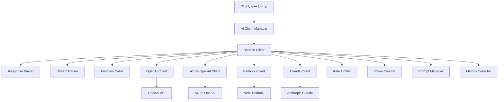

# layers_AI応答標準化ガイド

## 目次

1. [概要](#概要)
2. [アーキテクチャ](#アーキテクチャ)
3. [統一インターフェース](#統一インターフェース)
4. [プロバイダー実装](#プロバイダー実装)
5. [Function Calling](#function-calling)
6. [ストリーミング処理](#ストリーミング処理)
7. [エラーハンドリング](#エラーハンドリング)
8. [レート制限対策](#レート制限対策)
9. [プロンプト管理](#プロンプト管理)
10. [モデル管理](#モデル管理)
11. [メトリクス収集](#メトリクス収集)
12. [テスト戦略](#テスト戦略)

## 概要

AI応答標準化レイヤーは、異なるLLMプロバイダー（OpenAI、Azure OpenAI、AWS Bedrock、Anthropic Claude等）を統一インターフェースで操作し、一貫した応答形式を提供するコンポーネントです。

### 主要目的

1. **プロバイダー独立性**: アプリケーションをLLMプロバイダーから分離
2. **応答形式統一**: 異なるプロバイダーの応答を統一形式に変換
3. **Function Calling標準化**: 各プロバイダーのFunction Calling実装を統一
4. **ストリーミング対応**: リアルタイムストリーミング応答の標準化
5. **エラー処理統一**: プロバイダー固有のエラーを統一形式に変換

## アーキテクチャ

### システム構成図



### コンポーネント責務

| コンポーネント | 責務 |
|------------|------|
| AI Client Manager | プロバイダー選択とクライアント管理 |
| Base AI Client | 共通インターフェースと基本実装 |
| Provider Clients | 各プロバイダー固有の実装 |
| Response Parser | 応答形式の統一化 |
| Stream Parser | ストリーミング応答の解析 |
| Function Caller | Function Calling の実装 |
| Rate Limiter | レート制限の管理 |
| Token Counter | トークン数の計算 |
| Prompt Manager | プロンプトテンプレート管理 |
| Metrics Collector | 使用状況メトリクス収集 |

## 統一インターフェース

### 基本インターフェース定義

```python
from abc import ABC, abstractmethod
from typing import List, Dict, Any, Optional, AsyncIterator, Union
from dataclasses import dataclass
from enum import Enum
from datetime import datetime
import json

class MessageRole(Enum):
    """メッセージロール"""
    SYSTEM = "system"
    USER = "user"
    ASSISTANT = "assistant"
    FUNCTION = "function"
    TOOL = "tool"

class EmotionType(Enum):
    """感情タイプ（MAKOTO用）"""
    NEUTRAL = "neutral"
    HAPPY = "happy"
    SAD = "sad"
    ANGRY = "angry"
    SURPRISED = "surprised"
    CONFUSED = "confused"
    THINKING = "thinking"

class ResponseFormat(Enum):
    """応答フォーマット"""
    TEXT = "text"
    JSON = "json_object"
    STRUCTURED = "structured"

@dataclass
class Message:
    """統一メッセージ形式"""
    role: MessageRole
    content: str
    name: Optional[str] = None
    function_call: Optional[Dict[str, Any]] = None
    tool_calls: Optional[List[Dict[str, Any]]] = None
    metadata: Dict[str, Any] = None
    
    def to_dict(self) -> Dict[str, Any]:
        """辞書形式に変換"""
        data = {
            "role": self.role.value,
            "content": self.content
        }
        if self.name:
            data["name"] = self.name
        if self.function_call:
            data["function_call"] = self.function_call
        if self.tool_calls:
            data["tool_calls"] = self.tool_calls
        if self.metadata:
            data["metadata"] = self.metadata
        return data

@dataclass
class ChatCompletionRequest:
    """チャット完了リクエスト"""
    messages: List[Message]
    model: str
    temperature: float = 0.7
    max_tokens: Optional[int] = None
    top_p: float = 1.0
    frequency_penalty: float = 0.0
    presence_penalty: float = 0.0
    stop: Optional[List[str]] = None
    stream: bool = False
    response_format: ResponseFormat = ResponseFormat.TEXT
    functions: Optional[List[Dict[str, Any]]] = None
    function_call: Optional[Union[str, Dict[str, Any]]] = None
    tools: Optional[List[Dict[str, Any]]] = None
    tool_choice: Optional[Union[str, Dict[str, Any]]] = None
    user: Optional[str] = None
    seed: Optional[int] = None
    metadata: Dict[str, Any] = None

@dataclass
class ChatCompletionResponse:
    """統一チャット完了応答"""
    id: str
    model: str
    created: datetime
    choices: List['Choice']
    usage: 'Usage'
    emotion: Optional[EmotionType] = None
    metadata: Dict[str, Any] = None
    
    def to_dict(self) -> Dict[str, Any]:
        """辞書形式に変換"""
        return {
            "id": self.id,
            "model": self.model,
            "created": self.created.isoformat(),
            "choices": [c.to_dict() for c in self.choices],
            "usage": self.usage.to_dict(),
            "emotion": self.emotion.value if self.emotion else None,
            "metadata": self.metadata
        }

@dataclass
class Choice:
    """応答選択肢"""
    index: int
    message: Message
    finish_reason: str
    
    def to_dict(self) -> Dict[str, Any]:
        return {
            "index": self.index,
            "message": self.message.to_dict(),
            "finish_reason": self.finish_reason
        }

@dataclass
class Usage:
    """トークン使用量"""
    prompt_tokens: int
    completion_tokens: int
    total_tokens: int
    
    def to_dict(self) -> Dict[str, Any]:
        return {
            "prompt_tokens": self.prompt_tokens,
            "completion_tokens": self.completion_tokens,
            "total_tokens": self.total_tokens
        }

@dataclass
class StreamChunk:
    """ストリーミングチャンク"""
    id: str
    model: str
    created: datetime
    choices: List['StreamChoice']
    usage: Optional[Usage] = None
    
    def to_dict(self) -> Dict[str, Any]:
        return {
            "id": self.id,
            "model": self.model,
            "created": self.created.isoformat(),
            "choices": [c.to_dict() for c in self.choices],
            "usage": self.usage.to_dict() if self.usage else None
        }

@dataclass
class StreamChoice:
    """ストリーミング選択肢"""
    index: int
    delta: 'Delta'
    finish_reason: Optional[str] = None
    
    def to_dict(self) -> Dict[str, Any]:
        return {
            "index": self.index,
            "delta": self.delta.to_dict(),
            "finish_reason": self.finish_reason
        }

@dataclass
class Delta:
    """ストリーミングデルタ"""
    role: Optional[MessageRole] = None
    content: Optional[str] = None
    function_call: Optional[Dict[str, Any]] = None
    tool_calls: Optional[List[Dict[str, Any]]] = None
    
    def to_dict(self) -> Dict[str, Any]:
        data = {}
        if self.role:
            data["role"] = self.role.value
        if self.content:
            data["content"] = self.content
        if self.function_call:
            data["function_call"] = self.function_call
        if self.tool_calls:
            data["tool_calls"] = self.tool_calls
        return data
```

### AIクライアント基底クラス

```python
class AIClientBase(ABC):
    """AIクライアント基底クラス"""
    
    def __init__(
        self,
        api_key: Optional[str] = None,
        organization: Optional[str] = None,
        base_url: Optional[str] = None,
        timeout: int = 30,
        max_retries: int = 3,
        rate_limiter: Optional['RateLimiter'] = None
    ):
        self.api_key = api_key
        self.organization = organization
        self.base_url = base_url
        self.timeout = timeout
        self.max_retries = max_retries
        self.rate_limiter = rate_limiter or RateLimiter()
        self.metrics_collector = MetricsCollector()
    
    @abstractmethod
    async def create_chat_completion(
        self,
        request: ChatCompletionRequest
    ) -> ChatCompletionResponse:
        """チャット完了を作成"""
        pass
    
    @abstractmethod
    async def create_chat_completion_stream(
        self,
        request: ChatCompletionRequest
    ) -> AsyncIterator[StreamChunk]:
        """ストリーミングチャット完了を作成"""
        pass
    
    @abstractmethod
    async def count_tokens(
        self,
        messages: List[Message],
        model: str
    ) -> int:
        """トークン数を計算"""
        pass
    
    async def create_completion_with_retry(
        self,
        request: ChatCompletionRequest
    ) -> ChatCompletionResponse:
        """リトライ付きチャット完了"""
        retry_count = 0
        last_error = None
        
        while retry_count < self.max_retries:
            try:
                # レート制限チェック
                await self.rate_limiter.wait_if_needed()
                
                # API呼び出し
                response = await self.create_chat_completion(request)
                
                # メトリクス記録
                await self.metrics_collector.record_request(
                    provider=self.__class__.__name__,
                    model=request.model,
                    tokens=response.usage.total_tokens,
                    latency=0  # 実装で計測
                )
                
                return response
                
            except RateLimitError as e:
                # レート制限エラー
                retry_count += 1
                wait_time = self.calculate_backoff(retry_count)
                await asyncio.sleep(wait_time)
                last_error = e
                
            except APIError as e:
                # API エラー
                if e.is_retryable:
                    retry_count += 1
                    wait_time = self.calculate_backoff(retry_count)
                    await asyncio.sleep(wait_time)
                    last_error = e
                else:
                    raise
        
        raise MaxRetriesExceeded(f"最大リトライ回数を超えました: {last_error}")
    
    def calculate_backoff(self, retry_count: int) -> float:
        """バックオフ時間を計算"""
        return min(2 ** retry_count, 60)  # 最大60秒
```

## プロバイダー実装

### OpenAI実装

```python
import openai
from openai import AsyncOpenAI
import tiktoken

class OpenAIClient(AIClientBase):
    """OpenAI クライアント実装"""
    
    def __init__(self, **kwargs):
        super().__init__(**kwargs)
        self.client = AsyncOpenAI(
            api_key=self.api_key,
            organization=self.organization,
            base_url=self.base_url,
            timeout=self.timeout,
            max_retries=0  # 独自リトライを使用
        )
    
    async def create_chat_completion(
        self,
        request: ChatCompletionRequest
    ) -> ChatCompletionResponse:
        """OpenAI チャット完了"""
        try:
            # リクエスト変換
            openai_request = self._convert_request(request)
            
            # API呼び出し
            response = await self.client.chat.completions.create(**openai_request)
            
            # 応答変換
            return self._convert_response(response)
            
        except openai.RateLimitError as e:
            raise RateLimitError(str(e))
        except openai.APIError as e:
            raise APIError(str(e), is_retryable=True)
        except Exception as e:
            raise APIError(str(e), is_retryable=False)
    
    async def create_chat_completion_stream(
        self,
        request: ChatCompletionRequest
    ) -> AsyncIterator[StreamChunk]:
        """OpenAI ストリーミング"""
        try:
            # リクエスト変換
            openai_request = self._convert_request(request)
            openai_request['stream'] = True
            
            # ストリーミング呼び出し
            stream = await self.client.chat.completions.create(**openai_request)
            
            # チャンク変換
            async for chunk in stream:
                yield self._convert_stream_chunk(chunk)
                
        except Exception as e:
            raise APIError(str(e))
    
    async def count_tokens(
        self,
        messages: List[Message],
        model: str
    ) -> int:
        """トークン数計算（tiktoken使用）"""
        try:
            encoding = tiktoken.encoding_for_model(model)
        except KeyError:
            encoding = tiktoken.get_encoding("cl100k_base")
        
        tokens = 0
        for message in messages:
            tokens += 3  # メッセージヘッダー
            tokens += len(encoding.encode(message.content))
            if message.name:
                tokens += len(encoding.encode(message.name))
        
        tokens += 3  # 応答プライミング
        return tokens
    
    def _convert_request(self, request: ChatCompletionRequest) -> Dict[str, Any]:
        """統一形式からOpenAI形式への変換"""
        openai_request = {
            "model": request.model,
            "messages": [self._convert_message(m) for m in request.messages],
            "temperature": request.temperature,
            "top_p": request.top_p,
            "frequency_penalty": request.frequency_penalty,
            "presence_penalty": request.presence_penalty
        }
        
        if request.max_tokens:
            openai_request["max_tokens"] = request.max_tokens
        if request.stop:
            openai_request["stop"] = request.stop
        if request.response_format == ResponseFormat.JSON:
            openai_request["response_format"] = {"type": "json_object"}
        if request.functions:
            openai_request["functions"] = request.functions
        if request.function_call:
            openai_request["function_call"] = request.function_call
        if request.tools:
            openai_request["tools"] = request.tools
        if request.tool_choice:
            openai_request["tool_choice"] = request.tool_choice
        if request.user:
            openai_request["user"] = request.user
        if request.seed:
            openai_request["seed"] = request.seed
        
        return openai_request
    
    def _convert_message(self, message: Message) -> Dict[str, Any]:
        """メッセージ変換"""
        openai_message = {
            "role": message.role.value,
            "content": message.content
        }
        if message.name:
            openai_message["name"] = message.name
        if message.function_call:
            openai_message["function_call"] = message.function_call
        if message.tool_calls:
            openai_message["tool_calls"] = message.tool_calls
        return openai_message
    
    def _convert_response(self, response: Any) -> ChatCompletionResponse:
        """OpenAI応答から統一形式への変換"""
        choices = []
        for choice in response.choices:
            message = Message(
                role=MessageRole(choice.message.role),
                content=choice.message.content or "",
                function_call=choice.message.function_call if hasattr(choice.message, 'function_call') else None,
                tool_calls=choice.message.tool_calls if hasattr(choice.message, 'tool_calls') else None
            )
            choices.append(Choice(
                index=choice.index,
                message=message,
                finish_reason=choice.finish_reason
            ))
        
        usage = Usage(
            prompt_tokens=response.usage.prompt_tokens,
            completion_tokens=response.usage.completion_tokens,
            total_tokens=response.usage.total_tokens
        )
        
        # 感情分析（MAKOTO用）
        emotion = self._extract_emotion(choices[0].message.content if choices else "")
        
        return ChatCompletionResponse(
            id=response.id,
            model=response.model,
            created=datetime.fromtimestamp(response.created),
            choices=choices,
            usage=usage,
            emotion=emotion
        )
    
    def _convert_stream_chunk(self, chunk: Any) -> StreamChunk:
        """ストリームチャンク変換"""
        choices = []
        for choice in chunk.choices:
            delta = Delta(
                role=MessageRole(choice.delta.role) if choice.delta.role else None,
                content=choice.delta.content if hasattr(choice.delta, 'content') else None,
                function_call=choice.delta.function_call if hasattr(choice.delta, 'function_call') else None,
                tool_calls=choice.delta.tool_calls if hasattr(choice.delta, 'tool_calls') else None
            )
            choices.append(StreamChoice(
                index=choice.index,
                delta=delta,
                finish_reason=choice.finish_reason
            ))
        
        return StreamChunk(
            id=chunk.id,
            model=chunk.model,
            created=datetime.fromtimestamp(chunk.created),
            choices=choices
        )
    
    def _extract_emotion(self, content: str) -> Optional[EmotionType]:
        """コンテンツから感情を抽出（簡易実装）"""
        # 実際にはより高度な感情分析を実装
        emotion_keywords = {
            EmotionType.HAPPY: ["嬉しい", "楽しい", "😊", "😄"],
            EmotionType.SAD: ["悲しい", "辛い", "😢", "😔"],
            EmotionType.ANGRY: ["怒り", "腹立つ", "😠", "😡"],
            EmotionType.SURPRISED: ["驚き", "びっくり", "😮", "😲"],
            EmotionType.CONFUSED: ["困惑", "分からない", "😕", "🤔"],
            EmotionType.THINKING: ["考え", "思案", "🤔", "💭"]
        }
        
        for emotion, keywords in emotion_keywords.items():
            if any(keyword in content for keyword in keywords):
                return emotion
        
        return EmotionType.NEUTRAL
```

### Azure OpenAI実装

```python
from azure.identity import DefaultAzureCredential, ClientSecretCredential
import httpx

class AzureOpenAIClient(OpenAIClient):
    """Azure OpenAI クライアント実装"""
    
    def __init__(
        self,
        azure_endpoint: str,
        azure_deployment: str,
        api_version: str = "2024-02-15-preview",
        azure_ad_token: Optional[str] = None,
        azure_ad_token_provider: Optional[Any] = None,
        **kwargs
    ):
        # Azure固有の設定
        self.azure_endpoint = azure_endpoint
        self.azure_deployment = azure_deployment
        self.api_version = api_version
        
        # Azure AD認証
        if azure_ad_token_provider:
            kwargs['api_key'] = None  # ADトークンを使用
        
        # 基底クラス初期化
        super().__init__(**kwargs)
        
        # Azure OpenAIクライアント作成
        from openai import AsyncAzureOpenAI
        self.client = AsyncAzureOpenAI(
            azure_endpoint=azure_endpoint,
            azure_deployment=azure_deployment,
            api_version=api_version,
            azure_ad_token=azure_ad_token,
            azure_ad_token_provider=azure_ad_token_provider,
            api_key=kwargs.get('api_key'),
            timeout=self.timeout,
            max_retries=0
        )
    
    def _convert_request(self, request: ChatCompletionRequest) -> Dict[str, Any]:
        """Azure OpenAI用リクエスト変換"""
        # 基本変換
        azure_request = super()._convert_request(request)
        
        # Azure固有: モデル名をデプロイメント名に置換
        azure_request["model"] = self.azure_deployment
        
        # Azure固有の追加パラメータ
        if hasattr(request, 'azure_extensions'):
            azure_request["dataSources"] = request.azure_extensions.get('data_sources', [])
        
        return azure_request
```

### AWS Bedrock実装

```python
import boto3
import json
from botocore.exceptions import ClientError

class BedrockClient(AIClientBase):
    """AWS Bedrock クライアント実装"""
    
    def __init__(
        self,
        region_name: str = "us-east-1",
        model_id: str = "anthropic.claude-3-sonnet-20240229-v1:0",
        **kwargs
    ):
        super().__init__(**kwargs)
        self.region_name = region_name
        self.model_id = model_id
        self.bedrock_runtime = boto3.client(
            'bedrock-runtime',
            region_name=region_name
        )
    
    async def create_chat_completion(
        self,
        request: ChatCompletionRequest
    ) -> ChatCompletionResponse:
        """Bedrock チャット完了"""
        try:
            # モデル別のペイロード作成
            if "claude" in self.model_id:
                payload = self._create_claude_payload(request)
            elif "llama" in self.model_id:
                payload = self._create_llama_payload(request)
            elif "titan" in self.model_id:
                payload = self._create_titan_payload(request)
            else:
                raise ValueError(f"サポートされていないモデル: {self.model_id}")
            
            # 同期APIを非同期で実行
            loop = asyncio.get_event_loop()
            response = await loop.run_in_executor(
                None,
                lambda: self.bedrock_runtime.invoke_model(
                    modelId=self.model_id,
                    body=json.dumps(payload),
                    contentType='application/json'
                )
            )
            
            # 応答解析
            response_body = json.loads(response['body'].read())
            return self._parse_bedrock_response(response_body, request)
            
        except ClientError as e:
            if e.response['Error']['Code'] == 'ThrottlingException':
                raise RateLimitError(str(e))
            raise APIError(str(e))
    
    async def create_chat_completion_stream(
        self,
        request: ChatCompletionRequest
    ) -> AsyncIterator[StreamChunk]:
        """Bedrock ストリーミング"""
        try:
            # ペイロード作成
            if "claude" in self.model_id:
                payload = self._create_claude_payload(request)
            else:
                raise ValueError(f"ストリーミング非対応: {self.model_id}")
            
            # ストリーミング呼び出し
            loop = asyncio.get_event_loop()
            response = await loop.run_in_executor(
                None,
                lambda: self.bedrock_runtime.invoke_model_with_response_stream(
                    modelId=self.model_id,
                    body=json.dumps(payload),
                    contentType='application/json'
                )
            )
            
            # イベントストリーム処理
            for event in response['body']:
                chunk = json.loads(event['chunk']['bytes'])
                yield self._parse_bedrock_stream_chunk(chunk)
                
        except Exception as e:
            raise APIError(str(e))
    
    def _create_claude_payload(self, request: ChatCompletionRequest) -> Dict[str, Any]:
        """Claude用ペイロード作成"""
        # メッセージ変換
        messages = []
        system_prompt = None
        
        for msg in request.messages:
            if msg.role == MessageRole.SYSTEM:
                system_prompt = msg.content
            else:
                messages.append({
                    "role": "user" if msg.role == MessageRole.USER else "assistant",
                    "content": msg.content
                })
        
        payload = {
            "anthropic_version": "bedrock-2023-05-31",
            "messages": messages,
            "max_tokens": request.max_tokens or 1000,
            "temperature": request.temperature,
            "top_p": request.top_p
        }
        
        if system_prompt:
            payload["system"] = system_prompt
        
        if request.stop:
            payload["stop_sequences"] = request.stop
        
        return payload
    
    def _parse_bedrock_response(
        self,
        response_body: Dict[str, Any],
        request: ChatCompletionRequest
    ) -> ChatCompletionResponse:
        """Bedrock応答解析"""
        # Claude応答の場合
        if "content" in response_body:
            content = response_body["content"][0]["text"] if isinstance(response_body["content"], list) else response_body["content"]
            
            message = Message(
                role=MessageRole.ASSISTANT,
                content=content
            )
            
            choice = Choice(
                index=0,
                message=message,
                finish_reason=response_body.get("stop_reason", "stop")
            )
            
            # 使用量計算（概算）
            usage = Usage(
                prompt_tokens=response_body.get("usage", {}).get("input_tokens", 0),
                completion_tokens=response_body.get("usage", {}).get("output_tokens", 0),
                total_tokens=response_body.get("usage", {}).get("total_tokens", 0)
            )
            
            return ChatCompletionResponse(
                id=response_body.get("id", f"bedrock-{datetime.utcnow().timestamp()}"),
                model=self.model_id,
                created=datetime.utcnow(),
                choices=[choice],
                usage=usage
            )
        
        raise ValueError("応答解析エラー")
    
    async def count_tokens(
        self,
        messages: List[Message],
        model: str
    ) -> int:
        """トークン数計算（概算）"""
        # Bedrockは正確なトークン数計算APIがないため概算
        total_chars = sum(len(m.content) for m in messages)
        # 文字数から概算（日本語は1文字≒2トークン、英語は4文字≒1トークン）
        return int(total_chars * 0.5)
```

## Function Calling

### Function Calling実装

```python
@dataclass
class FunctionDefinition:
    """関数定義"""
    name: str
    description: str
    parameters: Dict[str, Any]  # JSON Schema
    
    def to_openai_format(self) -> Dict[str, Any]:
        """OpenAI形式に変換"""
        return {
            "name": self.name,
            "description": self.description,
            "parameters": self.parameters
        }
    
    def to_claude_format(self) -> Dict[str, Any]:
        """Claude形式に変換"""
        return {
            "name": self.name,
            "description": self.description,
            "input_schema": self.parameters
        }

class FunctionCaller:
    """Function Calling実装"""
    
    def __init__(self):
        self.functions: Dict[str, FunctionDefinition] = {}
        self.handlers: Dict[str, Callable] = {}
    
    def register_function(
        self,
        definition: FunctionDefinition,
        handler: Callable
    ):
        """関数登録"""
        self.functions[definition.name] = definition
        self.handlers[definition.name] = handler
    
    async def execute_function_call(
        self,
        function_name: str,
        arguments: Dict[str, Any]
    ) -> Any:
        """関数実行"""
        if function_name not in self.handlers:
            raise ValueError(f"未登録の関数: {function_name}")
        
        handler = self.handlers[function_name]
        
        # 非同期関数の場合
        if asyncio.iscoroutinefunction(handler):
            return await handler(**arguments)
        else:
            # 同期関数を非同期で実行
            loop = asyncio.get_event_loop()
            return await loop.run_in_executor(None, handler, **arguments)
    
    def get_function_definitions(
        self,
        provider: str = "openai"
    ) -> List[Dict[str, Any]]:
        """プロバイダー別の関数定義取得"""
        if provider == "openai":
            return [f.to_openai_format() for f in self.functions.values()]
        elif provider == "claude":
            return [f.to_claude_format() for f in self.functions.values()]
        else:
            raise ValueError(f"未対応のプロバイダー: {provider}")

# 使用例
function_caller = FunctionCaller()

# 関数定義
get_weather_def = FunctionDefinition(
    name="get_weather",
    description="指定された場所の天気を取得",
    parameters={
        "type": "object",
        "properties": {
            "location": {
                "type": "string",
                "description": "都市名、例: 東京"
            },
            "unit": {
                "type": "string",
                "enum": ["celsius", "fahrenheit"],
                "description": "温度単位"
            }
        },
        "required": ["location"]
    }
)

# ハンドラー実装
async def get_weather_handler(location: str, unit: str = "celsius") -> Dict[str, Any]:
    """天気情報取得（ダミー実装）"""
    return {
        "location": location,
        "temperature": 22,
        "unit": unit,
        "description": "晴れ"
    }

# 登録
function_caller.register_function(get_weather_def, get_weather_handler)
```

## ストリーミング処理

### ストリーミングパーサー

```python
class StreamingParser:
    """ストリーミング応答パーサー"""
    
    def __init__(self):
        self.buffer = ""
        self.current_function_call = None
        self.current_tool_calls = []
    
    async def parse_stream(
        self,
        stream: AsyncIterator[StreamChunk]
    ) -> AsyncIterator[Union[str, Dict[str, Any]]]:
        """ストリーム解析"""
        async for chunk in stream:
            for choice in chunk.choices:
                delta = choice.delta
                
                # コンテンツ
                if delta.content:
                    self.buffer += delta.content
                    yield delta.content
                
                # Function Call
                if delta.function_call:
                    if not self.current_function_call:
                        self.current_function_call = {
                            "name": delta.function_call.get("name", ""),
                            "arguments": ""
                        }
                    
                    if "arguments" in delta.function_call:
                        self.current_function_call["arguments"] += delta.function_call["arguments"]
                
                # Tool Calls
                if delta.tool_calls:
                    for tool_call_delta in delta.tool_calls:
                        # Tool Call処理
                        pass
                
                # 完了時
                if choice.finish_reason == "function_call":
                    if self.current_function_call:
                        # 引数をJSONパース
                        try:
                            args = json.loads(self.current_function_call["arguments"])
                            self.current_function_call["arguments"] = args
                            yield {"function_call": self.current_function_call}
                        except json.JSONDecodeError:
                            yield {"error": "Function引数のパースエラー"}
                        
                        self.current_function_call = None

class EnhancedStreamingHandler:
    """拡張ストリーミングハンドラー"""
    
    def __init__(self, function_caller: Optional[FunctionCaller] = None):
        self.function_caller = function_caller
        self.parser = StreamingParser()
    
    async def handle_stream(
        self,
        stream: AsyncIterator[StreamChunk],
        callback: Optional[Callable] = None
    ) -> ChatCompletionResponse:
        """ストリーミング処理とコールバック"""
        full_content = ""
        function_calls = []
        
        async for item in self.parser.parse_stream(stream):
            if isinstance(item, str):
                # テキストコンテンツ
                full_content += item
                if callback:
                    await callback({"type": "content", "data": item})
            
            elif isinstance(item, dict):
                if "function_call" in item:
                    # Function Call
                    function_call = item["function_call"]
                    function_calls.append(function_call)
                    
                    if callback:
                        await callback({"type": "function_call", "data": function_call})
                    
                    # 関数実行
                    if self.function_caller:
                        result = await self.function_caller.execute_function_call(
                            function_call["name"],
                            function_call["arguments"]
                        )
                        
                        if callback:
                            await callback({"type": "function_result", "data": result})
        
        # 最終応答作成
        message = Message(
            role=MessageRole.ASSISTANT,
            content=full_content,
            function_call=function_calls[0] if function_calls else None
        )
        
        return ChatCompletionResponse(
            id=f"stream-{datetime.utcnow().timestamp()}",
            model="streaming",
            created=datetime.utcnow(),
            choices=[Choice(index=0, message=message, finish_reason="stop")],
            usage=Usage(prompt_tokens=0, completion_tokens=0, total_tokens=0)
        )
```

## エラーハンドリング

### エラークラス定義

```python
class AIError(Exception):
    """AI関連エラーの基底クラス"""
    def __init__(self, message: str, code: Optional[str] = None, is_retryable: bool = False):
        super().__init__(message)
        self.code = code
        self.is_retryable = is_retryable

class RateLimitError(AIError):
    """レート制限エラー"""
    def __init__(self, message: str, retry_after: Optional[int] = None):
        super().__init__(message, code="rate_limit", is_retryable=True)
        self.retry_after = retry_after

class APIError(AIError):
    """APIエラー"""
    pass

class AuthenticationError(AIError):
    """認証エラー"""
    def __init__(self, message: str):
        super().__init__(message, code="authentication", is_retryable=False)

class InvalidRequestError(AIError):
    """無効なリクエストエラー"""
    def __init__(self, message: str):
        super().__init__(message, code="invalid_request", is_retryable=False)

class MaxRetriesExceeded(AIError):
    """最大リトライ回数超過"""
    def __init__(self, message: str):
        super().__init__(message, code="max_retries", is_retryable=False)

class ErrorHandler:
    """統一エラーハンドラー"""
    
    @staticmethod
    def handle_provider_error(provider: str, error: Exception) -> AIError:
        """プロバイダー固有エラーを統一エラーに変換"""
        
        if provider == "openai":
            import openai
            if isinstance(error, openai.RateLimitError):
                return RateLimitError(str(error))
            elif isinstance(error, openai.AuthenticationError):
                return AuthenticationError(str(error))
            elif isinstance(error, openai.BadRequestError):
                return InvalidRequestError(str(error))
            elif isinstance(error, openai.APIError):
                return APIError(str(error), is_retryable=True)
        
        elif provider == "bedrock":
            from botocore.exceptions import ClientError
            if isinstance(error, ClientError):
                error_code = error.response['Error']['Code']
                if error_code == 'ThrottlingException':
                    return RateLimitError(str(error))
                elif error_code == 'AccessDeniedException':
                    return AuthenticationError(str(error))
                elif error_code == 'ValidationException':
                    return InvalidRequestError(str(error))
        
        # デフォルト
        return APIError(str(error), is_retryable=False)
```

## レート制限対策

### レートリミッター実装

```python
import time
from collections import deque
from dataclasses import dataclass
from typing import Deque

@dataclass
class RateLimitConfig:
    """レート制限設定"""
    requests_per_minute: int = 60
    requests_per_hour: int = 3600
    tokens_per_minute: int = 90000
    tokens_per_hour: int = 2000000

class RateLimiter:
    """レート制限管理"""
    
    def __init__(self, config: RateLimitConfig = None):
        self.config = config or RateLimitConfig()
        self.request_times: Deque[float] = deque()
        self.token_usage: Deque[Tuple[float, int]] = deque()
    
    async def wait_if_needed(self):
        """必要に応じて待機"""
        now = time.time()
        
        # 古いエントリを削除
        self._cleanup_old_entries(now)
        
        # リクエスト制限チェック
        minute_requests = self._count_recent_requests(now - 60)
        if minute_requests >= self.config.requests_per_minute:
            wait_time = 60 - (now - self.request_times[0])
            await asyncio.sleep(wait_time)
        
        # 記録
        self.request_times.append(now)
    
    def record_token_usage(self, tokens: int):
        """トークン使用量記録"""
        self.token_usage.append((time.time(), tokens))
    
    def _cleanup_old_entries(self, now: float):
        """古いエントリ削除"""
        hour_ago = now - 3600
        
        while self.request_times and self.request_times[0] < hour_ago:
            self.request_times.popleft()
        
        while self.token_usage and self.token_usage[0][0] < hour_ago:
            self.token_usage.popleft()
    
    def _count_recent_requests(self, since: float) -> int:
        """最近のリクエスト数"""
        return sum(1 for t in self.request_times if t >= since)
    
    def _count_recent_tokens(self, since: float) -> int:
        """最近のトークン使用量"""
        return sum(tokens for t, tokens in self.token_usage if t >= since)

class AdaptiveRateLimiter(RateLimiter):
    """適応型レートリミッター"""
    
    def __init__(self, config: RateLimitConfig = None):
        super().__init__(config)
        self.success_rate = 1.0
        self.backoff_multiplier = 1.0
    
    async def wait_if_needed(self):
        """適応的な待機"""
        # 基本待機
        await super().wait_if_needed()
        
        # 成功率に基づく追加待機
        if self.success_rate < 0.8:
            additional_wait = (1 - self.success_rate) * 10 * self.backoff_multiplier
            await asyncio.sleep(additional_wait)
    
    def record_success(self):
        """成功記録"""
        self.success_rate = min(1.0, self.success_rate + 0.1)
        self.backoff_multiplier = max(1.0, self.backoff_multiplier - 0.1)
    
    def record_failure(self):
        """失敗記録"""
        self.success_rate = max(0.0, self.success_rate - 0.2)
        self.backoff_multiplier = min(5.0, self.backoff_multiplier + 0.5)
```

## プロンプト管理

### プロンプトマネージャー

```python
@dataclass
class PromptTemplate:
    """プロンプトテンプレート"""
    name: str
    template: str
    variables: List[str]
    system_prompt: Optional[str] = None
    examples: List[Dict[str, str]] = None
    
    def format(self, **kwargs) -> str:
        """変数を埋め込んでプロンプト生成"""
        # 不足している変数チェック
        missing = set(self.variables) - set(kwargs.keys())
        if missing:
            raise ValueError(f"必須変数が不足: {missing}")
        
        return self.template.format(**kwargs)

class PromptManager:
    """プロンプト管理"""
    
    def __init__(self):
        self.templates: Dict[str, PromptTemplate] = {}
        self._load_default_templates()
    
    def _load_default_templates(self):
        """デフォルトテンプレート読み込み"""
        
        # MAKOTOチャットテンプレート
        self.templates["makoto_chat"] = PromptTemplate(
            name="makoto_chat",
            system_prompt="""あなたはMAKOTO（マコト）という名前のAIアシスタントです。
以下の性格と特徴を持っています：
- 親切で丁寧な対応
- 専門的な知識を分かりやすく説明
- ユーザーの感情に寄り添う
- 必要に応じて絵文字を使用（控えめに）

応答時は以下の形式でJSONを返してください：
{
    "content": "応答内容",
    "emotion": "neutral|happy|sad|angry|surprised|confused|thinking",
    "metadata": {
        "confidence": 0.0-1.0,
        "tags": []
    }
}""",
            template="{user_message}",
            variables=["user_message"]
        )
        
        # 要約テンプレート
        self.templates["summarize"] = PromptTemplate(
            name="summarize",
            template="""以下のテキストを{max_length}文字以内で要約してください：

{text}

要約：""",
            variables=["text", "max_length"]
        )
        
        # 翻訳テンプレート
        self.templates["translate"] = PromptTemplate(
            name="translate",
            template="""以下のテキストを{source_lang}から{target_lang}に翻訳してください：

{text}

翻訳：""",
            variables=["text", "source_lang", "target_lang"]
        )
    
    def get_template(self, name: str) -> PromptTemplate:
        """テンプレート取得"""
        if name not in self.templates:
            raise ValueError(f"テンプレートが見つかりません: {name}")
        return self.templates[name]
    
    def register_template(self, template: PromptTemplate):
        """テンプレート登録"""
        self.templates[template.name] = template
    
    def create_messages(
        self,
        template_name: str,
        **kwargs
    ) -> List[Message]:
        """テンプレートからメッセージ作成"""
        template = self.get_template(template_name)
        
        messages = []
        
        # システムプロンプト
        if template.system_prompt:
            messages.append(Message(
                role=MessageRole.SYSTEM,
                content=template.system_prompt
            ))
        
        # 例示
        if template.examples:
            for example in template.examples:
                messages.append(Message(
                    role=MessageRole.USER,
                    content=example["input"]
                ))
                messages.append(Message(
                    role=MessageRole.ASSISTANT,
                    content=example["output"]
                ))
        
        # ユーザーメッセージ
        messages.append(Message(
            role=MessageRole.USER,
            content=template.format(**kwargs)
        ))
        
        return messages
```

## モデル管理

### モデルマネージャー

```python
@dataclass
class ModelInfo:
    """モデル情報"""
    id: str
    provider: str
    name: str
    context_length: int
    max_output_tokens: int
    cost_per_1k_input: float
    cost_per_1k_output: float
    capabilities: List[str]  # ["chat", "function_calling", "vision", etc.]
    
    def supports(self, capability: str) -> bool:
        """機能サポート確認"""
        return capability in self.capabilities

class ModelManager:
    """モデル管理"""
    
    def __init__(self):
        self.models: Dict[str, ModelInfo] = {}
        self._load_model_definitions()
    
    def _load_model_definitions(self):
        """モデル定義読み込み"""
        
        # OpenAI モデル
        self.models["gpt-4-turbo"] = ModelInfo(
            id="gpt-4-turbo",
            provider="openai",
            name="GPT-4 Turbo",
            context_length=128000,
            max_output_tokens=4096,
            cost_per_1k_input=0.01,
            cost_per_1k_output=0.03,
            capabilities=["chat", "function_calling", "vision", "json_mode"]
        )
        
        self.models["gpt-4o"] = ModelInfo(
            id="gpt-4o",
            provider="openai",
            name="GPT-4o",
            context_length=128000,
            max_output_tokens=4096,
            cost_per_1k_input=0.005,
            cost_per_1k_output=0.015,
            capabilities=["chat", "function_calling", "vision", "json_mode"]
        )
        
        # Azure OpenAI モデル
        self.models["gpt-4-azure"] = ModelInfo(
            id="gpt-4",
            provider="azure",
            name="GPT-4 (Azure)",
            context_length=8192,
            max_output_tokens=4096,
            cost_per_1k_input=0.03,
            cost_per_1k_output=0.06,
            capabilities=["chat", "function_calling"]
        )
        
        # Bedrock モデル
        self.models["claude-3-sonnet"] = ModelInfo(
            id="anthropic.claude-3-sonnet-20240229-v1:0",
            provider="bedrock",
            name="Claude 3 Sonnet",
            context_length=200000,
            max_output_tokens=4096,
            cost_per_1k_input=0.003,
            cost_per_1k_output=0.015,
            capabilities=["chat", "vision"]
        )
    
    def get_model(self, model_id: str) -> ModelInfo:
        """モデル情報取得"""
        if model_id not in self.models:
            raise ValueError(f"未登録のモデル: {model_id}")
        return self.models[model_id]
    
    def select_model(
        self,
        required_capabilities: List[str],
        max_cost_per_1k: float = None,
        min_context_length: int = None
    ) -> ModelInfo:
        """条件に合うモデル選択"""
        candidates = []
        
        for model in self.models.values():
            # 必要な機能をサポート
            if not all(model.supports(cap) for cap in required_capabilities):
                continue
            
            # コスト制約
            if max_cost_per_1k and model.cost_per_1k_input > max_cost_per_1k:
                continue
            
            # コンテキスト長
            if min_context_length and model.context_length < min_context_length:
                continue
            
            candidates.append(model)
        
        if not candidates:
            raise ValueError("条件に合うモデルが見つかりません")
        
        # コストが最も低いモデルを選択
        return min(candidates, key=lambda m: m.cost_per_1k_input)
```

## メトリクス収集

### メトリクスコレクター

```python
@dataclass
class RequestMetrics:
    """リクエストメトリクス"""
    timestamp: datetime
    provider: str
    model: str
    input_tokens: int
    output_tokens: int
    total_tokens: int
    latency_ms: float
    cost: float
    success: bool
    error: Optional[str] = None

class MetricsCollector:
    """メトリクス収集"""
    
    def __init__(self):
        self.metrics: List[RequestMetrics] = []
        self.aggregated_metrics = {}
    
    async def record_request(
        self,
        provider: str,
        model: str,
        tokens: int,
        latency: float,
        success: bool = True,
        error: Optional[str] = None
    ):
        """リクエスト記録"""
        # モデル情報取得
        model_manager = ModelManager()
        model_info = model_manager.get_model(model)
        
        # コスト計算
        cost = (tokens / 1000) * model_info.cost_per_1k_input
        
        # メトリクス作成
        metric = RequestMetrics(
            timestamp=datetime.utcnow(),
            provider=provider,
            model=model,
            input_tokens=0,  # 実装で分離
            output_tokens=0,
            total_tokens=tokens,
            latency_ms=latency * 1000,
            cost=cost,
            success=success,
            error=error
        )
        
        self.metrics.append(metric)
        
        # 集計更新
        await self._update_aggregates(metric)
    
    async def _update_aggregates(self, metric: RequestMetrics):
        """集計データ更新"""
        key = f"{metric.provider}:{metric.model}"
        
        if key not in self.aggregated_metrics:
            self.aggregated_metrics[key] = {
                "total_requests": 0,
                "total_tokens": 0,
                "total_cost": 0,
                "total_latency": 0,
                "success_count": 0,
                "error_count": 0
            }
        
        agg = self.aggregated_metrics[key]
        agg["total_requests"] += 1
        agg["total_tokens"] += metric.total_tokens
        agg["total_cost"] += metric.cost
        agg["total_latency"] += metric.latency_ms
        
        if metric.success:
            agg["success_count"] += 1
        else:
            agg["error_count"] += 1
    
    def get_statistics(
        self,
        provider: Optional[str] = None,
        model: Optional[str] = None,
        since: Optional[datetime] = None
    ) -> Dict[str, Any]:
        """統計情報取得"""
        filtered_metrics = self.metrics
        
        # フィルタリング
        if provider:
            filtered_metrics = [m for m in filtered_metrics if m.provider == provider]
        if model:
            filtered_metrics = [m for m in filtered_metrics if m.model == model]
        if since:
            filtered_metrics = [m for m in filtered_metrics if m.timestamp >= since]
        
        if not filtered_metrics:
            return {}
        
        # 統計計算
        total_requests = len(filtered_metrics)
        total_tokens = sum(m.total_tokens for m in filtered_metrics)
        total_cost = sum(m.cost for m in filtered_metrics)
        avg_latency = sum(m.latency_ms for m in filtered_metrics) / total_requests
        success_rate = sum(1 for m in filtered_metrics if m.success) / total_requests
        
        return {
            "total_requests": total_requests,
            "total_tokens": total_tokens,
            "total_cost": total_cost,
            "average_latency_ms": avg_latency,
            "success_rate": success_rate,
            "period": {
                "start": min(m.timestamp for m in filtered_metrics),
                "end": max(m.timestamp for m in filtered_metrics)
            }
        }
```

## テスト戦略

### モッククライアント

```python
class MockAIClient(AIClientBase):
    """テスト用モッククライアント"""
    
    def __init__(self, **kwargs):
        super().__init__(**kwargs)
        self.responses = []
        self.response_index = 0
    
    def add_response(self, response: ChatCompletionResponse):
        """レスポンス追加"""
        self.responses.append(response)
    
    async def create_chat_completion(
        self,
        request: ChatCompletionRequest
    ) -> ChatCompletionResponse:
        """モック応答"""
        if self.response_index >= len(self.responses):
            # デフォルト応答
            return ChatCompletionResponse(
                id="mock-response",
                model=request.model,
                created=datetime.utcnow(),
                choices=[Choice(
                    index=0,
                    message=Message(
                        role=MessageRole.ASSISTANT,
                        content="モック応答です"
                    ),
                    finish_reason="stop"
                )],
                usage=Usage(
                    prompt_tokens=10,
                    completion_tokens=5,
                    total_tokens=15
                )
            )
        
        response = self.responses[self.response_index]
        self.response_index += 1
        return response
    
    async def create_chat_completion_stream(
        self,
        request: ChatCompletionRequest
    ) -> AsyncIterator[StreamChunk]:
        """モックストリーミング"""
        content = "これはストリーミングテストです"
        
        for char in content:
            yield StreamChunk(
                id="mock-stream",
                model=request.model,
                created=datetime.utcnow(),
                choices=[StreamChoice(
                    index=0,
                    delta=Delta(content=char),
                    finish_reason=None
                )]
            )
        
        # 最終チャンク
        yield StreamChunk(
            id="mock-stream",
            model=request.model,
            created=datetime.utcnow(),
            choices=[StreamChoice(
                index=0,
                delta=Delta(),
                finish_reason="stop"
            )]
        )
    
    async def count_tokens(
        self,
        messages: List[Message],
        model: str
    ) -> int:
        """モックトークン計算"""
        return sum(len(m.content) for m in messages) // 4

# テスト例
import pytest

@pytest.mark.asyncio
async def test_ai_client():
    """AIクライアントテスト"""
    # モッククライアント
    client = MockAIClient()
    
    # テスト応答
    test_response = ChatCompletionResponse(
        id="test-1",
        model="gpt-4",
        created=datetime.utcnow(),
        choices=[Choice(
            index=0,
            message=Message(
                role=MessageRole.ASSISTANT,
                content="テスト応答"
            ),
            finish_reason="stop"
        )],
        usage=Usage(10, 5, 15)
    )
    
    client.add_response(test_response)
    
    # リクエスト
    request = ChatCompletionRequest(
        messages=[Message(role=MessageRole.USER, content="テスト")],
        model="gpt-4"
    )
    
    # 実行
    response = await client.create_chat_completion(request)
    
    # 検証
    assert response.id == "test-1"
    assert response.choices[0].message.content == "テスト応答"
    assert response.usage.total_tokens == 15

@pytest.mark.asyncio
async def test_streaming():
    """ストリーミングテスト"""
    client = MockAIClient()
    
    request = ChatCompletionRequest(
        messages=[Message(role=MessageRole.USER, content="テスト")],
        model="gpt-4",
        stream=True
    )
    
    # ストリーミング実行
    chunks = []
    async for chunk in client.create_chat_completion_stream(request):
        chunks.append(chunk)
    
    # 検証
    assert len(chunks) > 0
    content = "".join(
        c.choices[0].delta.content 
        for c in chunks 
        if c.choices[0].delta.content
    )
    assert content == "これはストリーミングテストです"
```

## まとめ

このAI応答標準化ガイドにより：

1. **統一インターフェース**: 異なるLLMプロバイダーを同じAPIで操作
2. **Function Calling**: プロバイダー間でFunction Callingを標準化
3. **ストリーミング**: リアルタイム応答の統一処理
4. **エラー処理**: プロバイダー固有エラーの統一化
5. **レート制限**: 適応的なレート制限管理
6. **メトリクス**: 使用状況の詳細な追跡
7. **テスタビリティ**: モッククライアントによる容易なテスト

これにより、LLMプロバイダーの切り替えが容易になり、アプリケーションの保守性と拡張性が向上します。

---

**作成者**: Claude  
**作成日**: 2025年8月7日  
**バージョン**: 1.0.0