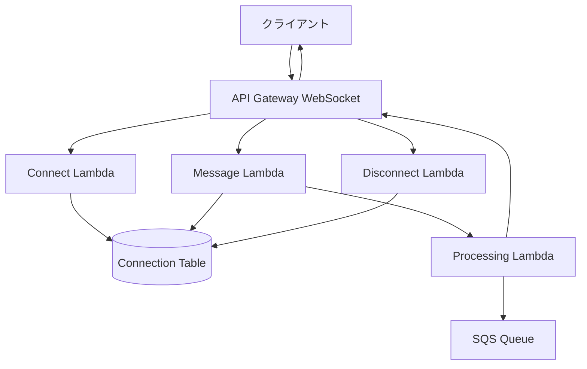

# layers_WebSocket通信アーキテクチャ【廃止予定】

> ⚠️ **重要**: WebSocket通信機能は廃止予定です。新規実装では**SSE（Server-Sent Events）**を使用してください。
> 
> 廃止理由：
> - アーキテクチャの複雑性増加
> - 保守コストの高さ
> - SSEで必要な要件をすべて満たせる
> - AWS App RunnerでのSSEサポートが優れている

## 目次

1. [概要](#概要)
2. [廃止計画](#廃止計画)
3. [SSEへの移行ガイド](#sseへの移行ガイド)
4. [既存WebSocket実装（参考）](#既存websocket実装参考)
5. [API Gateway WebSocket設計（参考）](#api-gateway-websocket設計参考)
6. [接続管理（参考）](#接続管理参考)
7. [メッセージルーティング（参考）](#メッセージルーティング参考)
8. [認証・認可（参考）](#認証認可参考)
9. [エラーハンドリング（参考）](#エラーハンドリング参考)
10. [移行チェックリスト](#移行チェックリスト)

## 概要

このドキュメントは、廃止予定のWebSocket通信アーキテクチャの仕様を記載しています。新規実装では使用せず、既存実装の保守と移行のための参考資料としてください。

### 廃止理由の詳細

1. **複雑性の問題**
   - 接続管理の複雑さ
   - 状態管理の難しさ
   - エラーハンドリングの煩雑さ

2. **コストの問題**
   - API Gateway WebSocketの料金
   - Lambda実行時間の増加
   - DynamoDB接続テーブルの管理コスト

3. **SSEの優位性**
   - シンプルな実装
   - HTTPベースで扱いやすい
   - 自動再接続機能
   - App Runnerとの相性が良い

## 廃止計画

### フェーズ1: 新規開発停止（現在）
- 新機能でのWebSocket使用禁止
- SSEでの実装を推奨

### フェーズ2: 既存機能の移行（3ヶ月以内）
- チャット機能をSSEに移行
- エージェント実行通知をSSEに移行
- ライブラリ処理通知をSSEに移行

### フェーズ3: WebSocket廃止（6ヶ月以内）
- WebSocketエンドポイントの削除
- 関連リソースのクリーンアップ
- ドキュメントのアーカイブ

## SSEへの移行ガイド

### WebSocketからSSEへの対応表

| WebSocket機能 | SSE代替実装 |
|-------------|------------|
| 双方向通信 | SSE（サーバー→クライアント）+ REST API（クライアント→サーバー） |
| 接続管理 | ブラウザの自動再接続機能を利用 |
| メッセージブロードキャスト | SSEのマルチキャスト |
| 認証 | HTTPヘッダーでのJWT認証 |
| エラー処理 | HTTPステータスコード |

### 移行例: チャット機能

#### 旧: WebSocket実装
```python
# WebSocket接続
class WebSocketHandler:
    async def connect(self, websocket, path):
        connection_id = str(uuid.uuid4())
        await self.save_connection(connection_id)
        
        try:
            async for message in websocket:
                await self.handle_message(connection_id, message)
        finally:
            await self.remove_connection(connection_id)
    
    async def handle_message(self, connection_id, message):
        # メッセージ処理
        response = await self.process_message(message)
        await self.send_to_connection(connection_id, response)
```

#### 新: SSE実装
```python
# SSE実装
@router.post("/chat/{chat_id}/stream")
async def chat_stream(
    chat_id: str,
    request: ChatRequest,
    current_user: User = Depends(get_current_user)
):
    async def generate():
        # ストリーミング処理
        async for chunk in process_chat_stream(request):
            yield f"data: {json.dumps(chunk)}\n\n"
    
    return StreamingResponse(
        generate(),
        media_type="text/event-stream",
        headers={
            "Cache-Control": "no-cache",
            "Connection": "keep-alive"
        }
    )
```

### クライアント側の移行

#### 旧: WebSocketクライアント
```javascript
// WebSocket接続
const ws = new WebSocket('wss://api.example.com/ws');

ws.onopen = () => {
    console.log('接続成功');
    ws.send(JSON.stringify({type: 'chat', message: 'Hello'}));
};

ws.onmessage = (event) => {
    const data = JSON.parse(event.data);
    handleMessage(data);
};

ws.onerror = (error) => {
    console.error('エラー:', error);
};

ws.onclose = () => {
    console.log('接続終了');
    // 再接続ロジックが必要
};
```

#### 新: SSEクライアント
```javascript
// SSE接続
const evtSource = new EventSource('/api/chat/stream', {
    headers: {
        'Authorization': `Bearer ${token}`
    }
});

evtSource.onmessage = (event) => {
    const data = JSON.parse(event.data);
    handleMessage(data);
};

evtSource.onerror = (error) => {
    console.error('エラー:', error);
    // ブラウザが自動的に再接続
};

// メッセージ送信はREST APIで
async function sendMessage(message) {
    const response = await fetch('/api/chat/message', {
        method: 'POST',
        headers: {
            'Content-Type': 'application/json',
            'Authorization': `Bearer ${token}`
        },
        body: JSON.stringify({message})
    });
    return response.json();
}
```

## 既存WebSocket実装（参考）

> 以下は既存実装の参考資料です。新規実装では使用しないでください。

### アーキテクチャ図（廃止予定）



### 型定義（廃止予定）

```python
from dataclasses import dataclass
from typing import Dict, Any, Optional, List
from datetime import datetime
from enum import Enum

class WebSocketMessageType(Enum):
    """WebSocketメッセージタイプ"""
    CONNECT = "connect"
    DISCONNECT = "disconnect"
    MESSAGE = "message"
    PING = "ping"
    PONG = "pong"
    ERROR = "error"
    
    # チャット関連
    CHAT_MESSAGE = "chat_message"
    CHAT_TYPING = "chat_typing"
    CHAT_STREAM_START = "chat_stream_start"
    CHAT_STREAM_CHUNK = "chat_stream_chunk"
    CHAT_STREAM_END = "chat_stream_end"

@dataclass
class WebSocketConnection:
    """WebSocket接続情報"""
    connection_id: str
    user_id: str
    tenant_id: str
    connected_at: datetime
    last_activity: datetime
    metadata: Dict[str, Any]

@dataclass
class WebSocketMessage:
    """WebSocketメッセージ"""
    type: WebSocketMessageType
    connection_id: str
    payload: Dict[str, Any]
    timestamp: datetime
    
@dataclass
class WebSocketResponse:
    """WebSocket応答"""
    type: WebSocketMessageType
    payload: Dict[str, Any]
    error: Optional[str] = None
```

## API Gateway WebSocket設計（参考）

### ルート定義（廃止予定）

```yaml
# serverless.yml
functions:
  connectHandler:
    handler: handlers.connect
    events:
      - websocket:
          route: $connect
          authorizer: websocketAuthorizer
          
  disconnectHandler:
    handler: handlers.disconnect
    events:
      - websocket:
          route: $disconnect
          
  defaultHandler:
    handler: handlers.default
    events:
      - websocket:
          route: $default
          
  chatHandler:
    handler: handlers.chat
    events:
      - websocket:
          route: chat
          
  pingHandler:
    handler: handlers.ping
    events:
      - websocket:
          route: ping
```

### Lambda実装（廃止予定）

```python
import json
import boto3
from datetime import datetime

dynamodb = boto3.resource('dynamodb')
connections_table = dynamodb.Table('websocket-connections')
apigateway = boto3.client('apigatewaymanagementapi')

async def connect_handler(event, context):
    """接続ハンドラー（廃止予定）"""
    connection_id = event['requestContext']['connectionId']
    user_id = event['requestContext']['authorizer']['userId']
    tenant_id = event['requestContext']['authorizer']['tenantId']
    
    # 接続情報保存
    connections_table.put_item(
        Item={
            'connection_id': connection_id,
            'user_id': user_id,
            'tenant_id': tenant_id,
            'connected_at': datetime.utcnow().isoformat(),
            'ttl': int(datetime.utcnow().timestamp()) + 3600  # 1時間
        }
    )
    
    return {'statusCode': 200}

async def disconnect_handler(event, context):
    """切断ハンドラー（廃止予定）"""
    connection_id = event['requestContext']['connectionId']
    
    # 接続情報削除
    connections_table.delete_item(
        Key={'connection_id': connection_id}
    )
    
    return {'statusCode': 200}

async def message_handler(event, context):
    """メッセージハンドラー（廃止予定）"""
    connection_id = event['requestContext']['connectionId']
    message = json.loads(event['body'])
    
    # メッセージ処理
    response = await process_message(message)
    
    # 応答送信
    await send_to_connection(connection_id, response)
    
    return {'statusCode': 200}

async def send_to_connection(connection_id: str, data: dict):
    """接続への送信（廃止予定）"""
    try:
        apigateway.post_to_connection(
            ConnectionId=connection_id,
            Data=json.dumps(data)
        )
    except apigateway.exceptions.GoneException:
        # 接続が存在しない場合
        connections_table.delete_item(
            Key={'connection_id': connection_id}
        )
```

## 接続管理（参考）

### 接続マネージャー（廃止予定）

```python
class WebSocketConnectionManager:
    """WebSocket接続管理（廃止予定）"""
    
    def __init__(self):
        self.dynamodb = boto3.resource('dynamodb')
        self.table = self.dynamodb.Table('websocket-connections')
        self.apigateway = None
    
    def set_endpoint(self, endpoint_url: str):
        """API Gatewayエンドポイント設定"""
        self.apigateway = boto3.client(
            'apigatewaymanagementapi',
            endpoint_url=endpoint_url
        )
    
    async def save_connection(
        self,
        connection_id: str,
        user_id: str,
        tenant_id: str,
        metadata: Dict[str, Any] = None
    ):
        """接続保存"""
        item = {
            'connection_id': connection_id,
            'user_id': user_id,
            'tenant_id': tenant_id,
            'connected_at': datetime.utcnow().isoformat(),
            'last_activity': datetime.utcnow().isoformat(),
            'metadata': metadata or {},
            'ttl': int(datetime.utcnow().timestamp()) + 3600
        }
        
        self.table.put_item(Item=item)
    
    async def remove_connection(self, connection_id: str):
        """接続削除"""
        self.table.delete_item(
            Key={'connection_id': connection_id}
        )
    
    async def get_connection(self, connection_id: str) -> Optional[WebSocketConnection]:
        """接続情報取得"""
        response = self.table.get_item(
            Key={'connection_id': connection_id}
        )
        
        if 'Item' in response:
            item = response['Item']
            return WebSocketConnection(
                connection_id=item['connection_id'],
                user_id=item['user_id'],
                tenant_id=item['tenant_id'],
                connected_at=datetime.fromisoformat(item['connected_at']),
                last_activity=datetime.fromisoformat(item['last_activity']),
                metadata=item.get('metadata', {})
            )
        
        return None
    
    async def get_user_connections(
        self,
        user_id: str,
        tenant_id: str
    ) -> List[WebSocketConnection]:
        """ユーザーの接続一覧取得"""
        response = self.table.query(
            IndexName='UserIndex',
            KeyConditionExpression=Key('user_id').eq(user_id) & Key('tenant_id').eq(tenant_id)
        )
        
        connections = []
        for item in response.get('Items', []):
            connections.append(WebSocketConnection(
                connection_id=item['connection_id'],
                user_id=item['user_id'],
                tenant_id=item['tenant_id'],
                connected_at=datetime.fromisoformat(item['connected_at']),
                last_activity=datetime.fromisoformat(item['last_activity']),
                metadata=item.get('metadata', {})
            ))
        
        return connections
    
    async def broadcast_to_tenant(
        self,
        tenant_id: str,
        message: Dict[str, Any],
        exclude_connection: Optional[str] = None
    ):
        """テナント内ブロードキャスト"""
        # テナントの全接続取得
        response = self.table.query(
            IndexName='TenantIndex',
            KeyConditionExpression=Key('tenant_id').eq(tenant_id)
        )
        
        # 各接続に送信
        for item in response.get('Items', []):
            connection_id = item['connection_id']
            
            if connection_id == exclude_connection:
                continue
            
            try:
                await self.send_message(connection_id, message)
            except Exception as e:
                # 失敗した接続は削除
                await self.remove_connection(connection_id)
    
    async def send_message(
        self,
        connection_id: str,
        message: Dict[str, Any]
    ):
        """メッセージ送信"""
        if not self.apigateway:
            raise ValueError("API Gatewayエンドポイントが設定されていません")
        
        try:
            self.apigateway.post_to_connection(
                ConnectionId=connection_id,
                Data=json.dumps(message)
            )
            
            # 最終活動時刻更新
            self.table.update_item(
                Key={'connection_id': connection_id},
                UpdateExpression='SET last_activity = :now',
                ExpressionAttributeValues={
                    ':now': datetime.utcnow().isoformat()
                }
            )
            
        except self.apigateway.exceptions.GoneException:
            # 接続が存在しない
            await self.remove_connection(connection_id)
            raise
```

## メッセージルーティング（参考）

### ルーター実装（廃止予定）

```python
class WebSocketRouter:
    """WebSocketメッセージルーター（廃止予定）"""
    
    def __init__(self):
        self.routes = {}
        self.connection_manager = WebSocketConnectionManager()
    
    def route(self, message_type: str):
        """ルートデコレーター"""
        def decorator(func):
            self.routes[message_type] = func
            return func
        return decorator
    
    async def handle_message(
        self,
        connection_id: str,
        message: Dict[str, Any]
    ):
        """メッセージ処理"""
        message_type = message.get('type')
        
        if not message_type:
            await self.send_error(
                connection_id,
                "メッセージタイプが指定されていません"
            )
            return
        
        handler = self.routes.get(message_type)
        
        if not handler:
            await self.send_error(
                connection_id,
                f"未対応のメッセージタイプ: {message_type}"
            )
            return
        
        try:
            # ハンドラー実行
            response = await handler(connection_id, message)
            
            if response:
                await self.connection_manager.send_message(
                    connection_id,
                    response
                )
                
        except Exception as e:
            await self.send_error(connection_id, str(e))
    
    async def send_error(
        self,
        connection_id: str,
        error_message: str
    ):
        """エラー送信"""
        await self.connection_manager.send_message(
            connection_id,
            {
                'type': 'error',
                'error': error_message,
                'timestamp': datetime.utcnow().isoformat()
            }
        )

# ルーター使用例
router = WebSocketRouter()

@router.route('chat')
async def handle_chat(connection_id: str, message: Dict[str, Any]):
    """チャットメッセージ処理（廃止予定）"""
    # 処理実装
    return {
        'type': 'chat_response',
        'data': processed_data
    }

@router.route('ping')
async def handle_ping(connection_id: str, message: Dict[str, Any]):
    """Pingメッセージ処理（廃止予定）"""
    return {'type': 'pong'}
```

## 認証・認可（参考）

### WebSocket認証（廃止予定）

```python
class WebSocketAuthorizer:
    """WebSocket認証（廃止予定）"""
    
    async def authorize(self, event: Dict[str, Any]) -> Dict[str, Any]:
        """認証処理"""
        # トークン取得
        token = self._extract_token(event)
        
        if not token:
            raise Exception('Unauthorized')
        
        # トークン検証
        try:
            payload = jwt.decode(
                token,
                self.jwt_secret,
                algorithms=['HS256']
            )
            
            # ポリシー生成
            return self._generate_policy(
                payload['user_id'],
                'Allow',
                event['methodArn'],
                {
                    'userId': payload['user_id'],
                    'tenantId': payload['tenant_id']
                }
            )
            
        except jwt.InvalidTokenError:
            raise Exception('Unauthorized')
    
    def _extract_token(self, event: Dict[str, Any]) -> Optional[str]:
        """トークン抽出"""
        # クエリパラメータから取得
        query_params = event.get('queryStringParameters', {})
        if query_params and 'token' in query_params:
            return query_params['token']
        
        # ヘッダーから取得
        headers = event.get('headers', {})
        auth_header = headers.get('Authorization', '')
        if auth_header.startswith('Bearer '):
            return auth_header[7:]
        
        return None
    
    def _generate_policy(
        self,
        principal_id: str,
        effect: str,
        resource: str,
        context: Dict[str, Any] = None
    ) -> Dict[str, Any]:
        """IAMポリシー生成"""
        policy = {
            'principalId': principal_id,
            'policyDocument': {
                'Version': '2012-10-17',
                'Statement': [{
                    'Action': 'execute-api:Invoke',
                    'Effect': effect,
                    'Resource': resource
                }]
            }
        }
        
        if context:
            policy['context'] = context
        
        return policy
```

## エラーハンドリング（参考）

### エラー処理（廃止予定）

```python
class WebSocketErrorHandler:
    """WebSocketエラーハンドリング（廃止予定）"""
    
    def __init__(self, connection_manager: WebSocketConnectionManager):
        self.connection_manager = connection_manager
    
    async def handle_error(
        self,
        connection_id: str,
        error: Exception,
        context: Dict[str, Any] = None
    ):
        """エラー処理"""
        error_type = type(error).__name__
        error_message = str(error)
        
        # エラーレスポンス作成
        error_response = {
            'type': 'error',
            'error': {
                'type': error_type,
                'message': error_message,
                'context': context
            },
            'timestamp': datetime.utcnow().isoformat()
        }
        
        # クライアントに送信
        try:
            await self.connection_manager.send_message(
                connection_id,
                error_response
            )
        except Exception as send_error:
            # 送信失敗の場合はログのみ
            print(f"エラー送信失敗: {send_error}")
        
        # エラーログ記録
        await self._log_error(
            connection_id,
            error,
            context
        )
    
    async def _log_error(
        self,
        connection_id: str,
        error: Exception,
        context: Dict[str, Any] = None
    ):
        """エラーログ記録"""
        # CloudWatch Logsに記録
        print(json.dumps({
            'level': 'ERROR',
            'connection_id': connection_id,
            'error_type': type(error).__name__,
            'error_message': str(error),
            'context': context,
            'timestamp': datetime.utcnow().isoformat()
        }))
```

## 移行チェックリスト

### 開発者向け移行チェックリスト

- [ ] WebSocket接続コードの特定
- [ ] SSE実装への置き換え
- [ ] クライアント側の更新
- [ ] エラーハンドリングの見直し
- [ ] 再接続ロジックの削除（SSEは自動）
- [ ] テストコードの更新
- [ ] ドキュメントの更新

### インフラ移行チェックリスト

- [ ] API Gateway WebSocketエンドポイントの削除計画
- [ ] DynamoDB接続テーブルの削除計画
- [ ] Lambda関数の削除計画
- [ ] CloudWatch Logsの保存期間設定
- [ ] コスト削減の確認

### 運用移行チェックリスト

- [ ] 監視ダッシュボードの更新
- [ ] アラート設定の見直し
- [ ] ランブックの更新
- [ ] サポートチームへの通知

## 参考資料

### SSE実装ガイド
- [SSE仕様書](./SSE仕様書.md)
- [SSE API型定義](./型定義/SSE API型定義.md)

### 移行サポート
- 移行に関する質問は開発チームまで
- 緊急時の連絡先: dev-team@example.com

---

**作成者**: Claude  
**作成日**: 2025年8月7日  
**バージョン**: 1.0.0  
**ステータス**: 廃止予定