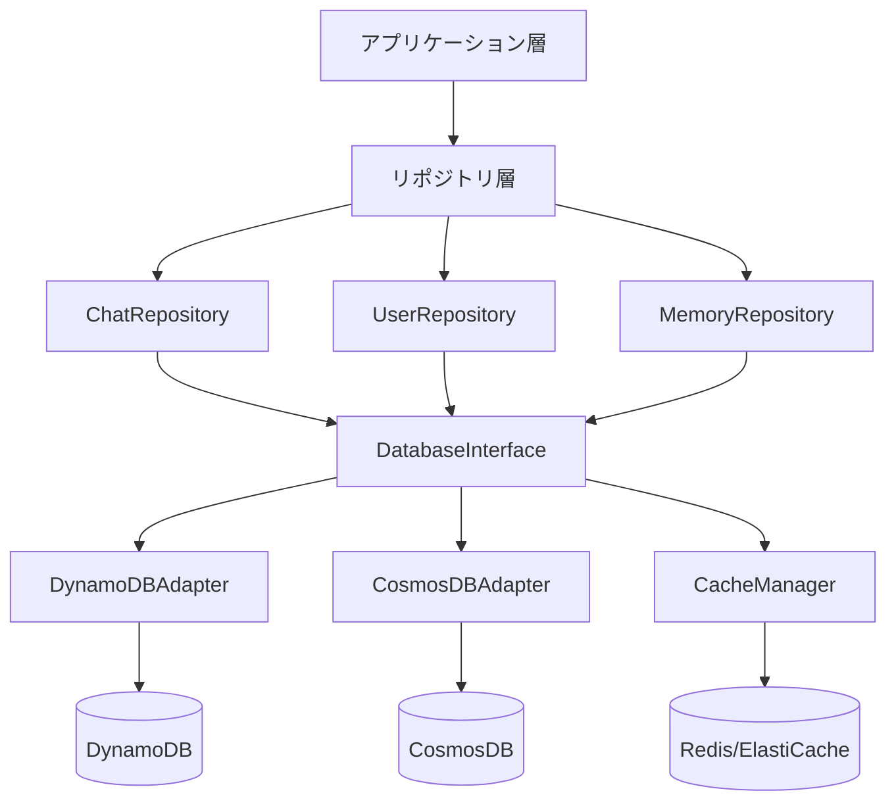

# layers_データベース抽象化設計

## 目次

1. [概要](#概要)
2. [設計原則](#設計原則)
3. [アーキテクチャ](#アーキテクチャ)
4. [インターフェース定義](#インターフェース定義)
5. [実装詳細](#実装詳細)
6. [データモデル](#データモデル)
7. [リポジトリパターン](#リポジトリパターン)
8. [トランザクション管理](#トランザクション管理)
9. [キャッシング戦略](#キャッシング戦略)
10. [マイグレーション](#マイグレーション)
11. [テスト戦略](#テスト戦略)
12. [パフォーマンス最適化](#パフォーマンス最適化)

## 概要

データベース抽象化レイヤーは、MAKOTO Visual AIのマルチクラウド・マルチテナント環境において、異なるデータベースバックエンド（DynamoDB、CosmosDB等）を統一インターフェースで操作可能にする重要なコンポーネントです。

### 主要目的

1. **データベース独立性**: アプリケーションコードをデータベース実装から分離
2. **マルチクラウド対応**: AWS DynamoDBとAzure CosmosDBの透過的な切り替え
3. **テナント分離**: テナントごとのデータ完全分離
4. **パフォーマンス最適化**: 各データベースの特性を活かした最適化
5. **保守性向上**: データアクセスロジックの一元管理

## 設計原則

### SOLID原則の適用

1. **単一責任の原則（SRP）**
   - 各クラスは単一のデータベース操作に責任を持つ
   - リポジトリは特定のエンティティのみを扱う

2. **開放閉鎖の原則（OCP）**
   - 新しいデータベースの追加は拡張で対応
   - 既存コードの変更は不要

3. **リスコフの置換原則（LSP）**
   - すべてのデータベース実装は同じインターフェースを実装
   - 実装の切り替えが透過的

4. **インターフェース分離の原則（ISP）**
   - 用途別に小さなインターフェースを定義
   - クライアントが不要なメソッドに依存しない

5. **依存性逆転の原則（DIP）**
   - 上位モジュールは抽象に依存
   - 具象実装は抽象に依存

## アーキテクチャ

### レイヤー構成



### コンポーネント責務

| コンポーネント | 責務 |
|------------|------|
| DatabaseInterface | データベース操作の抽象インターフェース |
| DynamoDBAdapter | DynamoDB固有の実装 |
| CosmosDBAdapter | CosmosDB固有の実装 |
| Repository | ビジネスロジックを含むデータアクセス |
| CacheManager | キャッシュ戦略の実装 |
| Factory | 適切な実装の選択と生成 |

## インターフェース定義

### 基本インターフェース

```python
from abc import ABC, abstractmethod
from typing import Any, Dict, List, Optional, AsyncIterator
from dataclasses import dataclass

class DatabaseInterface(ABC):
    """データベース操作の基本インターフェース"""
    
    @abstractmethod
    async def get_item(
        self, 
        table_name: str, 
        key: Dict[str, Any],
        consistent_read: bool = False
    ) -> Optional[Dict[str, Any]]:
        """単一アイテムの取得"""
        pass
    
    @abstractmethod
    async def put_item(
        self, 
        table_name: str, 
        item: Dict[str, Any],
        condition_expression: Optional[str] = None
    ) -> None:
        """アイテムの保存"""
        pass
    
    @abstractmethod
    async def update_item(
        self, 
        table_name: str, 
        key: Dict[str, Any],
        update_expression: str,
        expression_values: Dict[str, Any],
        condition_expression: Optional[str] = None
    ) -> Dict[str, Any]:
        """アイテムの更新"""
        pass
    
    @abstractmethod
    async def delete_item(
        self, 
        table_name: str, 
        key: Dict[str, Any],
        condition_expression: Optional[str] = None
    ) -> None:
        """アイテムの削除"""
        pass
    
    @abstractmethod
    async def query(
        self, 
        table_name: str,
        key_condition: str,
        expression_values: Dict[str, Any],
        index_name: Optional[str] = None,
        limit: Optional[int] = None,
        scan_forward: bool = True,
        projection_expression: Optional[str] = None
    ) -> List[Dict[str, Any]]:
        """条件に基づくクエリ"""
        pass
    
    @abstractmethod
    async def scan(
        self, 
        table_name: str,
        filter_expression: Optional[str] = None,
        expression_values: Optional[Dict[str, Any]] = None,
        limit: Optional[int] = None,
        projection_expression: Optional[str] = None
    ) -> List[Dict[str, Any]]:
        """テーブルスキャン"""
        pass
    
    @abstractmethod
    async def batch_write(
        self, 
        table_name: str,
        items: List[Dict[str, Any]]
    ) -> None:
        """バッチ書き込み"""
        pass
    
    @abstractmethod
    async def batch_get(
        self, 
        table_name: str,
        keys: List[Dict[str, Any]]
    ) -> List[Dict[str, Any]]:
        """バッチ読み込み"""
        pass
    
    @abstractmethod
    async def transaction_write(
        self,
        transactions: List[Dict[str, Any]]
    ) -> None:
        """トランザクション書き込み"""
        pass
```

### 拡張インターフェース

```python
class StreamingInterface(ABC):
    """ストリーミング操作インターフェース"""
    
    @abstractmethod
    async def get_stream(
        self,
        table_name: str,
        start_position: Optional[str] = None
    ) -> AsyncIterator[Dict[str, Any]]:
        """変更ストリームの取得"""
        pass

class SearchInterface(ABC):
    """検索操作インターフェース"""
    
    @abstractmethod
    async def text_search(
        self,
        table_name: str,
        search_text: str,
        fields: List[str],
        limit: int = 10
    ) -> List[Dict[str, Any]]:
        """テキスト検索"""
        pass
    
    @abstractmethod
    async def vector_search(
        self,
        table_name: str,
        vector: List[float],
        k: int = 10,
        threshold: float = 0.7
    ) -> List[Dict[str, Any]]:
        """ベクトル類似度検索"""
        pass
```

## 実装詳細

### DynamoDB実装

```python
import boto3
from boto3.dynamodb.conditions import Key, Attr
from botocore.exceptions import ClientError
import asyncio
from typing import Dict, Any, List, Optional

class DynamoDBAdapter(DatabaseInterface):
    """DynamoDB実装"""
    
    def __init__(
        self,
        region: str = 'ap-northeast-1',
        tenant_id: Optional[str] = None,
        credentials: Optional[Dict[str, str]] = None
    ):
        self.tenant_id = tenant_id
        
        # 認証情報に基づいてクライアント作成
        if credentials:
            self.dynamodb = boto3.resource(
                'dynamodb',
                region_name=region,
                aws_access_key_id=credentials['access_key_id'],
                aws_secret_access_key=credentials['secret_access_key'],
                aws_session_token=credentials.get('session_token')
            )
        else:
            self.dynamodb = boto3.resource('dynamodb', region_name=region)
        
        self._table_cache = {}
    
    def _get_table(self, table_name: str):
        """テーブルオブジェクトの取得（キャッシュ付き）"""
        if table_name not in self._table_cache:
            # テナント対応のテーブル名
            actual_table_name = f"{self.tenant_id}-{table_name}" if self.tenant_id else table_name
            self._table_cache[table_name] = self.dynamodb.Table(actual_table_name)
        return self._table_cache[table_name]
    
    async def get_item(
        self, 
        table_name: str, 
        key: Dict[str, Any],
        consistent_read: bool = False
    ) -> Optional[Dict[str, Any]]:
        """DynamoDBからアイテム取得"""
        try:
            table = self._get_table(table_name)
            
            # 非同期実行
            loop = asyncio.get_event_loop()
            response = await loop.run_in_executor(
                None,
                lambda: table.get_item(
                    Key=key,
                    ConsistentRead=consistent_read
                )
            )
            
            return response.get('Item')
            
        except ClientError as e:
            if e.response['Error']['Code'] == 'ResourceNotFoundException':
                return None
            raise
    
    async def put_item(
        self, 
        table_name: str, 
        item: Dict[str, Any],
        condition_expression: Optional[str] = None
    ) -> None:
        """DynamoDBへアイテム保存"""
        table = self._get_table(table_name)
        
        # テナントIDを自動追加
        if self.tenant_id:
            item['tenant_id'] = self.tenant_id
        
        params = {'Item': item}
        if condition_expression:
            params['ConditionExpression'] = condition_expression
        
        loop = asyncio.get_event_loop()
        await loop.run_in_executor(
            None,
            lambda: table.put_item(**params)
        )
    
    async def query(
        self, 
        table_name: str,
        key_condition: str,
        expression_values: Dict[str, Any],
        index_name: Optional[str] = None,
        limit: Optional[int] = None,
        scan_forward: bool = True,
        projection_expression: Optional[str] = None
    ) -> List[Dict[str, Any]]:
        """DynamoDBクエリ実行"""
        table = self._get_table(table_name)
        
        params = {
            'KeyConditionExpression': key_condition,
            'ExpressionAttributeValues': expression_values,
            'ScanIndexForward': scan_forward
        }
        
        if index_name:
            params['IndexName'] = index_name
        if limit:
            params['Limit'] = limit
        if projection_expression:
            params['ProjectionExpression'] = projection_expression
        
        # テナントフィルター追加
        if self.tenant_id:
            params['FilterExpression'] = Attr('tenant_id').eq(self.tenant_id)
        
        loop = asyncio.get_event_loop()
        response = await loop.run_in_executor(
            None,
            lambda: table.query(**params)
        )
        
        return response.get('Items', [])
    
    async def batch_write(
        self, 
        table_name: str,
        items: List[Dict[str, Any]]
    ) -> None:
        """バッチ書き込み（25件ずつ）"""
        table = self._get_table(table_name)
        
        # テナントID追加
        if self.tenant_id:
            for item in items:
                item['tenant_id'] = self.tenant_id
        
        # 25件ずつバッチ処理
        for i in range(0, len(items), 25):
            batch = items[i:i+25]
            
            with table.batch_writer() as batch_writer:
                for item in batch:
                    batch_writer.put_item(Item=item)
    
    async def transaction_write(
        self,
        transactions: List[Dict[str, Any]]
    ) -> None:
        """トランザクション書き込み"""
        client = self.dynamodb.meta.client
        
        # トランザクションアイテム構築
        transact_items = []
        for transaction in transactions:
            if transaction['type'] == 'Put':
                item = transaction['item']
                if self.tenant_id:
                    item['tenant_id'] = self.tenant_id
                
                transact_items.append({
                    'Put': {
                        'TableName': self._get_table_name(transaction['table']),
                        'Item': item
                    }
                })
            elif transaction['type'] == 'Update':
                transact_items.append({
                    'Update': {
                        'TableName': self._get_table_name(transaction['table']),
                        'Key': transaction['key'],
                        'UpdateExpression': transaction['update_expression'],
                        'ExpressionAttributeValues': transaction['expression_values']
                    }
                })
            elif transaction['type'] == 'Delete':
                transact_items.append({
                    'Delete': {
                        'TableName': self._get_table_name(transaction['table']),
                        'Key': transaction['key']
                    }
                })
        
        loop = asyncio.get_event_loop()
        await loop.run_in_executor(
            None,
            lambda: client.transact_write_items(TransactItems=transact_items)
        )
    
    def _get_table_name(self, base_name: str) -> str:
        """実際のテーブル名を取得"""
        return f"{self.tenant_id}-{base_name}" if self.tenant_id else base_name
```

### CosmosDB実装

```python
from azure.cosmos import CosmosClient, exceptions
from azure.identity import ClientSecretCredential
import asyncio
from typing import Dict, Any, List, Optional

class CosmosDBAdapter(DatabaseInterface):
    """CosmosDB実装"""
    
    def __init__(
        self,
        endpoint: str,
        database_name: str,
        tenant_id: Optional[str] = None,
        credentials: Optional[Dict[str, str]] = None
    ):
        self.tenant_id = tenant_id
        self.database_name = database_name
        
        # 認証設定
        if credentials:
            credential = ClientSecretCredential(
                tenant_id=credentials['tenant_id'],
                client_id=credentials['client_id'],
                client_secret=credentials['client_secret']
            )
            self.client = CosmosClient(endpoint, credential=credential)
        else:
            # マネージドIDまたは環境変数から認証
            self.client = CosmosClient.from_connection_string(
                os.environ['COSMOS_CONNECTION_STRING']
            )
        
        self.database = self.client.get_database_client(database_name)
        self._container_cache = {}
    
    def _get_container(self, container_name: str):
        """コンテナオブジェクトの取得"""
        if container_name not in self._container_cache:
            self._container_cache[container_name] = \
                self.database.get_container_client(container_name)
        return self._container_cache[container_name]
    
    async def get_item(
        self, 
        table_name: str, 
        key: Dict[str, Any],
        consistent_read: bool = False
    ) -> Optional[Dict[str, Any]]:
        """CosmosDBからアイテム取得"""
        container = self._get_container(table_name)
        
        try:
            # CosmosDBのキー構造に変換
            item_id = key.get('id') or key.get('PK')
            partition_key = self.tenant_id or key.get('partition_key')
            
            loop = asyncio.get_event_loop()
            item = await loop.run_in_executor(
                None,
                lambda: container.read_item(
                    item=item_id,
                    partition_key=partition_key
                )
            )
            
            return self._convert_from_cosmos(item)
            
        except exceptions.CosmosResourceNotFoundError:
            return None
    
    async def put_item(
        self, 
        table_name: str, 
        item: Dict[str, Any],
        condition_expression: Optional[str] = None
    ) -> None:
        """CosmosDBへアイテム保存"""
        container = self._get_container(table_name)
        
        # CosmosDB形式に変換
        cosmos_item = self._convert_to_cosmos(item)
        
        # テナントIDをパーティションキーとして設定
        if self.tenant_id:
            cosmos_item['tenantId'] = self.tenant_id
        
        loop = asyncio.get_event_loop()
        await loop.run_in_executor(
            None,
            lambda: container.upsert_item(body=cosmos_item)
        )
    
    async def query(
        self, 
        table_name: str,
        key_condition: str,
        expression_values: Dict[str, Any],
        index_name: Optional[str] = None,
        limit: Optional[int] = None,
        scan_forward: bool = True,
        projection_expression: Optional[str] = None
    ) -> List[Dict[str, Any]]:
        """CosmosDBクエリ実行"""
        container = self._get_container(table_name)
        
        # SQLクエリに変換
        query = self._build_sql_query(
            key_condition, 
            expression_values,
            self.tenant_id
        )
        
        # クエリパラメータ
        parameters = self._build_query_parameters(expression_values)
        
        loop = asyncio.get_event_loop()
        items = await loop.run_in_executor(
            None,
            lambda: list(container.query_items(
                query=query,
                parameters=parameters,
                max_item_count=limit,
                enable_cross_partition_query=False
            ))
        )
        
        return [self._convert_from_cosmos(item) for item in items]
    
    def _convert_to_cosmos(self, item: Dict[str, Any]) -> Dict[str, Any]:
        """DynamoDB形式からCosmosDB形式への変換"""
        cosmos_item = item.copy()
        
        # PKとSKをid形式に変換
        if 'PK' in cosmos_item and 'SK' in cosmos_item:
            cosmos_item['id'] = f"{cosmos_item['PK']}#{cosmos_item['SK']}"
            del cosmos_item['PK']
            del cosmos_item['SK']
        
        return cosmos_item
    
    def _convert_from_cosmos(self, item: Dict[str, Any]) -> Dict[str, Any]:
        """CosmosDB形式からDynamoDB形式への変換"""
        dynamo_item = item.copy()
        
        # idをPKとSKに分解
        if 'id' in dynamo_item and '#' in dynamo_item['id']:
            pk, sk = dynamo_item['id'].split('#', 1)
            dynamo_item['PK'] = pk
            dynamo_item['SK'] = sk
        
        # CosmosDB固有フィールドを削除
        cosmos_fields = ['_rid', '_self', '_etag', '_attachments', '_ts']
        for field in cosmos_fields:
            dynamo_item.pop(field, None)
        
        return dynamo_item
    
    def _build_sql_query(
        self,
        key_condition: str,
        expression_values: Dict[str, Any],
        tenant_id: Optional[str]
    ) -> str:
        """DynamoDB式からSQL クエリへの変換"""
        # 簡略化された例
        base_query = "SELECT * FROM c"
        
        conditions = []
        if tenant_id:
            conditions.append(f"c.tenantId = @tenant_id")
        
        # key_conditionの解析と変換
        # 実際の実装では複雑な変換ロジックが必要
        
        if conditions:
            return f"{base_query} WHERE {' AND '.join(conditions)}"
        
        return base_query
```

## データモデル

### 基本データモデル

```python
from dataclasses import dataclass, field
from datetime import datetime
from typing import Optional, List, Dict, Any
from enum import Enum

@dataclass
class BaseModel:
    """基本データモデル"""
    id: str
    tenant_id: str
    created_at: datetime = field(default_factory=datetime.utcnow)
    updated_at: datetime = field(default_factory=datetime.utcnow)
    version: int = 1
    
    def to_dict(self) -> Dict[str, Any]:
        """辞書形式に変換"""
        return {
            'id': self.id,
            'tenant_id': self.tenant_id,
            'created_at': self.created_at.isoformat(),
            'updated_at': self.updated_at.isoformat(),
            'version': self.version
        }
    
    @classmethod
    def from_dict(cls, data: Dict[str, Any]) -> 'BaseModel':
        """辞書から生成"""
        return cls(
            id=data['id'],
            tenant_id=data['tenant_id'],
            created_at=datetime.fromisoformat(data['created_at']),
            updated_at=datetime.fromisoformat(data['updated_at']),
            version=data.get('version', 1)
        )

@dataclass
class Chat(BaseModel):
    """チャットモデル"""
    user_id: str
    title: str
    summary: Optional[str] = None
    messages_count: int = 0
    last_message_at: Optional[datetime] = None
    metadata: Dict[str, Any] = field(default_factory=dict)
    
    def get_pk(self) -> str:
        """パーティションキー取得"""
        return f"CHAT#{self.id}"
    
    def get_sk(self) -> str:
        """ソートキー取得"""
        return "METADATA"

@dataclass
class Message(BaseModel):
    """メッセージモデル"""
    chat_id: str
    user_id: str
    role: str  # user | assistant | system
    content: str
    tokens: Optional[int] = None
    model: Optional[str] = None
    parent_message_id: Optional[str] = None
    
    def get_pk(self) -> str:
        """パーティションキー取得"""
        return f"CHAT#{self.chat_id}"
    
    def get_sk(self) -> str:
        """ソートキー取得"""
        return f"MESSAGE#{self.created_at.isoformat()}#{self.id}"

@dataclass
class User(BaseModel):
    """ユーザーモデル"""
    username: str
    email: str
    display_name: str
    avatar_url: Optional[str] = None
    role: str = "user"  # admin | user | guest
    is_active: bool = True
    last_login_at: Optional[datetime] = None
    preferences: Dict[str, Any] = field(default_factory=dict)
    
    def get_pk(self) -> str:
        """パーティションキー取得"""
        return f"USER#{self.id}"
    
    def get_sk(self) -> str:
        """ソートキー取得"""
        return "PROFILE"
```

## リポジトリパターン

### 基本リポジトリ

```python
from typing import Generic, TypeVar, Type, Optional, List
from abc import ABC, abstractmethod

T = TypeVar('T', bound=BaseModel)

class BaseRepository(ABC, Generic[T]):
    """基本リポジトリクラス"""
    
    def __init__(
        self,
        db_adapter: DatabaseInterface,
        table_name: str,
        model_class: Type[T],
        cache_manager: Optional[CacheManager] = None
    ):
        self.db = db_adapter
        self.table_name = table_name
        self.model_class = model_class
        self.cache = cache_manager
    
    async def get_by_id(self, id: str) -> Optional[T]:
        """IDによる取得"""
        # キャッシュ確認
        if self.cache:
            cached = await self.cache.get(f"{self.table_name}:{id}")
            if cached:
                return self.model_class.from_dict(cached)
        
        # データベースから取得
        item = await self.db.get_item(
            self.table_name,
            self._build_key(id)
        )
        
        if item:
            model = self.model_class.from_dict(item)
            
            # キャッシュ保存
            if self.cache:
                await self.cache.set(
                    f"{self.table_name}:{id}",
                    model.to_dict(),
                    ttl=300  # 5分
                )
            
            return model
        
        return None
    
    async def save(self, model: T) -> T:
        """モデルの保存"""
        # 更新時刻設定
        model.updated_at = datetime.utcnow()
        
        # バージョン管理
        existing = await self.get_by_id(model.id)
        if existing:
            if existing.version != model.version:
                raise ValueError("楽観的ロックエラー: バージョン不一致")
            model.version += 1
        
        # データベース保存
        await self.db.put_item(
            self.table_name,
            model.to_dict()
        )
        
        # キャッシュ無効化
        if self.cache:
            await self.cache.delete(f"{self.table_name}:{model.id}")
        
        return model
    
    async def delete(self, id: str) -> None:
        """削除"""
        await self.db.delete_item(
            self.table_name,
            self._build_key(id)
        )
        
        # キャッシュ無効化
        if self.cache:
            await self.cache.delete(f"{self.table_name}:{id}")
    
    @abstractmethod
    def _build_key(self, id: str) -> Dict[str, Any]:
        """キー構築（サブクラスで実装）"""
        pass

class ChatRepository(BaseRepository[Chat]):
    """チャットリポジトリ"""
    
    def __init__(self, db_adapter: DatabaseInterface, cache_manager: Optional[CacheManager] = None):
        super().__init__(db_adapter, "chats", Chat, cache_manager)
    
    def _build_key(self, id: str) -> Dict[str, Any]:
        """チャット用キー構築"""
        return {
            'PK': f"CHAT#{id}",
            'SK': "METADATA"
        }
    
    async def get_user_chats(
        self, 
        user_id: str, 
        limit: int = 20,
        last_evaluated_key: Optional[str] = None
    ) -> List[Chat]:
        """ユーザーのチャット一覧取得"""
        items = await self.db.query(
            self.table_name,
            "user_id = :user_id",
            {':user_id': user_id},
            index_name="UserIndex",
            limit=limit,
            scan_forward=False  # 新しい順
        )
        
        return [Chat.from_dict(item) for item in items]
    
    async def search_chats(self, search_text: str, limit: int = 10) -> List[Chat]:
        """チャット検索"""
        # 全文検索が必要な場合はElasticsearchなどと連携
        items = await self.db.scan(
            self.table_name,
            "contains(title, :search) OR contains(summary, :search)",
            {':search': search_text},
            limit=limit
        )
        
        return [Chat.from_dict(item) for item in items]

class MessageRepository(BaseRepository[Message]):
    """メッセージリポジトリ"""
    
    def __init__(self, db_adapter: DatabaseInterface, cache_manager: Optional[CacheManager] = None):
        super().__init__(db_adapter, "messages", Message, cache_manager)
    
    def _build_key(self, id: str) -> Dict[str, Any]:
        """メッセージ用キー構築"""
        # idは "chat_id#message_id" 形式
        chat_id, message_id = id.split('#', 1)
        return {
            'PK': f"CHAT#{chat_id}",
            'SK': f"MESSAGE#{message_id}"
        }
    
    async def get_chat_messages(
        self,
        chat_id: str,
        limit: int = 50,
        after_timestamp: Optional[datetime] = None
    ) -> List[Message]:
        """チャットメッセージ取得"""
        key_condition = "PK = :pk AND begins_with(SK, :sk_prefix)"
        expression_values = {
            ':pk': f"CHAT#{chat_id}",
            ':sk_prefix': "MESSAGE#"
        }
        
        if after_timestamp:
            key_condition += " AND SK > :after"
            expression_values[':after'] = f"MESSAGE#{after_timestamp.isoformat()}"
        
        items = await self.db.query(
            self.table_name,
            key_condition,
            expression_values,
            limit=limit,
            scan_forward=True  # 古い順
        )
        
        return [Message.from_dict(item) for item in items]
    
    async def create_message_stream(
        self,
        chat_id: str,
        role: str,
        model: str
    ) -> AsyncIterator[str]:
        """ストリーミングメッセージ作成"""
        message_id = str(uuid.uuid4())
        content_parts = []
        
        # ストリーミング中の一時保存
        async def save_partial():
            partial_content = ''.join(content_parts)
            message = Message(
                id=message_id,
                tenant_id=self.db.tenant_id,
                chat_id=chat_id,
                user_id="system",
                role=role,
                content=partial_content,
                model=model
            )
            await self.save(message)
        
        # 定期的な保存タスク
        save_task = None
        
        try:
            while True:
                chunk = yield
                if chunk is None:
                    break
                
                content_parts.append(chunk)
                
                # 100文字ごとに保存
                if len(''.join(content_parts)) % 100 == 0:
                    if save_task:
                        await save_task
                    save_task = asyncio.create_task(save_partial())
            
            # 最終保存
            if save_task:
                await save_task
            await save_partial()
            
        finally:
            if save_task and not save_task.done():
                await save_task
```

## トランザクション管理

### トランザクションマネージャー

```python
class TransactionManager:
    """トランザクション管理"""
    
    def __init__(self, db_adapter: DatabaseInterface):
        self.db = db_adapter
        self.operations = []
    
    def add_put(self, table_name: str, item: Dict[str, Any]):
        """Put操作追加"""
        self.operations.append({
            'type': 'Put',
            'table': table_name,
            'item': item
        })
    
    def add_update(
        self,
        table_name: str,
        key: Dict[str, Any],
        update_expression: str,
        expression_values: Dict[str, Any]
    ):
        """Update操作追加"""
        self.operations.append({
            'type': 'Update',
            'table': table_name,
            'key': key,
            'update_expression': update_expression,
            'expression_values': expression_values
        })
    
    def add_delete(self, table_name: str, key: Dict[str, Any]):
        """Delete操作追加"""
        self.operations.append({
            'type': 'Delete',
            'table': table_name,
            'key': key
        })
    
    async def commit(self):
        """トランザクションコミット"""
        if not self.operations:
            return
        
        await self.db.transaction_write(self.operations)
        self.operations = []
    
    async def rollback(self):
        """ロールバック（操作をクリア）"""
        self.operations = []

# 使用例
async def transfer_chat_ownership(
    chat_id: str,
    from_user_id: str,
    to_user_id: str,
    db_adapter: DatabaseInterface
):
    """チャット所有権の移譲（トランザクション）"""
    tx = TransactionManager(db_adapter)
    
    try:
        # チャット更新
        tx.add_update(
            'chats',
            {'PK': f"CHAT#{chat_id}", 'SK': "METADATA"},
            "SET user_id = :new_user",
            {':new_user': to_user_id}
        )
        
        # 旧ユーザーのチャットカウント減少
        tx.add_update(
            'users',
            {'PK': f"USER#{from_user_id}", 'SK': "STATS"},
            "ADD chat_count :dec",
            {':dec': -1}
        )
        
        # 新ユーザーのチャットカウント増加
        tx.add_update(
            'users',
            {'PK': f"USER#{to_user_id}", 'SK': "STATS"},
            "ADD chat_count :inc",
            {':inc': 1}
        )
        
        # 監査ログ
        tx.add_put(
            'audit_logs',
            {
                'PK': f"AUDIT#{datetime.utcnow().isoformat()}",
                'SK': f"TRANSFER#{chat_id}",
                'action': 'chat_ownership_transfer',
                'from_user': from_user_id,
                'to_user': to_user_id,
                'chat_id': chat_id,
                'timestamp': datetime.utcnow().isoformat()
            }
        )
        
        # コミット
        await tx.commit()
        
    except Exception as e:
        await tx.rollback()
        raise
```

## キャッシング戦略

### キャッシュマネージャー

```python
import json
import hashlib
from typing import Any, Optional

class CacheManager:
    """キャッシュ管理"""
    
    def __init__(
        self,
        redis_client=None,
        default_ttl: int = 300,
        use_local_cache: bool = True
    ):
        self.redis = redis_client
        self.default_ttl = default_ttl
        self.local_cache = {} if use_local_cache else None
    
    def _get_cache_key(self, key: str, tenant_id: Optional[str] = None) -> str:
        """キャッシュキー生成"""
        if tenant_id:
            return f"{tenant_id}:{key}"
        return key
    
    async def get(self, key: str, tenant_id: Optional[str] = None) -> Optional[Any]:
        """キャッシュ取得"""
        cache_key = self._get_cache_key(key, tenant_id)
        
        # ローカルキャッシュ確認
        if self.local_cache and cache_key in self.local_cache:
            item = self.local_cache[cache_key]
            if item['expires_at'] > datetime.utcnow().timestamp():
                return item['value']
            else:
                del self.local_cache[cache_key]
        
        # Redisキャッシュ確認
        if self.redis:
            value = await self.redis.get(cache_key)
            if value:
                return json.loads(value)
        
        return None
    
    async def set(
        self,
        key: str,
        value: Any,
        ttl: Optional[int] = None,
        tenant_id: Optional[str] = None
    ):
        """キャッシュ保存"""
        cache_key = self._get_cache_key(key, tenant_id)
        ttl = ttl or self.default_ttl
        
        # ローカルキャッシュ保存
        if self.local_cache:
            self.local_cache[cache_key] = {
                'value': value,
                'expires_at': datetime.utcnow().timestamp() + ttl
            }
        
        # Redisキャッシュ保存
        if self.redis:
            await self.redis.setex(
                cache_key,
                ttl,
                json.dumps(value, default=str)
            )
    
    async def delete(self, key: str, tenant_id: Optional[str] = None):
        """キャッシュ削除"""
        cache_key = self._get_cache_key(key, tenant_id)
        
        # ローカルキャッシュ削除
        if self.local_cache and cache_key in self.local_cache:
            del self.local_cache[cache_key]
        
        # Redisキャッシュ削除
        if self.redis:
            await self.redis.delete(cache_key)
    
    async def delete_pattern(self, pattern: str, tenant_id: Optional[str] = None):
        """パターンマッチでキャッシュ削除"""
        cache_pattern = self._get_cache_key(pattern, tenant_id)
        
        # ローカルキャッシュパターン削除
        if self.local_cache:
            keys_to_delete = [
                k for k in self.local_cache.keys()
                if k.startswith(cache_pattern.replace('*', ''))
            ]
            for key in keys_to_delete:
                del self.local_cache[key]
        
        # Redisキャッシュパターン削除
        if self.redis:
            keys = await self.redis.keys(cache_pattern)
            if keys:
                await self.redis.delete(*keys)

class CachedRepository(BaseRepository[T]):
    """キャッシュ対応リポジトリ"""
    
    def __init__(
        self,
        db_adapter: DatabaseInterface,
        table_name: str,
        model_class: Type[T],
        cache_manager: CacheManager,
        cache_ttl: int = 300
    ):
        super().__init__(db_adapter, table_name, model_class, cache_manager)
        self.cache_ttl = cache_ttl
    
    async def get_by_id(self, id: str) -> Optional[T]:
        """キャッシュ付き取得"""
        # キャッシュキー
        cache_key = f"{self.table_name}:{id}"
        
        # キャッシュ確認
        cached = await self.cache.get(cache_key)
        if cached:
            return self.model_class.from_dict(cached)
        
        # DB取得
        model = await super().get_by_id(id)
        
        # キャッシュ保存
        if model:
            await self.cache.set(
                cache_key,
                model.to_dict(),
                ttl=self.cache_ttl
            )
        
        return model
    
    async def invalidate_cache(self, id: str):
        """キャッシュ無効化"""
        cache_key = f"{self.table_name}:{id}"
        await self.cache.delete(cache_key)
```

## マイグレーション

### スキーママイグレーション

```python
class MigrationManager:
    """マイグレーション管理"""
    
    def __init__(self, db_adapter: DatabaseInterface):
        self.db = db_adapter
        self.migrations_table = "schema_migrations"
    
    async def run_migrations(self):
        """マイグレーション実行"""
        # 実行済みマイグレーション取得
        executed = await self._get_executed_migrations()
        
        # 未実行マイグレーション取得
        pending = self._get_pending_migrations(executed)
        
        for migration in pending:
            await self._execute_migration(migration)
    
    async def _get_executed_migrations(self) -> Set[str]:
        """実行済みマイグレーション取得"""
        items = await self.db.scan(self.migrations_table)
        return {item['migration_id'] for item in items}
    
    def _get_pending_migrations(self, executed: Set[str]) -> List[Migration]:
        """未実行マイグレーション取得"""
        all_migrations = [
            Migration001_CreateBaseTables(),
            Migration002_AddIndexes(),
            Migration003_AddVectorFields(),
        ]
        
        return [
            m for m in all_migrations
            if m.id not in executed
        ]
    
    async def _execute_migration(self, migration: Migration):
        """マイグレーション実行"""
        try:
            await migration.up(self.db)
            
            # 実行記録
            await self.db.put_item(
                self.migrations_table,
                {
                    'migration_id': migration.id,
                    'executed_at': datetime.utcnow().isoformat()
                }
            )
        except Exception as e:
            # ロールバック
            await migration.down(self.db)
            raise
```

## テスト戦略

### モックアダプター

```python
class MockDatabaseAdapter(DatabaseInterface):
    """テスト用モックアダプター"""
    
    def __init__(self):
        self.data = {}
    
    async def get_item(
        self, 
        table_name: str, 
        key: Dict[str, Any],
        consistent_read: bool = False
    ) -> Optional[Dict[str, Any]]:
        """モック取得"""
        table = self.data.get(table_name, {})
        key_str = json.dumps(key, sort_keys=True)
        return table.get(key_str)
    
    async def put_item(
        self, 
        table_name: str, 
        item: Dict[str, Any],
        condition_expression: Optional[str] = None
    ) -> None:
        """モック保存"""
        if table_name not in self.data:
            self.data[table_name] = {}
        
        # キー抽出
        key = {'PK': item.get('PK'), 'SK': item.get('SK')}
        key_str = json.dumps(key, sort_keys=True)
        
        self.data[table_name][key_str] = item

# テスト例
import pytest

@pytest.mark.asyncio
async def test_chat_repository():
    """チャットリポジトリのテスト"""
    # モックアダプター
    db = MockDatabaseAdapter()
    repo = ChatRepository(db)
    
    # チャット作成
    chat = Chat(
        id="test-chat-1",
        tenant_id="tenant-1",
        user_id="user-1",
        title="テストチャット"
    )
    
    # 保存
    saved_chat = await repo.save(chat)
    assert saved_chat.version == 1
    
    # 取得
    loaded_chat = await repo.get_by_id("test-chat-1")
    assert loaded_chat is not None
    assert loaded_chat.title == "テストチャット"
    
    # 更新
    loaded_chat.title = "更新されたチャット"
    updated_chat = await repo.save(loaded_chat)
    assert updated_chat.version == 2
    
    # 削除
    await repo.delete("test-chat-1")
    deleted_chat = await repo.get_by_id("test-chat-1")
    assert deleted_chat is None
```

## パフォーマンス最適化

### 最適化戦略

1. **接続プーリング**
   ```python
   class ConnectionPool:
       """接続プール管理"""
       def __init__(self, max_connections: int = 20):
           self.pool = asyncio.Queue(maxsize=max_connections)
           self.semaphore = asyncio.Semaphore(max_connections)
   ```

2. **バッチ処理**
   ```python
   async def batch_save_messages(messages: List[Message]):
       """メッセージのバッチ保存"""
       # 25件ずつバッチ処理（DynamoDB制限）
       for batch in chunks(messages, 25):
           await db.batch_write('messages', [m.to_dict() for m in batch])
   ```

3. **並列クエリ**
   ```python
   async def parallel_queries():
       """並列クエリ実行"""
       tasks = [
           repo.get_user_chats(user_id),
           repo.get_recent_messages(chat_id),
           repo.get_user_stats(user_id)
       ]
       results = await asyncio.gather(*tasks)
   ```

4. **インデックス最適化**
   ```yaml
   GSI設計:
     UserIndex:
       PartitionKey: user_id
       SortKey: created_at
       Projection: ALL
     
     TimestampIndex:
       PartitionKey: tenant_id
       SortKey: created_at
       Projection: KEYS_ONLY
   ```

5. **クエリ最適化**
   ```python
   # 効率的なクエリ
   async def get_recent_chats(tenant_id: str, days: int = 7):
       """最近のチャット取得（インデックス使用）"""
       cutoff = datetime.utcnow() - timedelta(days=days)
       
       return await db.query(
           'chats',
           'tenant_id = :tenant AND created_at > :cutoff',
           {':tenant': tenant_id, ':cutoff': cutoff.isoformat()},
           index_name='TimestampIndex'
       )
   ```

## まとめ

このデータベース抽象化設計により：

1. **マルチクラウド対応**: DynamoDBとCosmosDBを透過的に切り替え
2. **テナント分離**: データの完全な分離を保証
3. **パフォーマンス**: キャッシュとバッチ処理で高速化
4. **保守性**: リポジトリパターンでビジネスロジックを整理
5. **テスタビリティ**: モックアダプターで容易なテスト
6. **拡張性**: 新しいデータベースの追加が容易

---

**作成者**: Claude  
**作成日**: 2025年8月7日  
**バージョン**: 1.0.0