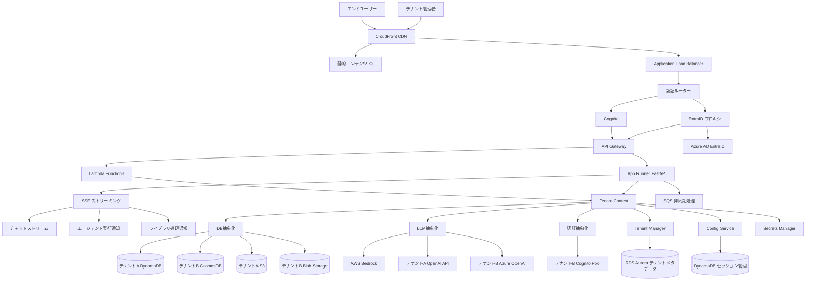

# layers_マルチテナント実装ガイド

## 目次

1. [概要](#概要)
2. [混合アーキテクチャ設計](#混合アーキテクチャ設計)
3. [テナント分離戦略](#テナント分離戦略)
4. [動的認証統合](#動的認証統合)
5. [リソース接続管理](#リソース接続管理)
6. [実装詳細](#実装詳細)
7. [テナント運用管理](#テナント運用管理)
8. [セキュリティ実装](#セキュリティ実装)
9. [パフォーマンス最適化](#パフォーマンス最適化)
10. [トラブルシューティング](#トラブルシューティング)

## 概要

MAKOTO Visual AIは、SaaS基盤をAWSで運用し、各テナント（顧客）が自身のクラウド環境（AWS/Azure）にデータベースやLLMサービスを保有する混合型マルチテナントアーキテクチャを採用しています。本ガイドでは、共通基盤と個別リソースを組み合わせた実装方法を詳細に説明します。

### アーキテクチャ特徴

- **共通基盤**: 認証・処理・管理をSaaS基盤で提供
- **個別リソース**: DB・LLM・ストレージは顧客のサブスクリプション
- **動的切り替え**: EntraIDとCognito認証の自動判別
- **抽象化**: 統一APIによるマルチクラウド対応

## 混合アーキテクチャ設計

### アーキテクチャ全体図



### 設計原則

1. **分離の原則**: 共通機能と個別リソースの明確な分離
2. **抽象化**: 統一インターフェースによるマルチクラウド対応
3. **セキュリティファースト**: ゼロトラスト・最小権限
4. **拡張性**: 新しいクラウドプロバイダーの容易な追加
5. **運用効率**: 自動化された管理とモニタリング

## テナント分離戦略

### 分離レベル

```python
from enum import Enum
from typing import Dict, Any

class IsolationLevel(Enum):
    """分離レベル"""
    SHARED_EVERYTHING = "shared_everything"      # 全て共有（開発・テスト用）
    SHARED_PLATFORM = "shared_platform"         # プラットフォーム共有、データ分離
    ISOLATED_RESOURCES = "isolated_resources"    # リソース完全分離
    DEDICATED_INSTANCE = "dedicated_instance"    # 専用インスタンス

@dataclass
class TenantIsolationConfig:
    """テナント分離設定"""
    isolation_level: IsolationLevel
    
    # 共通基盤での分離設定
    shared_cognito: bool = True
    shared_api_gateway: bool = True
    shared_lambda_runtime: bool = True
    
    # テナント個別リソース
    dedicated_database: bool = True
    dedicated_storage: bool = True
    dedicated_llm: bool = True
    
    # 認証設定
    auth_provider: str  # "cognito" | "entraid" | "mixed"
    sso_enabled: bool = False
    mfa_required: bool = False
```

### データ分離パターン

```yaml
データ分離戦略:
  共通データ (SaaS基盤):
    テナント設定: RDS Aurora (暗号化)
    セッション管理: DynamoDB Global Tables
    監査ログ: CloudWatch Logs
    
  テナント個別データ:
    ユーザーデータ: テナント提供DB
    チャットログ: テナント提供DB
    ファイル: テナント提供ストレージ
    
  分離方式:
    物理分離: 
      - 異なるAWSアカウント
      - 異なるAzureサブスクリプション
    論理分離:
      - テーブル名プレフィックス
      - パーティションキー
      - 名前空間
```

## 動的認証統合

### 認証プロバイダー判定

```python
from typing import Optional, Union
from dataclasses import dataclass
import jwt
import asyncio

@dataclass
class AuthenticationContext:
    """認証コンテキスト"""
    tenant_id: str
    provider: str  # "cognito" | "entraid"
    user_id: str
    username: str
    email: Optional[str] = None
    groups: List[str] = field(default_factory=list)
    claims: Dict[str, Any] = field(default_factory=dict)

class DynamicAuthenticator:
    """動的認証システム"""
    
    def __init__(self):
        self.cognito_verifier = CognitoJWTVerifier()
        self.entraid_verifier = EntraIDJWTVerifier()
        self.tenant_manager = TenantManager()
    
    async def authenticate(self, token: str, tenant_id: Optional[str] = None) -> AuthenticationContext:
        """
        トークンから認証情報を取得
        
        Args:
            token: JWTトークン
            tenant_id: テナントID（オプション、ヘッダーから取得可能）
        
        Returns:
            AuthenticationContext: 認証コンテキスト
        """
        # JWTトークンのヘッダーを確認してissuerを特定
        try:
            unverified_header = jwt.get_unverified_header(token)
            unverified_payload = jwt.decode(token, options={"verify_signature": False})
            
            issuer = unverified_payload.get('iss', '')
            
            # issuerからプロバイダーを判定
            if 'cognito-idp' in issuer:
                return await self._authenticate_cognito(token, tenant_id)
            elif 'login.microsoftonline.com' in issuer or 'sts.windows.net' in issuer:
                return await self._authenticate_entraid(token, tenant_id)
            else:
                raise ValueError(f"未対応のissuer: {issuer}")
                
        except Exception as e:
            raise ValueError(f"トークン解析エラー: {str(e)}")
    
    async def _authenticate_cognito(self, token: str, tenant_id: Optional[str]) -> AuthenticationContext:
        """Cognito認証処理"""
        # Cognitoトークン検証
        claims = await self.cognito_verifier.verify(token)
        
        # テナントIDの取得
        if not tenant_id:
            tenant_id = claims.get('custom:tenant_id')
        
        if not tenant_id:
            raise ValueError("テナントIDが特定できません")
        
        # テナント設定確認
        tenant_config = await self.tenant_manager.get_tenant_config(tenant_id)
        if not tenant_config or tenant_config.auth_provider != "cognito":
            raise ValueError("テナント認証設定が不正です")
        
        return AuthenticationContext(
            tenant_id=tenant_id,
            provider="cognito",
            user_id=claims['sub'],
            username=claims.get('cognito:username'),
            email=claims.get('email'),
            groups=claims.get('cognito:groups', []),
            claims=claims
        )
    
    async def _authenticate_entraid(self, token: str, tenant_id: Optional[str]) -> AuthenticationContext:
        """EntraID認証処理"""
        # EntraIDトークン検証
        claims = await self.entraid_verifier.verify(token)
        
        # テナントIDの取得（EntraIDテナントIDから逆引き）
        if not tenant_id:
            entraid_tenant = claims.get('tid')
            tenant_id = await self.tenant_manager.get_tenant_by_entraid(entraid_tenant)
        
        if not tenant_id:
            raise ValueError("テナントIDが特定できません")
        
        # テナント設定確認
        tenant_config = await self.tenant_manager.get_tenant_config(tenant_id)
        if not tenant_config or tenant_config.auth_provider != "entraid":
            raise ValueError("テナント認証設定が不正です")
        
        return AuthenticationContext(
            tenant_id=tenant_id,
            provider="entraid",
            user_id=claims['sub'],
            username=claims.get('preferred_username'),
            email=claims.get('email'),
            groups=claims.get('groups', []),
            claims=claims
        )

class CognitoJWTVerifier:
    """Cognito JWT検証"""
    
    def __init__(self):
        self.jwks_cache = {}
        self.cache_ttl = 3600  # 1時間
    
    async def verify(self, token: str) -> Dict[str, Any]:
        """JWTトークンの検証"""
        unverified_payload = jwt.decode(token, options={"verify_signature": False})
        user_pool_id = self._extract_user_pool_id(unverified_payload['iss'])
        
        # JWKSの取得
        jwks = await self._get_jwks(user_pool_id)
        
        # 署名検証
        public_key = self._get_public_key(token, jwks)
        
        # トークン検証
        payload = jwt.decode(
            token,
            public_key,
            algorithms=['RS256'],
            options={"verify_exp": True, "verify_aud": True}
        )
        
        return payload

class EntraIDJWTVerifier:
    """EntraID JWT検証"""
    
    def __init__(self):
        self.jwks_cache = {}
    
    async def verify(self, token: str) -> Dict[str, Any]:
        """EntraID JWTトークンの検証"""
        unverified_payload = jwt.decode(token, options={"verify_signature": False})
        tenant_id = unverified_payload.get('tid')
        
        # Microsoft のJWKSエンドポイント
        jwks_url = f"https://login.microsoftonline.com/{tenant_id}/discovery/v2.0/keys"
        
        # JWKSの取得と検証
        jwks = await self._get_jwks(jwks_url)
        public_key = self._get_public_key(token, jwks)
        
        # トークン検証
        payload = jwt.decode(
            token,
            public_key,
            algorithms=['RS256'],
            options={"verify_exp": True, "verify_aud": True}
        )
        
        return payload
```

### API Gateway統合

```python
class TenantAwareAuthorizer:
    """テナント対応Lambda Authorizer"""
    
    async def lambda_handler(self, event: Dict[str, Any], context: Any) -> Dict[str, Any]:
        """
        API Gateway Lambda Authorizerハンドラー
        """
        try:
            # トークン取得
            token = self._extract_token(event)
            if not token:
                raise ValueError("認証トークンが見つかりません")
            
            # テナントID取得（ホスト名から）
            tenant_id = self._extract_tenant_id(event)
            
            # 動的認証
            authenticator = DynamicAuthenticator()
            auth_context = await authenticator.authenticate(token, tenant_id)
            
            # 認可ポリシー生成
            policy = self._generate_policy(
                auth_context.user_id,
                'Allow',
                event['methodArn'],
                auth_context
            )
            
            return policy
            
        except Exception as e:
            # 認証失敗
            return self._generate_policy(
                'unauthorized',
                'Deny',
                event['methodArn']
            )
    
    def _generate_policy(self, principal_id: str, effect: str, resource: str, 
                        auth_context: Optional[AuthenticationContext] = None) -> Dict[str, Any]:
        """IAMポリシー生成"""
        policy = {
            'principalId': principal_id,
            'policyDocument': {
                'Version': '2012-10-17',
                'Statement': [{
                    'Action': 'execute-api:Invoke',
                    'Effect': effect,
                    'Resource': resource
                }]
            }
        }
        
        # コンテキスト情報を追加
        if auth_context:
            policy['context'] = {
                'tenant_id': auth_context.tenant_id,
                'provider': auth_context.provider,
                'username': auth_context.username or '',
                'email': auth_context.email or '',
                'groups': json.dumps(auth_context.groups)
            }
        
        return policy
```

## リソース接続管理

### 接続ファクトリー

```python
from abc import ABC, abstractmethod
from typing import Type, Dict, Any
import boto3
from azure.identity import ClientSecretCredential
from azure.cosmos import CosmosClient

class ResourceConnectionFactory:
    """リソース接続ファクトリー"""
    
    def __init__(self):
        self.connection_cache = {}
        self.secrets_manager = boto3.client('secretsmanager')
    
    async def create_database_connection(self, tenant_context: TenantContext) -> DatabaseInterface:
        """データベース接続の作成"""
        config = tenant_context.config
        cache_key = f"db_{tenant_context.tenant_id}"
        
        # キャッシュチェック
        if cache_key in self.connection_cache:
            return self.connection_cache[cache_key]
        
        # プロバイダー別接続作成
        if config.database.database_type == "dynamodb":
            connection = await self._create_dynamodb_connection(config)
        elif config.database.database_type == "cosmosdb":
            connection = await self._create_cosmosdb_connection(config)
        else:
            raise ValueError(f"未対応のデータベースタイプ: {config.database.database_type}")
        
        # キャッシュ保存
        self.connection_cache[cache_key] = connection
        return connection
    
    async def _create_dynamodb_connection(self, config: TenantConfig) -> DynamoDBInterface:
        """DynamoDB接続の作成"""
        # クロスアカウントRole情報を取得
        secret_name = f"tenant/{config.tenant_id}/aws-connection"
        secret = await self._get_secret(secret_name)
        
        # AssumeRole実行
        sts_client = boto3.client('sts')
        assumed_role = sts_client.assume_role(
            RoleArn=secret['role_arn'],
            RoleSessionName=f'makoto-{config.tenant_id}',
            ExternalId=secret['external_id'],
            DurationSeconds=3600
        )
        
        credentials = assumed_role['Credentials']
        
        # DynamoDBクライアント作成
        dynamodb = boto3.resource(
            'dynamodb',
            region_name=secret.get('region', 'ap-northeast-1'),
            aws_access_key_id=credentials['AccessKeyId'],
            aws_secret_access_key=credentials['SecretAccessKey'],
            aws_session_token=credentials['SessionToken']
        )
        
        return DynamoDBInterface(
            dynamodb=dynamodb,
            table_prefix=config.database.table_prefix,
            tenant_id=config.tenant_id
        )
    
    async def _create_cosmosdb_connection(self, config: TenantConfig) -> CosmosDBInterface:
        """CosmosDB接続の作成"""
        # Azure認証情報を取得
        secret_name = f"tenant/{config.tenant_id}/azure-connection"
        secret = await self._get_secret(secret_name)
        
        # Service Principal認証
        credential = ClientSecretCredential(
            tenant_id=secret['tenant_id'],
            client_id=secret['client_id'],
            client_secret=secret['client_secret']
        )
        
        # CosmosDBクライアント作成
        cosmos_client = CosmosClient(
            url=secret['cosmos_endpoint'],
            credential=credential
        )
        
        return CosmosDBInterface(
            cosmos_client=cosmos_client,
            database_name=secret['database_name'],
            tenant_id=config.tenant_id
        )
    
    async def create_llm_connection(self, tenant_context: TenantContext) -> LLMInterface:
        """LLM接続の作成"""
        config = tenant_context.config
        cache_key = f"llm_{tenant_context.tenant_id}"
        
        if cache_key in self.connection_cache:
            return self.connection_cache[cache_key]
        
        # LLM設定取得
        secret_name = f"tenant/{config.tenant_id}/llm-connection"
        secret = await self._get_secret(secret_name)
        
        provider = secret['provider']
        
        if provider == "azure_openai":
            connection = await self._create_azure_openai_connection(secret)
        elif provider == "openai":
            connection = await self._create_openai_connection(secret)
        else:
            raise ValueError(f"未対応のLLMプロバイダー: {provider}")
        
        self.connection_cache[cache_key] = connection
        return connection
    
    async def _get_secret(self, secret_name: str) -> Dict[str, Any]:
        """Secrets Managerからシークレット取得"""
        response = self.secrets_manager.get_secret_value(SecretId=secret_name)
        return json.loads(response['SecretString'])
```

### 統一データベースインターフェース

```python
class DatabaseInterface(ABC):
    """データベース統一インターフェース"""
    
    @abstractmethod
    async def get_item(self, table_name: str, key: Dict[str, Any]) -> Optional[Dict[str, Any]]:
        """アイテム取得"""
        pass
    
    @abstractmethod
    async def put_item(self, table_name: str, item: Dict[str, Any]) -> None:
        """アイテム保存"""
        pass
    
    @abstractmethod
    async def delete_item(self, table_name: str, key: Dict[str, Any]) -> None:
        """アイテム削除"""
        pass
    
    @abstractmethod
    async def query(self, table_name: str, **kwargs) -> List[Dict[str, Any]]:
        """クエリ実行"""
        pass
    
    @abstractmethod
    async def scan(self, table_name: str, **kwargs) -> List[Dict[str, Any]]:
        """スキャン実行"""
        pass

class DynamoDBInterface(DatabaseInterface):
    """DynamoDB実装"""
    
    def __init__(self, dynamodb, table_prefix: str, tenant_id: str):
        self.dynamodb = dynamodb
        self.table_prefix = table_prefix
        self.tenant_id = tenant_id
    
    def _get_table_name(self, base_name: str) -> str:
        """テナント対応テーブル名生成"""
        return f"{self.table_prefix}{self.tenant_id}-{base_name}"
    
    async def get_item(self, table_name: str, key: Dict[str, Any]) -> Optional[Dict[str, Any]]:
        """DynamoDBアイテム取得"""
        table = self.dynamodb.Table(self._get_table_name(table_name))
        
        response = table.get_item(Key=key)
        return response.get('Item')
    
    async def put_item(self, table_name: str, item: Dict[str, Any]) -> None:
        """DynamoDBアイテム保存"""
        table = self.dynamodb.Table(self._get_table_name(table_name))
        
        # テナントIDを自動追加
        item['tenant_id'] = self.tenant_id
        table.put_item(Item=item)
    
    async def query(self, table_name: str, **kwargs) -> List[Dict[str, Any]]:
        """DynamoDBクエリ"""
        table = self.dynamodb.Table(self._get_table_name(table_name))
        
        # テナントフィルターを追加
        if 'FilterExpression' in kwargs:
            kwargs['FilterExpression'] = kwargs['FilterExpression'] & Attr('tenant_id').eq(self.tenant_id)
        else:
            kwargs['FilterExpression'] = Attr('tenant_id').eq(self.tenant_id)
        
        response = table.query(**kwargs)
        return response.get('Items', [])

class CosmosDBInterface(DatabaseInterface):
    """CosmosDB実装"""
    
    def __init__(self, cosmos_client: CosmosClient, database_name: str, tenant_id: str):
        self.cosmos_client = cosmos_client
        self.database_name = database_name
        self.tenant_id = tenant_id
        self.database = cosmos_client.get_database_client(database_name)
    
    def _get_container_name(self, table_name: str) -> str:
        """コンテナ名生成"""
        return table_name.lower()
    
    async def get_item(self, table_name: str, key: Dict[str, Any]) -> Optional[Dict[str, Any]]:
        """CosmosDBアイテム取得"""
        container = self.database.get_container_client(self._get_container_name(table_name))
        
        try:
            item = container.read_item(
                item=key['id'],
                partition_key=self.tenant_id
            )
            return item
        except exceptions.CosmosResourceNotFoundError:
            return None
    
    async def put_item(self, table_name: str, item: Dict[str, Any]) -> None:
        """CosmosDBアイテム保存"""
        container = self.database.get_container_client(self._get_container_name(table_name))
        
        # テナントIDとパーティションキーを設定
        item['tenantId'] = self.tenant_id
        container.create_item(body=item)
    
    async def query(self, table_name: str, **kwargs) -> List[Dict[str, Any]]:
        """CosmosDBクエリ"""
        container = self.database.get_container_client(self._get_container_name(table_name))
        
        # SQLクエリ構築
        query = kwargs.get('query', 'SELECT * FROM c')
        parameters = kwargs.get('parameters', [])
        
        # テナントフィルター追加
        if 'WHERE' not in query.upper():
            query += ' WHERE c.tenantId = @tenant_id'
        else:
            query += ' AND c.tenantId = @tenant_id'
        
        parameters.append({'name': '@tenant_id', 'value': self.tenant_id})
        
        items = []
        for item in container.query_items(
            query=query,
            parameters=parameters,
            enable_cross_partition_query=False
        ):
            items.append(item)
        
        return items
```

## 実装詳細

### テナントコンテキスト拡張

```python
from makoto_common.tenant.models import TenantContext as BaseTenantContext

@dataclass
class ExtendedTenantContext(BaseTenantContext):
    """拡張テナントコンテキスト"""
    
    # 認証プロバイダー情報
    auth_provider: str = "cognito"  # "cognito" | "entraid"
    auth_context: Optional[AuthenticationContext] = None
    
    # リソース接続情報
    database_connection: Optional[DatabaseInterface] = None
    llm_connection: Optional[LLMInterface] = None
    storage_connection: Optional[StorageInterface] = None
    
    # セキュリティコンテキスト
    security_context: Dict[str, Any] = field(default_factory=dict)
    
    # パフォーマンス最適化
    connection_pool: Optional[ConnectionPool] = None
    cache_enabled: bool = True
    
    def get_database_connection(self) -> DatabaseInterface:
        """データベース接続取得"""
        if not self.database_connection:
            raise RuntimeError("データベース接続が初期化されていません")
        return self.database_connection
    
    def get_llm_connection(self) -> LLMInterface:
        """LLM接続取得"""
        if not self.llm_connection:
            raise RuntimeError("LLM接続が初期化されていません")
        return self.llm_connection
    
    async def initialize_connections(self):
        """接続の初期化"""
        factory = ResourceConnectionFactory()
        
        # データベース接続
        self.database_connection = await factory.create_database_connection(self)
        
        # LLM接続
        self.llm_connection = await factory.create_llm_connection(self)
        
        # ストレージ接続
        self.storage_connection = await factory.create_storage_connection(self)
    
    def get_table_name(self, base_name: str) -> str:
        """テーブル名の生成"""
        if self.config.database.partition_strategy == "isolated":
            return f"{self.config.database.table_prefix}{self.tenant_id}-{base_name}"
        else:
            return f"{self.config.database.table_prefix}{base_name}"
```

### デコレーター拡張

```python
def multi_tenant_handler(
    require_auth: bool = True,
    initialize_connections: bool = True,
    cache_enabled: bool = True,
    timeout: int = 30
):
    """
    マルチテナント対応Lambda関数デコレーター
    
    Args:
        require_auth: 認証を必須とするか
        initialize_connections: リソース接続を自動初期化するか
        cache_enabled: キャッシュを有効にするか
        timeout: タイムアウト時間（秒）
    """
    def decorator(func: Callable) -> Callable:
        @functools.wraps(func)
        async def wrapper(event: Dict[str, Any], context: Any) -> Dict[str, Any]:
            start_time = time.time()
            tenant_context = None
            
            try:
                # タイムアウト設定
                if timeout and timeout <= 20:  # 最大20秒制限
                    context.deadline_ms = int((start_time + timeout) * 1000)
                
                # テナントコンテキスト抽出
                tenant_manager = TenantManager()
                
                if require_auth:
                    # 動的認証
                    authenticator = DynamicAuthenticator()
                    token = extract_token(event)
                    auth_context = await authenticator.authenticate(token)
                    
                    # テナント設定取得
                    config = await tenant_manager.get_tenant_config(auth_context.tenant_id)
                    if not config or not config.is_active():
                        return error_response(403, "テナントが無効です")
                    
                    tenant_context = ExtendedTenantContext(
                        tenant_id=auth_context.tenant_id,
                        config=config,
                        auth_provider=auth_context.provider,
                        auth_context=auth_context,
                        user_id=auth_context.user_id,
                        username=auth_context.username,
                        cache_enabled=cache_enabled
                    )
                else:
                    # 認証なし（WebSocketなど）
                    tenant_context = await extract_tenant_context(event, tenant_manager)
                
                # リソース接続初期化
                if initialize_connections:
                    await tenant_context.initialize_connections()
                
                # 使用量チェック
                if not tenant_context.check_limit('api_calls'):
                    return error_response(429, "API使用量制限に達しました")
                
                # メイン処理実行
                if require_auth:
                    result = await func(event, context, tenant_context, tenant_context.auth_context)
                else:
                    result = await func(event, context, tenant_context)
                
                # 使用量更新
                tenant_context.increment_usage('api_calls')
                
                # レスポンス時間をヘッダーに追加
                processing_time = time.time() - start_time
                if isinstance(result, dict) and 'headers' not in result:
                    result['headers'] = {}
                result['headers']['X-Processing-Time'] = f"{processing_time:.3f}s"
                
                return result
                
            except asyncio.TimeoutError:
                return error_response(504, "処理がタイムアウトしました")
            except Exception as e:
                logger.error(f"Handler error: {str(e)}", exc_info=True)
                return error_response(500, "内部サーバーエラー")
            finally:
                # 接続のクリーンアップ
                if tenant_context and hasattr(tenant_context, 'cleanup'):
                    await tenant_context.cleanup()
        
        return wrapper
    return decorator

def extract_token(event: Dict[str, Any]) -> str:
    """イベントからJWTトークンを抽出"""
    headers = event.get('headers', {})
    auth_header = headers.get('Authorization', '')
    
    if auth_header.startswith('Bearer '):
        return auth_header[7:]
    
    # Cookie認証の場合
    cookies = headers.get('Cookie', '')
    if 'access_token=' in cookies:
        for cookie in cookies.split(';'):
            if cookie.strip().startswith('access_token='):
                return cookie.split('=', 1)[1]
    
    raise ValueError("認証トークンが見つかりません")

def error_response(status_code: int, message: str) -> Dict[str, Any]:
    """エラーレスポンス生成"""
    return {
        'statusCode': status_code,
        'headers': {
            'Content-Type': 'application/json',
            'Access-Control-Allow-Origin': '*'
        },
        'body': json.dumps({
            'error': message,
            'timestamp': datetime.utcnow().isoformat()
        }, ensure_ascii=False)
    }
```

### リポジトリパターン実装

```python
class TenantAwareRepository(ABC):
    """テナント対応リポジトリ基底クラス"""
    
    def __init__(self, tenant_context: ExtendedTenantContext):
        self.tenant_context = tenant_context
        self.db = tenant_context.get_database_connection()
    
    @abstractmethod
    def get_table_name(self) -> str:
        """テーブル名取得"""
        pass
    
    async def get_by_id(self, id: str) -> Optional[Dict[str, Any]]:
        """IDによる取得"""
        return await self.db.get_item(
            self.get_table_name(),
            self._build_key(id)
        )
    
    async def save(self, item: Dict[str, Any]) -> None:
        """アイテム保存"""
        # 共通フィールドを追加
        item['tenant_id'] = self.tenant_context.tenant_id
        item['updated_at'] = datetime.utcnow().isoformat()
        
        if 'created_at' not in item:
            item['created_at'] = item['updated_at']
        
        await self.db.put_item(self.get_table_name(), item)
    
    @abstractmethod
    def _build_key(self, id: str) -> Dict[str, Any]:
        """キー構築"""
        pass

class ChatRepository(TenantAwareRepository):
    """チャットリポジトリ"""
    
    def get_table_name(self) -> str:
        return self.tenant_context.get_table_name('chats')
    
    def _build_key(self, id: str) -> Dict[str, Any]:
        if self.tenant_context.config.database.database_type == "dynamodb":
            return {
                'PK': f"CHAT#{id}",
                'SK': "METADATA"
            }
        else:  # CosmosDB
            return {'id': id}
    
    async def get_user_chats(self, user_id: str) -> List[Dict[str, Any]]:
        """ユーザーのチャット一覧取得"""
        if self.tenant_context.config.database.database_type == "dynamodb":
            return await self.db.query(
                self.get_table_name(),
                IndexName='UserIndex',
                KeyConditionExpression=Key('user_id').eq(user_id)
            )
        else:  # CosmosDB
            return await self.db.query(
                self.get_table_name(),
                query='SELECT * FROM c WHERE c.user_id = @user_id ORDER BY c.created_at DESC',
                parameters=[{'name': '@user_id', 'value': user_id}]
            )
    
    async def create_chat(self, chat_data: Dict[str, Any]) -> str:
        """新規チャット作成"""
        chat_id = str(uuid.uuid4())
        
        chat_item = {
            'id': chat_id,
            'PK': f"CHAT#{chat_id}",
            'SK': "METADATA",
            **chat_data
        }
        
        await self.save(chat_item)
        return chat_id

class MessageRepository(TenantAwareRepository):
    """メッセージリポジトリ"""
    
    def get_table_name(self) -> str:
        return self.tenant_context.get_table_name('messages')
    
    def _build_key(self, id: str) -> Dict[str, Any]:
        if self.tenant_context.config.database.database_type == "dynamodb":
            # メッセージIDからチャットIDを抽出（フォーマット: chatid_messageid）
            chat_id, message_id = id.split('_', 1)
            return {
                'PK': f"CHAT#{chat_id}",
                'SK': f"MESSAGE#{message_id}"
            }
        else:
            return {'id': id}
    
    async def get_chat_messages(self, chat_id: str, limit: int = 50) -> List[Dict[str, Any]]:
        """チャットメッセージ取得"""
        if self.tenant_context.config.database.database_type == "dynamodb":
            return await self.db.query(
                self.get_table_name(),
                KeyConditionExpression=Key('PK').eq(f"CHAT#{chat_id}") & Key('SK').begins_with('MESSAGE#'),
                ScanIndexForward=False,  # 降順
                Limit=limit
            )
        else:
            return await self.db.query(
                self.get_table_name(),
                query='''
                    SELECT * FROM c 
                    WHERE c.chat_id = @chat_id 
                    ORDER BY c.created_at DESC 
                    OFFSET 0 LIMIT @limit
                ''',
                parameters=[
                    {'name': '@chat_id', 'value': chat_id},
                    {'name': '@limit', 'value': limit}
                ]
            )
```

## テナント運用管理

### オンボーディングフロー

```python
class TenantOnboardingService:
    """テナントオンボーディングサービス"""
    
    def __init__(self):
        self.tenant_manager = TenantManager()
        self.secrets_manager = boto3.client('secretsmanager')
        self.cognito_client = boto3.client('cognito-idp')
    
    async def create_tenant(self, request: TenantCreationRequest) -> TenantCreationResult:
        """新規テナント作成"""
        try:
            # 1. テナント設定作成
            tenant_config = await self._create_tenant_config(request)
            
            # 2. 認証設定
            auth_config = await self._setup_authentication(request, tenant_config)
            
            # 3. リソース接続設定
            await self._setup_resource_connections(request, tenant_config)
            
            # 4. 初期データ投入
            await self._initialize_tenant_data(tenant_config)
            
            # 5. 接続テスト
            test_result = await self._run_connection_tests(tenant_config)
            
            if not test_result.all_passed:
                raise ValueError(f"接続テストに失敗しました: {test_result.errors}")
            
            # 6. テナント有効化
            await self.tenant_manager.activate_tenant(tenant_config.tenant_id)
            
            return TenantCreationResult(
                tenant_id=tenant_config.tenant_id,
                status="active",
                auth_config=auth_config,
                connection_tests=test_result
            )
            
        except Exception as e:
            # ロールバック処理
            await self._rollback_tenant_creation(request.tenant_id)
            raise
    
    async def _create_tenant_config(self, request: TenantCreationRequest) -> TenantConfig:
        """テナント設定作成"""
        # ティア別制限設定
        limits = TenantLimits.for_tier(TenantTier(request.tier))
        
        # データベース設定
        database_config = TenantDatabase(
            database_type=request.database_type,
            table_prefix=f"makoto-{request.tenant_id}-",
            partition_strategy="isolated" if request.isolated_resources else "shared",
            connection_config=request.database_connection_config
        )
        
        # テナント設定
        config = TenantConfig(
            tenant_id=request.tenant_id,
            tenant_name=request.organization_name,
            domain=request.domain,
            cognito_user_pool_id="",  # 後で設定
            cognito_client_id="",     # 後で設定
            database=database_config,
            tier=TenantTier(request.tier),
            limits=limits,
            status=TenantStatus.TRIAL,
            features=request.features,
            metadata={
                'auth_provider': request.auth_provider,
                'cloud_provider': request.cloud_provider,
                'contact_email': request.contact_email,
                'setup_date': datetime.utcnow().isoformat()
            }
        )
        
        # データベースに保存
        await self.tenant_manager.create_tenant(
            tenant_id=config.tenant_id,
            tenant_name=config.tenant_name,
            domain=config.domain,
            cognito_user_pool_id="temp",
            cognito_client_id="temp",
            tier=config.tier,
            database_type=config.database.database_type
        )
        
        return config
    
    async def _setup_authentication(self, request: TenantCreationRequest, 
                                  config: TenantConfig) -> Dict[str, Any]:
        """認証設定"""
        if request.auth_provider == "cognito":
            return await self._setup_cognito_auth(request, config)
        elif request.auth_provider == "entraid":
            return await self._setup_entraid_auth(request, config)
        else:
            raise ValueError(f"未対応の認証プロバイダー: {request.auth_provider}")
    
    async def _setup_cognito_auth(self, request: TenantCreationRequest, 
                                config: TenantConfig) -> Dict[str, Any]:
        """Cognito認証設定"""
        # User Pool作成
        user_pool_response = self.cognito_client.create_user_pool(
            PoolName=f"makoto-{config.tenant_id}",
            Policies={
                'PasswordPolicy': {
                    'MinimumLength': 8,
                    'RequireUppercase': True,
                    'RequireLowercase': True,
                    'RequireNumbers': True,
                    'RequireSymbols': True
                }
            },
            Schema=[
                {
                    'Name': 'email',
                    'AttributeDataType': 'String',
                    'Required': True
                },
                {
                    'Name': 'tenant_id',
                    'AttributeDataType': 'String',
                    'Mutable': False
                }
            ],
            AutoVerifiedAttributes=['email']
        )
        
        user_pool_id = user_pool_response['UserPool']['Id']
        
        # App Client作成
        app_client_response = self.cognito_client.create_user_pool_client(
            UserPoolId=user_pool_id,
            ClientName=f"makoto-{config.tenant_id}-client",
            GenerateSecret=False,
            ExplicitAuthFlows=[
                'ADMIN_NO_SRP_AUTH',
                'USER_PASSWORD_AUTH',
                'USER_SRP_AUTH'
            ]
        )
        
        client_id = app_client_response['UserPoolClient']['ClientId']
        
        # テナント設定更新
        await self.tenant_manager.update_tenant(config.tenant_id, {
            'cognito_user_pool_id': user_pool_id,
            'cognito_client_id': client_id
        })
        
        return {
            'type': 'cognito',
            'user_pool_id': user_pool_id,
            'client_id': client_id
        }
    
    async def _setup_entraid_auth(self, request: TenantCreationRequest, 
                                config: TenantConfig) -> Dict[str, Any]:
        """EntraID認証設定"""
        # EntraIDテナント情報をSecrets Managerに保存
        secret_name = f"tenant/{config.tenant_id}/entraid-config"
        secret_value = {
            'tenant_id': request.entraid_tenant_id,
            'client_id': request.entraid_client_id,
            'client_secret': request.entraid_client_secret,
            'domain': request.entraid_domain
        }
        
        self.secrets_manager.create_secret(
            Name=secret_name,
            SecretString=json.dumps(secret_value),
            Description=f'EntraID configuration for tenant {config.tenant_id}'
        )
        
        return {
            'type': 'entraid',
            'tenant_id': request.entraid_tenant_id,
            'domain': request.entraid_domain
        }
    
    async def _setup_resource_connections(self, request: TenantCreationRequest, 
                                        config: TenantConfig) -> None:
        """リソース接続設定"""
        if request.cloud_provider == "aws":
            await self._setup_aws_connections(request, config)
        elif request.cloud_provider == "azure":
            await self._setup_azure_connections(request, config)
    
    async def _setup_aws_connections(self, request: TenantCreationRequest, 
                                   config: TenantConfig) -> None:
        """AWS接続設定"""
        secret_name = f"tenant/{config.tenant_id}/aws-connection"
        secret_value = {
            'account_id': request.aws_account_id,
            'role_arn': request.aws_role_arn,
            'external_id': request.aws_external_id,
            'region': request.aws_region,
            'dynamodb_table_name': request.dynamodb_table_name,
            's3_bucket_name': request.s3_bucket_name
        }
        
        self.secrets_manager.create_secret(
            Name=secret_name,
            SecretString=json.dumps(secret_value)
        )
    
    async def _run_connection_tests(self, config: TenantConfig) -> ConnectionTestResult:
        """接続テスト実行"""
        tester = ConnectionTester()
        return await tester.test_tenant_connection(config.tenant_id)

@dataclass
class TenantCreationRequest:
    """テナント作成リクエスト"""
    tenant_id: str
    organization_name: str
    domain: str
    contact_email: str
    
    # 認証設定
    auth_provider: str  # "cognito" | "entraid"
    entraid_tenant_id: Optional[str] = None
    entraid_client_id: Optional[str] = None
    entraid_client_secret: Optional[str] = None
    entraid_domain: Optional[str] = None
    
    # クラウド設定
    cloud_provider: str  # "aws" | "azure"
    
    # AWS設定
    aws_account_id: Optional[str] = None
    aws_role_arn: Optional[str] = None
    aws_external_id: Optional[str] = None
    aws_region: str = "ap-northeast-1"
    dynamodb_table_name: Optional[str] = None
    s3_bucket_name: Optional[str] = None
    
    # Azure設定
    azure_subscription_id: Optional[str] = None
    azure_tenant_id: Optional[str] = None
    azure_client_id: Optional[str] = None
    azure_client_secret: Optional[str] = None
    cosmosdb_endpoint: Optional[str] = None
    storage_account_name: Optional[str] = None
    
    # サービス設定
    tier: str = "free"
    database_type: str = "dynamodb"
    isolated_resources: bool = False
    features: Dict[str, bool] = field(default_factory=dict)
    database_connection_config: Dict[str, Any] = field(default_factory=dict)
```

### 課金・ティア管理

```python
class TenantBillingService:
    """テナント課金サービス"""
    
    def __init__(self):
        self.cloudwatch = boto3.client('cloudwatch')
        self.tenant_manager = TenantManager()
    
    async def calculate_usage_metrics(self, tenant_id: str, 
                                    start_date: datetime, end_date: datetime) -> UsageMetrics:
        """使用量メトリクス計算"""
        
        # CloudWatchからメトリクス取得
        metrics = {}
        
        # API呼び出し数
        api_calls = await self._get_metric(
            namespace='MAKOTO/Usage',
            metric_name='APICallCount',
            dimensions=[{'Name': 'TenantId', 'Value': tenant_id}],
            start_time=start_date,
            end_time=end_date,
            statistic='Sum'
        )
        
        # ストレージ使用量
        storage_usage = await self._get_metric(
            namespace='MAKOTO/Usage',
            metric_name='StorageUsage',
            dimensions=[{'Name': 'TenantId', 'Value': tenant_id}],
            start_time=start_date,
            end_time=end_date,
            statistic='Average'
        )
        
        # LLMトークン使用量
        llm_tokens = await self._get_metric(
            namespace='MAKOTO/Usage',
            metric_name='LLMTokenCount',
            dimensions=[{'Name': 'TenantId', 'Value': tenant_id}],
            start_time=start_date,
            end_time=end_date,
            statistic='Sum'
        )
        
        return UsageMetrics(
            tenant_id=tenant_id,
            period_start=start_date,
            period_end=end_date,
            api_calls=api_calls,
            storage_gb=storage_usage,
            llm_tokens=llm_tokens
        )
    
    async def check_tier_limits(self, tenant_id: str) -> TierLimitStatus:
        """ティア制限チェック"""
        tenant_config = await self.tenant_manager.get_tenant_config(tenant_id)
        if not tenant_config:
            raise ValueError(f"テナントが見つかりません: {tenant_id}")
        
        # 今月の使用量取得
        now = datetime.utcnow()
        month_start = now.replace(day=1, hour=0, minute=0, second=0, microsecond=0)
        usage = await self.calculate_usage_metrics(tenant_id, month_start, now)
        
        # 制限チェック
        limits = tenant_config.limits
        status = TierLimitStatus(tenant_id=tenant_id)
        
        # API呼び出し制限
        if usage.api_calls >= limits.max_api_calls_per_hour * 24 * 30:  # 月間上限
            status.api_limit_exceeded = True
        
        # ストレージ制限
        if usage.storage_gb >= limits.max_storage_gb:
            status.storage_limit_exceeded = True
        
        # 総合判定
        status.within_limits = not (status.api_limit_exceeded or status.storage_limit_exceeded)
        
        return status
    
    async def upgrade_tenant_tier(self, tenant_id: str, new_tier: TenantTier) -> bool:
        """テナントティアアップグレード"""
        try:
            # 新しい制限設定
            new_limits = TenantLimits.for_tier(new_tier)
            
            # テナント設定更新
            await self.tenant_manager.update_tenant(tenant_id, {
                'tier': new_tier,
                'limits': new_limits.to_dict(),
                'metadata': {
                    'tier_upgraded_at': datetime.utcnow().isoformat(),
                    'previous_tier': await self._get_current_tier(tenant_id)
                }
            })
            
            # 課金システムに通知（外部サービス連携）
            await self._notify_billing_system(tenant_id, new_tier)
            
            return True
        except Exception as e:
            logger.error(f"ティアアップグレード失敗: {str(e)}")
            return False

@dataclass
class UsageMetrics:
    """使用量メトリクス"""
    tenant_id: str
    period_start: datetime
    period_end: datetime
    api_calls: int
    storage_gb: float
    llm_tokens: int
    
    def calculate_cost(self, tier: TenantTier) -> float:
        """コスト計算"""
        cost = 0.0
        
        # ティア別料金設定
        if tier == TenantTier.FREE:
            return 0.0  # 無料プラン
        elif tier == TenantTier.STANDARD:
            base_cost = 1000  # 基本料金（円）
            cost += base_cost
            # 超過料金
            if self.api_calls > 10000:
                cost += (self.api_calls - 10000) * 0.01
        elif tier == TenantTier.PROFESSIONAL:
            base_cost = 5000
            cost += base_cost
            if self.api_calls > 50000:
                cost += (self.api_calls - 50000) * 0.008
        elif tier == TenantTier.ENTERPRISE:
            cost = 50000  # 固定料金
        
        return cost
```

## セキュリティ実装

### ゼロトラストアーキテクチャ

```python
class ZeroTrustSecurityManager:
    """ゼロトラストセキュリティマネージャー"""
    
    def __init__(self):
        self.waf_client = boto3.client('wafv2')
        self.guardduty_client = boto3.client('guardduty')
    
    async def evaluate_request_risk(self, event: Dict[str, Any], 
                                  tenant_context: ExtendedTenantContext) -> SecurityRiskScore:
        """リクエストリスク評価"""
        
        risk_factors = []
        risk_score = 0
        
        # 1. IP アドレス評価
        source_ip = self._extract_source_ip(event)
        ip_risk = await self._evaluate_ip_risk(source_ip)
        risk_factors.append(ip_risk)
        risk_score += ip_risk.score
        
        # 2. 地理的位置評価
        geo_risk = await self._evaluate_geographic_risk(source_ip, tenant_context)
        risk_factors.append(geo_risk)
        risk_score += geo_risk.score
        
        # 3. デバイス・ブラウザ評価
        user_agent = event.get('headers', {}).get('User-Agent', '')
        device_risk = await self._evaluate_device_risk(user_agent, tenant_context)
        risk_factors.append(device_risk)
        risk_score += device_risk.score
        
        # 4. 行動パターン評価
        behavior_risk = await self._evaluate_behavior_risk(tenant_context)
        risk_factors.append(behavior_risk)
        risk_score += behavior_risk.score
        
        # 5. 認証強度評価
        auth_risk = self._evaluate_auth_strength(tenant_context.auth_context)
        risk_factors.append(auth_risk)
        risk_score += auth_risk.score
        
        return SecurityRiskScore(
            total_score=risk_score,
            risk_level=self._calculate_risk_level(risk_score),
            factors=risk_factors,
            recommended_actions=self._get_recommended_actions(risk_score)
        )
    
    async def _evaluate_ip_risk(self, ip_address: str) -> RiskFactor:
        """IP アドレスリスク評価"""
        risk_score = 0
        details = []
        
        # IP 脅威インテリジェンス確認
        threat_intel = await self._check_threat_intelligence(ip_address)
        if threat_intel.is_malicious:
            risk_score += 50
            details.append(f"悪意のあるIPアドレス: {threat_intel.category}")
        
        # 地理的位置確認
        geo_info = await self._get_geo_location(ip_address)
        if geo_info.country in ['CN', 'RU', 'KP']:  # 高リスク国
            risk_score += 20
            details.append(f"高リスク地域からのアクセス: {geo_info.country}")
        
        # VPN・Proxy 検出
        if await self._is_vpn_or_proxy(ip_address):
            risk_score += 15
            details.append("VPN/Proxy経由のアクセス")
        
        return RiskFactor(
            name="IP Address",
            score=risk_score,
            details=details
        )
    
    async def _evaluate_behavior_risk(self, tenant_context: ExtendedTenantContext) -> RiskFactor:
        """行動パターンリスク評価"""
        risk_score = 0
        details = []
        
        user_id = tenant_context.user_id
        if not user_id:
            return RiskFactor(name="Behavior", score=0, details=[])
        
        # 過去30分のアクセス頻度確認
        recent_access_count = await self._get_recent_access_count(user_id, minutes=30)
        if recent_access_count > 100:
            risk_score += 30
            details.append(f"短期間での大量アクセス: {recent_access_count}回")
        
        # 異常な時間帯のアクセス
        current_hour = datetime.utcnow().hour
        if current_hour < 6 or current_hour > 22:  # 深夜早朝
            risk_score += 10
            details.append("異常な時間帯のアクセス")
        
        # 通常と異なるアクセスパターン
        normal_pattern = await self._get_user_normal_pattern(user_id)
        if self._is_abnormal_pattern(tenant_context, normal_pattern):
            risk_score += 20
            details.append("通常と異なるアクセスパターン")
        
        return RiskFactor(
            name="Behavior",
            score=risk_score,
            details=details
        )
    
    def _evaluate_auth_strength(self, auth_context: Optional[AuthenticationContext]) -> RiskFactor:
        """認証強度評価"""
        risk_score = 0
        details = []
        
        if not auth_context:
            return RiskFactor(name="Authentication", score=100, details=["認証なし"])
        
        # MFA確認
        if not self._has_mfa(auth_context):
            risk_score += 25
            details.append("MFA未使用")
        
        # トークン有効期限確認
        token_age = self._get_token_age(auth_context)
        if token_age > 3600:  # 1時間以上
            risk_score += 15
            details.append(f"古いトークン: {token_age}秒")
        
        # 認証強度
        if auth_context.provider == "entraid":
            risk_score -= 10  # EntraID は一般的により安全
        
        return RiskFactor(
            name="Authentication",
            score=max(0, risk_score),
            details=details
        )

class DataEncryptionManager:
    """データ暗号化管理"""
    
    def __init__(self):
        self.kms_client = boto3.client('kms')
    
    async def encrypt_sensitive_data(self, data: Dict[str, Any], 
                                   tenant_id: str) -> Dict[str, Any]:
        """機密データの暗号化"""
        # テナント専用KMSキー取得
        kms_key_id = await self._get_tenant_kms_key(tenant_id)
        
        encrypted_data = {}
        for key, value in data.items():
            if self._is_sensitive_field(key):
                # 暗号化が必要なフィールド
                encrypted_value = await self._encrypt_field(str(value), kms_key_id)
                encrypted_data[f"{key}_encrypted"] = encrypted_value
                encrypted_data[f"{key}_is_encrypted"] = True
            else:
                encrypted_data[key] = value
        
        return encrypted_data
    
    async def decrypt_sensitive_data(self, data: Dict[str, Any], 
                                   tenant_id: str) -> Dict[str, Any]:
        """機密データの復号化"""
        decrypted_data = {}
        
        for key, value in data.items():
            if key.endswith('_encrypted') and data.get(f"{key[:-10]}_is_encrypted"):
                # 暗号化されたフィールドの復号化
                original_key = key[:-10]
                decrypted_value = await self._decrypt_field(value)
                decrypted_data[original_key] = decrypted_value
            elif not key.endswith('_is_encrypted'):
                decrypted_data[key] = value
        
        return decrypted_data
    
    def _is_sensitive_field(self, field_name: str) -> bool:
        """機密フィールドかどうかの判定"""
        sensitive_fields = [
            'email', 'phone', 'address', 'credit_card',
            'ssn', 'passport', 'api_key', 'password',
            'personal_id', 'bank_account'
        ]
        return any(sensitive in field_name.lower() for sensitive in sensitive_fields)
```

## パフォーマンス最適化

### 接続プール管理

```python
class TenantConnectionPool:
    """テナント接続プール"""
    
    def __init__(self, max_connections: int = 20):
        self.max_connections = max_connections
        self.pools: Dict[str, asyncio.Queue] = {}
        self.connection_count: Dict[str, int] = {}
        self.lock = asyncio.Lock()
    
    async def get_connection(self, tenant_id: str) -> DatabaseInterface:
        """接続の取得"""
        async with self.lock:
            pool_key = f"db_{tenant_id}"
            
            if pool_key not in self.pools:
                self.pools[pool_key] = asyncio.Queue(maxsize=self.max_connections)
                self.connection_count[pool_key] = 0
            
            pool = self.pools[pool_key]
            
            # プールから接続を取得
            if not pool.empty():
                return await pool.get()
            
            # 新しい接続を作成（制限内の場合）
            if self.connection_count[pool_key] < self.max_connections:
                connection = await self._create_connection(tenant_id)
                self.connection_count[pool_key] += 1
                return connection
            
            # プールが満杯の場合は待機
            return await pool.get()
    
    async def return_connection(self, tenant_id: str, connection: DatabaseInterface):
        """接続の返却"""
        pool_key = f"db_{tenant_id}"
        
        if pool_key in self.pools:
            pool = self.pools[pool_key]
            if not pool.full():
                await pool.put(connection)
            else:
                # プールが満杯の場合は接続を閉じる
                await self._close_connection(connection)
                self.connection_count[pool_key] -= 1

class CacheManager:
    """キャッシュマネージャー"""
    
    def __init__(self):
        self.redis_client = None  # Redis接続（オプション）
        self.local_cache = {}
        self.cache_ttl = 300  # 5分
    
    async def get(self, key: str, tenant_id: str) -> Optional[Any]:
        """キャッシュから取得"""
        cache_key = f"{tenant_id}:{key}"
        
        # Redis キャッシュ確認
        if self.redis_client:
            cached_value = await self.redis_client.get(cache_key)
            if cached_value:
                return json.loads(cached_value)
        
        # ローカルキャッシュ確認
        if cache_key in self.local_cache:
            cached_item = self.local_cache[cache_key]
            if cached_item['expires_at'] > time.time():
                return cached_item['value']
            else:
                del self.local_cache[cache_key]
        
        return None
    
    async def set(self, key: str, value: Any, tenant_id: str, ttl: Optional[int] = None):
        """キャッシュに保存"""
        cache_key = f"{tenant_id}:{key}"
        ttl = ttl or self.cache_ttl
        
        # Redis キャッシュに保存
        if self.redis_client:
            await self.redis_client.setex(
                cache_key, 
                ttl, 
                json.dumps(value, default=str)
            )
        
        # ローカルキャッシュに保存
        self.local_cache[cache_key] = {
            'value': value,
            'expires_at': time.time() + ttl
        }
    
    async def invalidate(self, pattern: str, tenant_id: str):
        """キャッシュの無効化"""
        cache_pattern = f"{tenant_id}:{pattern}"
        
        # Redis パターン削除
        if self.redis_client:
            keys = await self.redis_client.keys(cache_pattern)
            if keys:
                await self.redis_client.delete(*keys)
        
        # ローカルキャッシュパターン削除
        keys_to_delete = [
            k for k in self.local_cache.keys() 
            if k.startswith(cache_pattern.replace('*', ''))
        ]
        for key in keys_to_delete:
            del self.local_cache[key]
```

### 非同期処理最適化

```python
class AsyncTaskManager:
    """非同期タスク管理"""
    
    def __init__(self, max_concurrent_tasks: int = 10):
        self.semaphore = asyncio.Semaphore(max_concurrent_tasks)
        self.task_queue = asyncio.Queue()
        self.workers = []
        self.running = False
    
    async def start_workers(self):
        """ワーカー開始"""
        self.running = True
        for i in range(5):  # 5つのワーカーを起動
            worker = asyncio.create_task(self._worker(f"worker-{i}"))
            self.workers.append(worker)
    
    async def stop_workers(self):
        """ワーカー停止"""
        self.running = False
        for worker in self.workers:
            worker.cancel()
        await asyncio.gather(*self.workers, return_exceptions=True)
    
    async def submit_task(self, task_func: Callable, *args, **kwargs) -> str:
        """タスク投入"""
        task_id = str(uuid.uuid4())
        task = {
            'id': task_id,
            'func': task_func,
            'args': args,
            'kwargs': kwargs,
            'submitted_at': time.time()
        }
        
        await self.task_queue.put(task)
        return task_id
    
    async def _worker(self, worker_name: str):
        """ワーカープロセス"""
        while self.running:
            try:
                # タスク取得（タイムアウト付き）
                task = await asyncio.wait_for(
                    self.task_queue.get(), 
                    timeout=1.0
                )
                
                # セマフォで同時実行数制限
                async with self.semaphore:
                    await self._execute_task(task, worker_name)
                
            except asyncio.TimeoutError:
                continue
            except Exception as e:
                logger.error(f"Worker {worker_name} error: {str(e)}")
    
    async def _execute_task(self, task: Dict[str, Any], worker_name: str):
        """タスク実行"""
        try:
            start_time = time.time()
            
            # タスク実行
            result = await task['func'](*task['args'], **task['kwargs'])
            
            execution_time = time.time() - start_time
            logger.info(
                f"Task {task['id']} completed by {worker_name} "
                f"in {execution_time:.3f}s"
            )
            
        except Exception as e:
            logger.error(f"Task {task['id']} failed: {str(e)}")

# バックグラウンドタスクの例
async def background_chat_processing(tenant_context: ExtendedTenantContext, 
                                   chat_id: str, message: str):
    """バックグラウンドチャット処理"""
    try:
        # LLM呼び出し（時間がかかる処理）
        llm_connection = tenant_context.get_llm_connection()
        response = await llm_connection.generate_response(message)
        
        # レスポンス保存
        chat_repo = ChatRepository(tenant_context)
        await chat_repo.save_response(chat_id, response)
        
        # リアルタイム通知
        await notify_user(tenant_context.user_id, {
            'type': 'chat_response',
            'chat_id': chat_id,
            'response': response
        })
        
    except Exception as e:
        logger.error(f"Background chat processing failed: {str(e)}")
        # エラー通知
        await notify_user(tenant_context.user_id, {
            'type': 'chat_error',
            'chat_id': chat_id,
            'error': str(e)
        })
```

## トラブルシューティング

### 診断ツール

```python
class TenantDiagnostics:
    """テナント診断ツール"""
    
    def __init__(self):
        self.tenant_manager = TenantManager()
        self.connection_factory = ResourceConnectionFactory()
    
    async def run_comprehensive_diagnosis(self, tenant_id: str) -> DiagnosisReport:
        """包括的診断実行"""
        report = DiagnosisReport(tenant_id=tenant_id)
        
        try:
            # 1. テナント設定確認
            report.tenant_config = await self._diagnose_tenant_config(tenant_id)
            
            # 2. 認証システム確認
            report.auth_diagnosis = await self._diagnose_authentication(tenant_id)
            
            # 3. データベース接続確認
            report.database_diagnosis = await self._diagnose_database(tenant_id)
            
            # 4. LLM接続確認
            report.llm_diagnosis = await self._diagnose_llm(tenant_id)
            
            # 5. ネットワーク確認
            report.network_diagnosis = await self._diagnose_network(tenant_id)
            
            # 6. パフォーマンス確認
            report.performance_diagnosis = await self._diagnose_performance(tenant_id)
            
            # 総合判定
            report.overall_health = self._calculate_overall_health(report)
            
        except Exception as e:
            report.error = str(e)
            report.overall_health = "error"
        
        return report
    
    async def _diagnose_tenant_config(self, tenant_id: str) -> ConfigDiagnosis:
        """テナント設定診断"""
        diagnosis = ConfigDiagnosis()
        
        try:
            config = await self.tenant_manager.get_tenant_config(tenant_id)
            
            if not config:
                diagnosis.status = "error"
                diagnosis.issues.append("テナント設定が見つかりません")
                return diagnosis
            
            # 設定値検証
            if not config.is_active():
                diagnosis.issues.append(f"テナントが非アクティブ: {config.status}")
            
            if config.expires_at and config.expires_at < datetime.utcnow():
                diagnosis.issues.append("テナントの有効期限が切れています")
            
            if not config.cognito_user_pool_id:
                diagnosis.issues.append("Cognito User Pool IDが設定されていません")
            
            diagnosis.status = "warning" if diagnosis.issues else "healthy"
            diagnosis.config = config
            
        except Exception as e:
            diagnosis.status = "error"
            diagnosis.error = str(e)
        
        return diagnosis
    
    async def _diagnose_database(self, tenant_id: str) -> DatabaseDiagnosis:
        """データベース診断"""
        diagnosis = DatabaseDiagnosis()
        
        try:
            # テナントコンテキスト作成
            config = await self.tenant_manager.get_tenant_config(tenant_id)
            tenant_context = ExtendedTenantContext(
                tenant_id=tenant_id,
                config=config
            )
            
            # 接続テスト
            connection = await self.connection_factory.create_database_connection(tenant_context)
            
            # 読み取りテスト
            start_time = time.time()
            test_result = await connection.get_item('chats', {'PK': 'TEST', 'SK': 'TEST'})
            read_time = time.time() - start_time
            
            # 書き込みテスト
            start_time = time.time()
            await connection.put_item('chats', {
                'PK': 'HEALTH_CHECK',
                'SK': 'HEALTH_CHECK',
                'timestamp': datetime.utcnow().isoformat(),
                'tenant_id': tenant_id
            })
            write_time = time.time() - start_time
            
            diagnosis.status = "healthy"
            diagnosis.read_latency = read_time
            diagnosis.write_latency = write_time
            
            # パフォーマンス警告
            if read_time > 1.0:
                diagnosis.issues.append(f"読み取り性能が低下: {read_time:.3f}s")
            if write_time > 2.0:
                diagnosis.issues.append(f"書き込み性能が低下: {write_time:.3f}s")
            
        except Exception as e:
            diagnosis.status = "error"
            diagnosis.error = str(e)
        
        return diagnosis
    
    async def _diagnose_performance(self, tenant_id: str) -> PerformanceDiagnosis:
        """パフォーマンス診断"""
        diagnosis = PerformanceDiagnosis()
        
        try:
            # CloudWatchメトリクス取得
            cloudwatch = boto3.client('cloudwatch')
            
            # 過去1時間のAPIレイテンシー
            end_time = datetime.utcnow()
            start_time = end_time - timedelta(hours=1)
            
            latency_metrics = cloudwatch.get_metric_statistics(
                Namespace='AWS/ApiGateway',
                MetricName='Latency',
                Dimensions=[
                    {'Name': 'TenantId', 'Value': tenant_id}
                ],
                StartTime=start_time,
                EndTime=end_time,
                Period=300,
                Statistics=['Average', 'Maximum']
            )
            
            if latency_metrics['Datapoints']:
                avg_latency = sum(d['Average'] for d in latency_metrics['Datapoints']) / len(latency_metrics['Datapoints'])
                max_latency = max(d['Maximum'] for d in latency_metrics['Datapoints'])
                
                diagnosis.avg_api_latency = avg_latency
                diagnosis.max_api_latency = max_latency
                
                if avg_latency > 1000:  # 1秒以上
                    diagnosis.issues.append(f"平均API応答時間が長い: {avg_latency}ms")
                
                if max_latency > 5000:  # 5秒以上
                    diagnosis.issues.append(f"最大API応答時間が長い: {max_latency}ms")
            
            diagnosis.status = "warning" if diagnosis.issues else "healthy"
            
        except Exception as e:
            diagnosis.status = "error"
            diagnosis.error = str(e)
        
        return diagnosis

@dataclass
class DiagnosisReport:
    """診断レポート"""
    tenant_id: str
    timestamp: datetime = field(default_factory=datetime.utcnow)
    overall_health: str = "unknown"
    
    tenant_config: Optional[ConfigDiagnosis] = None
    auth_diagnosis: Optional[AuthDiagnosis] = None
    database_diagnosis: Optional[DatabaseDiagnosis] = None
    llm_diagnosis: Optional[LLMDiagnosis] = None
    network_diagnosis: Optional[NetworkDiagnosis] = None
    performance_diagnosis: Optional[PerformanceDiagnosis] = None
    
    error: Optional[str] = None
    
    def to_dict(self) -> Dict[str, Any]:
        """辞書形式に変換"""
        return {
            'tenant_id': self.tenant_id,
            'timestamp': self.timestamp.isoformat(),
            'overall_health': self.overall_health,
            'tenant_config': asdict(self.tenant_config) if self.tenant_config else None,
            'auth_diagnosis': asdict(self.auth_diagnosis) if self.auth_diagnosis else None,
            'database_diagnosis': asdict(self.database_diagnosis) if self.database_diagnosis else None,
            'llm_diagnosis': asdict(self.llm_diagnosis) if self.llm_diagnosis else None,
            'network_diagnosis': asdict(self.network_diagnosis) if self.network_diagnosis else None,
            'performance_diagnosis': asdict(self.performance_diagnosis) if self.performance_diagnosis else None,
            'error': self.error
        }

# 使用例
async def diagnose_tenant_handler(event, context):
    """テナント診断Lambda関数"""
    tenant_id = event['pathParameters']['tenant_id']
    
    diagnostics = TenantDiagnostics()
    report = await diagnostics.run_comprehensive_diagnosis(tenant_id)
    
    return {
        'statusCode': 200,
        'headers': {
            'Content-Type': 'application/json'
        },
        'body': json.dumps(report.to_dict(), ensure_ascii=False)
    }
```

### 自動復旧機能

```python
class AutoRecoveryManager:
    """自動復旧マネージャー"""
    
    def __init__(self):
        self.max_retry_attempts = 3
        self.retry_backoff_base = 2
    
    async def handle_connection_failure(self, tenant_id: str, 
                                      error: Exception) -> RecoveryResult:
        """接続障害の自動復旧"""
        result = RecoveryResult(tenant_id=tenant_id, issue="connection_failure")
        
        try:
            # 1. 接続情報の再取得
            await self._refresh_connection_info(tenant_id)
            
            # 2. 接続テスト
            test_result = await self._test_connection(tenant_id)
            if test_result.success:
                result.recovery_actions.append("接続情報を更新しました")
                result.status = "recovered"
                return result
            
            # 3. 認証情報の更新
            await self._refresh_credentials(tenant_id)
            
            # 4. 再テスト
            test_result = await self._test_connection(tenant_id)
            if test_result.success:
                result.recovery_actions.append("認証情報を更新しました")
                result.status = "recovered"
                return result
            
            # 5. フェイルオーバー（可能な場合）
            if await self._attempt_failover(tenant_id):
                result.recovery_actions.append("バックアップリソースに切り替えました")
                result.status = "recovered"
                return result
            
            result.status = "failed"
            result.error = "自動復旧に失敗しました"
            
        except Exception as e:
            result.status = "error"
            result.error = str(e)
        
        return result
    
    async def handle_performance_degradation(self, tenant_id: str) -> RecoveryResult:
        """パフォーマンス劣化の自動復旧"""
        result = RecoveryResult(tenant_id=tenant_id, issue="performance_degradation")
        
        try:
            # 1. 接続プールの最適化
            await self._optimize_connection_pool(tenant_id)
            result.recovery_actions.append("接続プールを最適化しました")
            
            # 2. キャッシュクリア
            await self._clear_tenant_cache(tenant_id)
            result.recovery_actions.append("キャッシュをクリアしました")
            
            # 3. リソース使用量確認
            usage_metrics = await self._check_resource_usage(tenant_id)
            if usage_metrics.needs_scaling:
                await self._scale_resources(tenant_id, usage_metrics)
                result.recovery_actions.append("リソースをスケールアップしました")
            
            result.status = "recovered"
            
        except Exception as e:
            result.status = "error"
            result.error = str(e)
        
        return result

@dataclass
class RecoveryResult:
    """復旧結果"""
    tenant_id: str
    issue: str
    status: str = "in_progress"  # in_progress | recovered | failed | error
    recovery_actions: List[str] = field(default_factory=list)
    error: Optional[str] = None
    timestamp: datetime = field(default_factory=datetime.utcnow)
```

## まとめ

本実装ガイドでは、MAKOTO Visual AIのマルチテナントSaaS基盤における以下の要素を詳細に説明しました：

### 主要実装項目

1. **混合アーキテクチャ**
   - SaaS基盤での共通処理と個別リソースの分離
   - 統一インターフェースによるマルチクラウド対応

2. **動的認証統合**
   - CognitoとEntraIDの自動判別・切り替え
   - ゼロトラストセキュリティの実装

3. **リソース接続管理**
   - 顧客別AWS/Azureサブスクリプションへの安全な接続
   - 接続プールとキャッシュによる最適化

4. **運用自動化**
   - オンボーディングからトラブルシューティングまでの自動化
   - 診断・復旧機能の実装

### 実装のポイント

- **セキュリティファースト**: 最小権限、暗号化、ゼロトラスト
- **パフォーマンス最適化**: 接続プール、キャッシュ、非同期処理
- **運用効率**: 自動診断、復旧、監視機能
- **拡張性**: 新しいクラウドプロバイダーの容易な追加

このガイドに従って実装することで、エンタープライズグレードのマルチテナントSaaS基盤を構築できます。各コンポーネントは独立してテスト・デプロイ可能で、段階的な実装が可能です。