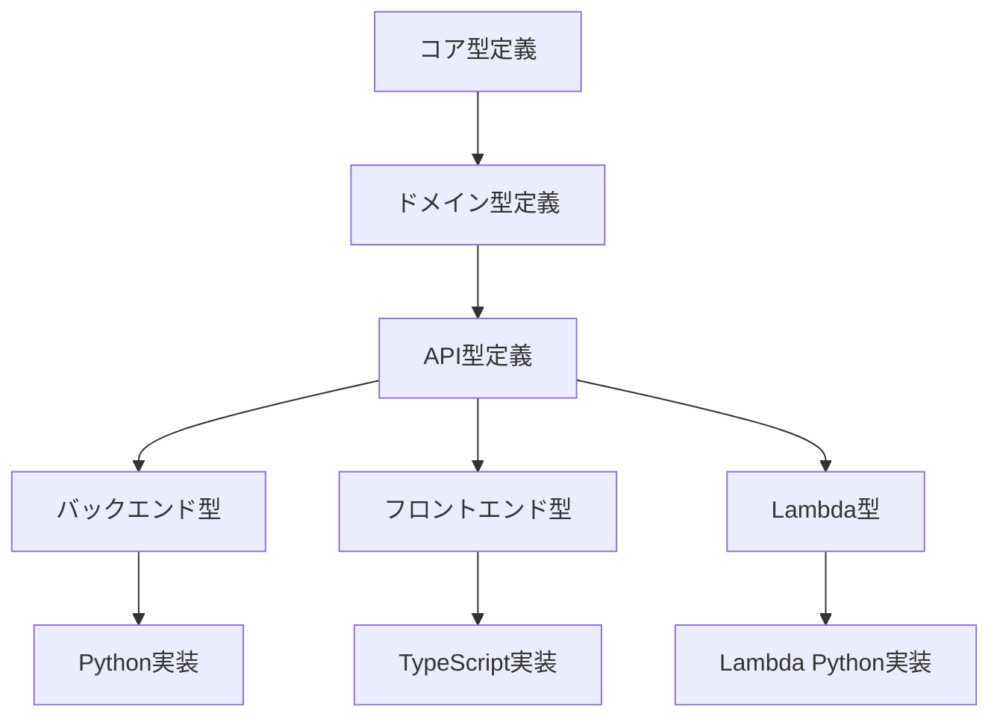

# layers_型定義統合管理

## 目次

1. [概要](#概要)
2. [型定義アーキテクチャ](#型定義アーキテクチャ)
3. [型定義カテゴリ](#型定義カテゴリ)
4. [型定義ファイル構成](#型定義ファイル構成)
5. [共通型定義](#共通型定義)
6. [型の継承と拡張](#型の継承と拡張)
7. [バリデーション](#バリデーション)
8. [型の自動生成](#型の自動生成)
9. [バージョン管理](#バージョン管理)
10. [ベストプラクティス](#ベストプラクティス)

## 概要

MAKOTO Visual AIシステムにおける型定義の統合管理ガイドです。Python、TypeScript、その他の言語間での型定義の一貫性を保ち、開発効率と保守性を向上させるための設計指針を提供します。

### 型定義の重要性

1. **開発効率の向上**
   - IDE の補完機能の活用
   - コンパイル時のエラー検出
   - ドキュメントとしての役割

2. **保守性の向上**
   - API契約の明確化
   - リファクタリングの安全性
   - 変更の影響範囲の把握

3. **品質の向上**
   - 型安全性の確保
   - 実行時エラーの削減
   - テストの効率化

## 型定義アーキテクチャ

### 階層構造



### Single Source of Truth

```yaml
# types/master/core.yaml
# マスター型定義（YAML形式）

types:
  TenantId:
    type: string
    pattern: "^tenant-[a-z0-9]{8}$"
    description: "テナント識別子"
  
  UserId:
    type: string
    format: uuid
    description: "ユーザー識別子"
  
  Timestamp:
    type: string
    format: date-time
    description: "ISO 8601形式のタイムスタンプ"
  
  ResourceStatus:
    type: enum
    values:
      - pending
      - processing
      - completed
      - failed
      - cancelled
    description: "リソースの状態"
```

## 型定義カテゴリ

### 1. 基本型（Primitive Types）

```python
# types/primitives.py
from typing import NewType, TypeAlias
from uuid import UUID
from datetime import datetime
from decimal import Decimal

# 識別子型
TenantId = NewType('TenantId', str)
UserId = NewType('UserId', UUID)
SessionId = NewType('SessionId', str)
ResourceId = NewType('ResourceId', UUID)

# 時刻型
Timestamp: TypeAlias = datetime
UnixTimestamp = NewType('UnixTimestamp', int)

# 数値型
Amount = NewType('Amount', Decimal)
Percentage = NewType('Percentage', float)  # 0.0 - 100.0
Count = NewType('Count', int)
```

### 2. エンティティ型（Entity Types）

```python
# types/entities.py
from dataclasses import dataclass, field
from typing import Optional, List, Dict, Any, Literal
from datetime import datetime
from .primitives import TenantId, UserId, ResourceId, ChatId, MessageId

# チャットモード型
ChatMode = Literal["chat", "image", "web", "rag"]

@dataclass
class ChatSettings:
    """チャット設定"""
    system_prompt: Optional[str] = None
    temperature: Optional[float] = None
    active_modes: List[ChatMode] = field(default_factory=list)
    max_tokens: Optional[int] = None

@dataclass
class UserProfile:
    """ユーザープロファイル"""
    display_name: Optional[str] = None
    bio: Optional[str] = None
    avatar_url: Optional[str] = None
    phone_number: Optional[str] = None
    timezone: Optional[str] = None
    language: str = "ja"
    country: Optional[str] = None

@dataclass
class UserSettings:
    """ユーザー設定"""
    theme: str = "light"
    notifications_enabled: bool = True
    email_notifications: bool = True
    auto_save: bool = True
    default_model: str = "gpt-4"
    interface_language: str = "ja"

@dataclass
class MessageFeedback:
    """メッセージフィードバック"""
    rating: Optional[int] = None  # 1-5
    is_helpful: Optional[bool] = None
    comment: Optional[str] = None
    reported_at: Optional[datetime] = None
    report_reason: Optional[str] = None

@dataclass
class FileAnalysisResult:
    """ファイル分析結果"""
    content_type: str
    language: Optional[str] = None
    encoding: Optional[str] = None
    word_count: Optional[int] = None
    page_count: Optional[int] = None
    dimensions: Optional[Dict[str, int]] = None  # width, height
    duration: Optional[float] = None
    metadata: Dict[str, str] = field(default_factory=dict)

@dataclass
class AgentConfiguration:
    """エージェント設定"""
    model: str = "gpt-4"
    temperature: float = 0.7
    max_tokens: Optional[int] = None
    system_prompt: Optional[str] = None
    response_format: Optional[str] = None
    stop_sequences: List[str] = field(default_factory=list)
    top_p: Optional[float] = None
    frequency_penalty: Optional[float] = None
    presence_penalty: Optional[float] = None

@dataclass
class IndexMetadata:
    """インデックスメタデータ"""
    vector_db_type: Optional[str] = None
    index_name: Optional[str] = None
    embedding_model: Optional[str] = None
    dimension: Optional[int] = None
    total_vectors: int = 0
    last_indexed_at: Optional[datetime] = None
    index_version: Optional[str] = None

@dataclass
class BaseEntity:
    """基底エンティティ"""
    id: ResourceId
    tenant_id: TenantId
    created_at: datetime
    updated_at: datetime
    created_by: UserId
    updated_by: UserId
    version: int = 1
    is_deleted: bool = False
    metadata: Metadata = field(default_factory=dict)
    
@dataclass
class User(BaseEntity):
    """ユーザーエンティティ"""
    username: str  # ログインID（必須）
    email: Optional[str] = None  # メールアドレス（オプション）
    email_verified: bool = False
    cognito_sub: Optional[str] = None
    display_name: Optional[str] = None
    account_type: str = "standard"  # standard, admin, service, guest
    roles: List[str] = field(default_factory=list)
    status: str = "active"
    profile: Optional[UserProfile] = None
    settings: Optional[UserSettings] = None
    organization_id: Optional[str] = None
    last_login_at: Optional[datetime] = None
    login_count: int = 0
    
@dataclass
class Chat(BaseEntity):
    """チャットエンティティ"""
    id: ChatId
    user_id: UserId  # 所有者ID
    title: str
    model: str = "gpt-4"
    status: str = "active"
    message_count: int = 0
    last_message: Optional[Dict[str, str]] = None
    last_message_at: Optional[datetime] = None
    settings: Optional[ChatSettings] = None

@dataclass
class Message(BaseEntity):
    """メッセージエンティティ"""
    id: MessageId
    chat_id: ChatId
    role: str  # user, assistant, system
    content: str
    model: Optional[str] = None
    attachments: List[FileId] = field(default_factory=list)
    references: List[MessageId] = field(default_factory=list)
    tokens: Optional[Dict[str, int]] = None  # prompt_tokens, completion_tokens, total_tokens
    feedback: Optional[MessageFeedback] = None
    is_edited: bool = False
    edited_at: Optional[datetime] = None
```

### 3. リクエスト/レスポンス型（Request/Response Types）

```python
# types/api.py
from pydantic import BaseModel, Field, ConfigDict
from typing import Optional, List, Dict, Any, Generic, TypeVar
from datetime import datetime
from uuid import UUID

T = TypeVar('T')

class BaseRequest(BaseModel):
    """基底リクエスト"""
    model_config = ConfigDict(
        str_strip_whitespace=True,
        json_encoders={
            datetime: lambda v: v.isoformat(),
            UUID: lambda v: str(v)
        }
    )
    
    request_id: str = Field(description="リクエストID")
    timestamp: datetime = Field(default_factory=datetime.utcnow)

class BaseResponse(BaseModel, Generic[T]):
    """基底レスポンス"""
    success: bool = Field(description="処理成功フラグ")
    data: Optional[T] = Field(default=None, description="レスポンスデータ")
    error: Optional[Dict[str, Any]] = Field(default=None, description="エラー情報")
    request_id: str = Field(description="リクエストID")
    timestamp: datetime = Field(default_factory=datetime.utcnow)

class PaginationRequest(BaseRequest):
    """ページネーションリクエスト"""
    page: int = Field(default=1, ge=1, description="ページ番号")
    limit: int = Field(default=20, ge=1, le=100, description="取得件数")
    sort_by: Optional[str] = Field(default=None, description="ソートキー")
    order: Optional[str] = Field(default="asc", pattern="^(asc|desc)$")

class PaginatedResponse(BaseResponse[T]):
    """ページネーションレスポンス"""
    total: int = Field(description="総件数")
    page: int = Field(description="現在のページ")
    limit: int = Field(description="ページあたりの件数")
    pages: int = Field(description="総ページ数")
```

### 4. イベント型（Event Types）

```python
# types/events.py
from enum import Enum
from dataclasses import dataclass, field
from typing import Dict, Any, Optional
from datetime import datetime
from uuid import uuid4

class EventType(Enum):
    """イベントタイプ"""
    # ユーザー関連
    USER_CREATED = "user.created"
    USER_UPDATED = "user.updated"
    USER_DELETED = "user.deleted"
    
    # チャット関連
    CHAT_CREATED = "chat.created"
    CHAT_MESSAGE_SENT = "chat.message.sent"
    CHAT_COMPLETED = "chat.completed"
    
    # AI関連
    AI_PROCESSING_STARTED = "ai.processing.started"
    AI_PROCESSING_COMPLETED = "ai.processing.completed"
    AI_PROCESSING_FAILED = "ai.processing.failed"

@dataclass
class Event:
    """イベント基底クラス"""
    event_id: str = field(default_factory=lambda: str(uuid4()))
    event_type: EventType = field()
    tenant_id: str = field()
    user_id: str = field()
    timestamp: datetime = field(default_factory=datetime.utcnow)
    payload: Dict[str, Any] = field(default_factory=dict)
    metadata: Dict[str, Any] = field(default_factory=dict)
    
    def to_dict(self) -> Dict[str, Any]:
        """辞書形式に変換"""
        return {
            'event_id': self.event_id,
            'event_type': self.event_type.value,
            'tenant_id': self.tenant_id,
            'user_id': self.user_id,
            'timestamp': self.timestamp.isoformat(),
            'payload': self.payload,
            'metadata': self.metadata
        }
```

## 型定義ファイル構成

### ディレクトリ構造

```
layers/common/python/makoto_common/types/
├── __init__.py           # 型定義エクスポート
├── primitives.py         # 基本型定義
├── entities/             # エンティティ型
│   ├── __init__.py
│   ├── user.py          # ユーザー関連
│   ├── chat.py          # チャット関連
│   ├── ai.py            # AI関連
│   └── file.py          # ファイル関連
├── api/                  # API型定義
│   ├── __init__.py
│   ├── requests.py      # リクエスト型
│   ├── responses.py     # レスポンス型
│   └── errors.py        # エラー型
├── events/               # イベント型
│   ├── __init__.py
│   └── domain_events.py # ドメインイベント
├── database/             # データベース型
│   ├── __init__.py
│   ├── dynamodb.py      # DynamoDB型
│   └── cosmos.py        # CosmosDB型
└── validators/           # バリデーター
    ├── __init__.py
    └── custom.py         # カスタムバリデーター
```

### TypeScript型定義

```typescript
// types/index.ts
// Python型定義から自動生成

// 基本型
export type TenantId = string;
export type UserId = string;
export type ResourceId = string;
export type Timestamp = string;  // ISO 8601

// エンティティ型
export interface BaseEntity {
  id: ResourceId;
  tenantId: TenantId;
  createdAt: Timestamp;
  updatedAt: Timestamp;
  createdBy: UserId;
  updatedBy: UserId;
  version: number;
}

export interface User extends BaseEntity {
  email: string;
  username: string;
  displayName: string;
  role: string;
  status: string;
  metadata: Record<string, any>;
}

// API型
export interface BaseRequest {
  requestId: string;
  timestamp: Timestamp;
}

export interface BaseResponse<T = any> {
  success: boolean;
  data?: T;
  error?: {
    code: string;
    message: string;
    details?: any;
  };
  requestId: string;
  timestamp: Timestamp;
}

// イベント型
export enum EventType {
  UserCreated = "user.created",
  UserUpdated = "user.updated",
  UserDeleted = "user.deleted",
  ChatCreated = "chat.created",
  ChatMessageSent = "chat.message.sent",
  ChatCompleted = "chat.completed"
}

export interface Event {
  eventId: string;
  eventType: EventType;
  tenantId: TenantId;
  userId: UserId;
  timestamp: Timestamp;
  payload: Record<string, any>;
  metadata: Record<string, any>;
}
```

## 共通型定義

### エラー型

```python
# types/api/errors.py
from enum import Enum
from typing import Optional, Dict, Any, List
from pydantic import BaseModel, Field

class ErrorCode(Enum):
    """エラーコード"""
    # 認証・認可
    UNAUTHORIZED = "UNAUTHORIZED"
    FORBIDDEN = "FORBIDDEN"
    TOKEN_EXPIRED = "TOKEN_EXPIRED"
    
    # リソース
    NOT_FOUND = "NOT_FOUND"
    ALREADY_EXISTS = "ALREADY_EXISTS"
    CONFLICT = "CONFLICT"
    
    # バリデーション
    VALIDATION_ERROR = "VALIDATION_ERROR"
    INVALID_FORMAT = "INVALID_FORMAT"
    REQUIRED_FIELD = "REQUIRED_FIELD"
    
    # システム
    INTERNAL_ERROR = "INTERNAL_ERROR"
    SERVICE_UNAVAILABLE = "SERVICE_UNAVAILABLE"
    RATE_LIMIT_EXCEEDED = "RATE_LIMIT_EXCEEDED"

class ErrorDetail(BaseModel):
    """エラー詳細"""
    code: ErrorCode = Field(description="エラーコード")
    message: str = Field(description="エラーメッセージ")
    field: Optional[str] = Field(default=None, description="エラーフィールド")
    details: Optional[Dict[str, Any]] = Field(default=None, description="詳細情報")

class ErrorResponse(BaseModel):
    """エラーレスポンス"""
    success: bool = Field(default=False)
    errors: List[ErrorDetail] = Field(description="エラーリスト")
    request_id: str = Field(description="リクエストID")
    timestamp: str = Field(description="タイムスタンプ")
```

### ページネーション型

```python
# types/api/pagination.py
from typing import TypeVar, Generic, List, Optional
from pydantic import BaseModel, Field

T = TypeVar('T')

class PaginationMeta(BaseModel):
    """ページネーションメタデータ"""
    total: int = Field(description="総件数")
    page: int = Field(description="現在のページ")
    limit: int = Field(description="ページあたりの件数")
    pages: int = Field(description="総ページ数")
    has_next: bool = Field(description="次ページの有無")
    has_prev: bool = Field(description="前ページの有無")

class PaginatedList(BaseModel, Generic[T]):
    """ページネーションリスト"""
    items: List[T] = Field(description="アイテムリスト")
    meta: PaginationMeta = Field(description="メタデータ")
    
    @classmethod
    def create(
        cls,
        items: List[T],
        total: int,
        page: int,
        limit: int
    ) -> 'PaginatedList[T]':
        """ページネーションリスト作成"""
        pages = (total + limit - 1) // limit
        return cls(
            items=items,
            meta=PaginationMeta(
                total=total,
                page=page,
                limit=limit,
                pages=pages,
                has_next=page < pages,
                has_prev=page > 1
            )
        )
```

## 型の継承と拡張

### 基底クラスの設計

```python
# types/base.py
from abc import ABC, abstractmethod
from typing import Dict, Any, Optional
from datetime import datetime
from pydantic import BaseModel, Field

class TimestampMixin(BaseModel):
    """タイムスタンプミックスイン"""
    created_at: datetime = Field(default_factory=datetime.utcnow)
    updated_at: datetime = Field(default_factory=datetime.utcnow)

class TenantMixin(BaseModel):
    """テナントミックスイン"""
    tenant_id: str = Field(description="テナントID")

class AuditMixin(BaseModel):
    """監査ミックスイン"""
    created_by: str = Field(description="作成者")
    updated_by: str = Field(description="更新者")
    version: int = Field(default=1, description="バージョン")

class BaseEntity(TimestampMixin, TenantMixin, AuditMixin):
    """基底エンティティ"""
    id: str = Field(description="エンティティID")
    
    class Config:
        """Pydantic設定"""
        validate_assignment = True
        use_enum_values = True
        json_encoders = {
            datetime: lambda v: v.isoformat()
        }
```

### 型の拡張パターン

```python
# types/extensions.py
from typing import TypeVar, Generic, Optional
from pydantic import BaseModel, Field

T = TypeVar('T')

class Versioned(BaseModel, Generic[T]):
    """バージョン管理された型"""
    data: T = Field(description="データ")
    version: int = Field(description="バージョン")
    previous: Optional['Versioned[T]'] = Field(default=None, description="前バージョン")

class Audited(BaseModel, Generic[T]):
    """監査ログ付き型"""
    data: T = Field(description="データ")
    audit_log: List[Dict[str, Any]] = Field(default_factory=list, description="監査ログ")
    
    def add_audit(self, action: str, user_id: str, details: Dict[str, Any] = None):
        """監査ログ追加"""
        self.audit_log.append({
            'action': action,
            'user_id': user_id,
            'timestamp': datetime.utcnow().isoformat(),
            'details': details or {}
        })

class Encrypted(BaseModel, Generic[T]):
    """暗号化された型"""
    encrypted_data: str = Field(description="暗号化データ")
    encryption_key_id: str = Field(description="暗号化キーID")
    algorithm: str = Field(default="AES-256-GCM", description="暗号化アルゴリズム")
```

## バリデーション

### カスタムバリデーター

```python
# types/validators/custom.py
from pydantic import field_validator, model_validator
from typing import Any
import re

class EmailValidator:
    """メールアドレスバリデーター"""
    
    @field_validator('email')
    @classmethod
    def validate_email(cls, v: str) -> str:
        pattern = r'^[a-zA-Z0-9._%+-]+@[a-zA-Z0-9.-]+\.[a-zA-Z]{2,}$'
        if not re.match(pattern, v):
            raise ValueError('無効なメールアドレス形式')
        return v.lower()

class PhoneValidator:
    """電話番号バリデーター"""
    
    @field_validator('phone')
    @classmethod
    def validate_phone(cls, v: str) -> str:
        # 日本の電話番号形式
        pattern = r'^0\d{1,4}-\d{1,4}-\d{4}$|^0\d{9,10}$'
        if not re.match(pattern, v):
            raise ValueError('無効な電話番号形式')
        return v.replace('-', '')

class TenantIdValidator:
    """テナントIDバリデーター"""
    
    @field_validator('tenant_id')
    @classmethod
    def validate_tenant_id(cls, v: str) -> str:
        pattern = r'^tenant-[a-z0-9]{8}$'
        if not re.match(pattern, v):
            raise ValueError('無効なテナントID形式')
        return v

class DateRangeValidator:
    """日付範囲バリデーター"""
    
    @model_validator(mode='after')
    def validate_date_range(self) -> 'DateRangeValidator':
        if hasattr(self, 'start_date') and hasattr(self, 'end_date'):
            if self.start_date > self.end_date:
                raise ValueError('開始日は終了日より前である必要があります')
        return self
```

### 複合バリデーション

```python
# types/validators/composite.py
from pydantic import BaseModel, field_validator, model_validator
from typing import List, Optional
import json

class JsonFieldValidator(BaseModel):
    """JSONフィールドバリデーター"""
    json_data: str
    
    @field_validator('json_data')
    @classmethod
    def validate_json(cls, v: str) -> str:
        try:
            json.loads(v)
        except json.JSONDecodeError as e:
            raise ValueError(f'無効なJSON形式: {e}')
        return v

class RequiredIfValidator(BaseModel):
    """条件付き必須フィールドバリデーター"""
    field_a: Optional[str] = None
    field_b: Optional[str] = None
    
    @model_validator(mode='after')
    def validate_required_if(self) -> 'RequiredIfValidator':
        if self.field_a and not self.field_b:
            raise ValueError('field_aが指定されている場合、field_bは必須です')
        return self

class MutuallyExclusiveValidator(BaseModel):
    """相互排他フィールドバリデーター"""
    option_a: Optional[str] = None
    option_b: Optional[str] = None
    
    @model_validator(mode='after')
    def validate_mutually_exclusive(self) -> 'MutuallyExclusiveValidator':
        if self.option_a and self.option_b:
            raise ValueError('option_aとoption_bは同時に指定できません')
        if not self.option_a and not self.option_b:
            raise ValueError('option_aまたはoption_bのいずれかが必須です')
        return self
```

## 型の自動生成

### OpenAPIからの生成

```python
# scripts/generate_types.py
import json
import yaml
from pathlib import Path
from typing import Dict, Any
from datamodel_code_generator import generate

def generate_from_openapi(
    openapi_path: str,
    output_path: str,
    base_class: str = "pydantic.BaseModel"
):
    """OpenAPI仕様から型定義を生成"""
    
    # OpenAPI仕様読み込み
    with open(openapi_path, 'r', encoding='utf-8') as f:
        if openapi_path.endswith('.yaml'):
            spec = yaml.safe_load(f)
        else:
            spec = json.load(f)
    
    # 型定義生成
    output = generate(
        json.dumps(spec),
        input_file_type='openapi',
        base_class=base_class,
        field_constraints=True,
        use_default=True,
        reuse_model=True,
        enum_field_as_literal='all',
        use_subclass_enum=True
    )
    
    # ファイル出力
    Path(output_path).write_text(output, encoding='utf-8')
    print(f"型定義を生成しました: {output_path}")

# 使用例
if __name__ == "__main__":
    generate_from_openapi(
        "docs/openapi.yaml",
        "types/generated/api.py"
    )
```

### TypeScript型の自動生成

```python
# scripts/generate_typescript.py
from typing import Dict, Any, List
import json
from pathlib import Path

class PythonToTypeScriptConverter:
    """Python型定義からTypeScript型定義を生成"""
    
    TYPE_MAPPING = {
        'str': 'string',
        'int': 'number',
        'float': 'number',
        'bool': 'boolean',
        'datetime': 'string',
        'UUID': 'string',
        'Dict': 'Record',
        'List': 'Array',
        'Optional': '| null',
        'Any': 'any'
    }
    
    def convert_type(self, python_type: str) -> str:
        """Python型をTypeScript型に変換"""
        for py_type, ts_type in self.TYPE_MAPPING.items():
            python_type = python_type.replace(py_type, ts_type)
        return python_type
    
    def generate_interface(
        self,
        name: str,
        fields: Dict[str, str],
        extends: Optional[str] = None
    ) -> str:
        """TypeScriptインターフェース生成"""
        lines = []
        
        if extends:
            lines.append(f"export interface {name} extends {extends} {{")
        else:
            lines.append(f"export interface {name} {{")
        
        for field_name, field_type in fields.items():
            ts_name = self.to_camel_case(field_name)
            ts_type = self.convert_type(field_type)
            lines.append(f"  {ts_name}: {ts_type};")
        
        lines.append("}")
        return "\n".join(lines)
    
    def to_camel_case(self, snake_str: str) -> str:
        """スネークケースをキャメルケースに変換"""
        components = snake_str.split('_')
        return components[0] + ''.join(x.title() for x in components[1:])
    
    def generate_enum(self, name: str, values: List[str]) -> str:
        """TypeScript enumを生成"""
        lines = [f"export enum {name} {{"]
        
        for value in values:
            enum_key = value.replace('.', '_').upper()
            lines.append(f'  {enum_key} = "{value}",')
        
        lines.append("}")
        return "\n".join(lines)
```

## バージョン管理

### セマンティックバージョニング

```python
# types/versioning.py
from typing import Dict, Any, Optional
from datetime import datetime
from enum import Enum

class ChangeType(Enum):
    """変更タイプ"""
    BREAKING = "breaking"    # 破壊的変更
    FEATURE = "feature"      # 機能追加
    FIX = "fix"             # バグ修正
    REFACTOR = "refactor"   # リファクタリング

class TypeVersion:
    """型定義バージョン管理"""
    
    def __init__(self, major: int = 1, minor: int = 0, patch: int = 0):
        self.major = major
        self.minor = minor
        self.patch = patch
    
    def bump(self, change_type: ChangeType) -> 'TypeVersion':
        """バージョンアップ"""
        if change_type == ChangeType.BREAKING:
            return TypeVersion(self.major + 1, 0, 0)
        elif change_type == ChangeType.FEATURE:
            return TypeVersion(self.major, self.minor + 1, 0)
        else:
            return TypeVersion(self.major, self.minor, self.patch + 1)
    
    def __str__(self) -> str:
        return f"v{self.major}.{self.minor}.{self.patch}"

class TypeRegistry:
    """型定義レジストリ"""
    
    def __init__(self):
        self.types: Dict[str, Dict[str, Any]] = {}
        self.versions: Dict[str, TypeVersion] = {}
        self.changelog: List[Dict[str, Any]] = []
    
    def register(
        self,
        type_name: str,
        type_def: Dict[str, Any],
        change_type: Optional[ChangeType] = None
    ):
        """型定義登録"""
        if type_name in self.types:
            # 既存型のアップデート
            old_version = self.versions[type_name]
            new_version = old_version.bump(change_type or ChangeType.FIX)
            
            self.changelog.append({
                'type': type_name,
                'old_version': str(old_version),
                'new_version': str(new_version),
                'change_type': change_type.value if change_type else 'fix',
                'timestamp': datetime.utcnow().isoformat()
            })
            
            self.versions[type_name] = new_version
        else:
            # 新規型登録
            self.versions[type_name] = TypeVersion()
        
        self.types[type_name] = type_def
    
    def get_type(self, type_name: str, version: Optional[str] = None) -> Dict[str, Any]:
        """型定義取得"""
        if type_name not in self.types:
            raise ValueError(f"型 {type_name} が見つかりません")
        
        # TODO: バージョン指定の実装
        return self.types[type_name]
```

## ベストプラクティス

### 1. 命名規則

```python
# 良い例
class UserRegistrationRequest(BaseModel):
    """ユーザー登録リクエスト"""
    email: str
    password: str
    display_name: str

# 悪い例
class UserReq(BaseModel):  # 省略形は避ける
    e: str  # 不明瞭なフィールド名
    p: str
    n: str
```

### 2. 必須フィールドと省略可能フィールド

```python
from typing import Optional
from pydantic import BaseModel, Field

class UserProfile(BaseModel):
    """ユーザープロファイル"""
    # 必須フィールド
    user_id: str = Field(description="ユーザーID")
    username: str = Field(description="ユーザー名")
    
    # 省略可能フィールド（明示的にOptionalを使用）
    bio: Optional[str] = Field(default=None, description="自己紹介")
    avatar_url: Optional[str] = Field(default=None, description="アバターURL")
    
    # デフォルト値付きフィールド
    is_active: bool = Field(default=True, description="アクティブフラグ")
    created_at: datetime = Field(default_factory=datetime.utcnow)
```

### 3. 型の再利用

```python
# types/common.py
from typing import TypeAlias

# 共通型定義
EmailAddress: TypeAlias = str
PhoneNumber: TypeAlias = str
JapanesePostalCode: TypeAlias = str
URL: TypeAlias = str

# 使用例
class ContactInfo(BaseModel):
    email: EmailAddress
    phone: PhoneNumber
    postal_code: JapanesePostalCode
    website: URL
```

### 4. 型安全性の確保

```python
from typing import Literal, Union
from pydantic import BaseModel, Field, validator

class PaymentMethod(BaseModel):
    """支払い方法"""
    type: Literal["credit_card", "bank_transfer", "paypal"]
    
    # Union型で複数の型を許可
    account_info: Union[CreditCardInfo, BankAccountInfo, PayPalInfo]
    
    @validator('account_info')
    def validate_account_info(cls, v, values):
        """支払い方法に応じた情報の検証"""
        payment_type = values.get('type')
        
        if payment_type == 'credit_card' and not isinstance(v, CreditCardInfo):
            raise ValueError('クレジットカード情報が必要です')
        elif payment_type == 'bank_transfer' and not isinstance(v, BankAccountInfo):
            raise ValueError('銀行口座情報が必要です')
        elif payment_type == 'paypal' and not isinstance(v, PayPalInfo):
            raise ValueError('PayPal情報が必要です')
        
        return v
```

### 5. ドキュメンテーション

```python
from pydantic import BaseModel, Field
from typing import Optional, List

class WellDocumentedModel(BaseModel):
    """
    詳細なモデル説明
    
    このモデルは〇〇の用途で使用されます。
    主な機能：
    - 機能1
    - 機能2
    
    使用例：
        >>> model = WellDocumentedModel(
        ...     field1="value1",
        ...     field2=42
        ... )
    """
    
    field1: str = Field(
        description="フィールド1の説明",
        example="example_value",
        min_length=1,
        max_length=100
    )
    
    field2: int = Field(
        description="フィールド2の説明",
        example=42,
        ge=0,
        le=100
    )
    
    optional_field: Optional[str] = Field(
        default=None,
        description="省略可能なフィールドの説明",
        example="optional_value"
    )
    
    class Config:
        """Pydantic設定"""
        schema_extra = {
            "example": {
                "field1": "example_value",
                "field2": 42,
                "optional_field": "optional_value"
            }
        }
```

### 6. 型定義のテスト

```python
# tests/test_types.py
import pytest
from pydantic import ValidationError
from types.api import UserRegistrationRequest

def test_user_registration_request_valid():
    """有効なリクエストのテスト"""
    request = UserRegistrationRequest(
        email="test@example.com",
        password="SecurePass123!",
        display_name="Test User"
    )
    assert request.email == "test@example.com"

def test_user_registration_request_invalid_email():
    """無効なメールアドレスのテスト"""
    with pytest.raises(ValidationError) as exc_info:
        UserRegistrationRequest(
            email="invalid-email",
            password="SecurePass123!",
            display_name="Test User"
        )
    
    errors = exc_info.value.errors()
    assert any(e['loc'] == ('email',) for e in errors)

def test_user_registration_request_missing_field():
    """必須フィールド欠落のテスト"""
    with pytest.raises(ValidationError) as exc_info:
        UserRegistrationRequest(
            email="test@example.com",
            display_name="Test User"
            # passwordが欠落
        )
    
    errors = exc_info.value.errors()
    assert any(e['loc'] == ('password',) for e in errors)
```

## まとめ

型定義統合管理のポイント：

1. **一貫性**: すべての言語で一貫した型定義を維持
2. **自動化**: 可能な限り型定義の生成を自動化
3. **バージョン管理**: 破壊的変更を適切に管理
4. **検証**: 厳密なバリデーションで品質確保
5. **ドキュメント**: 充実したドキュメントで開発効率向上

これらのベストプラクティスに従うことで、保守性が高く、バグの少ないシステムを構築できます。

---

**作成者**: Claude  
**作成日**: 2025年8月7日  
**バージョン**: 1.0.0