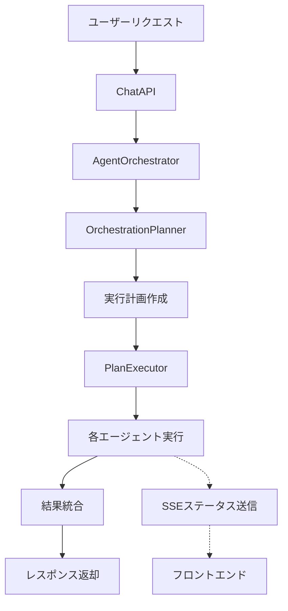

# エージェント仕様書

## 目次

1. [概要](#概要)
2. [システムアーキテクチャ](#システムアーキテクチャ)
3. [エージェントの種類](#エージェントの種類)
4. [オーケストレーション機能](#オーケストレーション機能)
5. [実行フロー](#実行フロー)
6. [エージェント詳細](#エージェント詳細)
   - [AnalyzerAgent（分析エージェント）](#analyzeragent分析エージェント)
   - [WebAgent（Web検索エージェント）](#webagentWeb検索エージェント)
   - [ImageAgent（画像生成エージェント）](#imageagent画像生成エージェント)
   - [DocumentAgent（ドキュメント処理エージェント）](#documentagentドキュメント処理エージェント)
7. [パラメータ最適化](#パラメータ最適化)
8. [エラーハンドリング](#エラーハンドリング)
9. [拡張性](#拡張性)
10. [セキュリティ](#セキュリティ)
11. [更新履歴](#更新履歴)

## 概要

MAKOTO Visual AIのエージェント機能は、LLM（Large Language Model）を活用してユーザーのリクエストを自動的に分析し、適切なAIエージェントを選択・実行する高度なオーケストレーションシステムです。

### 主要な特徴

- **自動タスク分析**: ユーザーの意図を理解し、必要なタスクを自動判定
- **動的な実行計画**: LLMが最適な実行順序とパラメータを決定
- **並列処理対応**: 独立したタスクを並列実行して応答時間を短縮
- **リアルタイムステータス**: SSE（Server-Sent Events）による進捗の可視化
- **フォールバック機能**: エラー時の代替計画を自動実行

## システムアーキテクチャ

### コンポーネント構成

```
エージェントシステム
├── オーケストレーター層
│   ├── AgentOrchestrator       # メインオーケストレーター
│   ├── OrchestrationPlanner    # LLMベース計画作成
│   └── PlanExecutor            # 実行計画の処理
│
├── エージェント層
│   ├── BaseAgent               # 基底クラス
│   ├── AnalyzerAgent           # プロンプト分析
│   ├── WebAgent                # Web検索・クロール
│   ├── ImageAgent              # 画像生成
│   └── DocumentAgent           # ドキュメント処理
│
├── 管理層
│   ├── AgentRegistry           # エージェント登録・管理
│   ├── StatusManager           # ステータス管理
│   └── ParameterOptimizer      # パラメータ最適化
│
└── 統合層
    └── ChatAPI                 # チャット機能との統合
```

### データフロー



## エージェントの種類

### 現在実装済みのエージェント

| エージェント名 | 用途 | 主要機能 |
|-------------|------|---------|
| AnalyzerAgent | プロンプト分析 | 意図理解、タスク分解、エージェント推奨 |
| WebAgent | Web検索 | 最新情報取得、Webページクロール、情報要約 |
| ImageAgent | 画像生成 | DALL-E 3による画像生成、プロンプト最適化 |
| DocumentAgent | 文書処理 | PDF/文書の解析、要約、情報抽出 |

### 今後追加予定のエージェント

- **CodeAgent**: コード生成・解析
- **DataAgent**: データ分析・可視化
- **CreativeAgent**: クリエイティブライティング
- **TranslationAgent**: 多言語翻訳

## オーケストレーション機能

### LLMベースの実行計画

オーケストレーターは、以下の情報を基に最適な実行計画を作成します：

1. **ユーザーリクエストの分析**
   - 意図の理解
   - 必要なタスクの特定
   - 優先順位の決定

2. **エージェント選択**
   - 各エージェントの能力評価
   - タスクとのマッチング
   - リソース効率の考慮

3. **パラメータ最適化**
   - タスクに応じたLLMパラメータ調整
   - エージェント固有設定の最適化
   - コスト・速度のバランス

### 実行計画の構造

```json
{
  "analysis": "ユーザーは最新のAI技術動向と関連画像を求めています",
  "reasoning": "Web検索で情報収集後、画像生成で視覚化",
  "execution_plan": [
    {
      "step": 1,
      "agent": "WebAgent",
      "purpose": "最新AI技術の情報収集",
      "inputs": {
        "keywords": ["AI", "最新技術", "2025"],
        "max_results": 5
      },
      "execution_params": {
        "llm_settings": {
          "temperature": 0.3,
          "max_tokens": 1500
        }
      },
      "depends_on": [],
      "parallel": false
    },
    {
      "step": 2,
      "agent": "ImageAgent",
      "purpose": "AI技術のイメージ生成",
      "inputs": {
        "prompt": "futuristic AI technology visualization"
      },
      "execution_params": {
        "llm_settings": {
          "temperature": 0.9
        }
      },
      "depends_on": [1],
      "parallel": false
    }
  ],
  "success_criteria": "情報収集と画像生成の両方が成功",
  "fallback_plan": "Web検索失敗時は一般的な知識で回答"
}
```

## 実行フロー

### 基本的な処理フロー

1. **リクエスト受信**
   - ユーザーからのチャットメッセージ受信
   - エージェントモードの確認

2. **分析フェーズ**
   - AnalyzerAgentによる初期分析
   - 必要なタスクの特定

3. **計画フェーズ**
   - OrchestrationPlannerによる実行計画作成
   - パラメータの最適化

4. **実行フェーズ**
   - PlanExecutorによる順次/並列実行
   - リアルタイムステータス送信

5. **結果統合**
   - 各エージェントの結果をマージ
   - 最終レスポンス生成

### SSEによるリアルタイム通信

エージェントの実行状態と思考プロセスは、SSE（Server-Sent Events）を通じてリアルタイムに送信されます。詳細は[SSE仕様書](./SSE仕様書.md)を参照してください。

```typescript
// ステータスイベントの例
data: {
  "type": "agent_status",
  "content": {
    "execution_id": "exec_123",
    "agent_type": "OrchestrationPlanner",
    "status": "planning",
    "message": "実行計画を作成中",
    "progress": {
      "current": 1,
      "total": 3,
      "percentage": 33
    }
  },
  "metadata": {
    "timestamp": "2025-08-06T10:00:00Z"
  }
}

// 思考状態イベントの例
data: {
  "type": "agent_thinking",
  "content": {
    "execution_id": "exec_123",
    "agent_type": "WebAgent",
    "phase": "analyzing",
    "thoughts": {
      "current_analysis": "検索キーワードを最適化中",
      "confidence": 0.9
    },
    "visibility": "summary"
  },
  "metadata": {
    "timestamp": "2025-08-06T10:00:01Z"
  }
}
```

## エージェント詳細

### AnalyzerAgent（分析エージェント）

#### 機能
- ユーザープロンプトの意図分析
- 必要なタスクの識別
- 最適なエージェント組み合わせの推奨

#### 使用タイミング
- すべてのリクエストの初期分析
- 複雑なリクエストの分解
- マルチステップタスクの計画

#### パラメータ設定
- **temperature**: 0.2-0.3（一貫した分析）
- **max_tokens**: 500-1000（簡潔な分析）
- **analysis_depth**: standard（標準的な深さ）

### WebAgent（Web検索エージェント）

#### 機能
- リアルタイムWeb検索
- Webページのクロールと要約
- 関連情報の抽出と整理

#### 使用タイミング
- 最新情報が必要な場合
- 事実確認や調査
- 外部データの取得

#### パラメータ設定
- **temperature**: 0.1-0.3（正確な情報収集）
- **max_tokens**: 1000-2000（詳細な要約）
- **search_depth**: thorough（徹底的な検索）
- **max_results**: 5-10（結果数）

### ImageAgent（画像生成エージェント）

#### 機能
- DALL-E 3を使用した画像生成
- プロンプトの最適化
- スタイル指定対応

#### 使用タイミング
- ビジュアルコンテンツが必要な場合
- イラストレーション作成
- コンセプトの視覚化

#### パラメータ設定
- **temperature**: 0.8-1.2（創造的な生成）
- **quality**: hd（高品質）
- **style**: vivid/natural（スタイル選択）
- **size**: 1024x1024（画像サイズ）

### DocumentAgent（ドキュメント処理エージェント）

#### 機能
- PDF/文書の解析
- 内容の要約と抽出
- 構造化データの生成

#### 使用タイミング
- アップロードされた文書の処理
- 長文の要約
- 情報の構造化

#### パラメータ設定
- **temperature**: 0.2-0.5（正確な抽出）
- **max_tokens**: 1500-3000（詳細な分析）
- **extraction_mode**: detailed（詳細抽出）

## パラメータ最適化

### Temperature設定ガイドライン

| タスクタイプ | 推奨値 | 理由 |
|------------|--------|------|
| 事実確認・検索 | 0.0-0.3 | 正確性と一貫性を重視 |
| 要約・説明 | 0.3-0.7 | バランスの取れた出力 |
| 創造的生成 | 0.7-1.2 | 多様性と創造性 |
| ブレインストーミング | 1.0-1.5 | 最大限の創造性 |

### 動的パラメータ調整

システムは以下の要因に基づいてパラメータを動的に調整します：

- **タスクの性質**: 分析的 vs 創造的
- **ユーザーの期待**: 精度重視 vs 速度重視
- **リソース制約**: コストとパフォーマンスのバランス
- **過去の実行結果**: 成功パターンの学習

## エラーハンドリング

### エラータイプと対処

| エラータイプ | 原因 | 対処法 |
|------------|------|--------|
| PlanValidationError | 実行計画が無効 | LLMに再生成を要求 |
| AgentNotFoundError | エージェント不在 | 代替エージェントを提案 |
| ExecutionTimeout | タイムアウト | 簡略版で再実行 |
| DependencyError | 依存関係エラー | 実行順序を再調整 |
| RateLimitError | API制限超過 | リトライまたは代替処理 |

### フォールバック戦略

```python
fallback_strategies = {
    "web_search_failed": "キャッシュまたは一般知識で回答",
    "image_generation_failed": "代替の説明文を提供",
    "document_processing_failed": "要約版の処理を実行",
    "llm_error": "デフォルトパラメータで再実行"
}
```

## 拡張性

### 新規エージェントの追加

新しいエージェントを追加する手順：

1. **BaseAgentクラスの継承**
   ```python
   class CustomAgent(BaseAgent):
       def __init__(self):
           super().__init__('custom')
   ```

2. **能力定義の実装**
   ```python
   @classmethod
   def get_capability_description(cls):
       return {
           'name': 'CustomAgent',
           'description': 'カスタム処理を行うエージェント',
           'when_to_use': '特定の条件下で使用',
           # ...
       }
   ```

3. **処理ロジックの実装**
   ```python
   async def process(self, prompt, context, **kwargs):
       # 処理ロジック
       yield status_update
   ```

4. **レジストリへの登録**
   ```python
   registry.register(CustomAgent)
   ```

### プラグインシステム

- **動的ロード**: 実行時にエージェントを追加可能
- **設定ファイル**: YAMLで能力を定義
- **ホットリロード**: 再起動なしで更新

## セキュリティ

### アクセス制御

- **認証**: JWTトークンによる認証
- **認可**: ロールベースのアクセス制御
- **テナント分離**: マルチテナント環境での完全分離

### データ保護

- **入力サニタイゼーション**: プロンプトインジェクション対策
- **出力フィルタリング**: 機密情報の除去
- **監査ログ**: すべての実行を記録

### リソース管理

- **レート制限**: ユーザー/テナントごとの制限
- **タイムアウト**: 長時間実行の防止
- **コスト管理**: トークン使用量の監視

## パフォーマンス最適化

### 並列実行

- 独立したタスクの並列処理
- リソース使用量に基づく動的調整
- デッドロック防止機構

### キャッシング

- 実行計画のキャッシュ
- エージェント結果のキャッシュ
- LLMレスポンスのキャッシュ

### モニタリング

- 実行時間の追跡
- エラー率の監視
- リソース使用状況の可視化

## 更新履歴

- 2025-08-06: 初版作成
  - 基本的なエージェント機能の定義
  - LLMベースオーケストレーション
  - 4種類の基本エージェント実装