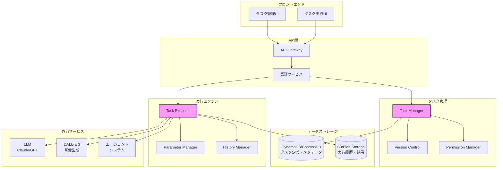
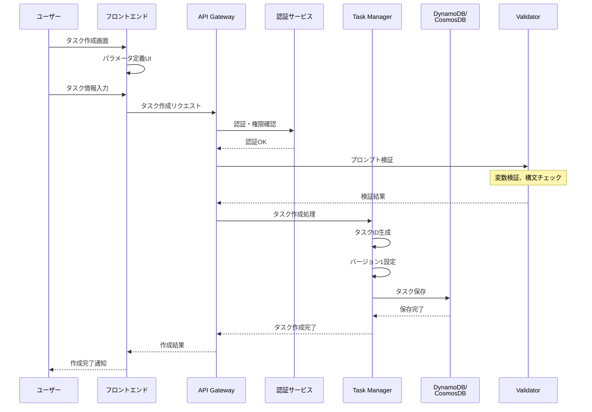
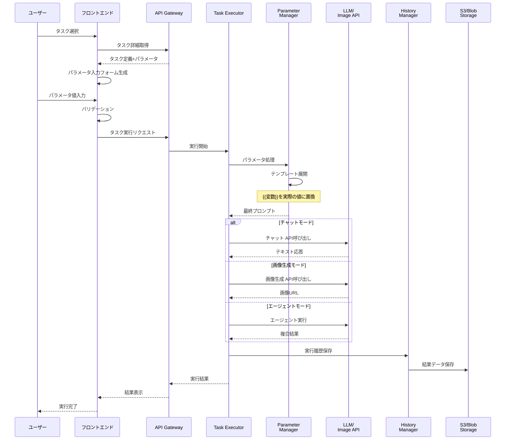
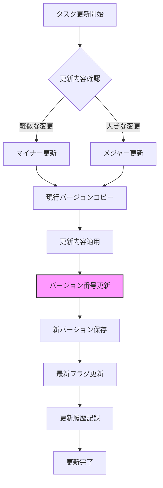

# タスク仕様書

## 目次

1. [概要](#概要)
2. [タスクの目的](#タスクの目的)
3. [データ構造](#データ構造)
   - [タスク](#タスク)
   - [タスクパラメータ](#タスクパラメータ)
   - [タスク実行履歴](#タスク実行履歴)
4. [公開範囲の仕様](#公開範囲の仕様)
   - [公開範囲の種類](#公開範囲の種類)
   - [アクセス制御ロジック](#アクセス制御ロジック)
5. [処理フロー](#処理フロー)
   - [タスク作成](#タスク作成)
   - [タスク実行](#タスク実行)
   - [バージョン管理](#バージョン管理)
6. [API仕様](#api仕様)
7. [ユースケース](#ユースケース)
8. [セキュリティ考慮事項](#セキュリティ考慮事項)
9. [更新履歴](#更新履歴)

## 概要

MAKOTO Visual AIのタスク機能は、頻繁に使用するプロンプトテンプレートや処理パターンを事前に登録・管理できる機能です。チーム内での共有が可能で、定型的な作業の効率化とプロンプトの標準化を実現します。

### タスクシステムアーキテクチャ



## タスクの目的

1. **プロンプトの標準化**
   - チーム内で統一されたプロンプトフォーマットの利用
   - ベストプラクティスの共有と活用
   - 品質の安定化

2. **作業効率の向上**
   - 頻繁に使用するプロンプトのワンクリック実行
   - パラメータ化による柔軟な再利用
   - 実行履歴からの再実行

3. **知識の共有**
   - 効果的なプロンプトのチーム内共有
   - 用途別テンプレートギャラリー
   - 実行結果の共有と学習

4. **ガバナンスの強化**
   - プロンプトのバージョン管理
   - 利用状況の追跡
   - アクセス制御による適切な利用

## データ構造

### タスク

```typescript
interface Task {
  // 基本情報
  task_id: UUID;                   // タスクID
  name: string;                    // タスク名（最大100文字）
  description?: string;            // 説明（最大500文字）
  category: TaskCategory;          // カテゴリー
  tags: string[];                  // タグ（最大10個）
  icon?: string;                   // アイコン（絵文字またはアイコンID）
  
  // プロンプト定義
  prompt_template: string;         // プロンプトテンプレート（最大10000文字）
  system_prompt?: string;          // システムプロンプト（最大2000文字）
  
  // 実行設定
  execution_mode: ExecutionMode;   // 実行モード
  model_settings?: ModelSettings;  // モデル設定
  
  // パラメータ定義
  parameters: TaskParameter[];     // パラメータ定義
  
  // 作成者情報
  created_by: UUID;                // 作成者ユーザーID
  created_at: DateTime;            // 作成日時
  updated_at: DateTime;            // 更新日時
  
  // バージョン管理
  version: number;                 // バージョン番号
  is_latest: boolean;              // 最新バージョンフラグ
  previous_version_id?: UUID;      // 前バージョンID
  
  // 公開範囲（ライブラリと同一仕様）
  visibility: TaskVisibility;      // 公開範囲設定
  
  // ステータス
  status: TaskStatus;              // タスクステータス
  is_favorite?: boolean;           // お気に入りフラグ（ユーザー別）
  
  // 統計情報
  execution_count: number;         // 実行回数
  last_executed_at?: DateTime;     // 最終実行日時
  average_rating?: number;         // 平均評価（1-5）
}

type TaskCategory = 
  | "text_generation"     // テキスト生成
  | "image_generation"    // 画像生成
  | "data_analysis"       // データ分析
  | "summarization"       // 要約
  | "translation"         // 翻訳
  | "code_generation"     // コード生成
  | "creative_writing"    // クリエイティブライティング
  | "business"            // ビジネス
  | "other";              // その他

type ExecutionMode = 
  | "chat"               // チャットモード
  | "image"              // 画像生成モード
  | "agent"              // エージェントモード
  | "hybrid";            // ハイブリッドモード

type TaskStatus = 
  | "draft"              // 下書き
  | "active"             // アクティブ
  | "deprecated"         // 非推奨
  | "archived";          // アーカイブ済み
```

### タスクパラメータ

```typescript
interface TaskParameter {
  // 基本情報
  parameter_id: string;            // パラメータID
  name: string;                    // パラメータ名（{{name}}で参照）
  label: string;                   // 表示ラベル
  description?: string;            // 説明文
  
  // パラメータ設定
  type: ParameterType;             // パラメータ型
  required: boolean;               // 必須フラグ
  default_value?: any;             // デフォルト値
  
  // 入力制約
  validation?: ParameterValidation; // バリデーション設定
  
  // UI設定
  ui_type: UIType;                 // UI表示タイプ
  placeholder?: string;            // プレースホルダー
  help_text?: string;              // ヘルプテキスト
  display_order: number;           // 表示順序
}

type ParameterType = 
  | "text"               // テキスト
  | "number"             // 数値
  | "boolean"            // 真偽値
  | "date"               // 日付
  | "datetime"           // 日時
  | "select"             // 選択肢
  | "multiselect"        // 複数選択
  | "file"               // ファイル
  | "url";               // URL

interface ParameterValidation {
  // テキスト型
  min_length?: number;             // 最小文字数
  max_length?: number;             // 最大文字数
  pattern?: string;                // 正規表現パターン
  
  // 数値型
  min_value?: number;              // 最小値
  max_value?: number;              // 最大値
  step?: number;                   // ステップ値
  
  // 選択肢型
  options?: SelectOption[];        // 選択肢リスト
  
  // ファイル型
  allowed_types?: string[];        // 許可するMIMEタイプ
  max_size?: number;               // 最大ファイルサイズ（バイト）
}

interface SelectOption {
  value: string;                   // 値
  label: string;                   // 表示ラベル
  description?: string;            // 説明
}

type UIType = 
  | "text_input"         // テキスト入力
  | "textarea"           // テキストエリア
  | "number_input"       // 数値入力
  | "checkbox"           // チェックボックス
  | "radio"              // ラジオボタン
  | "dropdown"           // ドロップダウン
  | "date_picker"        // 日付ピッカー
  | "file_upload"        // ファイルアップロード
  | "slider";            // スライダー
```

### モデル設定

```typescript
interface ModelSettings {
  // LLM設定
  model?: string;                  // モデル名（例: "gpt-4", "claude-3"）
  temperature?: number;            // 温度（0.0-2.0）
  max_tokens?: number;             // 最大トークン数
  top_p?: number;                  // Top-p（0.0-1.0）
  frequency_penalty?: number;      // 頻度ペナルティ（-2.0-2.0）
  presence_penalty?: number;       // 存在ペナルティ（-2.0-2.0）
  
  // 画像生成設定
  image_size?: ImageSize;          // 画像サイズ
  image_quality?: ImageQuality;    // 画像品質
  image_style?: ImageStyle;        // 画像スタイル
  image_count?: number;            // 生成枚数（1-10）
  
  // エージェント設定
  agent_modes?: string[];          // 有効なエージェントモード
  search_depth?: number;           // 検索深度
  
  // その他
  timeout?: number;                // タイムアウト（秒）
  retry_count?: number;            // リトライ回数
}
```

### タスク実行履歴

```typescript
interface TaskExecution {
  // 基本情報
  execution_id: UUID;              // 実行ID
  task_id: UUID;                   // タスクID
  task_version: number;            // 実行時のタスクバージョン
  
  // 実行者情報
  executed_by: UUID;               // 実行者ユーザーID
  executed_at: DateTime;           // 実行日時
  
  // 入力パラメータ
  parameters: Record<string, any>; // 実行時パラメータ値
  
  // 実行結果
  status: ExecutionStatus;         // 実行ステータス
  result?: ExecutionResult;        // 実行結果
  error?: ExecutionError;          // エラー情報
  
  // 実行情報
  execution_time_ms: number;       // 実行時間（ミリ秒）
  tokens_used?: number;            // 使用トークン数
  cost?: number;                   // コスト（USD）
  
  // 評価
  rating?: number;                 // 評価（1-5）
  feedback?: string;               // フィードバック
}

type ExecutionStatus = 
  | "pending"            // 実行待ち
  | "running"            // 実行中
  | "completed"          // 完了
  | "failed"             // 失敗
  | "cancelled";         // キャンセル

interface ExecutionResult {
  // 共通結果
  type: "text" | "image" | "mixed"; // 結果タイプ
  
  // テキスト結果
  text?: string;                   // 生成テキスト
  
  // 画像結果
  images?: Array<{
    url: string;                   // 画像URL
    prompt: string;                // 使用プロンプト
  }>;
  
  // メタデータ
  metadata?: Record<string, any>;  // その他のメタデータ
}
```

## 公開範囲の仕様

### 公開範囲の種類

ライブラリ機能と同一の公開範囲設定を採用します：

```typescript
interface TaskVisibility {
  // 公開タイプ
  visibility_type: VisibilityType;
  
  // 部署指定（AND条件）
  departments?: string[];          // 部署名リスト
  
  // 役職指定（AND条件）
  roles?: string[];                // 役職名リスト
  
  // ユーザー指定（OR条件）
  users?: UUID[];                  // ユーザーIDリスト
}

type VisibilityType = 
  | "private"       // 作成者のみ
  | "specific"      // 特定の条件指定
  | "tenant";       // テナント全体
```

### アクセス制御ロジック

アクセス可否の判定はライブラリと同じロジックを使用：

1. **visibility_type = "private"の場合**
   - 作成者本人のみアクセス可能

2. **visibility_type = "specific"の場合**
   - 以下の条件をすべて満たす場合にアクセス可能：
     - 部署条件：ユーザーの部署が`departments`配列のいずれかに含まれる（指定がない場合は条件なし）
     - 役職条件：ユーザーの役職が`roles`配列のいずれかに含まれる（指定がない場合は条件なし）
   - または、ユーザーIDが`users`配列に含まれる場合にアクセス可能

3. **visibility_type = "tenant"の場合**
   - 同一テナントの全ユーザーがアクセス可能

```typescript
// アクセス可否判定の例（ライブラリと同一）
function canAccessTask(task: Task, user: User): boolean {
  const visibility = task.visibility;
  
  // 作成者は常にアクセス可能
  if (task.created_by === user.user_id) {
    return true;
  }
  
  switch (visibility.visibility_type) {
    case "private":
      return false;
      
    case "specific":
      // ユーザー指定チェック（OR条件）
      if (visibility.users?.includes(user.user_id)) {
        return true;
      }
      
      // 部署・役職チェック（AND条件）
      const deptMatch = !visibility.departments || 
                        visibility.departments.includes(user.department);
      const roleMatch = !visibility.roles || 
                        visibility.roles.includes(user.role);
      return deptMatch && roleMatch;
      
    case "tenant":
      return user.tenant_id === task.tenant_id;
      
    default:
      return false;
  }
}
```

## 処理フロー

### タスク作成



### タスク実行



### バージョン管理



## API仕様

### エンドポイント一覧

1. **タスク管理**
   - `GET /api/tasks` - タスク一覧取得（アクセス可能なもののみ）
   - `POST /api/tasks` - タスク作成
   - `GET /api/tasks/{task_id}` - タスク詳細取得
   - `PUT /api/tasks/{task_id}` - タスク更新（新バージョン作成）
   - `DELETE /api/tasks/{task_id}` - タスク削除（アーカイブ）

2. **タスク実行**
   - `POST /api/tasks/{task_id}/execute` - タスク実行
   - `GET /api/tasks/{task_id}/executions` - 実行履歴取得
   - `GET /api/tasks/executions/{execution_id}` - 実行詳細取得

3. **バージョン管理**
   - `GET /api/tasks/{task_id}/versions` - バージョン履歴取得
   - `GET /api/tasks/{task_id}/versions/{version}` - 特定バージョン取得
   - `POST /api/tasks/{task_id}/rollback` - バージョンロールバック

4. **共有管理**
   - `PUT /api/tasks/{task_id}/visibility` - 公開範囲更新
   - `GET /api/tasks/shared` - 共有されたタスク一覧
   - `POST /api/tasks/{task_id}/favorite` - お気に入り登録

5. **タスクギャラリー**
   - `GET /api/tasks/gallery` - 公開タスクギャラリー
   - `GET /api/tasks/gallery/categories` - カテゴリー一覧
   - `POST /api/tasks/{task_id}/rate` - タスク評価

### リクエスト/レスポンス例

#### タスク作成
```typescript
// POST /api/tasks
interface CreateTaskRequest {
  name: string;
  description?: string;
  category: TaskCategory;
  tags?: string[];
  icon?: string;
  prompt_template: string;
  system_prompt?: string;
  execution_mode: ExecutionMode;
  model_settings?: ModelSettings;
  parameters: TaskParameter[];
  visibility: TaskVisibility;
}

interface CreateTaskResponse {
  task: Task;
  message: string;
}
```

#### タスク実行
```typescript
// POST /api/tasks/{task_id}/execute
interface ExecuteTaskRequest {
  parameters: Record<string, any>;  // パラメータ名と値のマップ
  options?: {
    save_history?: boolean;         // 履歴保存（デフォルト: true）
    return_metadata?: boolean;      // メタデータ返却（デフォルト: false）
  };
}

interface ExecuteTaskResponse {
  execution_id: string;
  status: ExecutionStatus;
  result?: ExecutionResult;
  metadata?: {
    execution_time_ms: number;
    tokens_used?: number;
    cost?: number;
  };
}
```

## ユースケース

### 1. 日報作成タスク
```typescript
{
  name: "日報作成アシスタント",
  category: "business",
  prompt_template: `
以下の情報を基に、{{date}}の日報を作成してください。

【本日の作業内容】
{{tasks}}

【進捗状況】
{{progress}}

【課題・相談事項】
{{issues}}

【明日の予定】
{{tomorrow}}

日報は以下の形式でまとめてください：
- 簡潔で読みやすい文章
- 成果を具体的に記載
- 課題は解決策も含めて記載
`,
  parameters: [
    {
      name: "date",
      label: "日付",
      type: "date",
      required: true,
      ui_type: "date_picker"
    },
    {
      name: "tasks",
      label: "本日の作業内容",
      type: "text",
      required: true,
      ui_type: "textarea",
      validation: { min_length: 10, max_length: 500 }
    }
    // ... 他のパラメータ
  ]
}
```

### 2. ブログ記事生成タスク
```typescript
{
  name: "SEO対応ブログ記事生成",
  category: "creative_writing",
  prompt_template: `
以下の条件でSEO最適化されたブログ記事を作成してください。

キーワード: {{keywords}}
ターゲット読者: {{target_audience}}
記事の長さ: {{word_count}}文字程度
トーン: {{tone}}

{{additional_requirements}}

記事には以下を含めてください：
- 魅力的なタイトル
- 導入文
- 見出し付きの本文（H2, H3を適切に使用）
- まとめ
- CTAの提案
`,
  execution_mode: "chat",
  model_settings: {
    model: "gpt-4",
    temperature: 0.7,
    max_tokens: 3000
  }
}
```

### 3. 商品画像生成タスク
```typescript
{
  name: "EC商品画像生成",
  category: "image_generation",
  prompt_template: `
{{product_name}}の商品画像を生成

スタイル: {{style}}
背景: {{background}}
アングル: {{angle}}
照明: {{lighting}}

追加要件: {{additional_details}}
`,
  execution_mode: "image",
  model_settings: {
    image_size: "1024x1024",
    image_quality: "hd",
    image_style: "natural",
    image_count: 3
  }
}
```

## セキュリティ考慮事項

1. **プロンプトインジェクション対策**
   - パラメータ値のサニタイゼーション
   - システムプロンプトの保護
   - 悪意のある入力の検出

2. **アクセス制御の厳格化**
   - タスクレベルでの権限チェック
   - 実行履歴へのアクセス制限
   - 公開範囲の適切な管理

3. **機密情報の保護**
   - プロンプトテンプレート内の機密情報チェック
   - 実行結果の適切な保存
   - 共有時の情報漏洩防止

4. **実行制限**
   - ユーザー/タスクごとの実行回数制限
   - コスト上限の設定
   - 異常な実行パターンの検出

5. **監査ログ**
   - すべてのタスク実行を記録
   - アクセスログの保持
   - 異常検知とアラート

## 更新履歴

- 2025-08-06: 初版作成
  - ライブラリ仕様書と同一の公開範囲設定を採用
  - プロンプトテンプレート機能の定義
  - パラメータ化による柔軟な実行
  - バージョン管理機能の追加