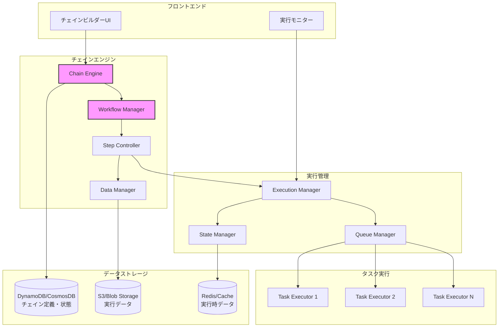
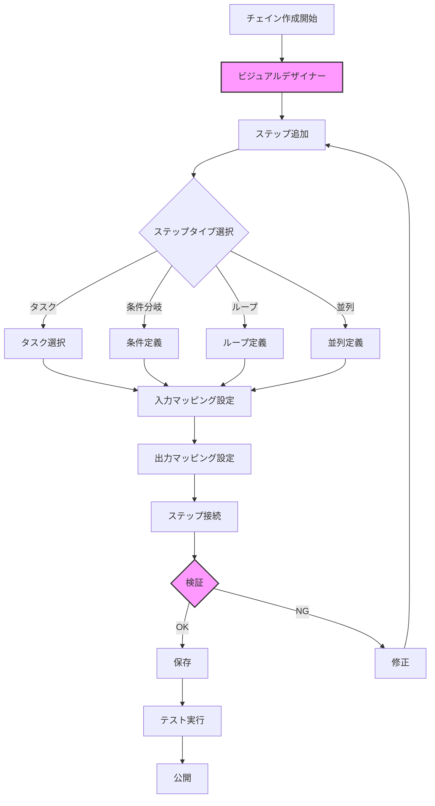
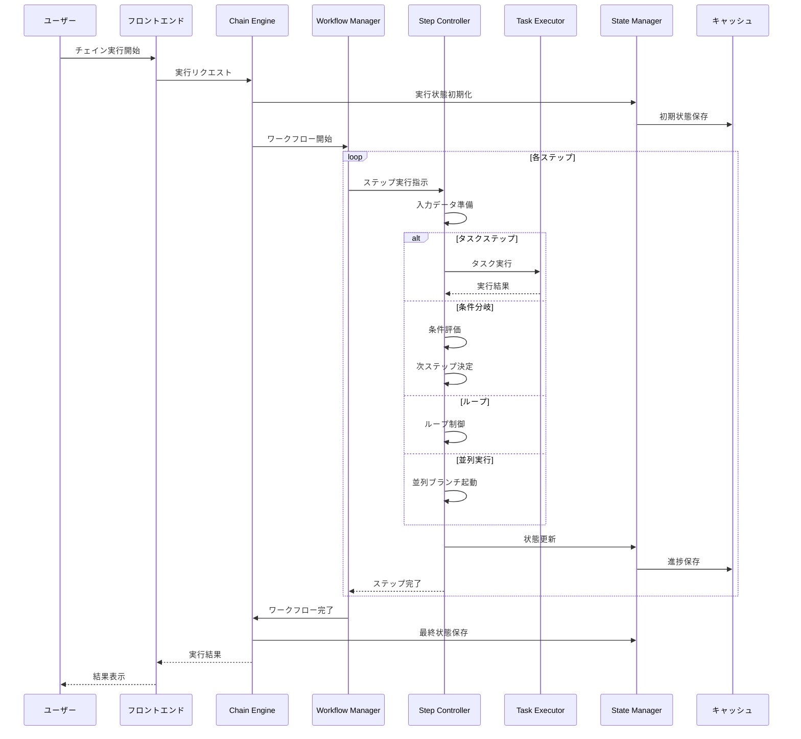

# チェイン仕様書

## 目次

1. [概要](#概要)
2. [チェインの目的](#チェインの目的)
3. [データ構造](#データ構造)
   - [チェイン](#チェイン)
   - [チェインステップ](#チェインステップ)
   - [ステップ間データフロー](#ステップ間データフロー)
   - [チェイン実行履歴](#チェイン実行履歴)
4. [公開範囲の仕様](#公開範囲の仕様)
5. [処理フロー](#処理フロー)
   - [チェイン作成](#チェイン作成)
   - [チェイン実行](#チェイン実行)
   - [エラーハンドリング](#エラーハンドリング)
6. [実行制御](#実行制御)
   - [条件分岐](#条件分岐)
   - [ループ処理](#ループ処理)
   - [並列実行](#並列実行)
7. [API仕様](#api仕様)
8. [ユースケース](#ユースケース)
9. [セキュリティ考慮事項](#セキュリティ考慮事項)
10. [更新履歴](#更新履歴)

## 概要

MAKOTO Visual AIのチェイン機能は、複数のタスクを連結して複雑なワークフローを構築できる機能です。各タスクの出力を次のタスクの入力として利用し、条件分岐やループ処理を含む高度な自動化を実現します。

### チェインシステムアーキテクチャ



## チェインの目的

1. **複雑なワークフローの自動化**
   - 複数のタスクを組み合わせた処理の自動実行
   - データの段階的な加工・変換
   - 多段階の意思決定プロセス

2. **再利用性の向上**
   - 既存タスクの組み合わせによる新機能の実現
   - ワークフローテンプレートの共有
   - モジュール化による保守性向上

3. **エラー処理の統一化**
   - ワークフロー全体でのエラーハンドリング
   - リトライ処理の自動化
   - フォールバック処理の実装

4. **実行の可視化**
   - ワークフローの進捗状況の可視化
   - ボトルネックの特定
   - デバッグの容易化

## データ構造

### チェイン

```typescript
interface Chain {
  // 基本情報
  chain_id: UUID;                  // チェインID
  name: string;                    // チェイン名（最大100文字）
  description?: string;            // 説明（最大500文字）
  category: ChainCategory;         // カテゴリー
  tags: string[];                  // タグ（最大10個）
  icon?: string;                   // アイコン
  
  // ステップ定義
  steps: ChainStep[];              // ステップ配列
  
  // 入力パラメータ定義
  input_parameters: ChainParameter[]; // チェイン全体の入力パラメータ
  
  // 出力定義
  output_mapping: OutputMapping;    // 最終出力のマッピング
  
  // 実行設定
  execution_config: ExecutionConfig; // 実行設定
  
  // 作成者情報
  created_by: UUID;                // 作成者ユーザーID
  created_at: DateTime;            // 作成日時
  updated_at: DateTime;            // 更新日時
  
  // バージョン管理
  version: number;                 // バージョン番号
  is_latest: boolean;              // 最新バージョンフラグ
  
  // 公開範囲（タスク・ライブラリと同一仕様）
  visibility: ChainVisibility;     // 公開範囲設定
  
  // ステータス
  status: ChainStatus;             // チェインステータス
  
  // 統計情報
  execution_count: number;         // 実行回数
  average_execution_time?: number; // 平均実行時間（秒）
  success_rate?: number;           // 成功率（%）
}

type ChainCategory = 
  | "data_processing"    // データ処理
  | "content_creation"   // コンテンツ作成
  | "analysis"           // 分析
  | "automation"         // 自動化
  | "integration"        // 統合処理
  | "other";            // その他

type ChainStatus = 
  | "draft"             // 下書き
  | "active"            // アクティブ
  | "testing"           // テスト中
  | "deprecated"        // 非推奨
  | "archived";         // アーカイブ済み
```

### チェインステップ

```typescript
interface ChainStep {
  // 基本情報
  step_id: string;                 // ステップID
  name: string;                    // ステップ名
  description?: string;            // 説明
  
  // 実行タイプ
  type: StepType;                  // ステップタイプ
  
  // タスク実行（type="task"の場合）
  task_config?: {
    task_id: UUID;                 // 実行するタスクID
    task_version?: number;         // タスクバージョン（省略時は最新）
  };
  
  // 制御フロー設定
  control_flow?: ControlFlow;      // 制御フロー設定
  
  // データマッピング
  input_mapping: InputMapping;     // 入力マッピング
  output_mapping: OutputMapping;   // 出力マッピング
  
  // 実行条件
  condition?: ExecutionCondition;  // 実行条件
  
  // エラーハンドリング
  error_handling?: ErrorHandling;  // エラー処理設定
  
  // 実行設定
  timeout?: number;                // タイムアウト（秒）
  retry_count?: number;            // リトライ回数
  
  // UI設定
  position?: {                     // ビジュアルエディタでの位置
    x: number;
    y: number;
  };
}

type StepType = 
  | "task"              // タスク実行
  | "condition"         // 条件分岐
  | "loop"              // ループ
  | "parallel"          // 並列実行
  | "wait"              // 待機
  | "transform"         // データ変換
  | "aggregate"         // データ集約
  | "output";           // 出力
```

### ステップ間データフロー

```typescript
interface InputMapping {
  // マッピングタイプ
  type: "direct" | "template" | "transform";
  
  // 直接マッピング
  direct_mappings?: Array<{
    target_param: string;          // 対象パラメータ名
    source: DataSource;            // データソース
  }>;
  
  // テンプレートマッピング
  template?: string;               // テンプレート文字列
  
  // 変換マッピング
  transform?: {
    function: TransformFunction;   // 変換関数
    parameters: Record<string, any>; // 変換パラメータ
  };
}

interface DataSource {
  type: "chain_input" | "step_output" | "constant" | "variable";
  
  // チェイン入力参照
  chain_input_name?: string;       // チェイン入力パラメータ名
  
  // ステップ出力参照
  step_id?: string;                // ソースステップID
  output_path?: string;            // 出力パス（例: "result.text"）
  
  // 定数値
  constant_value?: any;            // 定数値
  
  // 変数参照
  variable_name?: string;          // 変数名
}

type TransformFunction = 
  | "json_extract"      // JSON抽出
  | "text_split"        // テキスト分割
  | "text_join"         // テキスト結合
  | "array_map"         // 配列マッピング
  | "array_filter"      // 配列フィルタ
  | "array_reduce"      // 配列集約
  | "custom";           // カスタム関数
```

### 制御フロー

```typescript
interface ControlFlow {
  type: "sequential" | "conditional" | "loop" | "parallel";
  
  // 条件分岐
  conditional?: {
    conditions: Array<{
      expression: string;          // 条件式
      next_step_id: string;        // 次のステップID
    }>;
    default_step_id?: string;      // デフォルトステップID
  };
  
  // ループ処理
  loop?: {
    type: "for" | "while" | "foreach";
    
    // forループ
    for_config?: {
      start: number;               // 開始値
      end: number;                 // 終了値
      step: number;                // ステップ値
    };
    
    // whileループ
    while_config?: {
      condition: string;           // 継続条件
      max_iterations?: number;     // 最大繰り返し数
    };
    
    // foreachループ
    foreach_config?: {
      items_source: DataSource;    // 配列データソース
      item_variable: string;       // アイテム変数名
    };
    
    // ループ本体
    loop_steps: string[];          // ループ内ステップID
  };
  
  // 並列実行
  parallel?: {
    branches: Array<{
      branch_id: string;           // ブランチID
      step_ids: string[];          // ステップID配列
    }>;
    wait_all: boolean;             // 全完了待機フラグ
    aggregation?: AggregationConfig; // 結果集約設定
  };
}
```

### チェイン実行履歴

```typescript
interface ChainExecution {
  // 基本情報
  execution_id: UUID;              // 実行ID
  chain_id: UUID;                  // チェインID
  chain_version: number;           // 実行時のチェインバージョン
  
  // 実行者情報
  executed_by: UUID;               // 実行者ユーザーID
  started_at: DateTime;            // 開始日時
  completed_at?: DateTime;         // 完了日時
  
  // 入力データ
  input_parameters: Record<string, any>; // 入力パラメータ値
  
  // 実行状態
  status: ChainExecutionStatus;    // 実行ステータス
  current_step_id?: string;        // 現在のステップID
  
  // ステップ実行履歴
  step_executions: StepExecution[]; // ステップ実行履歴
  
  // 最終結果
  output?: Record<string, any>;    // 最終出力
  error?: ChainExecutionError;     // エラー情報
  
  // 実行メトリクス
  total_execution_time: number;    // 総実行時間（秒）
  total_tokens_used?: number;      // 総使用トークン数
  total_cost?: number;             // 総コスト（USD）
}

interface StepExecution {
  step_id: string;                 // ステップID
  step_name: string;               // ステップ名
  status: StepExecutionStatus;     // ステータス
  started_at: DateTime;            // 開始時刻
  completed_at?: DateTime;         // 完了時刻
  
  // 入出力データ
  input: Record<string, any>;      // 入力データ
  output?: Record<string, any>;    // 出力データ
  
  // タスク実行情報（タスクステップの場合）
  task_execution_id?: UUID;        // タスク実行ID
  
  // エラー情報
  error?: StepExecutionError;      // エラー詳細
  retry_count?: number;            // リトライ回数
}

type ChainExecutionStatus = 
  | "pending"           // 開始待ち
  | "running"           // 実行中
  | "paused"            // 一時停止
  | "completed"         // 完了
  | "failed"            // 失敗
  | "cancelled"         // キャンセル
  | "timeout";          // タイムアウト
```

## 公開範囲の仕様

チェインの公開範囲は、タスク・ライブラリと同一の仕様を採用します：

```typescript
interface ChainVisibility {
  // 公開タイプ
  visibility_type: VisibilityType;
  
  // 部署指定（AND条件）
  departments?: string[];          // 部署名リスト
  
  // 役職指定（AND条件）
  roles?: string[];                // 役職名リスト
  
  // ユーザー指定（OR条件）
  users?: UUID[];                  // ユーザーIDリスト
}
```

アクセス制御ロジックもタスク・ライブラリと完全に同一です。

## 処理フロー

### チェイン作成



### チェイン実行



### エラーハンドリング

```typescript
interface ErrorHandling {
  // エラー時の動作
  on_error: ErrorAction;
  
  // リトライ設定
  retry?: {
    max_attempts: number;          // 最大リトライ回数
    delay_ms: number;              // リトライ間隔（ミリ秒）
    backoff_multiplier?: number;   // バックオフ係数
  };
  
  // フォールバック
  fallback?: {
    type: "skip" | "default_value" | "alternate_step";
    default_value?: any;           // デフォルト値
    alternate_step_id?: string;    // 代替ステップID
  };
  
  // 通知設定
  notification?: {
    notify_user: boolean;          // ユーザー通知
    notify_admin: boolean;         // 管理者通知
    include_details: boolean;      // 詳細情報含有
  };
}

type ErrorAction = 
  | "stop"              // 即座に停止
  | "continue"          // エラーを無視して継続
  | "retry"             // リトライ
  | "skip"              // ステップをスキップ
  | "fallback";         // フォールバック処理
```

## 実行制御

### 条件分岐

```typescript
// 条件式の例
interface ConditionalExpression {
  // 単純な比較
  simple: {
    left: DataSource;              // 左辺値
    operator: ComparisonOperator;  // 比較演算子
    right: DataSource;             // 右辺値
  };
  
  // 複合条件
  complex: {
    type: "and" | "or";
    conditions: ConditionalExpression[];
  };
  
  // JavaScript式
  javascript: {
    expression: string;            // JS式
    context: Record<string, any>;  // 実行コンテキスト
  };
}

type ComparisonOperator = 
  | "=="    // 等しい
  | "!="    // 等しくない
  | ">"     // より大きい
  | "<"     // より小さい
  | ">="    // 以上
  | "<="    // 以下
  | "contains"   // 含む
  | "startsWith" // で始まる
  | "endsWith"   // で終わる
  | "matches";   // 正規表現マッチ
```

### ループ処理

```typescript
// ループ内での特殊変数
interface LoopContext {
  $index: number;                  // 現在のインデックス
  $item: any;                      // 現在のアイテム（foreach）
  $isFirst: boolean;               // 最初の繰り返しか
  $isLast: boolean;                // 最後の繰り返しか
  $accumulator: any;               // 累積値
}

// ループ制御
interface LoopControl {
  break_condition?: string;        // ループ中断条件
  continue_condition?: string;     // 次の繰り返しスキップ条件
  accumulator_init?: any;          // 累積値初期値
  accumulator_update?: string;     // 累積値更新式
}
```

### 並列実行

```typescript
// 並列実行の結果集約
interface AggregationConfig {
  type: AggregationType;
  
  // 配列結合
  array_concat?: {
    flatten: boolean;              // フラット化
  };
  
  // オブジェクトマージ
  object_merge?: {
    strategy: "shallow" | "deep";  // マージ戦略
    conflict_resolution: "first" | "last" | "error";
  };
  
  // カスタム集約
  custom?: {
    function: string;              // 集約関数
  };
}

type AggregationType = 
  | "array_concat"      // 配列として結合
  | "object_merge"      // オブジェクトとしてマージ
  | "first_completed"   // 最初に完了した結果
  | "all_results"       // 全結果を保持
  | "custom";          // カスタム集約
```

## API仕様

### エンドポイント一覧

1. **チェイン管理**
   - `GET /api/chains` - チェイン一覧取得
   - `POST /api/chains` - チェイン作成
   - `GET /api/chains/{chain_id}` - チェイン詳細取得
   - `PUT /api/chains/{chain_id}` - チェイン更新
   - `DELETE /api/chains/{chain_id}` - チェイン削除

2. **チェイン実行**
   - `POST /api/chains/{chain_id}/execute` - チェイン実行
   - `GET /api/chains/executions/{execution_id}` - 実行状態取得
   - `POST /api/chains/executions/{execution_id}/pause` - 実行一時停止
   - `POST /api/chains/executions/{execution_id}/resume` - 実行再開
   - `POST /api/chains/executions/{execution_id}/cancel` - 実行キャンセル

3. **実行履歴**
   - `GET /api/chains/{chain_id}/executions` - チェインの実行履歴
   - `GET /api/chains/executions` - ユーザーの全実行履歴

4. **テンプレート**
   - `GET /api/chains/templates` - チェインテンプレート一覧
   - `POST /api/chains/from-template` - テンプレートからチェイン作成

## ユースケース

### 1. ブログ記事作成ワークフロー

```typescript
{
  name: "SEOブログ記事作成ワークフロー",
  steps: [
    {
      step_id: "research",
      name: "キーワードリサーチ",
      type: "task",
      task_config: { task_id: "keyword-research-task" }
    },
    {
      step_id: "outline",
      name: "記事構成作成",
      type: "task",
      task_config: { task_id: "blog-outline-task" },
      input_mapping: {
        type: "direct",
        direct_mappings: [{
          target_param: "keywords",
          source: {
            type: "step_output",
            step_id: "research",
            output_path: "result.keywords"
          }
        }]
      }
    },
    {
      step_id: "write_sections",
      name: "セクション執筆",
      type: "loop",
      control_flow: {
        type: "loop",
        loop: {
          type: "foreach",
          foreach_config: {
            items_source: {
              type: "step_output",
              step_id: "outline",
              output_path: "result.sections"
            },
            item_variable: "section"
          },
          loop_steps: ["write_section"]
        }
      }
    },
    {
      step_id: "write_section",
      name: "セクション執筆",
      type: "task",
      task_config: { task_id: "write-section-task" }
    },
    {
      step_id: "finalize",
      name: "記事統合・最終調整",
      type: "task",
      task_config: { task_id: "finalize-blog-task" }
    }
  ]
}
```

### 2. データ分析レポート生成

```typescript
{
  name: "月次売上分析レポート",
  steps: [
    {
      step_id: "fetch_data",
      name: "データ取得",
      type: "parallel",
      control_flow: {
        type: "parallel",
        parallel: {
          branches: [
            {
              branch_id: "sales",
              step_ids: ["fetch_sales_data"]
            },
            {
              branch_id: "inventory",
              step_ids: ["fetch_inventory_data"]
            },
            {
              branch_id: "marketing",
              step_ids: ["fetch_marketing_data"]
            }
          ],
          wait_all: true,
          aggregation: { type: "object_merge" }
        }
      }
    },
    {
      step_id: "analyze",
      name: "データ分析",
      type: "task",
      task_config: { task_id: "sales-analysis-task" }
    },
    {
      step_id: "generate_charts",
      name: "グラフ生成",
      type: "task",
      task_config: { task_id: "chart-generation-task" }
    },
    {
      step_id: "create_report",
      name: "レポート作成",
      type: "task",
      task_config: { task_id: "report-creation-task" }
    }
  ]
}
```

### 3. カスタマーサポート自動応答

```typescript
{
  name: "問い合わせ自動処理",
  steps: [
    {
      step_id: "classify",
      name: "問い合わせ分類",
      type: "task",
      task_config: { task_id: "inquiry-classification-task" }
    },
    {
      step_id: "route",
      name: "ルーティング",
      type: "condition",
      control_flow: {
        type: "conditional",
        conditional: {
          conditions: [
            {
              expression: "output.category == 'technical'",
              next_step_id: "technical_support"
            },
            {
              expression: "output.category == 'billing'",
              next_step_id: "billing_support"
            },
            {
              expression: "output.urgency == 'high'",
              next_step_id: "escalate"
            }
          ],
          default_step_id: "general_support"
        }
      }
    },
    {
      step_id: "technical_support",
      name: "技術サポート回答生成",
      type: "task",
      task_config: { task_id: "technical-support-task" }
    },
    {
      step_id: "send_response",
      name: "回答送信",
      type: "task",
      task_config: { task_id: "send-email-task" }
    }
  ]
}
```

## セキュリティ考慮事項

1. **実行権限の管理**
   - チェイン実行権限の厳格な管理
   - ステップ内で呼び出されるタスクへのアクセス権限チェック
   - 実行時のテナント境界の保護

2. **データフローのセキュリティ**
   - ステップ間のデータ受け渡しの暗号化
   - 機密データのマスキング
   - 実行履歴の適切な保護

3. **リソース制限**
   - チェイン実行時間の上限設定
   - 並列実行数の制限
   - メモリ使用量の監視

4. **監査とモニタリング**
   - 全実行の詳細ログ記録
   - 異常パターンの検出
   - コスト追跡と制限

5. **エラー情報の管理**
   - エラー詳細の適切な隠蔽
   - デバッグ情報のアクセス制御
   - 機密情報の漏洩防止

## 更新履歴

- 2025-08-06: 初版作成
  - タスクをチェインする仕組みの定義
  - 条件分岐、ループ、並列実行の実装
  - タスク・ライブラリと同一の公開範囲設定
  - 詳細なエラーハンドリング仕様