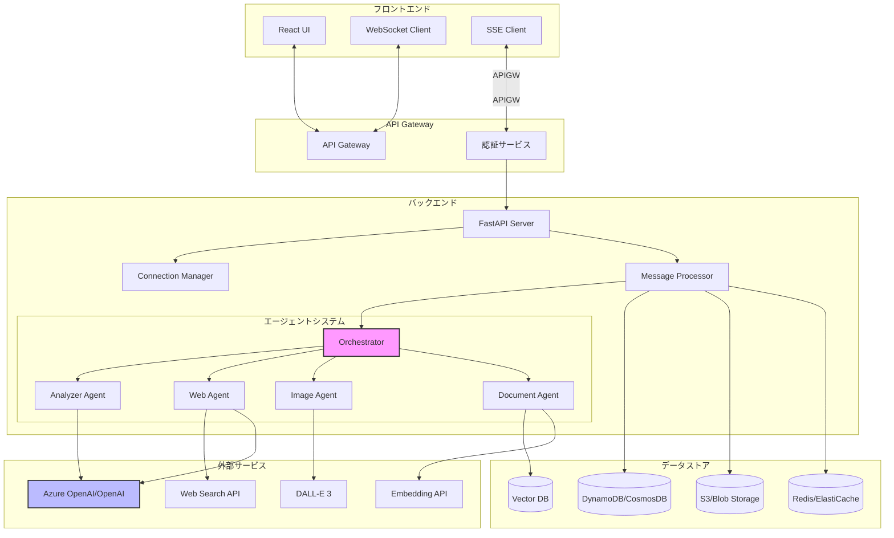
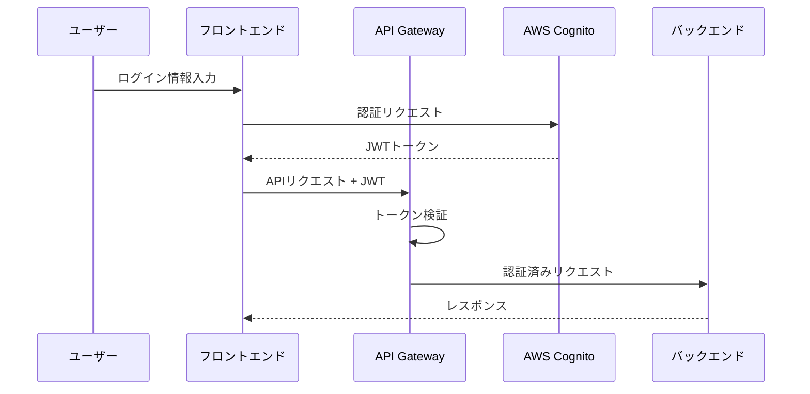
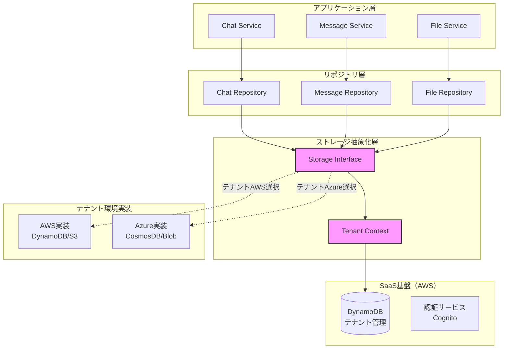
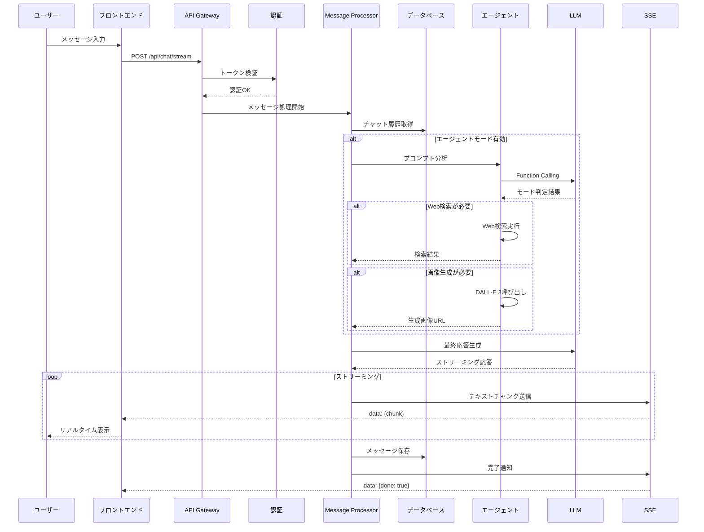
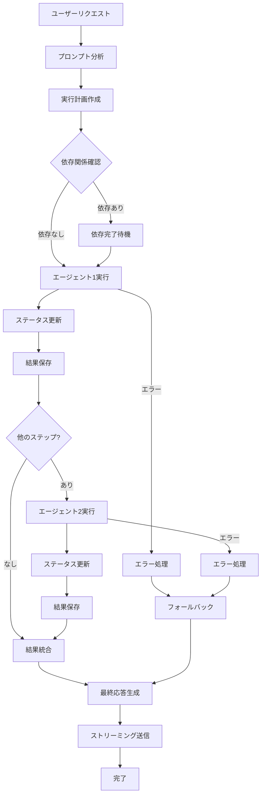
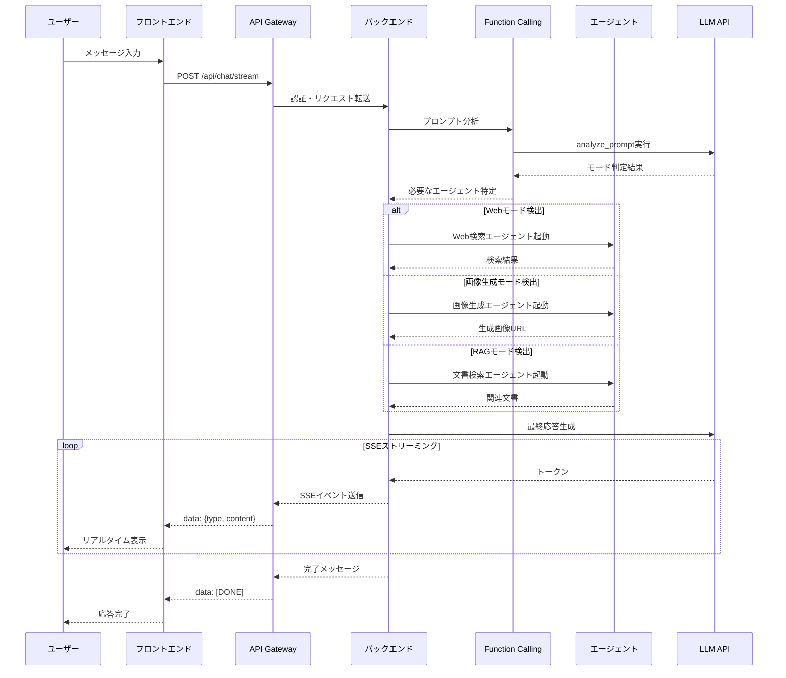

# チャット仕様書

## 目次

1. [概要](#概要)
2. [チャットシステムの目的](#チャットシステムの目的)
3. [システムアーキテクチャ](#システムアーキテクチャ)
   - [全体構成](#全体構成)
   - [技術スタック](#技術スタック)
4. [機能仕様](#機能仕様)
   - [基本機能](#基本機能)
   - [エージェント機能](#エージェント機能)
   - [マルチモード対応](#マルチモード対応)
5. [データ構造](#データ構造)
   - [チャット](#チャット)
   - [メッセージ](#メッセージ)
   - [エージェント実行情報](#エージェント実行情報)
6. [通信仕様](#通信仕様)
   - [WebSocket通信](#websocket通信)
   - [Server-Sent Events](#server-sent-events-1)
   - [REST API](#rest-api)
7. [エージェントシステム](#エージェントシステム)
   - [エージェントの種類](#エージェントの種類)
   - [オーケストレーション](#オーケストレーション)
   - [Function Calling](#function-calling)
8. [処理フロー](#処理フロー)
   - [メッセージ送信フロー](#メッセージ送信フロー)
   - [エージェント実行フロー](#エージェント実行フロー)
   - [ストリーミング応答フロー](#ストリーミング応答フロー)
9. [認証とセキュリティ](#認証とセキュリティ)
   - [認証フロー](#認証フロー)
   - [マルチテナント対応](#マルチテナント対応)
   - [セキュリティ考慮事項](#セキュリティ考慮事項)
10. [エラーハンドリング](#エラーハンドリング)
11. [パフォーマンス最適化](#パフォーマンス最適化)
12. [API仕様](#api仕様-1)
    - [チャットAPI](#チャットapi)
    - [エージェントAPI](#エージェントapi)
13. [フロントエンド実装](#フロントエンド実装)
14. [更新履歴](#更新履歴)

## 概要

MAKOTO Visual AIのチャットシステムは、LLM（Large Language Model）を活用したインテリジェントな対話システムです。ユーザーとAIアシスタントとの自然な会話を実現し、エージェント機能により文書検索、Web検索、画像生成など多様なタスクを自動的に実行します。

### 主な特徴

- **マルチモーダル対応**: テキスト、画像、文書を統合的に処理
- **リアルタイムストリーミング**: 文字単位での応答表示
- **インテリジェントエージェント**: タスクに応じた自動エージェント選択
- **マルチテナント**: 企業・組織ごとの独立した環境
- **高い拡張性**: プラグイン形式での機能追加

## チャットシステムの目的

1. **自然な対話インターフェース**
   - ユーザーが自然言語で質問や要求を伝えられる
   - コンテキストを維持した連続的な会話

2. **タスク自動実行**
   - ユーザーの意図を理解し、適切なエージェントを選択
   - Web検索、画像生成、文書分析を自動実行

3. **知識の活用**
   - アップロードされた文書をコンテキストとして活用（RAG）
   - 最新のWeb情報を取得して回答

4. **生産性向上**
   - 複雑なタスクを会話形式で簡単に実行
   - 複数の処理を組み合わせた高度な作業の自動化

## システムアーキテクチャ

### 全体構成



### 技術スタック

#### フロントエンド
- **フレームワーク**: React 18 + TypeScript
- **状態管理**: React Hooks (useState, useEffect)
- **スタイリング**: Tailwind CSS
- **通信**: Fetch API (SSE), WebSocket API
- **UIコンポーネント**: カスタムコンポーネント

#### バックエンド
- **フレームワーク**: FastAPI (Python 3.11+)
- **非同期処理**: asyncio
- **WebSocket**: FastAPI WebSocket
- **ストリーミング**: Server-Sent Events
- **Lambda**: AWS Lambda / Azure Functions

#### インフラストラクチャ
- **AWS環境**:
  - API Gateway + Lambda
  - DynamoDB (メタデータ)
  - S3 (ファイルストレージ)
  - OpenSearch (ベクトル検索)
  
- **Azure環境**:
  - API Management + Functions
  - CosmosDB (メタデータ)
  - Blob Storage (ファイルストレージ)
  - Cognitive Search (ベクトル検索)

## 機能仕様

### 基本機能

1. **テキストチャット**
   - リアルタイムメッセージ送受信
   - マークダウン形式のサポート
   - コード構文ハイライト
   - 絵文字対応

2. **会話履歴管理**
   - チャットルームの作成・削除
   - メッセージの永続化
   - 会話の検索機能
   - エクスポート機能

3. **ファイル添付**
   - ドラッグ&ドロップでのアップロード
   - 画像プレビュー
   - 文書ファイルの処理

### エージェント機能

1. **自動モード判定**
   - ユーザーの意図を分析
   - 最適なエージェントを選択
   - 複数エージェントの組み合わせ

2. **タスク実行状況の可視化**
   - リアルタイムステータス表示
   - プログレスインジケーター
   - 詳細ログの表示

3. **結果の統合**
   - 複数エージェントの結果を統合
   - 構造化された出力形式
   - インタラクティブな結果表示

### マルチモード対応

```typescript
interface ChatModes {
  chat: boolean;      // 通常のチャット
  web: boolean;       // Web検索
  image: boolean;     // 画像生成
  rag: boolean;       // RAG（文書検索）
  agent: boolean;     // 自動エージェント選択
}
```

## データ構造

### ストレージ構成

#### ⚠️⚠️⚠️ 重要：全メッセージS3/BlobStorage保存 ⚠️⚠️⚠️
**全てのメッセージはサイズに関わらずS3/BlobStorageに保存します！！！**
- ✅ **正しい実装**: 小さいメッセージも含めて全てS3/BlobStorageに保存
- ❌ **間違った実装**: 4KB未満はDynamoDB直接保存 → **絶対にやらない！**
- 📝 **理由**: 
  - 統一的なバックアップとアーカイブ
  - 分析用データの一元管理
  - 監査ログとしての完全性保証
  - ストレージコストの最適化（S3の方が安価）

#### テナント別バケット/コンテナ
各テナントは完全に独立したストレージを保有：
- **AWS S3**: `{tenant-id}-chat-data`（バケット名）
- **Azure Blob**: `chat-data`（コンテナ名）

#### ファイル構造
```
user_id/room_id/yyyy/mm/dd/hh-mm-ss.sssZ-msg_id.json
```

例：
```
user123/roomA/2025/08/05/12-34-56.789Z-msg_abc123.json
```

### メッセージデータ（1発言1ファイル）

```typescript
interface ChatMessage {
  // 識別子
  message_id: string;          // メッセージID
  user_id: string;             // ユーザーID
  room_id: string;             // チャットルームID
  
  // タイムスタンプ
  timestamp: string;           // ISO 8601形式（UTC）
  
  // メッセージ情報
  role: 'user' | 'assistant' | 'system';  // 送信者の役割
  text: string;                // メッセージ本文
  
  // RAGコンテキスト（非表示）
  context?: {
    rag_sources: Array<{
      title: string;           // ソースタイトル
      source: string;          // ソース種別（internal-db, web等）
      text: string;            // 参照されたテキスト
      score: number;           // 関連性スコア（0.0-1.0）
    }>;
  };
  
  // 添付ファイル
  attachments?: Array<{
    type: 'image' | 'pdf' | 'document' | 'audio' | 'video';
    url: string;               // ファイルURL（署名付き）
    thumbnail?: string;        // サムネイルURL（画像の場合）
    name?: string;             // ファイル名
    size?: number;             // ファイルサイズ（バイト）
  }>;
  
  // エージェント実行情報（assistantロールの場合）
  agent_info?: {
    mode: 'chat' | 'web' | 'image' | 'rag';
    execution_time_ms: number;
    tokens_used?: number;
  };
}
```

### チャットルームメタデータ

チャットルームの情報はDynamoDB/CosmosDBで管理：

```typescript
interface ChatRoom {
  // 識別子
  room_id: string;             // チャットルームID
  user_id: string;             // 所有者ID
  
  // 基本情報
  title: string;               // ルームタイトル
  created_at: string;          // 作成日時（ISO 8601）
  updated_at: string;          // 最終更新日時
  
  // 統計情報
  message_count: number;       // メッセージ数
  last_message?: {
    text: string;              // 最後のメッセージ（プレビュー）
    timestamp: string;         // タイムスタンプ
    role: string;              // 発言者役割
  };
  
  // 設定
  settings?: {
    system_prompt?: string;    // カスタムプロンプト
    temperature?: number;      // LLM温度設定
    active_modes?: string[];   // 有効なモード
  };
}
```

### ファイル格納構造

```
{tenant-bucket}/
├── {user_id}/
│   ├── chats/                 # チャットメッセージ
│   │   └── {room_id}/yyyy/mm/dd/*.json
│   ├── uploads/               # ユーザーアップロードファイル
│   │   └── yyyy/mm/dd/{file_id}_{filename}
│   ├── generated/             # AI生成ファイル
│   │   ├── images/
│   │   ├── audio/
│   │   └── documents/
│   └── thumbnails/            # 画像サムネイル
│       └── {file_id}_thumb.jpg
```

### DynamoDB/CosmosDBスキーマ

```python
# チャットルーム管理のみ（メッセージインデックスは削除）
PK: USER#{user_id}
SK: ROOM#{room_id}

# GSI: ユーザーの全ルーム
GSI1PK: USER#{user_id}
GSI1SK: UPDATED#{updated_at}
```

**設計変更**: 
- メッセージインデックスを削除（S3直接アクセスで十分な性能）
- チャットルーム毎の最大メッセージ数は500件程度
- DynamoDBにはチャットルーム情報のみ保存してシンプル化

### 分析用データ形式（JSONL）

バッチ分析用には、日次でJSONL形式に変換：

```
{user_id}/chats/{room_id}/analytics/yyyy/mm/dd/chatlog.jsonl
```

1行1メッセージのJSON Lines形式：
```json
{"message_id":"abc123","user_id":"user123","room_id":"roomA","timestamp":"2025-08-05T12:34:56.789Z","role":"user","text":"こんにちは"}
{"message_id":"def456","user_id":"user123","room_id":"roomA","timestamp":"2025-08-05T12:34:58.123Z","role":"assistant","text":"こんにちは！何かお手伝いできることはありますか？"}
```

### クロスクラウド分析対応

#### Azure Synapse Serverless SQLでの分析
```sql
SELECT 
  JSON_VALUE(doc, '$.user_id') AS user_id,
  JSON_VALUE(doc, '$.role') AS role,
  COUNT(*) AS message_count
FROM OPENROWSET(
  BULK 'https://{storage}.blob.core.windows.net/chat-data/*/chats/*/*/*/*/**.json',
  FORMAT='CSV',
  FIELDTERMINATOR='0x0b',
  FIELDQUOTE='0x0b'
) WITH (doc NVARCHAR(MAX)) AS messages
GROUP BY JSON_VALUE(doc, '$.user_id'), JSON_VALUE(doc, '$.role')
```

#### AWS Athenaでの分析
```sql
CREATE EXTERNAL TABLE chat_messages (
  message_id string,
  user_id string,
  room_id string,
  timestamp string,
  role string,
  text string
)
PARTITIONED BY (year string, month string, day string)
ROW FORMAT SERDE 'org.openx.data.jsonserde.JsonSerDe'
LOCATION 's3://{tenant-bucket}/'
```

### セキュリティとアクセス制御

#### S3/Blob Storage
- ユーザーごとにSASトークン/署名付きURL発行
- プレフィックス`{user_id}/`でアクセス制限
- クロステナントアクセスは完全に禁止

#### 分析アクセス
- SaaS提供側のSynapseワークスペースにRBACで読み取り権限付与
- またはSASトークンによる一時的アクセス許可

### ストリーミングイベント

Server-Sent Eventsで送信されるイベントの型定義：

```typescript
// テキストチャンクイベント
interface TextChunkEvent {
  type: 'text';
  content: string;             // テキストの断片
}

// 画像生成中イベント
interface ImageGeneratingEvent {
  type: 'generating_image';
  generating_image: true;
}

// 画像生成完了イベント
interface ImageGeneratedEvent {
  type: 'images';
  images: Array<{
    url: string;               // 画像URL
    prompt: string;            // 生成プロンプト
  }>;
}

// エラーイベント
interface StreamErrorEvent {
  type: 'error';
  error: string;               // エラーメッセージ
}

// 完了イベント
interface StreamCompleteEvent {
  type: 'done';
  done: true;
  chat_id: string;            // チャットID
  message_id: string;         // 生成されたメッセージID
}
```

## 通信プロトコル

### HTTP API

基本的なCRUD操作はRESTful APIで実装：

```typescript
// チャット一覧取得
GET /api/chats
Response: Chat[]

// チャット作成
POST /api/chats
Body: { title?: string }
Response: Chat

// メッセージ送信（非ストリーミング）
POST /api/chats/{chat_id}/messages
Body: {
  content: string;
  images?: string[];
  files?: File[];
  modes?: ChatMode[];
}
Response: Message
```

### Server-Sent Events

ストリーミング応答にはSSEを使用：

```typescript
// ストリーミングメッセージ送信
POST /api/chatgpt/stream
Headers: {
  'Content-Type': 'application/json',
  'Accept': 'text/event-stream'
}
Body: {
  messages: Message[];
  chat_id?: string;
  modes?: ChatMode[];
  stream: true;
}

// レスポンス形式
data: {"content": "こんにちは"}
data: {"content": "、"}
data: {"content": "何か"}
data: {"generating_image": true}
data: {"images": [{"url": "...", "prompt": "..."}]}
data: {"done": true, "chat_id": "...", "message_id": "..."}
```

### WebSocket

リアルタイム双方向通信にはWebSocketを使用：

```typescript
// 接続
ws://localhost:8000/ws?token={jwt_token}

// メッセージ送信
{
  "action": "chat",
  "data": {
    "content": "メッセージ内容",
    "chat_id": "...",
    "modes": ["chat"]
  }
}

// メッセージ受信
{
  "action": "message",
  "data": {
    "type": "text",
    "content": "応答内容"
  }
}

```

## 認証・認可

### 認証フロー



### マルチテナント対応

#### テナントコンテキスト
```python
@tenant_aware
async def lambda_handler(raw_event, context, tenant_context):
    """
    tenant_context: {
        'tenant_id': 'tenant-123',
        'user_id': 'user-456',
        'config': {
            'dynamodb_table_prefix': 'makoto-tenant123-',
            's3_bucket': 'makoto-tenant123-assets',
            'features': {...}
        }
    }
    """
```

#### データ分離
- **DynamoDB**: パーティションキーにテナントIDを含める
  ```
  PK: TENANT#tenant-123#CHAT#chat-456
  SK: MESSAGE#message-789
  ```

- **S3**: テナントごとのプレフィックス
  ```
  s3://bucket/{tenant_id}/chats/{chat_id}/attachments/
  ```

## エラーハンドリング

### エラーレスポンス形式

```typescript
interface ErrorResponse {
  error: {
    code: string;              // エラーコード
    message: string;           // エラーメッセージ
    details?: any;             // 詳細情報
  };
  status: number;              // HTTPステータスコード
  timestamp: string;           // タイムスタンプ
}
```

### エラーコード体系

```typescript
enum ErrorCode {
  // 認証関連
  AUTH_INVALID_TOKEN = 'AUTH001',
  AUTH_TOKEN_EXPIRED = 'AUTH002',
  AUTH_INSUFFICIENT_PERMISSIONS = 'AUTH003',
  
  // チャット関連
  CHAT_NOT_FOUND = 'CHAT001',
  CHAT_ACCESS_DENIED = 'CHAT002',
  CHAT_LIMIT_EXCEEDED = 'CHAT003',
  
  // メッセージ関連
  MESSAGE_INVALID_FORMAT = 'MSG001',
  MESSAGE_RATE_LIMIT = 'MSG002',
  
  // システム関連
  INTERNAL_SERVER_ERROR = 'SYS001',
  SERVICE_UNAVAILABLE = 'SYS002',
  TIMEOUT = 'SYS003'
}
```

### フロントエンドでのエラー処理

```typescript
// ストリーミング中のエラー処理
const handleStreamError = (error: StreamErrorEvent) => {
  if (error.error.includes('rate limit')) {
    showNotification('レート制限に達しました。しばらくお待ちください。');
  } else if (error.error.includes('token')) {
    redirectToLogin();
  } else {
    showNotification('エラーが発生しました: ' + error.error);
  }
};

// API呼び出しのエラー処理
try {
  const response = await chatApi.sendMessage(request);
} catch (error) {
  if (error.status === 401) {
    // 認証エラー
    await refreshToken();
  } else if (error.status === 429) {
    // レート制限
    await delay(error.retryAfter);
  } else {
    // その他のエラー
    console.error('API Error:', error);
  }
}
```


## データ保存の抽象化レイヤー

### 概要

MAKOTO Visual AIはSaaS型のマルチテナントシステムとして設計されており、SaaS基盤はAWS上で動作しますが、各テナントはAWSまたはAzureのいずれかの環境を選択できます。このため、テナントの環境に依存しない統一的なデータアクセスを実現する抽象化レイヤーが必要となります。

### アーキテクチャ



### ストレージインターフェース

```python
from abc import ABC, abstractmethod
from typing import Dict, List, Optional, Any

class StorageInterface(ABC):
    """ストレージの抽象基底クラス"""
    
    @abstractmethod
    async def get(self, key: str) -> Optional[Dict[str, Any]]:
        """データの取得"""
        pass
    
    @abstractmethod
    async def put(self, key: str, item: Dict[str, Any]) -> None:
        """データの保存"""
        pass
    
    @abstractmethod
    async def delete(self, key: str) -> None:
        """データの削除"""
        pass
    
    @abstractmethod
    async def query(self, **kwargs) -> List[Dict[str, Any]]:
        """データのクエリ"""
        pass
    
    @abstractmethod
    async def batch_get(self, keys: List[str]) -> List[Optional[Dict[str, Any]]]:
        """バッチ取得"""
        pass
```

### 実装例

#### AWS実装（DynamoDB + S3）
```python
class AWSStorage(StorageInterface):
    """AWS環境用ストレージ実装（DynamoDB + S3）"""
    
    def __init__(self, tenant_config: TenantConfig):
        self.tenant_id = tenant_config.tenant_id
        self.table_name = tenant_config.dynamodb_table
        self.bucket_name = tenant_config.s3_bucket
        self.dynamodb = boto3.resource('dynamodb', region_name=tenant_config.region)
        self.table = self.dynamodb.Table(self.table_name)
        self.s3_client = boto3.client('s3', region_name=tenant_config.region)
    
    async def get(self, key: str) -> Optional[Dict[str, Any]]:
        response = self.table.get_item(
            Key={
                'PK': f'TENANT#{self.tenant_id}',
                'SK': key
            }
        )
        return response.get('Item')
    
    async def put(self, key: str, item: Dict[str, Any]) -> None:
        item['PK'] = f'TENANT#{self.tenant_id}'
        item['SK'] = key
        self.table.put_item(Item=item)
    
    async def query(self, **kwargs) -> List[Dict[str, Any]]:
        response = self.table.query(
            KeyConditionExpression=Key('PK').eq(f'TENANT#{self.tenant_id}'),
            FilterExpression=self._build_filter_expression(kwargs)
        )
        return response['Items']
```

#### Azure実装（CosmosDB + Blob Storage）
```python
class AzureStorage(StorageInterface):
    """Azure環境用ストレージ実装（CosmosDB + Blob Storage）"""
    
    def __init__(self, tenant_config: TenantConfig):
        self.tenant_id = tenant_config.tenant_id
        self.cosmos_endpoint = tenant_config.cosmos_endpoint
        self.cosmos_key = tenant_config.cosmos_key
        self.database_name = tenant_config.cosmos_database
        self.container_name = tenant_config.cosmos_container
        self.blob_connection = tenant_config.blob_connection_string
        
        # CosmosDB クライアント初期化
        self.cosmos_client = CosmosClient(self.cosmos_endpoint, self.cosmos_key)
        self.database = self.cosmos_client.get_database_client(self.database_name)
        self.container = self.database.get_container_client(self.container_name)
        
        # Blob Storage クライアント初期化
        self.blob_service_client = BlobServiceClient.from_connection_string(self.blob_connection)
    
    async def get(self, key: str) -> Optional[Dict[str, Any]]:
        try:
            response = self.container.read_item(
                item=key,
                partition_key=self.tenant_id
            )
            return response
        except exceptions.CosmosResourceNotFoundError:
            return None
    
    async def put(self, key: str, item: Dict[str, Any]) -> None:
        item['id'] = key
        item['partitionKey'] = self.tenant_id
        self.container.upsert_item(body=item)
    
    async def query(self, **kwargs) -> List[Dict[str, Any]]:
        query = f"SELECT * FROM c WHERE c.partitionKey = '{self.tenant_id}'"
        for field, value in kwargs.items():
            query += f" AND c.{field} = '{value}'"
        
        items = list(self.container.query_items(
            query=query,
            enable_cross_partition_query=False
        ))
        return items
```

### リポジトリパターン

```python
class ChatRepository:
    """チャットリポジトリ"""
    
    def __init__(self, storage: StorageInterface, tenant_context: TenantContext):
        self.storage = storage
        self.tenant_context = tenant_context
    
    async def get_chat(self, chat_id: str) -> Optional[Chat]:
        """チャットの取得"""
        key = f"CHAT#{chat_id}"
        data = await self.storage.get(key)
        return Chat.from_dict(data) if data else None
    
    async def save_chat(self, chat: Chat) -> None:
        """チャットの保存"""
        key = f"CHAT#{chat.id}"
        await self.storage.put(key, chat.to_dict())
    
    async def list_chats(self, user_id: str) -> List[Chat]:
        """ユーザーのチャット一覧取得"""
        results = await self.storage.query(
            entity_type='CHAT',
            user_id=user_id,
            tenant_id=self.tenant_context.tenant_id
        )
        return [Chat.from_dict(r) for r in results]
    
    async def delete_chat(self, chat_id: str) -> None:
        """チャットの削除"""
        key = f"CHAT#{chat_id}"
        await self.storage.delete(key)
```

### ストレージ設計

#### S3/Blob Storageのキー設計

マルチユーザー・マルチチャットルーム環境では、以下のキー構造を採用します：

```
# メッセージデータ（バッチ保存）
{tenant_id}/messages/{user_id}/{chat_id}/{date}/messages.jsonl

# 添付ファイル
{tenant_id}/attachments/{user_id}/{chat_id}/{file_id}

# 生成画像
{tenant_id}/generated/{user_id}/{chat_id}/{image_id}

# 大容量メッセージ（10KB以上）
{tenant_id}/large-messages/{user_id}/{chat_id}/{message_id}.json
```

#### メタデータ管理（DynamoDB/CosmosDB）

検索性とパフォーマンスのため、メッセージのメタデータはデータベースで管理：

```python
# DynamoDBのキー設計
PK: TENANT#{tenant_id}#USER#{user_id}
SK: CHAT#{chat_id}#MSG#{timestamp}#{message_id}

# インデックス
GSI1PK: TENANT#{tenant_id}#CHAT#{chat_id}
GSI1SK: MSG#{timestamp}#{message_id}
```

### ファイルストレージ抽象化

```python
class FileStorageInterface(ABC):
    """ファイルストレージの抽象基底クラス"""
    
    @abstractmethod
    async def upload(self, key: str, content: bytes, metadata: Dict[str, str]) -> str:
        """ファイルのアップロード"""
        pass
    
    @abstractmethod
    async def download(self, key: str) -> bytes:
        """ファイルのダウンロード"""
        pass
    
    @abstractmethod
    async def delete(self, key: str) -> None:
        """ファイルの削除"""
        pass
    
    @abstractmethod
    async def generate_presigned_url(self, key: str, expires_in: int = 3600) -> str:
        """署名付きURLの生成"""
        pass
    
    @abstractmethod
    async def list_objects(self, prefix: str, max_keys: int = 1000) -> List[str]:
        """オブジェクト一覧の取得"""
        pass

class S3FileStorage(FileStorageInterface):
    """S3ファイルストレージ実装"""
    
    def __init__(self, bucket_name: str, tenant_id: str):
        self.bucket_name = bucket_name
        self.tenant_id = tenant_id
        self.s3_client = boto3.client('s3')
    
    async def upload(self, key: str, content: bytes, metadata: Dict[str, str]) -> str:
        full_key = f"{self.tenant_id}/{key}"
        
        self.s3_client.put_object(
            Bucket=self.bucket_name,
            Key=full_key,
            Body=content,
            Metadata=metadata
        )
        
        return f"s3://{self.bucket_name}/{full_key}"
    
    async def generate_presigned_url(self, key: str, expires_in: int = 3600) -> str:
        full_key = f"{self.tenant_id}/{key}"
        
        url = self.s3_client.generate_presigned_url(
            'get_object',
            Params={'Bucket': self.bucket_name, 'Key': full_key},
            ExpiresIn=expires_in
        )
        
        return url
```

class BlobFileStorage(FileStorageInterface):
    """Azure Blob Storageファイルストレージ実装"""
    
    def __init__(self, container_name: str, tenant_id: str, connection_string: str):
        self.container_name = container_name
        self.tenant_id = tenant_id
        self.blob_service_client = BlobServiceClient.from_connection_string(connection_string)
        self.container_client = self.blob_service_client.get_container_client(container_name)
    
    async def upload(self, key: str, content: bytes, metadata: Dict[str, str]) -> str:
        full_key = f"{self.tenant_id}/{key}"
        blob_client = self.container_client.get_blob_client(full_key)
        
        await blob_client.upload_blob(
            content,
            metadata=metadata,
            overwrite=True
        )
        
        return f"https://{self.blob_service_client.account_name}.blob.core.windows.net/{self.container_name}/{full_key}"
    
    async def generate_presigned_url(self, key: str, expires_in: int = 3600) -> str:
        full_key = f"{self.tenant_id}/{key}"
        blob_client = self.container_client.get_blob_client(full_key)
        
        sas_token = generate_blob_sas(
            account_name=self.blob_service_client.account_name,
            container_name=self.container_name,
            blob_name=full_key,
            permission=BlobSasPermissions(read=True),
            expiry=datetime.utcnow() + timedelta(seconds=expires_in)
        )
        
        return f"{blob_client.url}?{sas_token}"
```

### ストレージファクトリー

```python
class StorageFactory:
    """テナントの環境に応じたストレージ実装を生成するファクトリー"""
    
    @staticmethod
    def create_storage(
        tenant_context: TenantContext
    ) -> StorageInterface:
        """ストレージインスタンスの生成"""
        
        if tenant_context.cloud_provider == "aws":
            return AWSStorage(tenant_context.config)
        
        elif tenant_context.cloud_provider == "azure":
            return AzureStorage(tenant_context.config)
        
        else:
            raise ValueError(f"Unknown cloud provider: {tenant_context.cloud_provider}")
    
    @staticmethod
    def create_file_storage(
        tenant_context: TenantContext
    ) -> FileStorageInterface:
        """ファイルストレージインスタンスの生成"""
        
        if tenant_context.cloud_provider == "aws":
            return S3FileStorage(
                bucket_name=tenant_context.config.s3_bucket,
                tenant_id=tenant_context.tenant_id
            )
        
        elif tenant_context.cloud_provider == "azure":
            return BlobFileStorage(
                container_name=tenant_context.config.blob_container,
                tenant_id=tenant_context.tenant_id,
                connection_string=tenant_context.config.blob_connection_string
            )
        
        else:
            raise ValueError(f"Unknown cloud provider: {tenant_context.cloud_provider}")
```

### Lambda最適化のポイント

Lambdaの特性を考慮した設計：

1. **即座に保存**
   - Lambdaは実行時間で課金されるため、待機時間は無駄
   - メッセージは受信したら即座にS3とDynamoDBに保存

2. **ステートレス設計**
   - Lambdaはステートレスなため、メモリにバッファを持たない
   - 各実行は独立しており、前回の状態を保持しない

3. **並列処理の活用**
   - S3とDynamoDBへの保存を並列実行
   - Promise.all()やasyncio.gather()で高速化

```python
# Lambda最適化例
async def save_message_optimized(message: ChatMessage):
    """Lambda最適化されたメッセージ保存"""
    # S3とDynamoDBへの保存を並列実行
    await asyncio.gather(
        storage.upload_to_s3(message),
        db.save_metadata(message)
    )
```

### シンプルなメッセージ保存実装

```python
class SimpleChatStorage:
    """1発言1ファイル形式のシンプルなメッセージ保存"""
    
    def __init__(self, storage: FileStorageInterface, db: StorageInterface):
        self.storage = storage
        self.db = db
        
    async def save_message(self, user_id: str, room_id: str, 
                          message: ChatMessage):
        """メッセージを即座に保存"""
        # 1. タイムスタンプとキーの生成
        timestamp_str = datetime.utcnow().strftime("%Y-%m-%dT%H:%M:%S.%f")[:-3] + "Z"
        date_parts = timestamp_str.split("T")[0].split("-")
        time_part = timestamp_str.split("T")[1].replace(":", "-")
        
        # ファイルパス: user_id/room_id/yyyy/mm/dd/hh-mm-ss.sssZ-msg_id.json
        s3_key = f"{user_id}/chats/{room_id}/{date_parts[0]}/{date_parts[1]}/{date_parts[2]}/{time_part}-{message.message_id}.json"
        
        # メッセージデータ
        message_data = {
            "message_id": message.message_id,
            "user_id": user_id,
            "room_id": room_id,
            "timestamp": timestamp_str,
            "role": message.role,
            "text": message.text,
        }
        
        # オプションフィールド
        if message.context:
            message_data["context"] = message.context
        if message.attachments:
            message_data["attachments"] = message.attachments
        if message.agent_info:
            message_data["agent_info"] = message.agent_info
        
        # S3/Blob Storageに保存
        await self.storage.upload(
            key=s3_key,
            content=json.dumps(message_data, ensure_ascii=False).encode('utf-8'),
            metadata={
                'user_id': user_id,
                'room_id': room_id,
                'message_id': message.message_id,
                'role': message.role
            }
        )
        
        # 2. DynamoDBでチャットルーム情報を更新
        # シンプルな単一更新（メッセージインデックスは削除）
        await self.db.update_item(
            Key={
                'PK': f'USER#{user_id}',
                'SK': f'ROOM#{room_id}'
            },
            UpdateExpression='ADD message_count :inc SET updated_at = :updated, last_message = :last_msg',
            ExpressionAttributeValues={
                ':inc': 1,
                ':updated': timestamp_str,
                ':last_msg': {
                    'text': message.text[:100] if len(message.text) > 100 else message.text,
                    'timestamp': timestamp_str,
                    'role': message.role
                }
            }
        )
            
    async def get_messages_metadata(self, user_id: str, room_id: str, 
                                   continuation_token: str = None) -> dict:
        """メッセージのメタ情報を取得（ページング対応）"""
        
        params = {
            'Bucket': self.bucket_name,
            'Prefix': f"{user_id}/chats/{room_id}/",
            'MaxKeys': 1000  # S3の上限
        }
        
        # ページング用の継続トークン
        if continuation_token:
            params['ContinuationToken'] = continuation_token
        
        response = await self.storage.list_objects_v2(**params)
        
        return {
            "messages": [
                {
                    "key": obj["Key"],
                    "last_modified": obj["LastModified"].isoformat(),
                    "size": obj["Size"]
                }
                for obj in response.get("Contents", [])
            ],
            "is_truncated": response.get("IsTruncated", False),
            "next_continuation_token": response.get("NextContinuationToken")
        }
    
    async def get_all_messages_metadata(self, user_id: str, room_id: str) -> list:
        """全メッセージのメタ情報を取得（ページング自動処理）"""
        all_messages = []
        continuation_token = None
        
        while True:
            batch = await self.get_messages_metadata(user_id, room_id, continuation_token)
            all_messages.extend(batch["messages"])
            
            if not batch["is_truncated"]:
                break
                
            continuation_token = batch["next_continuation_token"]
        
        return all_messages
    
    async def get_latest_messages(self, user_id: str, room_id: str, limit: int = 20) -> List[Message]:
        """最新メッセージを取得（クライアント側ソート方式）"""
        
        # 1. 全件メタ情報取得（ページング対応）
        all_metadata = await self.get_all_messages_metadata(user_id, room_id)
        
        # 2. キー名でソート（最新が先頭）
        sorted_metadata = sorted(all_metadata, key=lambda x: x["key"], reverse=True)
        
        # 3. 最新N件のキーを取得
        latest_keys = [meta["key"] for meta in sorted_metadata[:limit]]
        
        # 4. メッセージ本文を並列取得
        messages = []
        for key in latest_keys:
            content = await self.storage.download(key)
            message_data = json.loads(content.decode('utf-8'))
            messages.append(ChatMessage.from_dict(message_data))
        
        # 5. 時系列順に並び替え（古い→新しい）
        return sorted(messages, key=lambda m: m.timestamp)
```

### 使用例

```python
# FastAPIのDI（Dependency Injection）での使用
async def get_storage(
    tenant_context: TenantContext = Depends(get_tenant_context)
) -> StorageInterface:
    """ストレージインスタンスの取得"""
    return StorageFactory.create_storage(tenant_context)

async def get_chat_repository(
    storage: StorageInterface = Depends(get_storage),
    tenant_context: TenantContext = Depends(get_tenant_context)
) -> ChatRepository:
    """チャットリポジトリの取得"""
    return ChatRepository(storage, tenant_context)

async def get_message_batch_service(
    storage: FileStorageInterface = Depends(get_file_storage),
    db: StorageInterface = Depends(get_storage),
    tenant_context: TenantContext = Depends(get_tenant_context)
) -> MessageBatchService:
    """メッセージバッチサービスの取得"""
    service = MessageBatchService(storage, db)
    service.tenant_id = tenant_context.tenant_id
    return service

# エンドポイントでの使用
@router.post("/chats/{chat_id}/messages")
async def send_message(
    chat_id: str,
    request: MessageRequest,
    current_user: User = Depends(get_current_user),
    batch_service: MessageBatchService = Depends(get_message_batch_service)
):
    """メッセージ送信（バッチ保存対応）"""
    message = Message(
        id=generate_uuid(),
        chat_id=chat_id,
        user_id=current_user.id,
        content=request.content,
        created_at=datetime.now()
    )
    
    # バッチサービスで効率的に保存
    await batch_service.add_message(message)
    
    return {"message_id": message.id}
```

### トランザクション管理

```python
class TransactionManager:
    """トランザクション管理"""
    
    def __init__(self, storage: StorageInterface):
        self.storage = storage
        self.operations = []
    
    def add_operation(self, operation: Callable):
        """操作の追加"""
        self.operations.append(operation)
    
    async def commit(self):
        """トランザクションのコミット"""
        try:
            for operation in self.operations:
                await operation()
        except Exception as e:
            # ロールバック処理
            await self.rollback()
            raise e
    
    async def rollback(self):
        """ロールバック処理"""
        # 実装は使用するストレージに依存
        pass
```

## セキュリティ考慮事項

### 1. 認証・認可
- すべてのAPIエンドポイントでJWT認証を必須化
- テナント間のデータアクセスを完全に分離
- 最小権限の原則に基づくアクセス制御

### 2. データ保護
- 通信はHTTPS/WSSで暗号化
- S3、DynamoDBのデータは暗号化（保存時）
- 個人情報のマスキング処理

### 3. 入力検証
- SQLインジェクション対策
- XSS対策（HTMLエスケープ）
- ファイルアップロードの検証
  - MIMEタイプチェック
  - ファイルサイズ制限
  - ウイルススキャン

### 4. レート制限
```typescript
interface RateLimits {
  messages_per_minute: 10;      // 1分あたりのメッセージ数
  messages_per_hour: 100;       // 1時間あたりのメッセージ数
  file_uploads_per_hour: 20;    // 1時間あたりのファイルアップロード数
  max_file_size_mb: 10;         // 最大ファイルサイズ（MB）
}
```

### 5. 監査ログ
- すべてのAPIアクセスをログ記録
- メッセージの作成・編集・削除を追跡
- 異常なアクセスパターンの検知

## API仕様

### エンドポイント一覧

#### チャット管理
- `GET /api/chats` - チャット一覧取得
- `POST /api/chats` - 新規チャット作成
- `GET /api/chats/{chat_id}` - チャット詳細取得
- `PUT /api/chats/{chat_id}` - チャット更新
- `DELETE /api/chats/{chat_id}` - チャット削除
- `POST /api/chats/bulk-delete` - チャット一括削除

#### メッセージ管理
- `GET /api/chats/{chat_id}/messages` - メッセージ一覧取得
- `POST /api/chats/{chat_id}/messages` - メッセージ送信
- `PUT /api/messages/{message_id}` - メッセージ編集
- `DELETE /api/messages/{message_id}` - メッセージ削除
- `POST /api/messages/{message_id}/regenerate` - メッセージ再生成

#### ストリーミング
- `POST /api/chatgpt/stream` - ストリーミングメッセージ送信

#### ファイル管理
- `POST /api/files/upload` - ファイルアップロード
- `GET /api/files/{file_id}` - ファイルダウンロード

### リクエスト/レスポンス例

#### チャット作成
```http
POST /api/chats
Content-Type: application/json
Authorization: Bearer {jwt_token}

{
  "title": "新しいチャット"
}

Response:
{
  "id": "chat-123",
  "title": "新しいチャット",
  "created_at": "2025-08-05T10:00:00Z",
  "updated_at": "2025-08-05T10:00:00Z",
  "message_count": 0
}
```

#### ストリーミングメッセージ送信
```http
POST /api/chatgpt/stream
Content-Type: application/json
Accept: text/event-stream
Authorization: Bearer {jwt_token}

{
  "messages": [
    {
      "role": "user",
      "content": "こんにちは"
    }
  ],
  "chat_id": "chat-123",
  "modes": ["chat"],
  "stream": true
}

Response (SSE):
data: {"content": "こんにちは"}
data: {"content": "！"}
data: {"content": " "}
data: {"content": "何か"}
data: {"content": "お手伝い"}
data: {"content": "できる"}
data: {"content": "ことは"}
data: {"content": "ありますか"}
data: {"content": "？"}
data: {"done": true, "chat_id": "chat-123", "message_id": "msg-456"}
```

## 実装例

### フロントエンド - メッセージ送信

```typescript
// hooks/useChat.ts
export const useChat = (chatId: string) => {
  const [messages, setMessages] = useState<Message[]>([]);
  const [isLoading, setIsLoading] = useState(false);

  const sendMessage = async (
    content: string,
    files?: File[],
    modes?: ChatMode[]
  ) => {
    setIsLoading(true);
    
    try {
      // ユーザーメッセージを即座に表示
      const userMessage: Message = {
        id: generateTempId(),
        chat_id: chatId,
        role: 'user',
        content,
        created_at: new Date().toISOString()
      };
      setMessages(prev => [...prev, userMessage]);

      // ストリーミング応答を受信
      let assistantMessage = '';
      await chatGPTApi.streamMessage(
        {
          messages: [...messages, userMessage],
          chat_id: chatId,
          modes: modes || ['chat'],
          stream: true
        },
        // テキストチャンク受信時
        (chunk) => {
          assistantMessage += chunk.content;
          updateAssistantMessage(assistantMessage);
        },
        // 完了時
        (data) => {
          finalizeAssistantMessage(data.message_id);
        },
        // エラー時
        (error) => {
          showError(error);
        }
      );
    } finally {
      setIsLoading(false);
    }
  };

  return { messages, sendMessage, isLoading };
};
```

### バックエンド - ストリーミング処理

```python
# api/chat.py
@router.post("/chatgpt/stream")
async def stream_chat(
    request: StreamChatRequest,
    background_tasks: BackgroundTasks,
    current_user: User = Depends(get_current_user)
):
    """ストリーミングチャット応答"""
    
    async def generate():
        try:
            # OpenAI APIを呼び出し
            stream = await openai.chat.completions.create(
                model="gpt-4",
                messages=request.messages,
                stream=True
            )
            
            # チャンクごとに送信
            full_response = ""
            async for chunk in stream:
                if chunk.choices[0].delta.content:
                    content = chunk.choices[0].delta.content
                    full_response += content
                    yield f"data: {json.dumps({'content': content})}\n\n"
            
            # メッセージを保存
            message = await save_message(
                chat_id=request.chat_id,
                role="assistant",
                content=full_response
            )
            
            # 完了イベント
            yield f"data: {json.dumps({
                'done': True,
                'chat_id': request.chat_id,
                'message_id': str(message.id)
            })}\n\n"
            
        except Exception as e:
            yield f"data: {json.dumps({'error': str(e)})}\n\n"
    
    return StreamingResponse(
        generate(),
        media_type="text/event-stream"
    )
```


## 処理フロー

### メッセージ送信フロー



### エージェント実行フロー



### ストリーミング応答フロー

```typescript
async function* streamChatResponse(
  request: ChatRequest,
  processor: MessageProcessor
): AsyncGenerator<StreamEvent> {
  try {
    // 1. 初期化
    yield { type: 'stream_start', chat_id: request.chat_id };
    
    // 2. エージェント処理（必要な場合）
    if (request.active_modes.agent) {
      yield { type: 'agent_status', status: 'analyzing' };
      
      const agentResults = await processor.runAgents(request);
      
      for (const update of agentResults.updates) {
        yield {
          type: 'agent_status',
          status: update.status,
          message: update.message,
          details: update.details
        };
      }
    }
    
    // 3. LLM応答生成
    const llmStream = processor.generateResponse({
      messages: request.messages,
      context: agentResults?.context,
      temperature: request.temperature
    });
    
    // 4. ストリーミング送信
    for await (const chunk of llmStream) {
      yield {
        type: 'text_chunk',
        content: chunk.text
      };
    }
    
    // 5. 画像生成（必要な場合）
    if (request.active_modes.image && hasImageRequest(llmResponse)) {
      yield { type: 'image_generating', generating: true };
      
      const images = await processor.generateImages(imagePrompt);
      
      yield {
        type: 'image_generated',
        images: images.map(img => ({
          url: img.url,
          prompt: img.revised_prompt
        }))
      };
    }
    
    // 6. 完了
    yield {
      type: 'complete',
      done: true,
      chat_id: request.chat_id,
      message_id: savedMessage.id
    };
    
  } catch (error) {
    yield {
      type: 'error',
      error: error.message,
      code: error.code
    };
  }
}
```

## エージェントシステム

### エージェントの種類

実装済みのエージェント：
- **AnalyzerAgent**: プロンプト分析と適切なモード判定
- **WebAgent**: Web検索とクロール
- **ImageAgent**: DALL-E 3による画像生成
- **DocumentAgent**: ドキュメント処理とRAG

### オーケストレーション

LLMベースのオーケストレーションにより、複数エージェントの連携を自動化。詳細は[エージェント仕様書](./エージェント仕様書.md)を参照。

### Function Calling

#### 概要

Function Callingは、LLMが必要な機能を自動的に判定し、適切なパラメータを生成する仕組みです。MAKOTO Visual AIでは、ユーザーのプロンプトを分析して必要なモード（Web検索、画像生成、RAG等）を自動判定し、さらにAIエージェントの感情状態などのメタ情報も返す機能を提供します。

#### プロンプト分析Function

```typescript
// プロンプト分析Function
const ANALYZE_FUNCTION = {
  name: "analyze_prompt",
  description: "ユーザープロンプトを分析し、必要な機能を判定する",
  parameters: {
    type: "object",
    properties: {
      modes: {
        type: "array",
        items: {
          type: "object",
          properties: {
            type: {
              type: "string",
              enum: ["web", "image", "rag", "none"],
              description: "有効にすべきモードのタイプ"
            },
            confidence: {
              type: "number",
              minimum: 0,
              maximum: 1,
              description: "判定の確信度（0-1）"
            },
            reason: {
              type: "string",
              description: "このモードを選択した理由"
            },
            search_keywords: {
              type: "array",
              items: { type: "string" },
              description: "Webモードの場合のGoogle検索キーワード（3-5個）"
            }
          },
          required: ["type", "confidence", "reason"]
        }
      },
      analysis: {
        type: "string",
        description: "プロンプトの全体的な分析"
      }
    },
    required: ["modes", "analysis"]
  }
};
```

#### 実行フロー

1. **プロンプト受信**
   - ユーザーからのメッセージを受信
   - 会話コンテキストを含めてLLMに送信

2. **Function Call実行**
   ```python
   # バックエンド実装例
   response = azure_client.chat.completions.create(
       model="gpt-4",
       messages=messages,
       functions=[ANALYZE_FUNCTION],
       function_call="auto"  # 自動判定
   )
   ```

3. **結果の解析**
   ```python
   if response.choices[0].message.function_call:
       function_call = response.choices[0].message.function_call
       function_args = json.loads(function_call.arguments)
       
       # モード判定結果の処理
       for mode in function_args["modes"]:
           if mode["confidence"] > 0.7:
               activate_mode(mode["type"], mode.get("search_keywords"))
   ```

4. **エージェント実行**
   - 判定されたモードに基づいてエージェントを起動
   - 複数モードの場合は並列/順次実行

#### 判定基準

| モード | 判定される条件 | 使用されるキーワード例 |
|-------|-------------|------------------|
| **web** | 最新情報、リアルタイムデータが必要 | 「最新」「今日」「現在」「ニュース」 |
| **image** | ビジュアルコンテンツの生成が必要 | 「画像」「絵」「描いて」「イラスト」 |
| **rag** | ライブラリの文書知識が必要 | 「資料」「ドキュメント」「以前の」 |
| **複合** | 複数の機能が必要 | 「調べて画像も生成」など |

#### AIエージェント応答メタデータ

AIエージェントからの応答には、テキスト本文だけでなく感情状態やカテゴリなどのメタ情報も含まれます：

```typescript
interface AIResponseMetadata {
  // AIエージェントの感情状態（14種類）
  emotion: EmotionType;
  
  // 応答のカテゴリ（20種類）
  category: CategoryType;
  
  // メモリ関連情報
  memory?: string;              // 新規メモリ内容（ユーザーに関する記憶）
  memory_correction?: string;   // メモリ修正内容（既存記憶の更新）
  memory_category?: MemoryCategoryType;  // メモリカテゴリ
}

// 感情タイプ（14種類）
type EmotionType = 
  | "通常"      // 標準的な状態
  | "笑い"      // 楽しい、嬉しい
  | "泣き"      // 悲しい、感動
  | "考え中"    // 思考中、検討中
  | "混乱"      // 困惑、理解困難
  | "落ち込み"  // 失望、がっかり
  | "自慢"      // 誇らしい、自信
  | "驚き"      // 驚愕、予想外
  | "怒り"      // 憤り、不満
  | "疑念"      // 疑問、不確か
  | "安心"      // 安堵、落ち着き
  | "照れる"    // 恥ずかしい、照れ
  | "興奮"      // 熱意、ワクワク
  | "暗黒";     // ダークモード、皮肉

// カテゴリタイプ（20種類）
type CategoryType = 
  | "ドキュメント自動生成"
  | "要約"
  | "カスタマーサポート自動化"
  | "コード生成"
  | "レビュー支援"
  | "データ分析"
  | "レポーティング"
  | "メール"
  | "文章作成支援"
  | "企画"
  | "アイデア創出支援"
  | "翻訳"
  | "多言語対応"
  | "学習"
  | "教育コンテンツ生成"
  | "法務"
  | "規程対応支援"
  | "ナレッジ管理"
  | "情報検索"
  | "雑談";

// メモリカテゴリタイプ（6種類）
type MemoryCategoryType = 
  | "personal_info"   // 個人情報（名前、年齢など）
  | "preferences"     // 好み（食べ物、趣味など）
  | "background"      // 背景情報（職業、家族など）
  | "goals"           // 目標・目的
  | "context"         // 文脈情報
  | "technical";      // 技術的な設定
```

##### SSEストリーミングでのメタ情報送信

SSEストリーミング中に、メタ情報は別のイベントタイプとして送信されます：

```typescript
// テキストトークン（通常のストリーミング）
data: {"type": "token", "content": "こんにちは"}

// 感情情報（14種類のいずれか）
data: {"type": "emotion", "content": "笑い"}

// カテゴリ情報（20種類のいずれか）
data: {"type": "category", "content": "雑談"}

// メモリ情報（会話から学習した内容）
data: {"type": "memory", "content": "ユーザーは朝の挨拶をした"}

// メモリ修正情報（既存の記憶を更新）
data: {"type": "memory_correction", "content": "ユーザーの勤務時間は朝型"}

// メモリカテゴリ（6種類のいずれか）
data: {"type": "usage", "content": {"memory_category": "context"}}
```

##### 完了時の統合レスポンス

ストリーミング完了時には、すべてのメタ情報を含む完全なレスポンスが返されます：

```typescript
interface ChatCompletionResponse {
  message_id: string;           // メッセージの一意識別子
  content: string;              // 完全な応答テキスト
  metadata: AIResponseMetadata; // 感情・カテゴリ・メモリ情報
  usage: {
    prompt_tokens: number;      // プロンプトのトークン数
    completion_tokens: number;  // 生成されたトークン数
    total_tokens: number;       // 合計トークン数
  };
  timestamp: string;            // 応答完了時刻（ISO 8601形式）
}
```

##### フロントエンドでの活用例

```typescript
// 感情に基づいたアバター表情の変更
const emotionToAvatar = {
  "通常": "neutral",
  "笑い": "happy",
  "泣き": "sad",
  "考え中": "thinking",
  "混乱": "confused",
  // ... 他の感情マッピング
};

// SSEストリーミングの処理
eventSource.onmessage = (event) => {
  const data = JSON.parse(event.data);
  
  switch(data.type) {
    case 'emotion':
      // アバターの表情を変更
      updateAvatarEmotion(emotionToAvatar[data.content]);
      break;
    case 'category':
      // カテゴリに応じたUIスタイル調整
      adjustUIForCategory(data.content);
      break;
    case 'memory':
      // メモリ更新のログ（デバッグ用）
      console.log('新規メモリ:', data.content);
      break;
    case 'token':
      // テキストを追加
      appendToMessage(data.content);
      break;
  }
};
```

#### メタ情報の活用

Function Callingの結果とAIエージェントのメタ情報は、メッセージデータとして保存されます：

```typescript
interface MessageMetadata {
  // Function Call情報
  function_call?: {
    name: string;
    arguments: any;
    execution_time_ms: number;
  };
  
  // AI応答メタデータ
  ai_metadata?: AIResponseMetadata;
  
  // 判定されたモード
  detected_modes?: Array<{
    type: string;
    confidence: number;
    reason: string;
  }>;
  
  // 実行されたエージェント
  executed_agents?: Array<{
    name: string;
    status: 'success' | 'failed';
    duration_ms: number;
    result?: any;
  }>;
}
```

### 実際のリクエスト・レスポンス例

#### 1. 通常の挨拶

##### リクエスト
```http
POST /api/chat/stream
Authorization: Bearer <jwt_token>
Content-Type: application/json

{
  "chat_id": "chat_abc123",
  "messages": [
    {
      "role": "user",
      "content": "おはようございます！今日も頑張りましょう！"
    }
  ],
  "stream": true,
  "active_modes": ["chat"]
}
```

##### SSEストリーミングレスポンス
```
data: {"type": "emotion", "content": "笑い"}

data: {"type": "category", "content": "雑談"}

data: {"type": "token", "content": "おはよう"}

data: {"type": "token", "content": "ございます"}

data: {"type": "token", "content": "！"}

data: {"type": "token", "content": "今日も"}

data: {"type": "token", "content": "素敵な"}

data: {"type": "token", "content": "一日に"}

data: {"type": "token", "content": "なり"}

data: {"type": "token", "content": "ますよう"}

data: {"type": "token", "content": "に！"}

data: {"type": "memory", "content": "ユーザーは朝に挨拶をした。前向きな性格。"}

data: {"type": "usage", "content": {"memory_category": "context"}}

data: {"type": "message_complete", "content": {
  "message_id": "msg_xyz789",
  "content": "おはようございます！今日も素敵な一日になりますように！",
  "metadata": {
    "emotion": "笑い",
    "category": "雑談",
    "memory": "ユーザーは朝に挨拶をした。前向きな性格。",
    "memory_category": "context"
  },
  "usage": {
    "prompt_tokens": 45,
    "completion_tokens": 28,
    "total_tokens": 73
  },
  "timestamp": "2025-08-07T09:00:15.789Z"
}}

data: [DONE]
```

#### 2. 技術的な質問

##### リクエスト
```http
POST /api/chat/stream
Authorization: Bearer <jwt_token>
Content-Type: application/json

{
  "chat_id": "chat_abc123",
  "messages": [
    {
      "role": "user",
      "content": "Pythonで再帰関数を使ってフィボナッチ数列を実装するにはどうすればいいですか？"
    }
  ],
  "stream": true,
  "active_modes": ["chat"]
}
```

##### SSEストリーミングレスポンス
```
data: {"type": "emotion", "content": "考え中"}

data: {"type": "category", "content": "コード生成"}

data: {"type": "token", "content": "Python"}

data: {"type": "token", "content": "で"}

data: {"type": "token", "content": "再帰"}

data: {"type": "token", "content": "関数"}

data: {"type": "token", "content": "を"}

data: {"type": "token", "content": "使った"}

data: {"type": "token", "content": "フィボナッチ"}

data: {"type": "token", "content": "数列"}

data: {"type": "token", "content": "の"}

data: {"type": "token", "content": "実装"}

data: {"type": "token", "content": "例"}

data: {"type": "token", "content": "を"}

data: {"type": "token", "content": "示し"}

data: {"type": "token", "content": "ます"}

data: {"type": "token", "content": "：\n\n"}

data: {"type": "token", "content": "```python\n"}

data: {"type": "token", "content": "def fibonacci(n):\n"}

data: {"type": "token", "content": "    if n <= 0:\n"}

data: {"type": "token", "content": "        return 0\n"}

data: {"type": "token", "content": "    elif n == 1:\n"}

data: {"type": "token", "content": "        return 1\n"}

data: {"type": "token", "content": "    else:\n"}

data: {"type": "token", "content": "        return fibonacci(n-1) + fibonacci(n-2)\n"}

data: {"type": "token", "content": "```"}

data: {"type": "message_complete", "content": {
  "message_id": "msg_def456",
  "content": "Pythonで再帰関数を使ったフィボナッチ数列の実装例を示します：\n\n```python\ndef fibonacci(n):\n    if n <= 0:\n        return 0\n    elif n == 1:\n        return 1\n    else:\n        return fibonacci(n-1) + fibonacci(n-2)\n```",
  "metadata": {
    "emotion": "考え中",
    "category": "コード生成"
  },
  "usage": {
    "prompt_tokens": 52,
    "completion_tokens": 95,
    "total_tokens": 147
  },
  "timestamp": "2025-08-07T10:15:23.456Z"
}}

data: [DONE]
```

#### 3. Web検索が必要な質問（Function Calling発動）

##### リクエスト
```http
POST /api/chat/stream
Authorization: Bearer <jwt_token>
Content-Type: application/json

{
  "chat_id": "chat_abc123",
  "messages": [
    {
      "role": "user", 
      "content": "今日の東京の天気はどうですか？"
    }
  ],
  "stream": true,
  "active_modes": ["chat", "web", "agent"]
}
```

##### SSEストリーミングレスポンス
```
data: {"type": "agent_status", "content": "analyzing_prompt"}

data: {"type": "function_call", "content": {
  "name": "analyze_prompt",
  "result": {
    "modes": [
      {
        "type": "web",
        "confidence": 0.95,
        "reason": "現在の天気情報が必要",
        "search_keywords": ["東京", "天気", "今日", "天気予報", "気温"]
      }
    ],
    "analysis": "ユーザーは今日の東京の天気を知りたがっています。リアルタイムの情報が必要です。"
  }
}}

data: {"type": "agent_status", "content": "executing_web_search"}

data: {"type": "emotion", "content": "通常"}

data: {"type": "category", "content": "情報検索"}

data: {"type": "token", "content": "東京"}

data: {"type": "token", "content": "の"}

data: {"type": "token", "content": "今日"}

data: {"type": "token", "content": "の"}

data: {"type": "token", "content": "天気"}

data: {"type": "token", "content": "は"}

data: {"type": "token", "content": "、"}

data: {"type": "token", "content": "晴れ"}

data: {"type": "token", "content": "で"}

data: {"type": "token", "content": "最高"}

data: {"type": "token", "content": "気温"}

data: {"type": "token", "content": "は"}

data: {"type": "token", "content": "28"}

data: {"type": "token", "content": "℃"}

data: {"type": "token", "content": "、"}

data: {"type": "token", "content": "最低"}

data: {"type": "token", "content": "気温"}

data: {"type": "token", "content": "は"}

data: {"type": "token", "content": "20"}

data: {"type": "token", "content": "℃"}

data: {"type": "token", "content": "の"}

data: {"type": "token", "content": "予報"}

data: {"type": "token", "content": "です"}

data: {"type": "token", "content": "。"}

data: {"type": "web_sources", "content": [
  {
    "url": "https://weather.yahoo.co.jp/weather/jp/13/4410.html",
    "title": "東京の天気 - Yahoo!天気",
    "snippet": "東京都の今日の天気、気温、降水確率..."
  }
]}

data: {"type": "message_complete", "content": {
  "message_id": "msg_ghi789",
  "content": "東京の今日の天気は、晴れで最高気温は28℃、最低気温は20℃の予報です。",
  "metadata": {
    "emotion": "通常",
    "category": "情報検索",
    "detected_modes": [
      {
        "type": "web",
        "confidence": 0.95,
        "reason": "現在の天気情報が必要"
      }
    ],
    "executed_agents": [
      {
        "name": "web_agent",
        "status": "success",
        "duration_ms": 1250
      }
    ]
  },
  "web_sources": [
    {
      "url": "https://weather.yahoo.co.jp/weather/jp/13/4410.html",
      "title": "東京の天気 - Yahoo!天気",
      "snippet": "東京都の今日の天気、気温、降水確率..."
    }
  ],
  "usage": {
    "prompt_tokens": 125,
    "completion_tokens": 45,
    "total_tokens": 170
  },
  "timestamp": "2025-08-07T11:30:45.123Z"
}}

data: [DONE]
```

#### 4. エラー発生時

##### リクエスト
```http
POST /api/chat/stream
Authorization: Bearer <jwt_token>
Content-Type: application/json

{
  "chat_id": "chat_abc123",
  "messages": [
    {
      "role": "user",
      "content": "これは長すぎるメッセージです..." // 50,000文字以上
    }
  ],
  "stream": true
}
```

##### SSEストリーミングレスポンス
```
data: {"type": "error", "content": {
  "code": "MESSAGE_TOO_LONG",
  "message": "メッセージが長すぎます。50,000文字以内にしてください。",
  "details": {
    "max_length": 50000,
    "actual_length": 55000
  },
  "recoverable": true
}}

data: [DONE]
```

#### 5. 画像生成リクエスト

##### リクエスト
```http
POST /api/chat/stream
Authorization: Bearer <jwt_token>
Content-Type: application/json

{
  "chat_id": "chat_abc123",
  "messages": [
    {
      "role": "user",
      "content": "富士山の夕焼けの美しい風景画を描いてください"
    }
  ],
  "stream": true,
  "active_modes": ["chat", "image", "agent"]
}
```

##### SSEストリーミングレスポンス
```
data: {"type": "function_call", "content": {
  "name": "analyze_prompt",
  "result": {
    "modes": [
      {
        "type": "image",
        "confidence": 0.98,
        "reason": "画像生成の明確な要求"
      }
    ],
    "analysis": "富士山の夕焼け風景画の生成要求"
  }
}}

data: {"type": "agent_status", "content": "generating_image"}

data: {"type": "emotion", "content": "興奮"}

data: {"type": "category", "content": "画像生成"}

data: {"type": "token", "content": "富士山"}

data: {"type": "token", "content": "の"}

data: {"type": "token", "content": "夕焼け"}

data: {"type": "token", "content": "の"}

data: {"type": "token", "content": "風景画"}

data: {"type": "token", "content": "を"}

data: {"type": "token", "content": "生成"}

data: {"type": "token", "content": "しています"}

data: {"type": "token", "content": "..."}

data: {"type": "image_generated", "content": {
  "url": "https://cdn.example.com/images/generated_123456.png",
  "prompt": "富士山の夕焼けの美しい風景画",
  "size": "1024x1024",
  "style": "realistic"
}}

data: {"type": "token", "content": "\n\n"}

data: {"type": "token", "content": "美しい"}

data: {"type": "token", "content": "富士山"}

data: {"type": "token", "content": "の"}

data: {"type": "token", "content": "夕焼け"}

data: {"type": "token", "content": "の"}

data: {"type": "token", "content": "風景画"}

data: {"type": "token", "content": "を"}

data: {"type": "token", "content": "生成"}

data: {"type": "token", "content": "しました"}

data: {"type": "token", "content": "！"}

data: {"type": "message_complete", "content": {
  "message_id": "msg_jkl012",
  "content": "富士山の夕焼けの風景画を生成しています...\n\n美しい富士山の夕焼けの風景画を生成しました！",
  "metadata": {
    "emotion": "興奮",
    "category": "画像生成",
    "executed_agents": [
      {
        "name": "image_agent",
        "status": "success",
        "duration_ms": 3500
      }
    ]
  },
  "attachments": [
    {
      "type": "image",
      "url": "https://cdn.example.com/images/generated_123456.png",
      "thumbnail": "https://cdn.example.com/images/generated_123456_thumb.png",
      "name": "富士山の夕焼け.png",
      "size": 2048576
    }
  ],
  "usage": {
    "prompt_tokens": 85,
    "completion_tokens": 42,
    "total_tokens": 127
  },
  "timestamp": "2025-08-07T14:20:30.789Z"
}}

data: [DONE]
```

#### レスポンスフロー図



#### パフォーマンス最適化

1. **Function定義の最小化**
   - 必要最小限のFunctionのみを定義
   - スキーマをシンプルに保つ

2. **強制Function Call**
   ```python
   # 特定の関数を強制的に呼び出す
   function_call={"name": "analyze_prompt"}
   ```

3. **キャッシング**
   - 類似プロンプトの判定結果をキャッシュ
   - 頻出パターンの事前判定

#### エラーハンドリング

```python
try:
    # Function Call実行
    response = await execute_function_call(prompt)
    
except RateLimitError:
    # レート制限時はフォールバック
    return use_default_mode()
    
except FunctionCallError as e:
    # Function Call失敗時は通常のチャットモード
    logger.error(f"Function Call failed: {e}")
    return chat_mode_only()
```

## 更新履歴

- 2025-08-05: 初版作成（チャットシステム全体仕様）
  - 基本機能とエージェント機能を統合
  - WebSocket/SSE通信仕様を追加
  - マルチテナント対応を明記
  - データ保存の抽象化レイヤーを追加（AWS/Azure対応）
- 2025-08-05: データ構造を全面改訂
  - テナント別独立バケット構成に変更
  - 1発言1JSONファイル形式を採用
  - user/assistantを別メッセージとして保存
  - Synapse/Athena分析対応の設計を追加
- 2025-08-05: メッセージ管理設計をシンプル化
  - DynamoDBメッセージインデックスを削除（チャットルーム毎最大500件程度のため不要）
  - S3メタ情報取得→クライアントソート方式に変更
- 2025-08-06: Function Callingセクションを追加
  - プロンプト分析の仕組みを詳細化
  - メタ情報の保存形式を定義
  - パフォーマンス最適化とエラーハンドリングを追加
  - 1000件超過時のページング処理に対応
  - トランザクション処理をシンプルな単一更新に変更