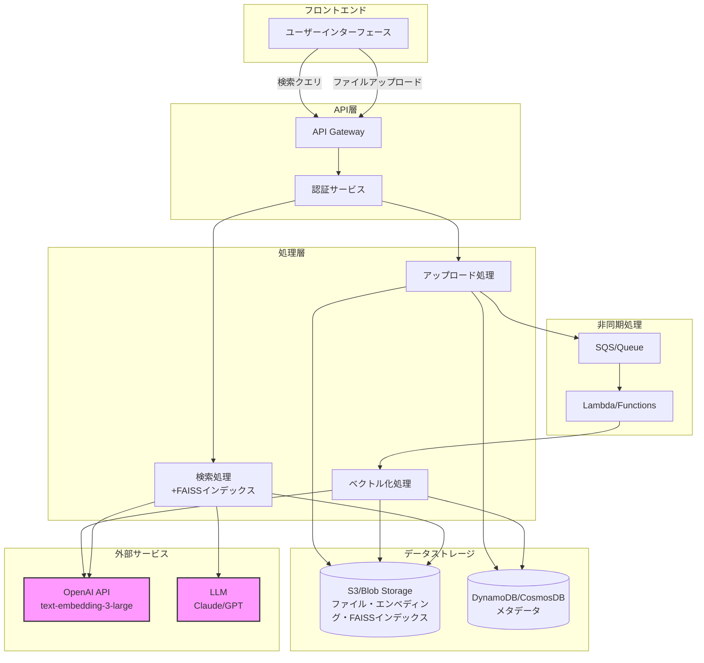
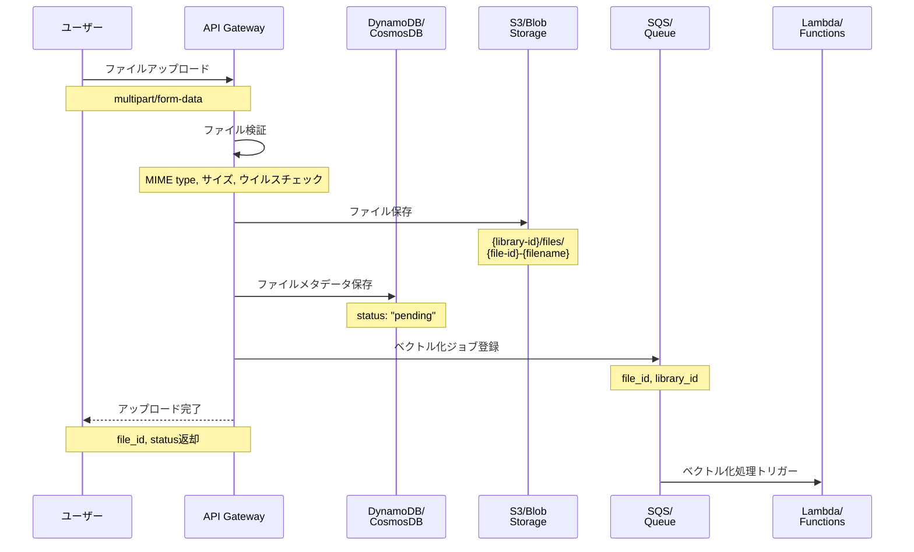
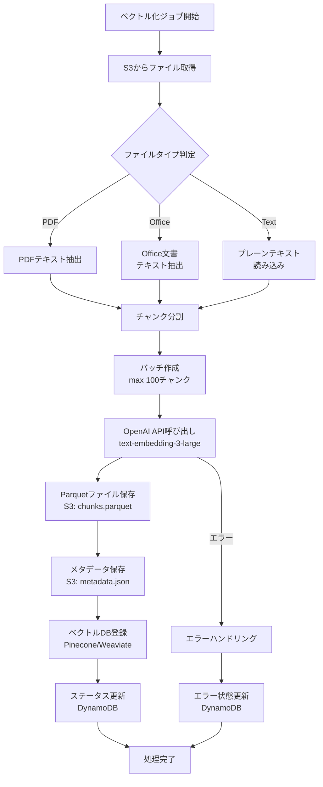
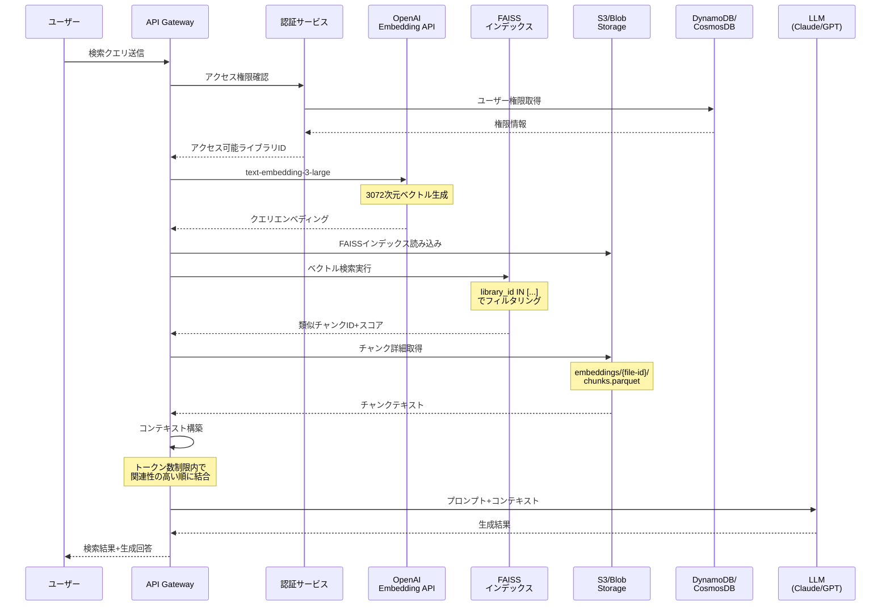
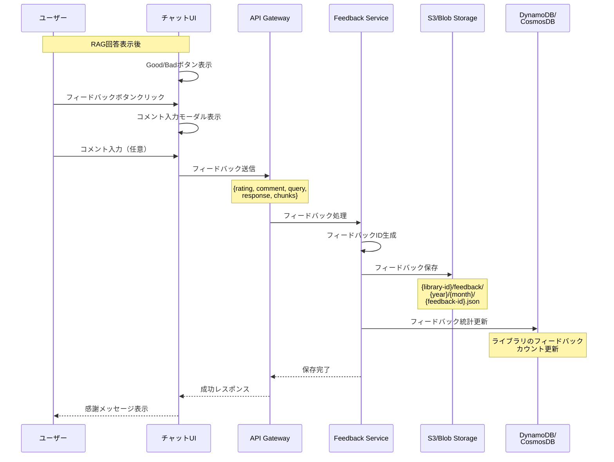

# ライブラリ仕様書

## 目次

1. [概要](#概要)
2. [ライブラリの目的](#ライブラリの目的)
3. [データ構造](#データ構造)
   - [ストレージ構造](#ストレージ構造)
   - [ライブラリ](#ライブラリ)
   - [ライブラリファイル](#ライブラリファイル)
   - [エンベディングデータ](#エンベディングデータ)
   - [RAGフィードバック](#ragフィードバック)
4. [公開範囲の仕様](#公開範囲の仕様)
   - [公開範囲の種類](#公開範囲の種類)
   - [アクセス制御ロジック](#アクセス制御ロジック)
5. [処理フロー](#処理フロー)
   - [ファイルアップロード](#ファイルアップロード)
   - [ベクトル化処理](#ベクトル化処理)
   - [RAG検索](#rag検索)
   - [フィードバック送信](#フィードバック送信)
6. [RAGフィードバック機能](#ragフィードバック機能)
   - [フィードバックUI](#フィードバックui)
   - [フィードバック管理](#フィードバック管理)
7. [API仕様](#api仕様)
8. [セキュリティ考慮事項](#セキュリティ考慮事項)
9. [更新履歴](#更新履歴)

## 概要

MAKOTO Visual AIのライブラリ機能は、RAG（Retrieval-Augmented Generation）を実現するためのドキュメント管理システムです。アップロードされたファイルをOpenAIのtext-embedding-3-largeモデルを使用してベクトル化し、LLMがコンテキストとして利用できる知識ベースを構築します。

### RAGシステム全体アーキテクチャ（FAISS版）



## ライブラリの目的

1. **知識ベースの構築**
   - 組織内のドキュメントをLLMが参照可能な形式で管理
   - PDFやテキストファイルなどの構造化されていないデータを活用

2. **ベクトル検索の実現**
   - ドキュメントをベクトル化して高速な類似検索を可能に
   - ユーザーの質問に最も関連性の高い情報を抽出

3. **アクセス制御**
   - 部署、役職、個人単位での細かなアクセス制御
   - 機密情報の適切な管理

## ベクトルデータベースの選択

### ベクトルデータベースとは
ベクトルデータベースは、高次元ベクトル（エンベディング）を効率的に保存・検索するための専用データベースです。従来のデータベースと異なり、類似性検索（コサイン類似度、ユークリッド距離等）に最適化されています。

### AWS環境での選択肢

#### 1. Amazon OpenSearch Service（推奨）
```typescript
// AWS ネイティブサービス
{
  service: "Amazon OpenSearch Service",
  features: {
    knn_plugin: true,           // k-NN（k近傍法）プラグイン対応
    dimensions: 16000,          // 最大次元数
    index_types: ["HNSW", "IVF"],  // 高速検索アルゴリズム
    managed: true,              // フルマネージド
    integration: "AWS統合が容易"
  },
  cost: "インスタンスベース",
  setup: "CloudFormation/CDK対応"
}
```

#### 2. Amazon RDS for PostgreSQL + pgvector
```typescript
// RDS拡張機能を使用
{
  service: "RDS PostgreSQL + pgvector",
  features: {
    dimensions: 2000,           // 推奨最大次元数
    sql_compatible: true,       // SQL クエリ可能
    backup: "RDS自動バックアップ",
    scaling: "垂直スケーリング"
  },
  limitations: "大規模データでは性能制限あり"
}
```

#### 3. サードパーティ（Pinecone）
```typescript
// SaaS型ベクトルDB
{
  service: "Pinecone",
  features: {
    serverless: true,           // サーバーレス
    dimensions: 20000,          // 高次元対応
    api_based: true,            // REST/gRPC API
    global_index: true          // グローバル分散
  },
  cost: "従量課金（ベクトル数ベース）",
  integration: "API経由"
}
```

### Azure環境での選択肢

#### 1. Azure Cognitive Search（推奨）
```typescript
// Azure ネイティブサービス
{
  service: "Azure Cognitive Search",
  features: {
    vector_search: true,        // ベクトル検索機能
    dimensions: 4096,           // 最大次元数
    hybrid_search: true,        // キーワード+ベクトル検索
    managed: true,              // フルマネージド
    ai_enrichment: true         // AI エンリッチメント
  },
  cost: "ユニット/レプリカベース",
  setup: "ARM Template/Terraform対応"
}
```

#### 2. Azure Cosmos DB for PostgreSQL + pgvector
```typescript
// Cosmos DB PostgreSQL版
{
  service: "Azure Cosmos DB for PostgreSQL",
  features: {
    distributed: true,          // 分散型
    pgvector: true,            // pgvector拡張対応
    global_distribution: true,  // グローバル分散
    consistency: "強整合性オプション"
  },
  scalability: "水平スケーリング対応"
}
```

#### 3. Azure Database for PostgreSQL + pgvector
```typescript
// Azure PostgreSQL サービス
{
  service: "Azure Database for PostgreSQL",
  features: {
    flexible_server: true,      // フレキシブルサーバー
    pgvector: true,            // pgvector拡張
    backup: "自動バックアップ",
    high_availability: true     // 高可用性
  },
  cost: "インスタンスベース"
}
```

### ベクトルDBを使わない選択肢

#### ファイルベースの検索（シンプル実装）
```typescript
interface FileBasedVectorSearch {
  approach: "ファイルシステムベース",
  storage: {
    format: "Parquet + FAISS インデックス",
    location: "S3/Blob Storage",
    structure: {
      embeddings: "chunks.parquet",      // エンベディング保存
      index: "index.faiss"               // FAISSインデックス
    }
  },
  
  // メリット
  pros: [
    "追加コストなし（S3/Blob Storageのみ）",
    "シンプルな実装",
    "小〜中規模（数万チャンク）では十分な性能",
    "ベンダーロックインなし"
  ],
  
  // デメリット
  cons: [
    "大規模データでは検索が遅い",
    "インデックス更新時に全体再構築が必要",
    "並行アクセスの制御が複雑",
    "メモリ制限（Lambda: 10GB）"
  ],
  
  // 適用ケース
  suitable_for: [
    "ライブラリ数: 〜100",
    "総チャンク数: 〜50,000",
    "同時検索ユーザー: 〜10"
  ]
}
```

#### 実装例（FAISS使用）
```python
import faiss
import numpy as np
import pandas as pd
from typing import List, Tuple

class FileBasedVectorDB:
    def __init__(self, library_id: str):
        self.library_id = library_id
        self.s3_prefix = f"{library_id}/embeddings/"
        
    def search(self, query_embedding: np.ndarray, top_k: int = 10) -> List[Tuple[int, float]]:
        # 1. Parquetファイルからエンベディング読み込み
        embeddings_df = pd.read_parquet(f"s3://{bucket}/{self.s3_prefix}chunks.parquet")
        embeddings = np.array(embeddings_df['embedding'].tolist()).astype('float32')
        
        # 2. FAISSインデックス構築（またはキャッシュから読み込み）
        dimension = embeddings.shape[1]  # 3072
        index = faiss.IndexFlatIP(dimension)  # 内積（コサイン類似度）
        faiss.normalize_L2(embeddings)  # 正規化
        index.add(embeddings)
        
        # 3. 検索実行
        faiss.normalize_L2(query_embedding.reshape(1, -1))
        scores, indices = index.search(query_embedding.reshape(1, -1), top_k)
        
        # 4. 結果を返す
        return [(idx, score) for idx, score in zip(indices[0], scores[0])]
```

### 推奨構成

```typescript
interface RecommendedVectorDBConfig {
  // 小規模プロジェクト（〜50,000チャンク）
  small_scale: {
    approach: "ファイルベース（FAISS）",
    reason: "コスト効率が高く、実装がシンプル",
    storage: "S3/Blob Storage のみ"
  },
  
  // 中規模プロジェクト（50,000〜500,000チャンク）
  medium_scale: {
    aws: "Amazon OpenSearch Service",
    azure: "Azure Cognitive Search",
    reason: "マネージドサービスで運用負荷軽減"
  },
  
  // 大規模プロジェクト（500,000チャンク以上）
  large_scale: {
    primary: "Pinecone",
    aws_alternative: "Amazon OpenSearch Service（複数インスタンス）",
    azure_alternative: "Azure Cosmos DB for PostgreSQL + pgvector",
    reason: "高性能、スケーラビリティ重視"
  }
}
```

## データ構造

### ストレージ構造

#### S3/Azure Blob Storage構造
```
{bucket-name}/
├── {library-id}/
│   ├── files/                    # 元ファイル
│   │   └── {file-id}-{filename}
│   ├── embeddings/               # エンベディングファイル
│   │   └── {file-id}/
│   │       ├── metadata.json     # ファイルメタデータ
│   │       ├── chunks.parquet    # チャンクとエンベディング
│   │       └── index.faiss       # FAISSインデックス（オプション）
│   └── feedback/                 # RAGフィードバック
│       └── {year}/{month}/
│           └── {feedback-id}.json
```

#### DynamoDB/CosmosDB構造
- ライブラリのメタデータを保存
- ファイルのベクトル化状態を管理
- アクセス権限情報を保持

### ライブラリ

```typescript
interface Library {
  // 基本情報
  library_id: UUID;                // ライブラリID
  name: string;                    // ライブラリ名
  description?: string;            // 説明
  
  // 作成者情報
  created_by: UUID;                // 作成者ユーザーID
  created_at: DateTime;            // 作成日時
  updated_at: DateTime;            // 更新日時
  
  // 統計情報
  file_count: number;              // ファイル数
  total_size: number;              // 総ファイルサイズ（バイト）
  vectorized_count: number;        // ベクトル化完了ファイル数
  
  // 公開範囲
  visibility: LibraryVisibility;   // 公開範囲設定
  
  // ステータス
  status: LibraryStatus;           // ライブラリステータス
  last_vectorized_at?: DateTime;   // 最終ベクトル化日時
}

type LibraryStatus = 
  | "active"        // アクティブ
  | "processing"    // 処理中
  | "archived";     // アーカイブ済み
```

### ライブラリファイル

```typescript
interface LibraryFile {
  // 基本情報
  file_id: UUID;                   // ファイルID
  library_id: UUID;                // 所属ライブラリID
  filename: string;                // ファイル名
  original_filename: string;       // アップロード時のファイル名
  
  // ファイル情報
  mime_type: string;               // MIMEタイプ
  size: number;                    // ファイルサイズ（バイト）
  file_hash: string;               // ファイルハッシュ（SHA-256）
  storage_path: string;            // ストレージパス
  
  // アップロード情報
  uploaded_by: UUID;               // アップロードユーザーID
  uploaded_at: DateTime;           // アップロード日時
  
  // ベクトル化情報
  vectorization_status: VectorizationStatus;  // ベクトル化ステータス
  vectorized_at?: DateTime;        // ベクトル化完了日時
  vectorization_error?: string;    // ベクトル化エラー情報
  chunk_count?: number;            // チャンク数
  
  // メタデータ
  metadata?: FileMetadata;         // ファイルメタデータ
}

type VectorizationStatus = 
  | "pending"       // ベクトル化待ち
  | "processing"    // ベクトル化処理中
  | "completed"     // ベクトル化完了
  | "failed"        // ベクトル化失敗
  | "skipped";      // ベクトル化スキップ（非対応形式）
```

### エンベディングデータ

#### メタデータファイル（metadata.json）
```typescript
interface EmbeddingMetadata {
  file_id: string;                 // ファイルID
  original_filename: string;       // 元のファイル名
  embedding_model: "text-embedding-3-large";  // 使用モデル
  dimensions: 3072;                // ベクトル次元数
  total_chunks: number;            // 総チャンク数
  total_tokens: number;            // 総トークン数
  embedding_cost: number;          // エンベディングコスト（USD）
  created_at: DateTime;            // 作成日時
  processing_time_ms: number;      // 処理時間（ミリ秒）
}
```

#### チャンクデータ（chunks.parquet）
```typescript
interface ChunkData {
  chunk_id: string;                // チャンクID
  chunk_index: number;             // チャンクインデックス
  text: string;                    // チャンクテキスト
  embedding: Float32Array;         // 埋め込みベクトル（3072次元）
  token_count: number;             // トークン数
  metadata: {
    start_char: number;            // 開始文字位置
    end_char: number;              // 終了文字位置
    page_number?: number;          // ページ番号（PDFの場合）
    section_title?: string;        // セクション名
  };
}
```

### RAGフィードバック

```typescript
interface RAGFeedback {
  // 識別情報
  feedback_id: UUID;               // フィードバックID
  library_id: UUID;                // ライブラリID
  user_id: UUID;                   // フィードバック送信者ID
  
  // フィードバック対象
  query: string;                    // 元の検索クエリ
  response: string;                 // 生成された回答
  
  // 参照されたチャンク
  referenced_chunks: Array<{
    file_id: string;                // ファイルID
    chunk_id: string;               // チャンクID
    text: string;                   // チャンクテキスト
    score: number;                  // 類似度スコア
  }>;
  
  // フィードバック内容
  rating: 'good' | 'bad';          // 評価（Good/Bad）
  comment?: string;                // コメント（最大1000文字）
  
  // 改善提案
  suggestions?: {
    missing_info?: string;          // 不足していた情報
    incorrect_info?: string;        // 誤っていた情報
    expected_response?: string;     // 期待していた回答
  };
  
  // タイムスタンプ
  created_at: DateTime;             // フィードバック日時
  
  // メタデータ
  chat_id?: UUID;                  // 関連するチャットID
  message_id?: UUID;                // 関連するメッセージID
  model_used?: string;              // 使用されたモデル
  temperature?: number;             // 生成時の温度パラメータ
}
```

## 公開範囲の仕様

### 公開範囲の種類

```typescript
interface LibraryVisibility {
  // 公開タイプ
  visibility_type: VisibilityType;
  
  // 部署指定（AND条件）
  departments?: string[];          // 部署名リスト
  
  // 役職指定（AND条件）
  roles?: string[];                // 役職名リスト
  
  // ユーザー指定（OR条件）
  users?: UUID[];                  // ユーザーIDリスト
}

type VisibilityType = 
  | "private"       // 作成者のみ
  | "specific"      // 特定の条件指定
  | "tenant";       // テナント全体
```

### アクセス制御ロジック

アクセス可否の判定は以下のロジックで行います：

1. **visibility_type = "private"の場合**
   - 作成者本人のみアクセス可能

2. **visibility_type = "specific"の場合**
   - 以下の条件をすべて満たす場合にアクセス可能：
     - 部署条件：ユーザーの部署が`departments`配列のいずれかに含まれる（指定がない場合は条件なし）
     - 役職条件：ユーザーの役職が`roles`配列のいずれかに含まれる（指定がない場合は条件なし）
   - または、ユーザーIDが`users`配列に含まれる場合にアクセス可能

3. **visibility_type = "tenant"の場合**
   - 同一テナントの全ユーザーがアクセス可能

```typescript
// アクセス可否判定の例
function canAccessLibrary(library: Library, user: User): boolean {
  const visibility = library.visibility;
  
  // 作成者は常にアクセス可能
  if (library.created_by === user.user_id) {
    return true;
  }
  
  switch (visibility.visibility_type) {
    case "private":
      return false;
      
    case "specific":
      // ユーザー指定チェック（OR条件）
      if (visibility.users?.includes(user.user_id)) {
        return true;
      }
      
      // 部署・役職チェック（AND条件）
      const deptMatch = !visibility.departments || 
                        visibility.departments.includes(user.department);
      const roleMatch = !visibility.roles || 
                        visibility.roles.includes(user.role);
      return deptMatch && roleMatch;
      
    case "tenant":
      return user.tenant_id === library.tenant_id;
      
    default:
      return false;
  }
}
```

## 処理フロー

### ファイルアップロード



### ベクトル化処理

#### ベクトル化処理フロー図



#### 処理詳細

1. **テキスト抽出**
   - PDFからのテキスト抽出
   - Office文書からのテキスト抽出
   - プレーンテキストの読み込み

2. **チャンク分割**
   ```typescript
   interface ChunkingStrategy {
     strategy: "sliding_window";
     chunk_size: 1000;           // 文字数
     overlap: 200;               // オーバーラップ文字数
     max_chunk_tokens: 256;      // 最大トークン数
   }
   ```

3. **埋め込みベクトル生成**
   ```typescript
   // OpenAI text-embedding-3-largeを使用
   const response = await openai.embeddings.create({
     model: "text-embedding-3-large",
     input: chunkTexts,  // バッチ処理
   });
   ```
   - コスト: $0.13/1M tokens
   - 次元数: 3072
   - レート制限: 3,000 RPM / 1,000,000 TPM

4. **データ保存**
   - S3/Blob: Parquet形式でチャンクとエンベディングを保存
   - ベクトルDB: 高速検索用インデックス（Pinecone/Weaviate）
   - DynamoDB/CosmosDB: メタデータと状態管理

### RAG検索

#### RAG検索フロー図



#### 単一ライブラリ検索
```typescript
interface SingleLibrarySearch {
  // 1. クエリのベクトル化
  queryEmbedding: Float32Array;  // 3072次元
  
  // 2. ベクトル検索
  searchResults: {
    chunk_id: string;
    score: number;        // コサイン類似度
    metadata: ChunkMetadata;
  }[];
  
  // 3. チャンク詳細取得
  chunks: ChunkData[];
  
  // 4. コンテキスト生成
  context: string;
}
```

#### 複数ライブラリ検索
```typescript
class MultiLibraryRAGSearch {
  async search(
    query: string,
    libraryIds: string[],
    options: {
      topK?: number;          // デフォルト: 10
      threshold?: number;     // 類似度閾値: 0.7
      maxTokens?: number;     // コンテキスト最大トークン数: 4000
    }
  ): Promise<RAGSearchResult> {
    // 1. アクセス権限チェック
    const accessibleLibraries = await this.filterAccessibleLibraries(
      libraryIds,
      userId
    );
    
    // 2. クエリエンベディング（キャッシュ確認）
    const queryEmbedding = await this.embedQuery(query);
    
    // 3. ベクトルDB検索（ハイブリッド方式）
    const searchResults = await this.vectorDB.search({
      vector: queryEmbedding,
      filter: {
        library_id: { $in: accessibleLibraries }
      },
      top_k: options.topK * 2,
      include_metadata: true
    });
    
    // 4. スコアフィルタリングと再ランキング
    const filtered = this.filterAndRerank(
      searchResults,
      options.threshold
    );
    
    // 5. コンテキスト構築
    return this.buildContext(filtered, options.maxTokens);
  }
}
```

### フィードバック送信



## RAGフィードバック機能

### フィードバックUI

チャット画面でRAGを使用した回答が生成された場合、以下のUIを表示：

```typescript
interface RAGFeedbackUI {
  // 表示条件
  show_condition: {
    has_rag_context: boolean;       // RAGコンテキストが使用された
    response_completed: boolean;    // 回答生成が完了
  };
  
  // UIコンポーネント
  components: {
    // フィードバックボタン
    feedback_buttons: {
      good_button: {
        icon: "👍" | "thumb_up";
        label: "役に立った";
        color: "green";
      };
      bad_button: {
        icon: "👎" | "thumb_down";
        label: "改善が必要";
        color: "red";
      };
    };
    
    // コメントモーダル
    comment_modal: {
      title: "フィードバックありがとうございます";
      placeholder: "具体的な改善点があれば教えてください（任意）";
      max_length: 1000;
      
      // Badの場合の追加フィールド
      bad_feedback_fields?: {
        missing_info: {
          label: "不足していた情報";
          type: "textarea";
        };
        incorrect_info: {
          label: "誤っていた情報";
          type: "textarea";
        };
        expected_response: {
          label: "期待していた回答";
          type: "textarea";
        };
      };
    };
    
    // 送信後の表示
    thank_you_message: {
      text: "フィードバックをお送りいただきありがとうございます。品質改善に活用させていただきます。";
      duration: 3000;  // 表示時間（ミリ秒）
    };
  };
  
  // 動作設定
  behavior: {
    one_time_only: boolean;         // 1メッセージにつき1回のみ
    anonymous_allowed: boolean;     // 匿名フィードバック許可
    require_comment_for_bad: boolean; // Bad評価時はコメント必須
  };
}
```

### フィードバック管理

ライブラリ管理画面でのフィードバック管理機能：

```typescript
interface FeedbackManagement {
  // フィードバック一覧表示
  feedback_list: {
    columns: [
      "日時",
      "評価",
      "クエリ",
      "コメント",
      "ユーザー"
    ];
    
    filters: {
      date_range: DateRange;        // 期間フィルター
      rating: 'all' | 'good' | 'bad'; // 評価フィルター
      has_comment: boolean;          // コメント有無
    };
    
    sort: {
      field: 'created_at' | 'rating';
      order: 'asc' | 'desc';
    };
  };
  
  // フィードバック統計
  statistics: {
    total_count: number;            // 総フィードバック数
    good_count: number;             // Good評価数
    bad_count: number;              // Bad評価数
    satisfaction_rate: number;      // 満足度（%）
    
    // 時系列グラフ
    trend_chart: {
      type: 'line' | 'bar';
      period: 'daily' | 'weekly' | 'monthly';
      metrics: ['total', 'good', 'bad', 'satisfaction_rate'];
    };
    
    // よくある問題
    common_issues: Array<{
      issue_type: string;
      count: number;
      percentage: number;
    }>;
  };
  
  // 一括削除機能
  bulk_delete: {
    // 削除対象の選択
    selection_options: {
      all: boolean;                 // 全件削除
      date_range: DateRange;        // 期間指定
      rating_filter: 'good' | 'bad'; // 評価指定
    };
    
    // 確認ダイアログ
    confirmation: {
      title: "フィードバックの削除確認";
      message: "選択されたフィードバックを削除します。この操作は取り消せません。";
      show_count: boolean;          // 削除件数を表示
      require_confirmation_text: string; // "DELETE"と入力させる
    };
    
    // 削除実行
    delete_action: {
      soft_delete: boolean;         // 論理削除
      archive_before_delete: boolean; // 削除前にアーカイブ
      log_deletion: boolean;        // 削除ログを記録
    };
  };
  
  // エクスポート機能
  export: {
    formats: ['csv', 'json', 'excel'];
    include_options: {
      include_chunks: boolean;      // チャンク情報を含める
      include_response: boolean;    // 生成された回答を含める
      anonymize: boolean;           // 個人情報を匿名化
    };
  };
}
```

## API仕様

### エンドポイント一覧

1. **ライブラリ管理**
   - `GET /api/libraries` - ライブラリ一覧取得
   - `POST /api/libraries` - ライブラリ作成
   - `GET /api/libraries/{library_id}` - ライブラリ詳細取得
   - `PUT /api/libraries/{library_id}` - ライブラリ更新
   - `DELETE /api/libraries/{library_id}` - ライブラリ削除

2. **ファイル管理**
   - `POST /api/libraries/{library_id}/files` - ファイルアップロード
   - `GET /api/libraries/{library_id}/files` - ファイル一覧取得
   - `DELETE /api/libraries/{library_id}/files/{file_id}` - ファイル削除

3. **ベクトル化管理**
   - `POST /api/libraries/{library_id}/vectorize` - ベクトル化実行
   - `GET /api/libraries/{library_id}/vectorization-status` - ベクトル化状態取得

4. **検索**
   - `POST /api/libraries/search` - 複数ライブラリ横断検索
   - `POST /api/libraries/{library_id}/search` - 特定ライブラリ内検索

5. **RAGフィードバック**
   - `POST /api/libraries/{library_id}/feedback` - フィードバック送信
   - `GET /api/libraries/{library_id}/feedback` - フィードバック一覧取得
   - `GET /api/libraries/{library_id}/feedback/stats` - フィードバック統計取得
   - `DELETE /api/libraries/{library_id}/feedback` - フィードバック一括削除
   - `GET /api/libraries/{library_id}/feedback/export` - フィードバックエクスポート

### 検索リクエスト例
```typescript
interface LibrarySearchRequest {
  query: string;                  // 検索クエリ
  library_ids?: string[];         // 対象ライブラリID（省略時は全アクセス可能ライブラリ）
  options?: {
    top_k?: number;               // 取得件数（デフォルト: 10）
    threshold?: number;           // 類似度閾値（デフォルト: 0.7）
    include_metadata?: boolean;   // メタデータ含有（デフォルト: true）
  };
}
```

### フィードバックリクエスト例

#### フィードバック送信
```typescript
// POST /api/libraries/{library_id}/feedback
interface SubmitFeedbackRequest {
  query: string;                    // 元の検索クエリ
  response: string;                 // 生成された回答
  referenced_chunks: Array<{        // 参照されたチャンク
    file_id: string;
    chunk_id: string;
    text: string;
    score: number;
  }>;
  rating: 'good' | 'bad';          // 評価
  comment?: string;                // コメント（オプション）
  suggestions?: {                   // 改善提案（オプション）
    missing_info?: string;
    incorrect_info?: string;
    expected_response?: string;
  };
  chat_id?: string;                // 関連するチャットID
  message_id?: string;             // 関連するメッセージID
}
```

#### フィードバック一括削除
```typescript
// DELETE /api/libraries/{library_id}/feedback
interface BulkDeleteFeedbackRequest {
  delete_all?: boolean;            // 全件削除
  date_range?: {                   // 期間指定削除
    from: string;                  // 開始日（ISO 8601）
    to: string;                    // 終了日（ISO 8601）
  };
  rating?: 'good' | 'bad';         // 評価による削除
  confirmation_text: string;       // 確認テキスト（"DELETE"）
}
```

## コスト最適化

### エンベディングコスト管理
```typescript
interface CostOptimization {
  // バッチ処理
  batch_processing: {
    batch_size: 100;              // 一度に処理するチャンク数
    rate_limit_buffer: 0.8;       // レート制限の80%で制御
  };
  
  // キャッシング戦略
  caching: {
    query_embeddings: {
      ttl: 3600;                  // 1時間
      max_size: 10000;            // 最大キャッシュ数
    };
    search_results: {
      ttl: 300;                   // 5分
      key: "query_hash:library_ids_hash";
    };
  };
  
  // コスト追跡
  cost_tracking: {
    track_per_file: true;
    track_per_library: true;
    alert_threshold: 100;         // $100/日を超えたらアラート
  };
}
```

## セキュリティ考慮事項

1. **アクセス制御の厳格な実施**
   - すべてのAPIでアクセス権限をチェック
   - ライブラリレベルとファイルレベルでの二重チェック

2. **データの暗号化**
   - ストレージ上のファイルは暗号化
   - ベクトルデータも暗号化保存

3. **監査ログ**
   - すべてのアクセスをログに記録
   - 誰がいつどのファイルにアクセスしたかを追跡可能

4. **データの分離**
   - テナント間でデータを完全に分離
   - ベクトルデータベースでもテナント分離を実施

## 更新履歴

- 2025-08-05: 初版作成（RAG用ライブラリ仕様）