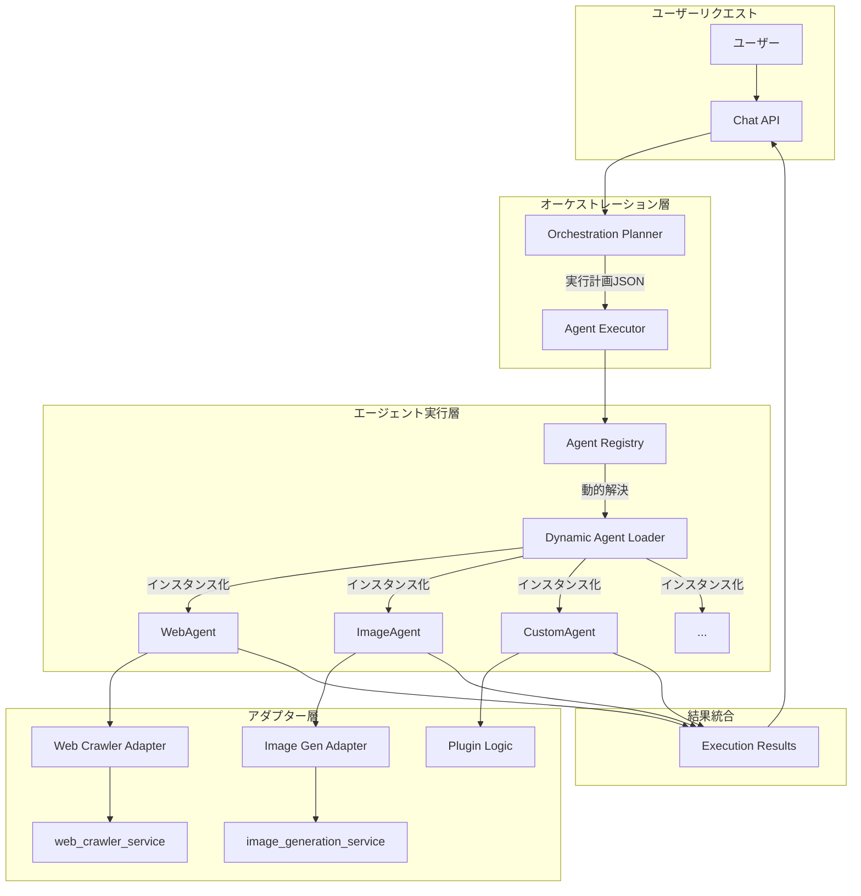
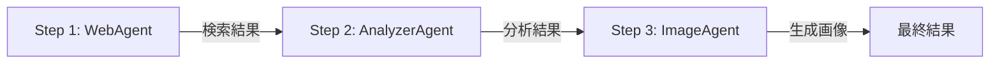
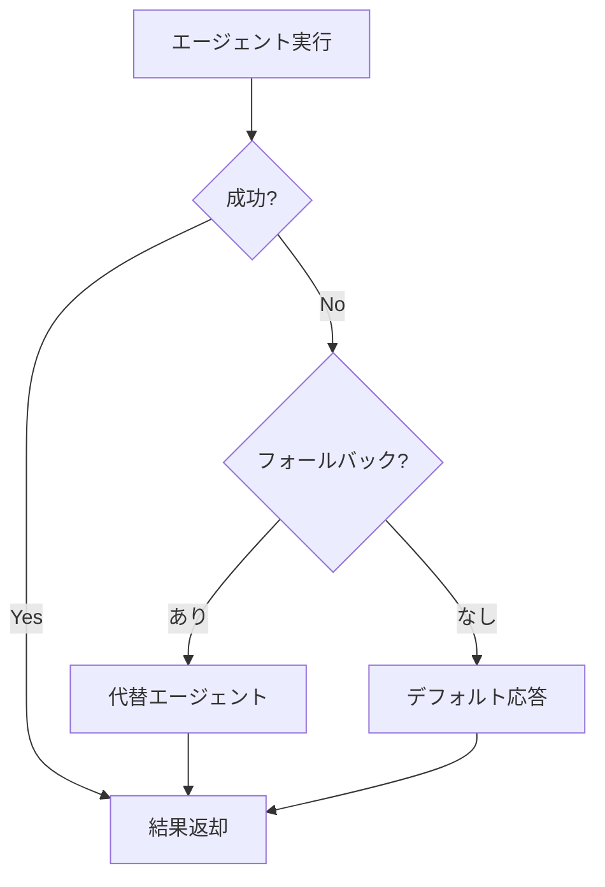

# 動的エージェント実行システム詳細設計

## 概要

動的エージェント実行システムは、プラグイン形式でエージェントを追加・実行できる柔軟なアーキテクチャです。ハードコーディングされたif文の代わりに、実行時に動的にエージェントを解決・実行します。

## アーキテクチャ図



## 実行フロー詳細

### 1. 実行計画の作成

```json
{
  "execution_plan": [
    {
      "step": 1,
      "agent": "WebAgent",
      "purpose": "最新情報を検索",
      "inputs": {
        "keywords": ["AI", "最新技術"],
        "original_query": "AIの最新技術について"
      },
      "execution_params": {
        "llm_settings": {"temperature": 0.3},
        "agent_specific": {"search_depth": "thorough"}
      },
      "depends_on": [],
      "parallel": false
    },
    {
      "step": 2,
      "agent": "ImageAgent",
      "purpose": "検索結果を基に図を生成",
      "inputs": {
        "prompt": "{{step_1.summary}}を表すインフォグラフィック"
      },
      "execution_params": {
        "llm_settings": {"temperature": 0.9},
        "agent_specific": {"quality": "hd", "style": "vivid"}
      },
      "depends_on": [1],
      "parallel": false
    }
  ]
}
```

### 2. 動的エージェント解決

```python
# Agent Executorの動的解決プロセス
async def execute_step(step):
    agent_name = step['agent']  # 例: "WebAgent"
    
    # 1. レジストリから検索
    agent_instance = registry.get(agent_name)
    
    # 2. ファクトリーから検索
    if not agent_instance:
        agent_instance = factory.create(agent_name)
    
    # 3. 動的インポート
    if not agent_instance:
        module_path = f"AI_Agent.agents.{to_snake_case(agent_name)}"
        agent_instance = dynamic_import(module_path, agent_name)
    
    # 4. アダプター確認
    if not agent_instance:
        agent_instance = ServiceAdapterRegistry.get_adapter(agent_name)
    
    # 5. プラグインディレクトリ確認
    if not agent_instance:
        agent_instance = load_from_plugins(agent_name)
    
    return agent_instance
```

## プラグイン形式の利点

### 1. 拡張性
```
従来の方式:
if agent_name == 'WebAgent':
    # Web検索処理
elif agent_name == 'ImageAgent':
    # 画像生成処理
elif agent_name == 'NewAgent':  # ← chat.pyを修正必要
    # 新しい処理

動的方式:
agent = executor.get_agent(agent_name)  # ← chat.py修正不要
result = await agent.process(**inputs)
```

### 2. モジュール性
```
plugins/
├── weather_agent.py      # 天気情報エージェント
├── stock_agent.py        # 株価情報エージェント
├── translation_agent.py  # 翻訳エージェント
└── custom_agents/        # カスタムエージェント群
    ├── company_specific_agent.py
    └── domain_expert_agent.py
```

### 3. 設定駆動
```yaml
# agent_config.yaml
agents:
  WeatherAgent:
    enabled: true
    module: plugins.weather_agent
    config:
      api_key: ${WEATHER_API_KEY}
      default_location: Tokyo
      
  StockAgent:
    enabled: true
    module: plugins.stock_agent
    config:
      data_source: yahoo_finance
      update_interval: 300
```

## 実装例

### 新しいエージェントの追加（コード変更なし）

1. **エージェントファイルの作成**
```python
# plugins/weather_agent.py
from AI_Agent.base_agent import BaseAgent

class WeatherAgent(BaseAgent):
    async def process(self, **kwargs):
        location = kwargs.get('location', 'Tokyo')
        # 天気情報を取得
        weather_data = await self.get_weather(location)
        yield self.format_result(weather_data)
```

2. **自動登録**
```python
# プラグインローダーが自動的に検出・登録
# chat.pyの変更は不要
```

3. **即座に利用可能**
```json
{
  "step": 3,
  "agent": "WeatherAgent",
  "inputs": {"location": "東京"}
}
```

## エージェント間の連携

### 依存関係の解決


### データフロー
```python
# Step 1の結果
results['step_1'] = {
    'data': {
        'sources': [...],
        'summary': "AIの最新技術には..."
    }
}

# Step 2で参照
inputs = {
    'text': '{{step_1.summary}}',  # 自動的に解決
    'analysis_type': 'technical'
}
```

## パフォーマンス最適化

### 1. 並列実行
```json
{
  "execution_plan": [
    {"step": 1, "agent": "WebAgent", "parallel": true},
    {"step": 2, "agent": "NewsAgent", "parallel": true},
    {"step": 3, "agent": "ImageAgent", "depends_on": [1, 2]}
  ]
}
```

### 2. キャッシング
```python
class CachedAgentExecutor(AgentExecutor):
    def __init__(self):
        self._agent_cache = {}  # インスタンスキャッシュ
        self._result_cache = LRUCache(maxsize=100)  # 結果キャッシュ
```

### 3. 遅延ロード
```python
# エージェントは実際に使用されるまでインポートされない
if agent_name not in self._loaded_agents:
    self._loaded_agents[agent_name] = self._lazy_load(agent_name)
```

## エラーハンドリング

### フォールバック戦略


## まとめ

動的エージェント実行システムは：

1. **プラグイン形式**: 新しいエージェントをコード変更なしで追加
2. **動的解決**: 実行時にエージェントを解決・インスタンス化
3. **柔軟な連携**: エージェント間のデータ受け渡しが容易
4. **高い拡張性**: 企業固有のエージェントも簡単に追加可能
5. **保守性向上**: エージェントごとに独立したテスト・デプロイが可能

この設計により、システムの成長に伴うコードの複雑化を防ぎ、新機能の追加が容易になります。