# マルチテナント認証・認可設計書

## 1. 概要

マルチテナントSaaSアプリケーションにおける認証・認可システムの設計書。
開発環境ではFastAPIとCognitoを直接連携し、本番環境ではAPI Gateway + Lambdaへ移行可能な設計とする。

## 2. アーキテクチャ設計

### 2.1 認証フロー概要

#### 開発環境（FastAPI直接連携）

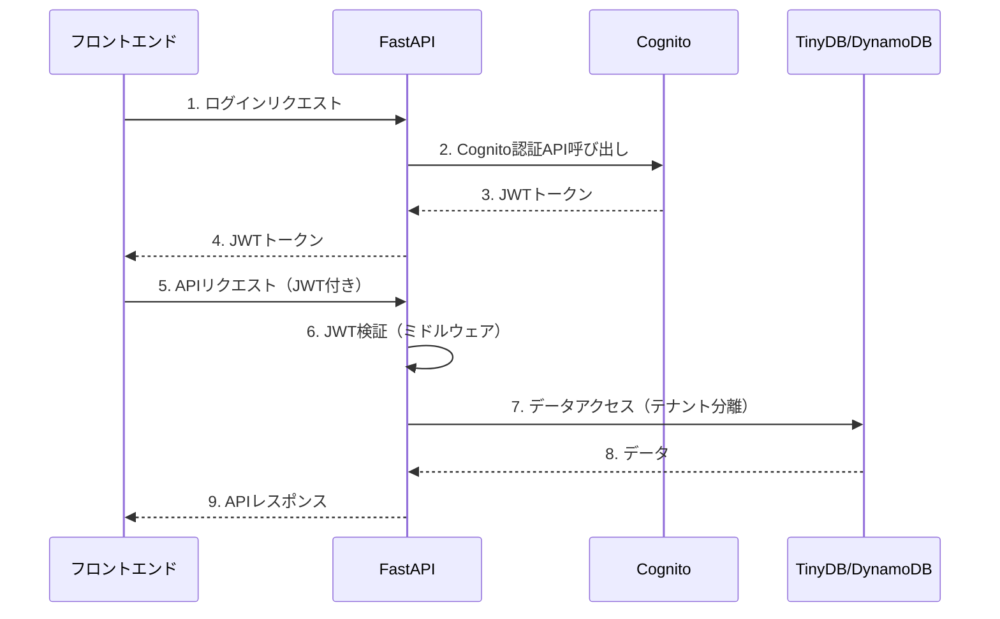

#### 本番環境（API Gateway + Lambda）

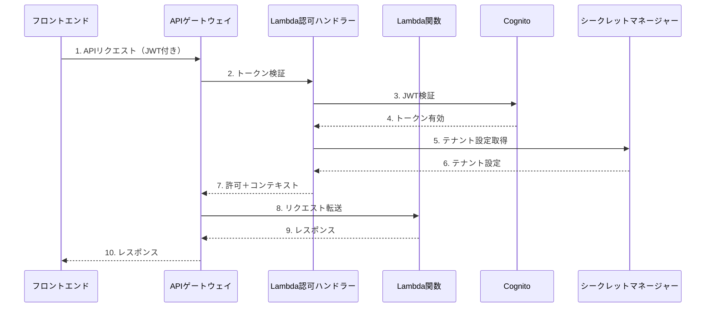

### 2.2 テナント分離戦略

#### 戦略A: 統合User Pool (推奨)

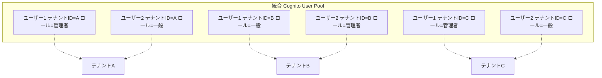

**メリット:**
- 管理が簡単
- コスト効率が良い
- ユーザー横断機能（将来の機能拡張）に対応可能

**デメリット:**
- テナント間の完全分離が難しい
- 大規模テナントでのパフォーマンス問題の可能性

#### 戦略B: テナント別User Pool

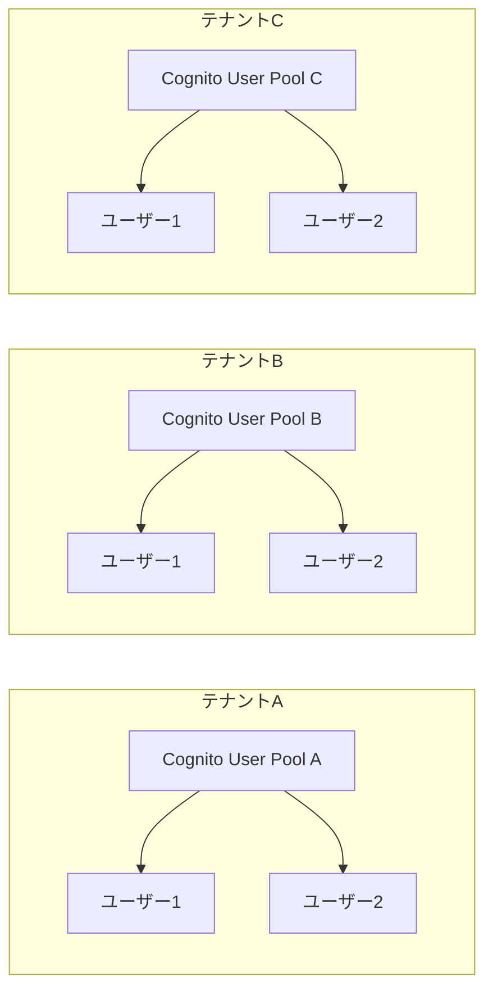

**メリット:**
- 完全なテナント分離
- セキュリティが高い
- テナント毎の独立した設定

**デメリット:**
- 管理が複雑
- コストが高い
- テナント毎のUser Pool作成が必要

### 2.3 採用戦略: テナント別User Pool

セキュリティの面から**テナント別User Pool**を採用。

## 3. Cognito User Pool 設計

### 3.1 User Pool 設定

```yaml
# CloudFormation Template
MakotoUserPool:
  Type: AWS::Cognito::UserPool
  Properties:
    UserPoolName: makoto-users
    
    # サインアップ設定
    Policies:
      PasswordPolicy:
        MinimumLength: 8
        RequireUppercase: true
        RequireLowercase: true
        RequireNumbers: true
        RequireSymbols: true
    
    # 属性設定
    UsernameAttributes:
      - email  # メールアドレスでログイン可能
    
    # カスタム属性（テナント情報）
    Schema:
      - Name: tenant_id
        AttributeDataType: String
        Required: true
        Mutable: true
      - Name: role
        AttributeDataType: String
        Required: true
        Mutable: true
      - Name: organization_name
        AttributeDataType: String
        Required: false
        Mutable: true
    
    # 自動検証設定
    AutoVerifiedAttributes:
      - email
    
    # MFA設定
    MfaConfiguration: OPTIONAL
    EnabledMfas:
      - SOFTWARE_TOKEN_MFA
    
    # Lambda Trigger設定
    LambdaConfig:
      PreSignUp: !GetAtt PreSignUpLambda.Arn
      PostConfirmation: !GetAtt PostConfirmationLambda.Arn
```

### 3.2 User Pool Client 設定

```yaml
MakotoUserPoolClient:
  Type: AWS::Cognito::UserPoolClient
  Properties:
    UserPoolId: !Ref MakotoUserPool
    ClientName: makoto-app-client
    
    # 認証フロー設定
    ExplicitAuthFlows:
      - ALLOW_USER_PASSWORD_AUTH
      - ALLOW_REFRESH_TOKEN_AUTH
      - ALLOW_USER_SRP_AUTH
    
    # トークン設定
    AccessTokenValidity: 1    # 1時間
    IdTokenValidity: 1        # 1時間  
    RefreshTokenValidity: 30  # 30日
    
    TokenValidityUnits:
      AccessToken: hours
      IdToken: hours
      RefreshToken: days
    
    # セキュリティ設定
    PreventUserExistenceErrors: ENABLED
    
    # 読み書き属性
    ReadAttributes:
      - email
      - name
      - custom:tenant_id
      - custom:role
      - custom:organization_name
    
    WriteAttributes:
      - name
      - custom:organization_name
```

## 4. JWT Token 設計

### 4.1 Token Claims 構造

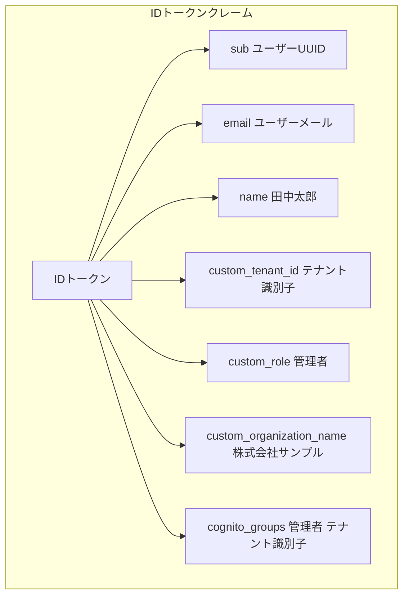
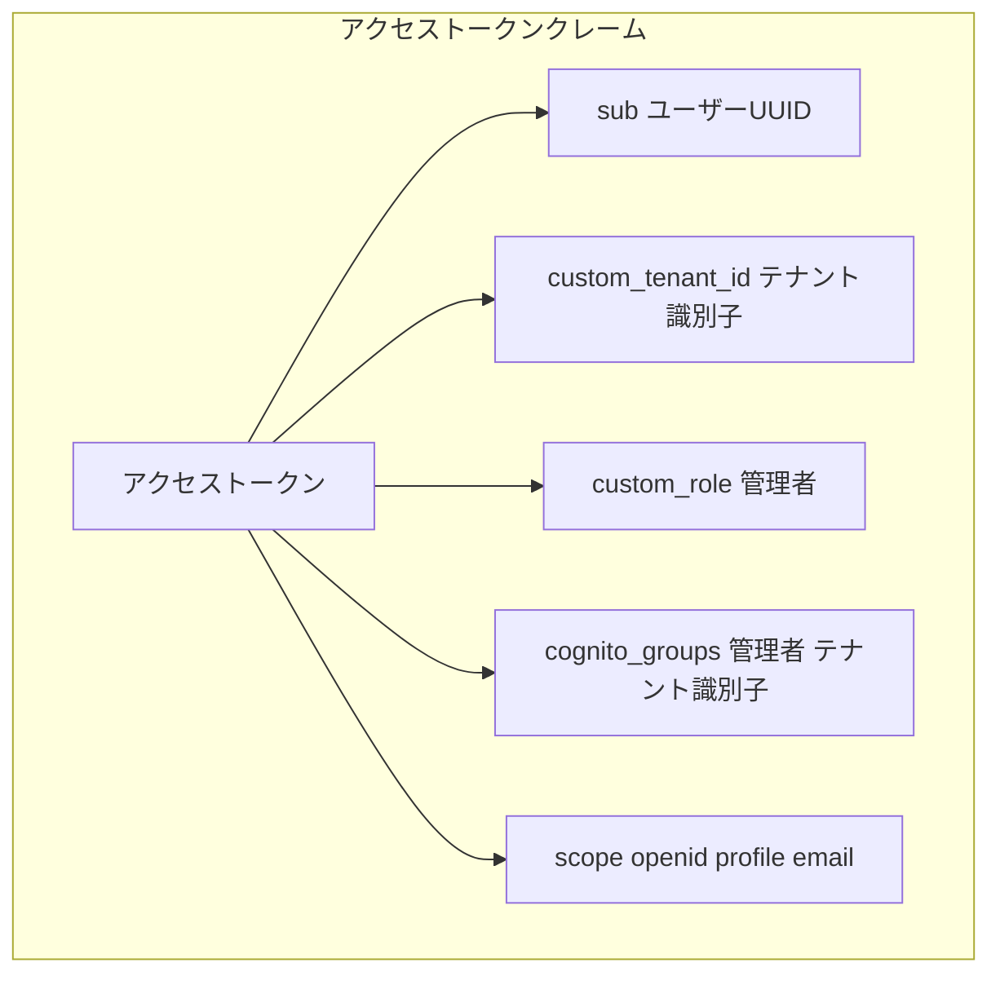

### 4.2 ID Token Claims 構造

```json
{
  "sub": "user-uuid-here",
  "aud": "cognito-client-id",
  "iss": "https://cognito-idp.region.amazonaws.com/user-pool-id",
  "exp": 1234567890,
  "iat": 1234567890,
  "auth_time": 1234567890,
  "token_use": "id",
  
  // 標準クレーム
  "email": "user@example.com",
  "email_verified": true,
  "name": "田中太郎",
  
  // カスタムクレーム（テナント情報）
  "custom:tenant_id": "tenant-abc-123",
  "custom:role": "admin",
  "custom:organization_name": "株式会社サンプル",
  
  // 権限情報（Lambda Triggerで追加）
  "cognito:groups": ["admin", "tenant-abc-123"]
}
```

### 4.3 Access Token Claims 構造

```json
{
  "sub": "user-uuid-here",
  "aud": "cognito-client-id", 
  "iss": "https://cognito-idp.region.amazonaws.com/user-pool-id",
  "exp": 1234567890,
  "iat": 1234567890,
  "token_use": "access",
  "scope": "openid profile email",
  
  // テナント情報
  "custom:tenant_id": "tenant-abc-123",
  "custom:role": "admin",
  
  // Cognito Groups
  "cognito:groups": ["admin", "tenant-abc-123"]
}
```

## 5. FastAPI実装（開発環境）

### 5.1 認証ミドルウェア実装

```python
# backend/core/auth/cognito_auth.py
import json
import time
from typing import Optional, Dict
from fastapi import HTTPException, Request
from fastapi.security import HTTPBearer, HTTPAuthorizationCredentials
from jose import jwt, jwk, JWTError
import boto3
import requests
from functools import lru_cache

class CognitoTokenVerifier:
    """テナント別Cognito User Poolに対応したトークン検証クラス"""
    
    def __init__(self):
        self.cognito_client = boto3.client('cognito-idp', 
                                         region_name=os.getenv('AWS_REGION', 'ap-northeast-1'))
        self._jwks_cache = {}  # テナント別のJWKSキャッシュ
    
    def get_tenant_config(self, tenant_id: str) -> dict:
        """テナント設定を取得（開発環境では環境変数から）"""
        # 本番環境ではSecrets Managerから取得
        return {
            "user_pool_id": os.getenv(f'COGNITO_USER_POOL_ID_{tenant_id.upper()}'),
            "client_id": os.getenv(f'COGNITO_CLIENT_ID_{tenant_id.upper()}'),
            "region": os.getenv('AWS_REGION', 'ap-northeast-1')
        }
    
    @lru_cache(maxsize=10)
    def get_jwks(self, user_pool_id: str, region: str):
        """Cognito公開鍵を取得（キャッシュ付き）"""
        cache_key = f"{region}_{user_pool_id}"
        if cache_key not in self._jwks_cache:
            jwks_url = f"https://cognito-idp.{region}.amazonaws.com/{user_pool_id}/.well-known/jwks.json"
            response = requests.get(jwks_url)
            self._jwks_cache[cache_key] = response.json()
        return self._jwks_cache[cache_key]
    
    def verify_token(self, token: str, tenant_id: str) -> dict:
        """JWTトークンを検証"""
        try:
            # テナント設定を取得
            tenant_config = self.get_tenant_config(tenant_id)
            if not tenant_config['user_pool_id']:
                raise HTTPException(status_code=401, detail="テナント設定が見つかりません")
            
            # トークンヘッダーから kid を取得
            headers = jwt.get_unverified_headers(token)
            kid = headers['kid']
            
            # 対応する公開鍵を取得
            jwks = self.get_jwks(tenant_config['user_pool_id'], tenant_config['region'])
            key = None
            for k in jwks['keys']:
                if k['kid'] == kid:
                    key = k
                    break
            
            if not key:
                raise HTTPException(status_code=401, detail="公開鍵が見つかりません")
            
            # トークンを検証
            payload = jwt.decode(
                token,
                key,
                algorithms=['RS256'],
                audience=tenant_config['client_id'],
                issuer=f"https://cognito-idp.{tenant_config['region']}.amazonaws.com/{tenant_config['user_pool_id']}"
            )
            
            # 有効期限チェック
            if payload['exp'] < time.time():
                raise HTTPException(status_code=401, detail="トークンの有効期限が切れています")
            
            # テナントIDの検証
            token_tenant_id = payload.get('custom:tenant_id')
            if token_tenant_id != tenant_id:
                raise HTTPException(status_code=403, detail="テナントIDが一致しません")
            
            return payload
            
        except JWTError as e:
            raise HTTPException(status_code=401, detail=f"トークン検証エラー: {str(e)}")

class TenantAwareBearer(HTTPBearer):
    """テナント別認証を行うBearer認証クラス"""
    
    def __init__(self, verifier: CognitoTokenVerifier, auto_error: bool = True):
        super().__init__(auto_error=auto_error)
        self.verifier = verifier
    
    async def __call__(self, request: Request) -> Optional[dict]:
        # URLからテナントIDを取得
        tenant_id = request.path_params.get('tenant_id') or request.headers.get('X-Tenant-ID')
        if not tenant_id:
            raise HTTPException(status_code=400, detail="テナントIDが指定されていません")
        
        credentials: HTTPAuthorizationCredentials = await super().__call__(request)
        if credentials:
            if not credentials.scheme == "Bearer":
                raise HTTPException(status_code=403, detail="Invalid authentication scheme")
            
            # トークンを検証
            payload = self.verifier.verify_token(credentials.credentials, tenant_id)
            
            # リクエストに認証情報を追加
            request.state.user = {
                "user_id": payload.get("sub"),
                "email": payload.get("email"),
                "tenant_id": payload.get("custom:tenant_id"),
                "role": payload.get("custom:role", "user"),
                "organization_name": payload.get("custom:organization_name")
            }
            
            return payload
        return None
```

### 5.2 認証エンドポイント実装

```python
# backend/routers/auth.py
import boto3
from fastapi import APIRouter, HTTPException, Path
from pydantic import BaseModel
from typing import Optional
import os

router = APIRouter()

class LoginRequest(BaseModel):
    email: str
    password: str

class SignUpRequest(BaseModel):
    email: str
    password: str
    name: str
    organization_name: Optional[str] = None

class TokenResponse(BaseModel):
    access_token: str
    id_token: str
    refresh_token: str
    expires_in: int
    tenant_id: str

def get_cognito_client(tenant_id: str):
    """テナント別のCognito設定を取得"""
    return {
        "client": boto3.client('cognito-idp', region_name=os.getenv('AWS_REGION', 'ap-northeast-1')),
        "user_pool_id": os.getenv(f'COGNITO_USER_POOL_ID_{tenant_id.upper()}'),
        "client_id": os.getenv(f'COGNITO_CLIENT_ID_{tenant_id.upper()}')
    }

@router.post("/tenants/{tenant_id}/auth/login", response_model=TokenResponse)
async def login(tenant_id: str = Path(...), request: LoginRequest = ...):
    """テナント別ユーザーログイン"""
    try:
        config = get_cognito_client(tenant_id)
        cognito = config["client"]
        
        response = cognito.initiate_auth(
            ClientId=config["client_id"],
            AuthFlow='USER_PASSWORD_AUTH',
            AuthParameters={
                'USERNAME': request.email,
                'PASSWORD': request.password
            }
        )
        
        return TokenResponse(
            access_token=response['AuthenticationResult']['AccessToken'],
            id_token=response['AuthenticationResult']['IdToken'],
            refresh_token=response['AuthenticationResult']['RefreshToken'],
            expires_in=response['AuthenticationResult']['ExpiresIn'],
            tenant_id=tenant_id
        )
    except cognito.exceptions.NotAuthorizedException:
        raise HTTPException(status_code=401, detail="認証に失敗しました")
    except Exception as e:
        raise HTTPException(status_code=500, detail=str(e))

@router.post("/tenants/{tenant_id}/auth/signup")
async def signup(tenant_id: str = Path(...), request: SignUpRequest = ...):
    """テナント別ユーザー登録"""
    try:
        config = get_cognito_client(tenant_id)
        cognito = config["client"]
        
        # カスタム属性を設定
        user_attributes = [
            {'Name': 'email', 'Value': request.email},
            {'Name': 'name', 'Value': request.name},
            {'Name': 'custom:tenant_id', 'Value': tenant_id},
            {'Name': 'custom:role', 'Value': 'user'}  # デフォルトロール
        ]
        
        if request.organization_name:
            user_attributes.append({
                'Name': 'custom:organization_name', 
                'Value': request.organization_name
            })
        
        response = cognito.sign_up(
            ClientId=config["client_id"],
            Username=request.email,
            Password=request.password,
            UserAttributes=user_attributes
        )
        
        return {"message": "登録が完了しました。メールをご確認ください。", "user_sub": response['UserSub']}
    except cognito.exceptions.UsernameExistsException:
        raise HTTPException(status_code=400, detail="このメールアドレスは既に登録されています")
    except Exception as e:
        raise HTTPException(status_code=500, detail=str(e))
```

### 5.3 FastAPIアプリケーションへの統合

```python
# backend/main.py
from fastapi import FastAPI, Depends, Request
from core.auth.cognito_auth import CognitoTokenVerifier, TenantAwareBearer
import os

app = FastAPI()

# Cognito認証設定
verifier = CognitoTokenVerifier()
auth = TenantAwareBearer(verifier)

# 認証付きエンドポイントの例
@app.get("/tenants/{tenant_id}/api/protected")
async def protected_route(tenant_id: str, token=Depends(auth)):
    return {"message": f"テナント {tenant_id} の認証されたユーザーのみアクセス可能"}

# 認証情報を使用するエンドポイント
@app.get("/tenants/{tenant_id}/api/user/profile")
async def get_profile(tenant_id: str, request: Request, token=Depends(auth)):
    user = request.state.user
    return {
        "tenant_id": tenant_id,
        "user_id": user["user_id"],
        "email": user["email"],
        "role": user["role"],
        "organization_name": user.get("organization_name")
    }

# テナント管理者のみアクセス可能なエンドポイント
@app.post("/tenants/{tenant_id}/api/admin/users")
async def create_user(tenant_id: str, request: Request, token=Depends(auth)):
    user = request.state.user
    if user["role"] != "admin":
        raise HTTPException(status_code=403, detail="管理者権限が必要です")
    
    # ユーザー作成処理
    return {"message": "ユーザーを作成しました"}
```

## 6. Lambda Authorizer 設計（本番環境）

### 6.1 認可処理フロー

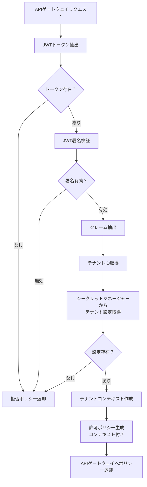

### 6.2 認可処理実装

```python
# lambda/auth/authorizer.py
import json
import jwt
import boto3
from typing import Dict, Any, Optional
from makoto_common.tenant.context import TenantContext
from makoto_common.tenant.secrets import get_tenant_config

def lambda_handler(event: Dict[str, Any], context) -> Dict[str, Any]:
    """
    API Gateway Lambda Authorizer
    
    JWTトークンを検証し、テナントコンテキストを作成
    """
    try:
        # トークン抽出
        token = extract_token_from_event(event)
        if not token:
            raise Exception('Unauthorized')
        
        # トークン検証とデコード
        payload = verify_and_decode_token(token)
        
        # テナント情報抽出
        tenant_id = payload.get('custom:tenant_id')
        user_id = payload.get('sub')
        role = payload.get('custom:role')
        
        if not tenant_id or not user_id:
            raise Exception('Invalid token claims')
        
        # テナント設定取得
        tenant_config = get_tenant_config(tenant_id)
        
        # 認可ポリシー生成
        policy = generate_policy(user_id, 'Allow', event['methodArn'])
        policy['context'] = {
            'tenant_id': tenant_id,
            'user_id': user_id,
            'role': role,
            'tenant_config': json.dumps(tenant_config.to_dict())
        }
        
        return policy
        
    except Exception as e:
        print(f"Authorization failed: {str(e)}")
        # 認証失敗時は拒否ポリシーを返す
        return generate_policy('unknown', 'Deny', event['methodArn'])
```

## 7. テナント設定管理

### 7.1 テナント設定管理方式

#### 開発環境：環境変数管理
```env
# backend/.env
AWS_REGION=ap-northeast-1

# テナントA設定
COGNITO_USER_POOL_ID_TENANT_A=ap-northeast-1_XXXXXXXXX
COGNITO_CLIENT_ID_TENANT_A=1234567890abcdef1234567890

# テナントB設定
COGNITO_USER_POOL_ID_TENANT_B=ap-northeast-1_YYYYYYYYY
COGNITO_CLIENT_ID_TENANT_B=abcdef1234567890abcdef1234

# テナントC設定
COGNITO_USER_POOL_ID_TENANT_C=ap-northeast-1_ZZZZZZZZZ
COGNITO_CLIENT_ID_TENANT_C=fedcba0987654321fedcba0987
```

#### 本番環境：AWS Secrets Manager

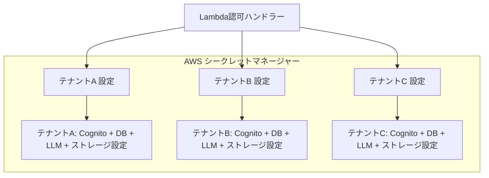

### 7.2 設定データ構造

```json
{
  "secret_name": "makoto/tenant/{tenant_id}/config",
  "secret_value": {
    "tenant_id": "tenant-abc-123",
    "cognito": {
      "user_pool_id": "us-east-1_XXXXXXXXX",
      "client_id": "1234567890abcdef1234567890"
    },
    "database": {
      "type": "dynamodb",
      "region": "us-east-1", 
      "table_prefix": "makoto_tenant_abc_",
      "connection_string": null
    },
    "llm": {
      "provider": "azure_openai",
      "api_key": "sk-...",
      "endpoint": "https://tenant-abc.openai.azure.com/",
      "deployment_name": "gpt-4",
      "api_version": "2023-12-01-preview"
    },
    "storage": {
      "provider": "s3",
      "bucket_name": "makoto-tenant-abc-storage",
      "region": "us-east-1",
      "access_key_id": "AKIA...",
      "secret_access_key": "...",
      "prefix": "tenant-abc/"
    }
  }
}
```

## 8. 権限・ロール設計

### 8.1 ロール階層

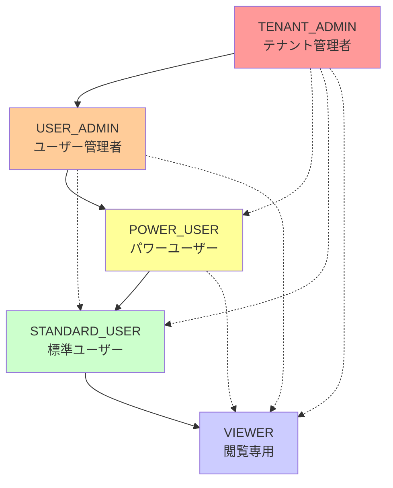

### 8.2 権限マトリックス

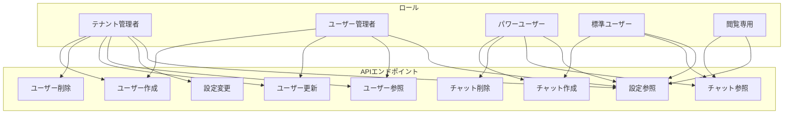

## 9. セキュリティ考慮事項

### 9.1 セキュリティレイヤー

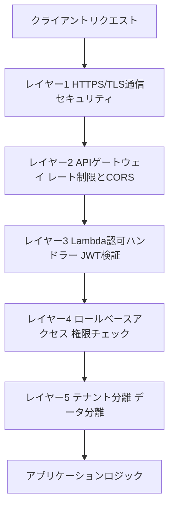

### 9.2 JWT検証プロセス

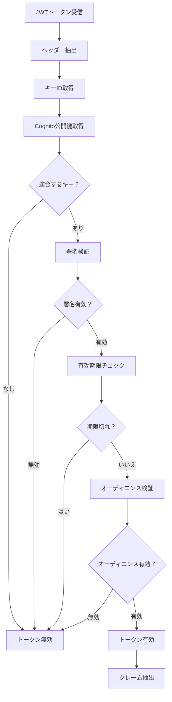

## 10. 実装チェックリスト

### 10.1 Cognito設定
- [ ] テナント別User Pool作成
- [ ] カスタム属性設定（tenant_id, role等）
- [ ] User Pool Client設定（テナント毎）
- [ ] Lambda Trigger設定
- [ ] MFA設定（オプション）

### 10.2 Lambda関数
- [ ] Auth Lambda（ログイン・登録等）
- [ ] Lambda Authorizer（JWT検証）
- [ ] PreSignUp Trigger（テナント検証）
- [ ] PostConfirmation Trigger（初期設定）

### 10.3 Secrets Manager
- [ ] テナント設定構造定義
- [ ] 設定取得ライブラリ実装
- [ ] キャッシュ機能実装

### 10.4 共通ライブラリ
- [ ] テナントコンテキスト管理
- [ ] JWT検証ライブラリ（FastAPI/Lambda両対応）
- [ ] 権限チェック機能
- [ ] デコレーター実装（FastAPI用）

### 10.5 セキュリティ
- [ ] HTTPS設定
- [ ] CORS設定
- [ ] トークン有効期限設定
- [ ] ログ記録実装

## 11. 環境別の実装ガイドライン

### 11.1 開発環境
- FastAPIで直接Cognito連携
- 環境変数でテナント設定管理
- 認証をオプション化可能（REQUIRE_AUTH=false）
- ローカルでの高速開発

### 11.2 本番環境への移行
- API Gateway + Lambda構成へ移行
- Secrets Managerでテナント設定管理
- Lambda Authorizerで認証処理
- 完全なマルチテナント分離

この設計により、開発環境から本番環境まで段階的に移行可能な、スケーラブルで安全なマルチテナント認証システムを構築できます。